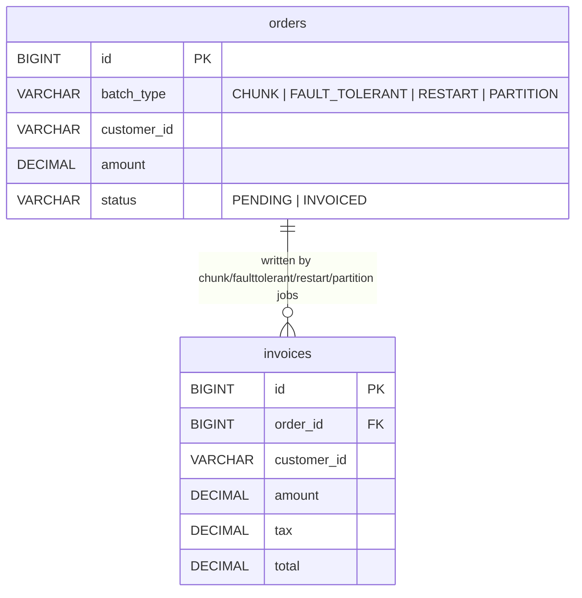
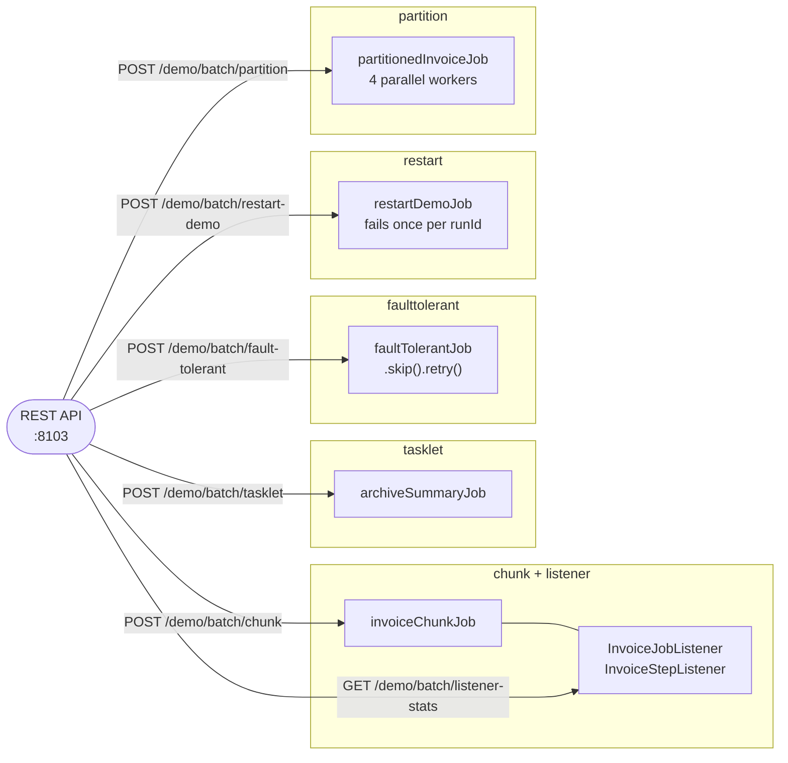

# Spring Batch Demo

A Spring Boot app demonstrating six Spring Batch patterns — chunk-oriented ETL, lifecycle listeners, a tasklet step, skip/retry fault tolerance, job restart, and partitioned steps — around an order-invoicing domain (a nightly billing run that reads pending orders and writes invoices). No external infrastructure required: H2 only.

## Prerequisites

- Java 21
- Maven 3.9+

All commands below assume your working directory is `batch-processing/spring-batch/spring-demo`.

## Run the app

```bash
mvn spring-boot:run
```

## Trigger endpoints

```bash
# Seed 20 pending orders for the chunk pattern (type is CHUNK, FAULT_TOLERANT, RESTART, or PARTITION)
curl -X POST "http://localhost:8103/demo/orders/seed?type=CHUNK&count=20"

# Chunk-oriented ETL: reads pending CHUNK orders, writes invoices, marks orders INVOICED
curl -X POST "http://localhost:8103/demo/batch/chunk"

# Listener stats captured from the chunk job's JobExecutionListener/StepExecutionListener
curl "http://localhost:8103/demo/batch/listener-stats"

# Tasklet step: counts invoices on file, logs a summary (no chunk read/write/skip counts — see below)
curl -X POST "http://localhost:8103/demo/batch/tasklet"

# Skip + retry: seed FAULT_TOLERANT orders first, then launch
curl -X POST "http://localhost:8103/demo/orders/seed?type=FAULT_TOLERANT&count=200"
curl -X POST "http://localhost:8103/demo/batch/fault-tolerant"

# Restart: seed RESTART orders, then launch twice with the SAME runId
curl -X POST "http://localhost:8103/demo/orders/seed?type=RESTART&count=6"
curl -X POST "http://localhost:8103/demo/batch/restart-demo?runId=demo-1"   # -> FAILED, 3 invoices written
curl -X POST "http://localhost:8103/demo/batch/restart-demo?runId=demo-1"   # -> COMPLETED, 3 more invoices (6 total)

# Partitioning: seed PARTITION orders, then launch (fixed at 4 partitions)
curl -X POST "http://localhost:8103/demo/orders/seed?type=PARTITION&count=40"
curl -X POST "http://localhost:8103/demo/batch/partition"

# Inspect the invoices written so far
curl "http://localhost:8103/demo/invoices"
```

## Swagger UI

http://localhost:8103/swagger-ui/index.html

## Run performance tests

```bash
mvn gatling:test
```

HTML report: `target/gatling/<timestamp>/index.html`. The restart pattern is excluded from the load test (it needs the same `runId` across two sequential calls, which doesn't fit Gatling's concurrent-user injection model) — exercise it via `curl` or `RestartJobConfigTest`.

## Architecture

### Domain tables



### Five jobs, six patterns



## Patterns demonstrated

| Pattern | Job | Notes |
|---|---|---|
| Chunk-oriented ETL | `invoiceChunkJob` | `JdbcCursorItemReader` → `ItemProcessor` → custom `ItemWriter`, chunk size 10, transactional per chunk |
| Lifecycle listeners | (attached to `invoiceChunkJob`) | `JobExecutionListener` aggregates stats into `ListenerStatsService`; `StepExecutionListener` logs per-step lifecycle |
| Tasklet | `archiveSummaryJob` | Single non-chunked step — its `JobRunResult` naturally shows `readCount`/`writeCount`/`skipCount` of `0`, since tasklets aren't chunk-oriented |
| Skip + retry | `faultTolerantJob` | `.faultTolerant().skip(RuntimeException.class).skipLimit(50).retry(RuntimeException.class).retryLimit(3)`, driven by `FailureSimulator`'s real 5% failure rate. With retry enabled, an item only ends up *skipped* if it fails all 3 attempts (≈0.0125% per item) — seed a large batch (200+) to have a realistic chance of observing a nonzero skip count, or read `FaultTolerantProcessor`/`FailureSimulator` and lower `retryLimit` temporarily to see skips more often |
| Restart | `restartDemoJob` | Fails deterministically on the 5th order processed for a given `runId` (once, ever); relaunching with the same `runId` resumes from the last committed chunk rather than reprocessing everything. Its reader deliberately does **not** filter by `status = 'PENDING'` (unlike every other reader here) — `JdbcCursorItemReader` restarts by re-running its query and skipping forward N already-read rows, which only works if the query returns a stable row set across restarts |
| Partitioning | `partitionedInvoiceJob` | `OrderRangePartitioner` splits pending `PARTITION` orders into 4 id-range partitions, each run by its own worker step via `TaskExecutorPartitionHandler` |

## Concurrent launches

Nothing prevents the same job pattern from being triggered multiple times concurrently — each launch endpoint gets its own unique `JobParameters`, so two overlapping `POST /demo/batch/chunk` calls run as two independent job executions rather than colliding. Two things make that safe:

- Every `JdbcCursorItemReader` is `@StepScope`d, so each concurrent execution gets its own cursor instead of sharing one stateful reader (a shared singleton reader corrupts under concurrent reads — this was a real bug caught via `mvn spring-boot:run` under load).
- `InvoiceItemWriter` *claims* each order with a conditional `UPDATE ... WHERE status = 'PENDING'` rather than an unconditional status flip, checking the affected-row count before inserting an invoice. Two concurrent executions can legitimately read the same `PENDING` row before either commits; only the one whose claim succeeds gets to invoice it.

## Stop the app

`Ctrl+C` in the terminal running `mvn spring-boot:run` — H2 is in-memory, so all data (orders, invoices, and Spring Batch's own job history) resets on restart.
