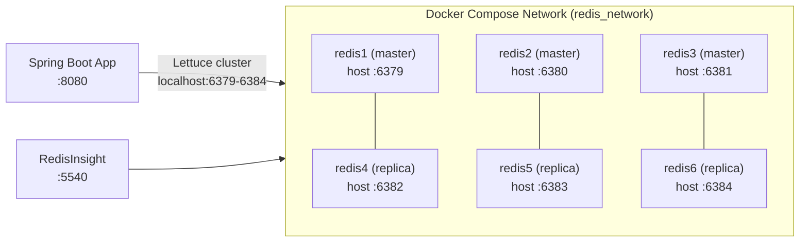

# Redis Streams Cluster & Spring Demo Implementation Plan

> **For agentic workers:** REQUIRED SUB-SKILL: Use superpowers:subagent-driven-development (recommended) or superpowers:executing-plans to implement this plan task-by-task. Steps use checkbox (`- [ ]`) syntax for tracking.

**Goal:** Build a 6-node Redis Cluster in Docker and a Spring Boot demo app demonstrating 6 messaging patterns: simple streaming, work queue (consumer groups), fanout, pending entries & retry, stream trimming, and native Pub/Sub.

**Architecture:** A Docker Compose file spins up 6 Redis 7.4 nodes (3 masters + 3 replicas), a one-shot `cluster-init` container forms the cluster using `redis-cli --cluster create`, and RedisInsight provides a UI. The Spring Boot app connects via Lettuce cluster client and exposes 6 REST endpoints — one per pattern.

**Tech Stack:** Redis 7.4, Docker Compose, Spring Boot 3.4.4, Java 21, Lettuce (via `spring-boot-starter-data-redis`), Springdoc OpenAPI 2.8.6, Lombok 1.18.38, Gatling 3.13.1.

---

## File Map

| File | Action | Purpose |
|---|---|---|
| `message-brokers/redis/docker/docker-compose.yml` | Create | 6-node Redis cluster + cluster-init + RedisInsight |
| `message-brokers/redis/spring-demo/pom.xml` | Create | Maven project descriptor |
| `message-brokers/redis/spring-demo/src/main/resources/application.yml` | Create | Redis cluster connection config |
| `message-brokers/redis/spring-demo/src/main/java/com/testingai/redis/RedisDemoApplication.java` | Create | `@SpringBootApplication` entry point |
| `message-brokers/redis/spring-demo/src/main/java/com/testingai/redis/config/StreamKeys.java` | Create | Stream key and channel constants |
| `message-brokers/redis/spring-demo/src/main/java/com/testingai/redis/config/RedisConfig.java` | Create | RedisTemplate, StreamMessageListenerContainer, consumer group bootstrap, Pub/Sub container |
| `message-brokers/redis/spring-demo/src/main/java/com/testingai/redis/util/FailureSimulator.java` | Create | 5% random failure utility |
| `message-brokers/redis/spring-demo/src/main/java/com/testingai/redis/simple/SimpleProducer.java` | Create | XADD to `{streams}:simple` |
| `message-brokers/redis/spring-demo/src/main/java/com/testingai/redis/simple/SimpleConsumer.java` | Create | XREAD standalone reader |
| `message-brokers/redis/spring-demo/src/main/java/com/testingai/redis/workqueue/WorkQueueProducer.java` | Create | XADD to `{streams}:work` |
| `message-brokers/redis/spring-demo/src/main/java/com/testingai/redis/workqueue/WorkQueueConsumer.java` | Create | Consumer in `work-group`, XACK on success |
| `message-brokers/redis/spring-demo/src/main/java/com/testingai/redis/fanout/FanoutProducer.java` | Create | XADD to `{streams}:fanout` |
| `message-brokers/redis/spring-demo/src/main/java/com/testingai/redis/fanout/FanoutConsumerA.java` | Create | Consumer in `group-a` |
| `message-brokers/redis/spring-demo/src/main/java/com/testingai/redis/fanout/FanoutConsumerB.java` | Create | Consumer in `group-b` |
| `message-brokers/redis/spring-demo/src/main/java/com/testingai/redis/pending/PendingProducer.java` | Create | XADD to `{streams}:pending` |
| `message-brokers/redis/spring-demo/src/main/java/com/testingai/redis/pending/PendingConsumer.java` | Create | Consumer + `@Scheduled` XCLAIM reclaimer |
| `message-brokers/redis/spring-demo/src/main/java/com/testingai/redis/trimming/TrimmingProducer.java` | Create | XADD with `MAXLEN 100` |
| `message-brokers/redis/spring-demo/src/main/java/com/testingai/redis/trimming/TrimmingConsumer.java` | Create | Consumer, logs stream length |
| `message-brokers/redis/spring-demo/src/main/java/com/testingai/redis/pubsub/PubSubPublisher.java` | Create | Redis PUBLISH to `demo:pubsub` |
| `message-brokers/redis/spring-demo/src/main/java/com/testingai/redis/pubsub/PubSubSubscriberA.java` | Create | `MessageListener` bean A |
| `message-brokers/redis/spring-demo/src/main/java/com/testingai/redis/pubsub/PubSubSubscriberB.java` | Create | `MessageListener` bean B |
| `message-brokers/redis/spring-demo/src/main/java/com/testingai/redis/controller/DemoController.java` | Create | REST endpoints for all 6 patterns |
| `message-brokers/redis/spring-demo/src/test/java/com/testingai/redis/config/StreamKeysTest.java` | Create | Verifies all constants non-null/non-blank |
| `message-brokers/redis/spring-demo/src/test/java/com/testingai/redis/simple/SimpleProducerTest.java` | Create | Unit test for SimpleProducer |
| `message-brokers/redis/spring-demo/src/test/java/com/testingai/redis/simple/SimpleConsumerTest.java` | Create | Unit test for SimpleConsumer |
| `message-brokers/redis/spring-demo/src/test/java/com/testingai/redis/workqueue/WorkQueueProducerTest.java` | Create | Unit test for WorkQueueProducer |
| `message-brokers/redis/spring-demo/src/test/java/com/testingai/redis/workqueue/WorkQueueConsumerTest.java` | Create | Unit test for WorkQueueConsumer |
| `message-brokers/redis/spring-demo/src/test/java/com/testingai/redis/fanout/FanoutProducerTest.java` | Create | Unit test for FanoutProducer |
| `message-brokers/redis/spring-demo/src/test/java/com/testingai/redis/fanout/FanoutConsumerATest.java` | Create | Unit test for FanoutConsumerA |
| `message-brokers/redis/spring-demo/src/test/java/com/testingai/redis/fanout/FanoutConsumerBTest.java` | Create | Unit test for FanoutConsumerB |
| `message-brokers/redis/spring-demo/src/test/java/com/testingai/redis/pending/PendingProducerTest.java` | Create | Unit test for PendingProducer |
| `message-brokers/redis/spring-demo/src/test/java/com/testingai/redis/pending/PendingConsumerTest.java` | Create | Unit test for PendingConsumer |
| `message-brokers/redis/spring-demo/src/test/java/com/testingai/redis/trimming/TrimmingProducerTest.java` | Create | Unit test for TrimmingProducer |
| `message-brokers/redis/spring-demo/src/test/java/com/testingai/redis/trimming/TrimmingConsumerTest.java` | Create | Unit test for TrimmingConsumer |
| `message-brokers/redis/spring-demo/src/test/java/com/testingai/redis/pubsub/PubSubPublisherTest.java` | Create | Unit test for PubSubPublisher |
| `message-brokers/redis/spring-demo/src/test/java/com/testingai/redis/pubsub/PubSubSubscriberATest.java` | Create | Unit test for PubSubSubscriberA |
| `message-brokers/redis/spring-demo/src/test/java/com/testingai/redis/pubsub/PubSubSubscriberBTest.java` | Create | Unit test for PubSubSubscriberB |
| `message-brokers/redis/spring-demo/src/test/java/com/testingai/redis/controller/DemoControllerTest.java` | Create | `@WebMvcTest` for all 6 endpoints |
| `message-brokers/redis/spring-demo/src/test/java/com/testingai/redis/performance/DemoSimulation.java` | Create | Gatling simulation |
| `message-brokers/redis/README.md` | Create | Cluster setup, run, curl examples, CLI commands, RedisInsight shortcuts |

---

### Task 1: Docker Compose — Redis Cluster

**Files:**
- Create: `message-brokers/redis/docker/docker-compose.yml`

- [ ] **Step 1: Create the docker-compose.yml**

```yaml
name: redis-cluster

services:
  redis1:
    image: redis:7.4
    container_name: redis1
    ports:
      - "6379:6379"
    command: >
      redis-server
      --cluster-enabled yes
      --cluster-config-file nodes.conf
      --cluster-node-timeout 5000
      --cluster-announce-ip 127.0.0.1
      --cluster-announce-port 6379
      --cluster-announce-bus-port 16379
      --appendonly yes
    networks:
      - redis_network
    healthcheck:
      test: ["CMD", "redis-cli", "ping"]
      interval: 5s
      timeout: 3s
      retries: 10

  redis2:
    image: redis:7.4
    container_name: redis2
    ports:
      - "6380:6379"
    command: >
      redis-server
      --cluster-enabled yes
      --cluster-config-file nodes.conf
      --cluster-node-timeout 5000
      --cluster-announce-ip 127.0.0.1
      --cluster-announce-port 6380
      --cluster-announce-bus-port 16380
      --appendonly yes
    networks:
      - redis_network
    healthcheck:
      test: ["CMD", "redis-cli", "ping"]
      interval: 5s
      timeout: 3s
      retries: 10

  redis3:
    image: redis:7.4
    container_name: redis3
    ports:
      - "6381:6379"
    command: >
      redis-server
      --cluster-enabled yes
      --cluster-config-file nodes.conf
      --cluster-node-timeout 5000
      --cluster-announce-ip 127.0.0.1
      --cluster-announce-port 6381
      --cluster-announce-bus-port 16381
      --appendonly yes
    networks:
      - redis_network
    healthcheck:
      test: ["CMD", "redis-cli", "ping"]
      interval: 5s
      timeout: 3s
      retries: 10

  redis4:
    image: redis:7.4
    container_name: redis4
    ports:
      - "6382:6379"
    command: >
      redis-server
      --cluster-enabled yes
      --cluster-config-file nodes.conf
      --cluster-node-timeout 5000
      --cluster-announce-ip 127.0.0.1
      --cluster-announce-port 6382
      --cluster-announce-bus-port 16382
      --appendonly yes
    networks:
      - redis_network
    healthcheck:
      test: ["CMD", "redis-cli", "ping"]
      interval: 5s
      timeout: 3s
      retries: 10

  redis5:
    image: redis:7.4
    container_name: redis5
    ports:
      - "6383:6379"
    command: >
      redis-server
      --cluster-enabled yes
      --cluster-config-file nodes.conf
      --cluster-node-timeout 5000
      --cluster-announce-ip 127.0.0.1
      --cluster-announce-port 6383
      --cluster-announce-bus-port 16383
      --appendonly yes
    networks:
      - redis_network
    healthcheck:
      test: ["CMD", "redis-cli", "ping"]
      interval: 5s
      timeout: 3s
      retries: 10

  redis6:
    image: redis:7.4
    container_name: redis6
    ports:
      - "6384:6379"
    command: >
      redis-server
      --cluster-enabled yes
      --cluster-config-file nodes.conf
      --cluster-node-timeout 5000
      --cluster-announce-ip 127.0.0.1
      --cluster-announce-port 6384
      --cluster-announce-bus-port 16384
      --appendonly yes
    networks:
      - redis_network
    healthcheck:
      test: ["CMD", "redis-cli", "ping"]
      interval: 5s
      timeout: 3s
      retries: 10

  cluster-init:
    image: redis:7.4
    container_name: cluster-init
    depends_on:
      redis1:
        condition: service_healthy
      redis2:
        condition: service_healthy
      redis3:
        condition: service_healthy
      redis4:
        condition: service_healthy
      redis5:
        condition: service_healthy
      redis6:
        condition: service_healthy
    command: >
      redis-cli --cluster create
        redis1:6379 redis2:6379 redis3:6379
        redis4:6379 redis5:6379 redis6:6379
        --cluster-replicas 1 --cluster-yes
    networks:
      - redis_network

  redisinsight:
    image: redis/redisinsight:latest
    container_name: redisinsight
    ports:
      - "5540:5540"
    depends_on:
      - cluster-init
    networks:
      - redis_network

networks:
  redis_network:
    driver: bridge
```

- [ ] **Step 2: Smoke-test the cluster**

```bash
cd message-brokers/redis/docker
docker compose up -d
# Wait ~30 seconds for cluster-init to finish
docker exec redis1 redis-cli -c cluster info | grep cluster_state
```

Expected output: `cluster_state:ok`

- [ ] **Step 3: Commit**

```bash
git add message-brokers/redis/docker/docker-compose.yml
git commit -m "feat: add Redis 6-node cluster docker-compose"
```

---

### Task 2: Maven Project — pom.xml and application.yml

**Files:**
- Create: `message-brokers/redis/spring-demo/pom.xml`
- Create: `message-brokers/redis/spring-demo/src/main/resources/application.yml`

- [ ] **Step 1: Create pom.xml**

```xml
<?xml version="1.0" encoding="UTF-8"?>
<project xmlns="http://maven.apache.org/POM/4.0.0"
         xmlns:xsi="http://www.w3.org/2001/XMLSchema-instance"
         xsi:schemaLocation="http://maven.apache.org/POM/4.0.0
             https://maven.apache.org/xsd/maven-4.0.0.xsd">
    <modelVersion>4.0.0</modelVersion>

    <parent>
        <groupId>org.springframework.boot</groupId>
        <artifactId>spring-boot-starter-parent</artifactId>
        <version>3.4.4</version>
        <relativePath/>
    </parent>

    <groupId>com.testingai</groupId>
    <artifactId>redis-demo</artifactId>
    <version>0.0.1-SNAPSHOT</version>
    <name>redis-demo</name>

    <properties>
        <java.version>21</java.version>
        <springdoc.version>2.8.6</springdoc.version>
        <lombok.version>1.18.38</lombok.version>
        <gatling.version>3.13.1</gatling.version>
    </properties>

    <dependencies>
        <dependency>
            <groupId>org.springframework.boot</groupId>
            <artifactId>spring-boot-starter-data-redis</artifactId>
        </dependency>
        <dependency>
            <groupId>org.springframework.boot</groupId>
            <artifactId>spring-boot-starter-web</artifactId>
        </dependency>
        <dependency>
            <groupId>org.springdoc</groupId>
            <artifactId>springdoc-openapi-starter-webmvc-ui</artifactId>
            <version>${springdoc.version}</version>
        </dependency>
        <dependency>
            <groupId>org.projectlombok</groupId>
            <artifactId>lombok</artifactId>
            <version>${lombok.version}</version>
            <optional>true</optional>
        </dependency>
        <dependency>
            <groupId>org.springframework.boot</groupId>
            <artifactId>spring-boot-starter-test</artifactId>
            <scope>test</scope>
        </dependency>
        <dependency>
            <groupId>io.gatling.highcharts</groupId>
            <artifactId>gatling-charts-highcharts</artifactId>
            <version>${gatling.version}</version>
            <scope>test</scope>
        </dependency>
    </dependencies>

    <build>
        <plugins>
            <plugin>
                <groupId>org.springframework.boot</groupId>
                <artifactId>spring-boot-maven-plugin</artifactId>
                <configuration>
                    <excludes>
                        <exclude>
                            <groupId>org.projectlombok</groupId>
                            <artifactId>lombok</artifactId>
                        </exclude>
                    </excludes>
                </configuration>
            </plugin>
            <plugin>
                <groupId>io.gatling</groupId>
                <artifactId>gatling-maven-plugin</artifactId>
                <version>4.10.2</version>
                <configuration>
                    <simulationClass>com.testingai.redis.performance.DemoSimulation</simulationClass>
                </configuration>
            </plugin>
            <plugin>
                <groupId>org.apache.maven.plugins</groupId>
                <artifactId>maven-surefire-plugin</artifactId>
                <configuration>
                    <excludes>
                        <exclude>**/performance/**</exclude>
                    </excludes>
                </configuration>
            </plugin>
        </plugins>
    </build>
</project>
```

- [ ] **Step 2: Create application.yml**

```yaml
spring:
  data:
    redis:
      cluster:
        nodes: localhost:6379,localhost:6380,localhost:6381,localhost:6382,localhost:6383,localhost:6384
        max-redirects: 3
```

- [ ] **Step 3: Verify the project compiles**

```bash
cd message-brokers/redis/spring-demo
mvn compile -q
```

Expected: BUILD SUCCESS (no output).

- [ ] **Step 4: Commit**

```bash
git add message-brokers/redis/spring-demo/pom.xml \
        message-brokers/redis/spring-demo/src/main/resources/application.yml
git commit -m "feat: add Redis Spring Boot project scaffold"
```

---

### Task 3: Core Config — StreamKeys, RedisConfig, RedisDemoApplication

**Files:**
- Create: `message-brokers/redis/spring-demo/src/main/java/com/testingai/redis/config/StreamKeys.java`
- Create: `message-brokers/redis/spring-demo/src/main/java/com/testingai/redis/config/RedisConfig.java`
- Create: `message-brokers/redis/spring-demo/src/main/java/com/testingai/redis/RedisDemoApplication.java`
- Test: `message-brokers/redis/spring-demo/src/test/java/com/testingai/redis/config/StreamKeysTest.java`

- [ ] **Step 1: Write the failing StreamKeysTest**

```java
package com.testingai.redis.config;

import org.junit.jupiter.api.Test;
import static org.assertj.core.api.Assertions.assertThat;

class StreamKeysTest {

    @Test
    void allConstantsAreNonNullAndNonBlank() {
        assertThat(StreamKeys.SIMPLE).isNotBlank();
        assertThat(StreamKeys.WORK).isNotBlank();
        assertThat(StreamKeys.FANOUT).isNotBlank();
        assertThat(StreamKeys.PENDING).isNotBlank();
        assertThat(StreamKeys.TRIMMED).isNotBlank();
        assertThat(StreamKeys.PUBSUB_CHANNEL).isNotBlank();
    }

    @Test
    void trimMaxLenIsPositive() {
        assertThat(StreamKeys.TRIM_MAX_LEN).isGreaterThan(0);
    }
}
```

- [ ] **Step 2: Run the test to confirm it fails**

```bash
cd message-brokers/redis/spring-demo
mvn test -pl . -Dtest=StreamKeysTest -q 2>&1 | tail -5
```

Expected: compilation error — `StreamKeys` does not exist yet.

- [ ] **Step 3: Create StreamKeys.java**

```java
package com.testingai.redis.config;

public class StreamKeys {

    private StreamKeys() {}

    public static final String SIMPLE  = "{streams}:simple";
    public static final String WORK    = "{streams}:work";
    public static final String FANOUT  = "{streams}:fanout";
    public static final String PENDING = "{streams}:pending";
    public static final String TRIMMED = "{streams}:trimmed";

    public static final String PUBSUB_CHANNEL = "demo:pubsub";
    public static final int    TRIM_MAX_LEN   = 100;
}
```

- [ ] **Step 4: Run the test to confirm it passes**

```bash
mvn test -Dtest=StreamKeysTest -q
```

Expected: BUILD SUCCESS.

- [ ] **Step 5: Create RedisDemoApplication.java**

```java
package com.testingai.redis;

import org.springframework.boot.SpringApplication;
import org.springframework.boot.autoconfigure.SpringBootApplication;
import org.springframework.scheduling.annotation.EnableScheduling;

@SpringBootApplication
@EnableScheduling
public class RedisDemoApplication {

    public static void main(String[] args) {
        SpringApplication.run(RedisDemoApplication.class, args);
    }
}
```

- [ ] **Step 6: Create RedisConfig.java**

RedisConfig wires up three things:
1. `RedisTemplate<String, String>` with string serializers
2. `StreamMessageListenerContainer` for stream consumers (registered in later tasks)
3. `RedisMessageListenerContainer` for native Pub/Sub (registered in later tasks)
4. Consumer group bootstrap (`@PostConstruct`)

```java
package com.testingai.redis.config;

import lombok.extern.slf4j.Slf4j;
import org.springframework.context.annotation.Bean;
import org.springframework.context.annotation.Configuration;
import org.springframework.data.redis.connection.RedisConnectionFactory;
import org.springframework.data.redis.connection.stream.MapRecord;
import org.springframework.data.redis.connection.stream.ReadOffset;
import org.springframework.data.redis.connection.stream.StreamOffset;
import org.springframework.data.redis.core.RedisTemplate;
import org.springframework.data.redis.listener.RedisMessageListenerContainer;
import org.springframework.data.redis.serializer.StringRedisSerializer;
import org.springframework.data.redis.stream.StreamMessageListenerContainer;
import org.springframework.data.redis.stream.StreamMessageListenerContainer.StreamMessageListenerContainerOptions;

import jakarta.annotation.PostConstruct;
import java.time.Duration;
import java.util.List;

@Slf4j
@Configuration
public class RedisConfig {

    private final RedisConnectionFactory connectionFactory;
    private final RedisTemplate<String, String> redisTemplate;

    public RedisConfig(RedisConnectionFactory connectionFactory) {
        this.connectionFactory = connectionFactory;
        this.redisTemplate = buildTemplate(connectionFactory);
    }

    @Bean
    public RedisTemplate<String, String> redisTemplate() {
        return redisTemplate;
    }

    private RedisTemplate<String, String> buildTemplate(RedisConnectionFactory cf) {
        var tpl = new RedisTemplate<String, String>();
        tpl.setConnectionFactory(cf);
        tpl.setKeySerializer(new StringRedisSerializer());
        tpl.setValueSerializer(new StringRedisSerializer());
        tpl.setHashKeySerializer(new StringRedisSerializer());
        tpl.setHashValueSerializer(new StringRedisSerializer());
        tpl.afterPropertiesSet();
        return tpl;
    }

    @Bean(destroyMethod = "stop")
    public StreamMessageListenerContainer<String, MapRecord<String, String, String>>
            streamListenerContainer() {
        var options = StreamMessageListenerContainerOptions
                .builder()
                .pollTimeout(Duration.ofMillis(100))
                .build();
        var container = StreamMessageListenerContainer
                .create(connectionFactory, options);
        container.start();
        return container;
    }

    @Bean
    public RedisMessageListenerContainer pubSubListenerContainer() {
        var container = new RedisMessageListenerContainer();
        container.setConnectionFactory(connectionFactory);
        return container;
    }

    /** Bootstrap consumer groups for all stream patterns. */
    @PostConstruct
    public void createConsumerGroups() {
        List<String[]> streamGroups = List.of(
                new String[]{StreamKeys.WORK,    "work-group"},
                new String[]{StreamKeys.FANOUT,  "group-a"},
                new String[]{StreamKeys.FANOUT,  "group-b"},
                new String[]{StreamKeys.PENDING, "pending-group"},
                new String[]{StreamKeys.TRIMMED, "trimmed-group"}
        );
        for (String[] sg : streamGroups) {
            String stream = sg[0];
            String group  = sg[1];
            try {
                redisTemplate.opsForStream()
                        .createGroup(stream, ReadOffset.from("$"), group);
                log.info("Created consumer group '{}' on '{}'", group, stream);
            } catch (Exception e) {
                if (e.getMessage() != null && e.getMessage().contains("BUSYGROUP")) {
                    log.debug("Consumer group '{}' on '{}' already exists", group, stream);
                } else {
                    throw e;
                }
            }
        }
    }
}
```

- [ ] **Step 7: Run StreamKeysTest again to confirm nothing is broken**

```bash
mvn test -Dtest=StreamKeysTest -q
```

Expected: BUILD SUCCESS.

- [ ] **Step 8: Commit**

```bash
git add message-brokers/redis/spring-demo/src/
git commit -m "feat: add StreamKeys, RedisConfig, RedisDemoApplication"
```

---

### Task 4: FailureSimulator utility

**Files:**
- Create: `message-brokers/redis/spring-demo/src/main/java/com/testingai/redis/util/FailureSimulator.java`

- [ ] **Step 1: Create FailureSimulator.java**

```java
package com.testingai.redis.util;

import java.util.random.RandomGenerator;

public class FailureSimulator {

    private static final double FAILURE_RATE = 0.05;

    private FailureSimulator() {}

    public static void maybeThrow(String context) {
        if (RandomGenerator.getDefault().nextDouble() < FAILURE_RATE) {
            throw new RuntimeException("Simulated failure in " + context);
        }
    }
}
```

- [ ] **Step 2: Compile**

```bash
cd message-brokers/redis/spring-demo
mvn compile -q
```

Expected: BUILD SUCCESS.

- [ ] **Step 3: Commit**

```bash
git add message-brokers/redis/spring-demo/src/main/java/com/testingai/redis/util/FailureSimulator.java
git commit -m "feat: add FailureSimulator utility"
```

---

### Task 5: Simple Streaming pattern

**Files:**
- Create: `message-brokers/redis/spring-demo/src/main/java/com/testingai/redis/simple/SimpleProducer.java`
- Create: `message-brokers/redis/spring-demo/src/main/java/com/testingai/redis/simple/SimpleConsumer.java`
- Test: `message-brokers/redis/spring-demo/src/test/java/com/testingai/redis/simple/SimpleProducerTest.java`
- Test: `message-brokers/redis/spring-demo/src/test/java/com/testingai/redis/simple/SimpleConsumerTest.java`

- [ ] **Step 1: Write SimpleProducerTest**

```java
package com.testingai.redis.simple;

import com.testingai.redis.config.StreamKeys;
import org.junit.jupiter.api.Test;
import org.junit.jupiter.api.extension.ExtendWith;
import org.mockito.InjectMocks;
import org.mockito.Mock;
import org.mockito.junit.jupiter.MockitoExtension;
import org.springframework.data.redis.core.RedisTemplate;
import org.springframework.data.redis.core.StreamOperations;

import static org.mockito.ArgumentMatchers.any;
import static org.mockito.ArgumentMatchers.eq;
import static org.mockito.Mockito.verify;
import static org.mockito.Mockito.when;

@ExtendWith(MockitoExtension.class)
class SimpleProducerTest {

    @Mock
    RedisTemplate<String, String> redisTemplate;

    @Mock
    StreamOperations<String, String, String> streamOps;

    @InjectMocks
    SimpleProducer producer;

    @Test
    void sendAddsMessageToSimpleStream() {
        when(redisTemplate.opsForStream()).thenReturn(streamOps);

        producer.send("hello");

        verify(streamOps).add(eq(StreamKeys.SIMPLE), any(java.util.Map.class));
    }
}
```

- [ ] **Step 2: Write SimpleConsumerTest**

```java
package com.testingai.redis.simple;

import org.junit.jupiter.api.Test;
import org.springframework.data.redis.connection.stream.MapRecord;
import org.springframework.data.redis.connection.stream.RecordId;

import java.util.Map;

class SimpleConsumerTest {

    @Test
    void onMessageLogsPayload() {
        var consumer = new SimpleConsumer();
        var record = MapRecord.create(
                "test-stream", Map.of("message", "hello"));
        // No exception thrown = pass
        consumer.onMessage(record);
    }
}
```

- [ ] **Step 3: Run tests to confirm they fail (SimpleProducer/Consumer not created yet)**

```bash
cd message-brokers/redis/spring-demo
mvn test -Dtest="SimpleProducerTest,SimpleConsumerTest" -q 2>&1 | tail -5
```

Expected: compilation error.

- [ ] **Step 4: Create SimpleProducer.java**

```java
package com.testingai.redis.simple;

import com.testingai.redis.config.StreamKeys;
import lombok.RequiredArgsConstructor;
import lombok.extern.slf4j.Slf4j;
import org.springframework.data.redis.core.RedisTemplate;
import org.springframework.stereotype.Component;

import java.util.Map;

@Slf4j
@Component
@RequiredArgsConstructor
public class SimpleProducer {

    private final RedisTemplate<String, String> redisTemplate;

    public void send(String message) {
        var id = redisTemplate.opsForStream()
                .add(StreamKeys.SIMPLE, Map.of("message", message));
        log.info("[simple] sent id={} message={}", id, message);
    }
}
```

- [ ] **Step 5: Create SimpleConsumer.java**

SimpleConsumer reads from `{streams}:simple` without a consumer group. It registers itself with the `StreamMessageListenerContainer` on construction.

```java
package com.testingai.redis.simple;

import com.testingai.redis.config.StreamKeys;
import lombok.extern.slf4j.Slf4j;
import org.springframework.data.redis.connection.stream.MapRecord;
import org.springframework.data.redis.connection.stream.ReadOffset;
import org.springframework.data.redis.connection.stream.StreamOffset;
import org.springframework.data.redis.stream.StreamListener;
import org.springframework.data.redis.stream.StreamMessageListenerContainer;
import org.springframework.stereotype.Component;

@Slf4j
@Component
public class SimpleConsumer
        implements StreamListener<String, MapRecord<String, String, String>> {

    public SimpleConsumer(
            StreamMessageListenerContainer<String, MapRecord<String, String, String>> container) {
        container.receive(
                StreamOffset.create(StreamKeys.SIMPLE, ReadOffset.lastConsumed()),
                this);
    }

    @Override
    public void onMessage(MapRecord<String, String, String> record) {
        log.info("[simple] received id={} body={}", record.getId(), record.getValue());
    }
}
```

- [ ] **Step 6: Run tests**

```bash
mvn test -Dtest="SimpleProducerTest,SimpleConsumerTest" -q
```

Expected: BUILD SUCCESS.

- [ ] **Step 7: Commit**

```bash
git add message-brokers/redis/spring-demo/src/
git commit -m "feat: add simple streaming pattern"
```

---

### Task 6: Work Queue pattern

**Files:**
- Create: `message-brokers/redis/spring-demo/src/main/java/com/testingai/redis/workqueue/WorkQueueProducer.java`
- Create: `message-brokers/redis/spring-demo/src/main/java/com/testingai/redis/workqueue/WorkQueueConsumer.java`
- Test: `message-brokers/redis/spring-demo/src/test/java/com/testingai/redis/workqueue/WorkQueueProducerTest.java`
- Test: `message-brokers/redis/spring-demo/src/test/java/com/testingai/redis/workqueue/WorkQueueConsumerTest.java`

- [ ] **Step 1: Write WorkQueueProducerTest**

```java
package com.testingai.redis.workqueue;

import com.testingai.redis.config.StreamKeys;
import org.junit.jupiter.api.Test;
import org.junit.jupiter.api.extension.ExtendWith;
import org.mockito.InjectMocks;
import org.mockito.Mock;
import org.mockito.junit.jupiter.MockitoExtension;
import org.springframework.data.redis.core.RedisTemplate;
import org.springframework.data.redis.core.StreamOperations;

import static org.mockito.ArgumentMatchers.any;
import static org.mockito.ArgumentMatchers.eq;
import static org.mockito.Mockito.verify;
import static org.mockito.Mockito.when;

@ExtendWith(MockitoExtension.class)
class WorkQueueProducerTest {

    @Mock RedisTemplate<String, String> redisTemplate;
    @Mock StreamOperations<String, String, String> streamOps;
    @InjectMocks WorkQueueProducer producer;

    @Test
    void sendAddsMessageToWorkStream() {
        when(redisTemplate.opsForStream()).thenReturn(streamOps);

        producer.send("task-1");

        verify(streamOps).add(eq(StreamKeys.WORK), any(java.util.Map.class));
    }
}
```

- [ ] **Step 2: Write WorkQueueConsumerTest**

```java
package com.testingai.redis.workqueue;

import com.testingai.redis.config.StreamKeys;
import com.testingai.redis.util.FailureSimulator;
import org.junit.jupiter.api.Test;
import org.junit.jupiter.api.extension.ExtendWith;
import org.mockito.InjectMocks;
import org.mockito.Mock;
import org.mockito.MockedStatic;
import org.mockito.junit.jupiter.MockitoExtension;
import org.springframework.data.redis.connection.stream.MapRecord;
import org.springframework.data.redis.connection.stream.RecordId;
import org.springframework.data.redis.core.RedisTemplate;
import org.springframework.data.redis.core.StreamOperations;

import java.util.Map;

import static org.mockito.ArgumentMatchers.any;
import static org.mockito.ArgumentMatchers.eq;
import static org.mockito.Mockito.*;

@ExtendWith(MockitoExtension.class)
class WorkQueueConsumerTest {

    @Mock RedisTemplate<String, String> redisTemplate;
    @Mock StreamOperations<String, String, String> streamOps;
    @InjectMocks WorkQueueConsumer consumer;

    @Test
    void onMessageAcknowledgesOnSuccess() {
        when(redisTemplate.opsForStream()).thenReturn(streamOps);
        var record = MapRecord.create(StreamKeys.WORK, Map.of("message", "task"))
                .withId(RecordId.of("1-0"));

        try (MockedStatic<FailureSimulator> mock = mockStatic(FailureSimulator.class)) {
            mock.when(() -> FailureSimulator.maybeThrow(any())).thenAnswer(inv -> null);
            consumer.onMessage(record);
        }

        verify(streamOps).acknowledge(eq(StreamKeys.WORK), eq("work-group"), any(RecordId.class));
    }

    @Test
    void onMessageSkipsAckOnFailure() {
        var record = MapRecord.create(StreamKeys.WORK, Map.of("message", "task"))
                .withId(RecordId.of("1-0"));

        try (MockedStatic<FailureSimulator> mock = mockStatic(FailureSimulator.class)) {
            mock.when(() -> FailureSimulator.maybeThrow(any()))
                    .thenThrow(new RuntimeException("simulated"));
            consumer.onMessage(record);
        }

        verify(redisTemplate, never()).opsForStream();
    }
}
```

- [ ] **Step 3: Run tests to confirm they fail**

```bash
mvn test -Dtest="WorkQueueProducerTest,WorkQueueConsumerTest" -q 2>&1 | tail -5
```

Expected: compilation error.

- [ ] **Step 4: Create WorkQueueProducer.java**

```java
package com.testingai.redis.workqueue;

import com.testingai.redis.config.StreamKeys;
import lombok.RequiredArgsConstructor;
import lombok.extern.slf4j.Slf4j;
import org.springframework.data.redis.core.RedisTemplate;
import org.springframework.stereotype.Component;

import java.util.Map;

@Slf4j
@Component
@RequiredArgsConstructor
public class WorkQueueProducer {

    private final RedisTemplate<String, String> redisTemplate;

    public void send(String message) {
        var id = redisTemplate.opsForStream()
                .add(StreamKeys.WORK, Map.of("message", message));
        log.info("[work-queue] sent id={} message={}", id, message);
    }
}
```

- [ ] **Step 5: Create WorkQueueConsumer.java**

Two instances of this class are registered (consumer-1 and consumer-2) via `RedisConfig`. Both share `work-group`; each entry is delivered to exactly one of them.

```java
package com.testingai.redis.workqueue;

import com.testingai.redis.config.StreamKeys;
import com.testingai.redis.util.FailureSimulator;
import lombok.RequiredArgsConstructor;
import lombok.extern.slf4j.Slf4j;
import org.springframework.data.redis.connection.stream.Consumer;
import org.springframework.data.redis.connection.stream.MapRecord;
import org.springframework.data.redis.connection.stream.ReadOffset;
import org.springframework.data.redis.connection.stream.StreamOffset;
import org.springframework.data.redis.core.RedisTemplate;
import org.springframework.data.redis.stream.StreamListener;
import org.springframework.data.redis.stream.StreamMessageListenerContainer;
import org.springframework.stereotype.Component;

@Slf4j
@Component
public class WorkQueueConsumer
        implements StreamListener<String, MapRecord<String, String, String>> {

    private final RedisTemplate<String, String> redisTemplate;

    public WorkQueueConsumer(
            RedisTemplate<String, String> redisTemplate,
            StreamMessageListenerContainer<String, MapRecord<String, String, String>> container) {
        this.redisTemplate = redisTemplate;
        container.receive(
                Consumer.from("work-group", "worker-1"),
                StreamOffset.create(StreamKeys.WORK, ReadOffset.lastConsumed()),
                this);
        container.receive(
                Consumer.from("work-group", "worker-2"),
                StreamOffset.create(StreamKeys.WORK, ReadOffset.lastConsumed()),
                this);
    }

    @Override
    public void onMessage(MapRecord<String, String, String> record) {
        try {
            FailureSimulator.maybeThrow("work-queue");
            log.info("[work-queue] processed id={} body={}", record.getId(), record.getValue());
            redisTemplate.opsForStream()
                    .acknowledge(StreamKeys.WORK, "work-group", record.getId());
        } catch (RuntimeException e) {
            log.warn("[work-queue] simulated failure id={} — left in PEL", record.getId());
        }
    }
}
```

- [ ] **Step 6: Run tests**

```bash
mvn test -Dtest="WorkQueueProducerTest,WorkQueueConsumerTest" -q
```

Expected: BUILD SUCCESS.

- [ ] **Step 7: Commit**

```bash
git add message-brokers/redis/spring-demo/src/
git commit -m "feat: add work queue pattern with consumer groups"
```

---

### Task 7: Fanout pattern

**Files:**
- Create: `message-brokers/redis/spring-demo/src/main/java/com/testingai/redis/fanout/FanoutProducer.java`
- Create: `message-brokers/redis/spring-demo/src/main/java/com/testingai/redis/fanout/FanoutConsumerA.java`
- Create: `message-brokers/redis/spring-demo/src/main/java/com/testingai/redis/fanout/FanoutConsumerB.java`
- Test: `message-brokers/redis/spring-demo/src/test/java/com/testingai/redis/fanout/FanoutProducerTest.java`
- Test: `message-brokers/redis/spring-demo/src/test/java/com/testingai/redis/fanout/FanoutConsumerATest.java`
- Test: `message-brokers/redis/spring-demo/src/test/java/com/testingai/redis/fanout/FanoutConsumerBTest.java`

- [ ] **Step 1: Write FanoutProducerTest**

```java
package com.testingai.redis.fanout;

import com.testingai.redis.config.StreamKeys;
import org.junit.jupiter.api.Test;
import org.junit.jupiter.api.extension.ExtendWith;
import org.mockito.InjectMocks;
import org.mockito.Mock;
import org.mockito.junit.jupiter.MockitoExtension;
import org.springframework.data.redis.core.RedisTemplate;
import org.springframework.data.redis.core.StreamOperations;

import static org.mockito.ArgumentMatchers.any;
import static org.mockito.ArgumentMatchers.eq;
import static org.mockito.Mockito.verify;
import static org.mockito.Mockito.when;

@ExtendWith(MockitoExtension.class)
class FanoutProducerTest {

    @Mock RedisTemplate<String, String> redisTemplate;
    @Mock StreamOperations<String, String, String> streamOps;
    @InjectMocks FanoutProducer producer;

    @Test
    void sendAddsMessageToFanoutStream() {
        when(redisTemplate.opsForStream()).thenReturn(streamOps);
        producer.send("broadcast");
        verify(streamOps).add(eq(StreamKeys.FANOUT), any(java.util.Map.class));
    }
}
```

- [ ] **Step 2: Write FanoutConsumerATest**

```java
package com.testingai.redis.fanout;

import org.junit.jupiter.api.Test;
import org.springframework.data.redis.connection.stream.MapRecord;

import java.util.Map;

class FanoutConsumerATest {

    @Test
    void onMessageLogsPayload() {
        var consumer = new FanoutConsumerA();
        var record = MapRecord.create("test-stream", Map.of("message", "broadcast"));
        consumer.onMessage(record);
    }
}
```

- [ ] **Step 3: Write FanoutConsumerBTest**

```java
package com.testingai.redis.fanout;

import org.junit.jupiter.api.Test;
import org.springframework.data.redis.connection.stream.MapRecord;

import java.util.Map;

class FanoutConsumerBTest {

    @Test
    void onMessageLogsPayload() {
        var consumer = new FanoutConsumerB();
        var record = MapRecord.create("test-stream", Map.of("message", "broadcast"));
        consumer.onMessage(record);
    }
}
```

- [ ] **Step 4: Run tests to confirm they fail**

```bash
mvn test -Dtest="FanoutProducerTest,FanoutConsumerATest,FanoutConsumerBTest" -q 2>&1 | tail -5
```

Expected: compilation error.

- [ ] **Step 5: Create FanoutProducer.java**

```java
package com.testingai.redis.fanout;

import com.testingai.redis.config.StreamKeys;
import lombok.RequiredArgsConstructor;
import lombok.extern.slf4j.Slf4j;
import org.springframework.data.redis.core.RedisTemplate;
import org.springframework.stereotype.Component;

import java.util.Map;

@Slf4j
@Component
@RequiredArgsConstructor
public class FanoutProducer {

    private final RedisTemplate<String, String> redisTemplate;

    public void send(String message) {
        var id = redisTemplate.opsForStream()
                .add(StreamKeys.FANOUT, Map.of("message", message));
        log.info("[fanout] sent id={} message={}", id, message);
    }
}
```

- [ ] **Step 6: Create FanoutConsumerA.java**

```java
package com.testingai.redis.fanout;

import com.testingai.redis.config.StreamKeys;
import lombok.extern.slf4j.Slf4j;
import org.springframework.data.redis.connection.stream.Consumer;
import org.springframework.data.redis.connection.stream.MapRecord;
import org.springframework.data.redis.connection.stream.ReadOffset;
import org.springframework.data.redis.connection.stream.StreamOffset;
import org.springframework.data.redis.stream.StreamListener;
import org.springframework.data.redis.stream.StreamMessageListenerContainer;
import org.springframework.stereotype.Component;

@Slf4j
@Component
public class FanoutConsumerA
        implements StreamListener<String, MapRecord<String, String, String>> {

    public FanoutConsumerA() {}

    public FanoutConsumerA(
            StreamMessageListenerContainer<String, MapRecord<String, String, String>> container) {
        container.receive(
                Consumer.from("group-a", "consumer-a"),
                StreamOffset.create(StreamKeys.FANOUT, ReadOffset.lastConsumed()),
                this);
    }

    @Override
    public void onMessage(MapRecord<String, String, String> record) {
        log.info("[fanout/group-a] received id={} body={}", record.getId(), record.getValue());
    }
}
```

- [ ] **Step 7: Create FanoutConsumerB.java**

```java
package com.testingai.redis.fanout;

import com.testingai.redis.config.StreamKeys;
import lombok.extern.slf4j.Slf4j;
import org.springframework.data.redis.connection.stream.Consumer;
import org.springframework.data.redis.connection.stream.MapRecord;
import org.springframework.data.redis.connection.stream.ReadOffset;
import org.springframework.data.redis.connection.stream.StreamOffset;
import org.springframework.data.redis.stream.StreamListener;
import org.springframework.data.redis.stream.StreamMessageListenerContainer;
import org.springframework.stereotype.Component;

@Slf4j
@Component
public class FanoutConsumerB
        implements StreamListener<String, MapRecord<String, String, String>> {

    public FanoutConsumerB() {}

    public FanoutConsumerB(
            StreamMessageListenerContainer<String, MapRecord<String, String, String>> container) {
        container.receive(
                Consumer.from("group-b", "consumer-b"),
                StreamOffset.create(StreamKeys.FANOUT, ReadOffset.lastConsumed()),
                this);
    }

    @Override
    public void onMessage(MapRecord<String, String, String> record) {
        log.info("[fanout/group-b] received id={} body={}", record.getId(), record.getValue());
    }
}
```

- [ ] **Step 8: Wire FanoutConsumers in RedisConfig**

In `RedisConfig.java`, inject `FanoutConsumerA` and `FanoutConsumerB` as beans and call the constructor overload that registers them with the container. The simplest approach is to expose the fanout consumers as `@Bean` methods:

Add to `RedisConfig.java`:

```java
@Bean
public FanoutConsumerA fanoutConsumerA(
        StreamMessageListenerContainer<String, MapRecord<String, String, String>> container) {
    return new FanoutConsumerA(container);
}

@Bean
public FanoutConsumerB fanoutConsumerB(
        StreamMessageListenerContainer<String, MapRecord<String, String, String>> container) {
    return new FanoutConsumerB(container);
}
```

And add the import:
```java
import com.testingai.redis.fanout.FanoutConsumerA;
import com.testingai.redis.fanout.FanoutConsumerB;
```

- [ ] **Step 9: Run tests**

```bash
mvn test -Dtest="FanoutProducerTest,FanoutConsumerATest,FanoutConsumerBTest" -q
```

Expected: BUILD SUCCESS.

- [ ] **Step 10: Commit**

```bash
git add message-brokers/redis/spring-demo/src/
git commit -m "feat: add fanout pattern with two independent consumer groups"
```

---

### Task 8: Pending & Retry pattern

**Files:**
- Create: `message-brokers/redis/spring-demo/src/main/java/com/testingai/redis/pending/PendingProducer.java`
- Create: `message-brokers/redis/spring-demo/src/main/java/com/testingai/redis/pending/PendingConsumer.java`
- Test: `message-brokers/redis/spring-demo/src/test/java/com/testingai/redis/pending/PendingProducerTest.java`
- Test: `message-brokers/redis/spring-demo/src/test/java/com/testingai/redis/pending/PendingConsumerTest.java`

- [ ] **Step 1: Write PendingProducerTest**

```java
package com.testingai.redis.pending;

import com.testingai.redis.config.StreamKeys;
import org.junit.jupiter.api.Test;
import org.junit.jupiter.api.extension.ExtendWith;
import org.mockito.InjectMocks;
import org.mockito.Mock;
import org.mockito.junit.jupiter.MockitoExtension;
import org.springframework.data.redis.core.RedisTemplate;
import org.springframework.data.redis.core.StreamOperations;

import static org.mockito.ArgumentMatchers.any;
import static org.mockito.ArgumentMatchers.eq;
import static org.mockito.Mockito.verify;
import static org.mockito.Mockito.when;

@ExtendWith(MockitoExtension.class)
class PendingProducerTest {

    @Mock RedisTemplate<String, String> redisTemplate;
    @Mock StreamOperations<String, String, String> streamOps;
    @InjectMocks PendingProducer producer;

    @Test
    void sendAddsMessageToPendingStream() {
        when(redisTemplate.opsForStream()).thenReturn(streamOps);
        producer.send("hello");
        verify(streamOps).add(eq(StreamKeys.PENDING), any(java.util.Map.class));
    }
}
```

- [ ] **Step 2: Write PendingConsumerTest**

```java
package com.testingai.redis.pending;

import com.testingai.redis.config.StreamKeys;
import com.testingai.redis.util.FailureSimulator;
import org.junit.jupiter.api.Test;
import org.junit.jupiter.api.extension.ExtendWith;
import org.mockito.InjectMocks;
import org.mockito.Mock;
import org.mockito.MockedStatic;
import org.mockito.junit.jupiter.MockitoExtension;
import org.springframework.data.redis.connection.stream.MapRecord;
import org.springframework.data.redis.connection.stream.RecordId;
import org.springframework.data.redis.core.RedisTemplate;
import org.springframework.data.redis.core.StreamOperations;

import java.util.Map;

import static org.mockito.ArgumentMatchers.any;
import static org.mockito.ArgumentMatchers.eq;
import static org.mockito.Mockito.*;

@ExtendWith(MockitoExtension.class)
class PendingConsumerTest {

    @Mock RedisTemplate<String, String> redisTemplate;
    @Mock StreamOperations<String, String, String> streamOps;
    @InjectMocks PendingConsumer consumer;

    @Test
    void onMessageAcknowledgesOnSuccess() {
        when(redisTemplate.opsForStream()).thenReturn(streamOps);
        var record = MapRecord.create(StreamKeys.PENDING, Map.of("message", "hello"))
                .withId(RecordId.of("1-0"));

        try (MockedStatic<FailureSimulator> mock = mockStatic(FailureSimulator.class)) {
            mock.when(() -> FailureSimulator.maybeThrow(any())).thenAnswer(inv -> null);
            consumer.onMessage(record);
        }

        verify(streamOps).acknowledge(eq(StreamKeys.PENDING), eq("pending-group"), any(RecordId.class));
    }

    @Test
    void onMessageSkipsAckOnFailure() {
        var record = MapRecord.create(StreamKeys.PENDING, Map.of("message", "hello"))
                .withId(RecordId.of("1-0"));

        try (MockedStatic<FailureSimulator> mock = mockStatic(FailureSimulator.class)) {
            mock.when(() -> FailureSimulator.maybeThrow(any()))
                    .thenThrow(new RuntimeException("simulated"));
            consumer.onMessage(record);
        }

        verify(redisTemplate, never()).opsForStream();
    }
}
```

- [ ] **Step 3: Run tests to confirm they fail**

```bash
mvn test -Dtest="PendingProducerTest,PendingConsumerTest" -q 2>&1 | tail -5
```

Expected: compilation error.

- [ ] **Step 4: Create PendingProducer.java**

```java
package com.testingai.redis.pending;

import com.testingai.redis.config.StreamKeys;
import lombok.RequiredArgsConstructor;
import lombok.extern.slf4j.Slf4j;
import org.springframework.data.redis.core.RedisTemplate;
import org.springframework.stereotype.Component;

import java.util.Map;

@Slf4j
@Component
@RequiredArgsConstructor
public class PendingProducer {

    private final RedisTemplate<String, String> redisTemplate;

    public void send(String message) {
        var id = redisTemplate.opsForStream()
                .add(StreamKeys.PENDING, Map.of("message", message));
        log.info("[pending] sent id={} message={}", id, message);
    }
}
```

- [ ] **Step 5: Create PendingConsumer.java**

```java
package com.testingai.redis.pending;

import com.testingai.redis.config.StreamKeys;
import com.testingai.redis.util.FailureSimulator;
import lombok.RequiredArgsConstructor;
import lombok.extern.slf4j.Slf4j;
import org.springframework.data.redis.connection.stream.Consumer;
import org.springframework.data.redis.connection.stream.MapRecord;
import org.springframework.data.redis.connection.stream.PendingMessage;
import org.springframework.data.redis.connection.stream.PendingMessages;
import org.springframework.data.redis.connection.stream.PendingMessagesSummary;
import org.springframework.data.redis.connection.stream.ReadOffset;
import org.springframework.data.redis.connection.stream.RecordId;
import org.springframework.data.redis.connection.stream.StreamOffset;
import org.springframework.data.redis.core.RedisTemplate;
import org.springframework.data.redis.stream.StreamListener;
import org.springframework.data.redis.stream.StreamMessageListenerContainer;
import org.springframework.scheduling.annotation.Scheduled;
import org.springframework.stereotype.Component;

import java.time.Duration;
import java.util.List;

@Slf4j
@Component
public class PendingConsumer
        implements StreamListener<String, MapRecord<String, String, String>> {

    private static final String GROUP    = "pending-group";
    private static final String CONSUMER = "pending-consumer";
    private static final long   MIN_IDLE = 5000L;

    private final RedisTemplate<String, String> redisTemplate;

    public PendingConsumer(
            RedisTemplate<String, String> redisTemplate,
            StreamMessageListenerContainer<String, MapRecord<String, String, String>> container) {
        this.redisTemplate = redisTemplate;
        container.receive(
                Consumer.from(GROUP, CONSUMER),
                StreamOffset.create(StreamKeys.PENDING, ReadOffset.lastConsumed()),
                this);
    }

    @Override
    public void onMessage(MapRecord<String, String, String> record) {
        try {
            FailureSimulator.maybeThrow("pending");
            log.info("[pending] processed id={} body={}", record.getId(), record.getValue());
            redisTemplate.opsForStream()
                    .acknowledge(StreamKeys.PENDING, GROUP, record.getId());
        } catch (RuntimeException e) {
            log.warn("[pending] simulated failure id={} — left in PEL for reclaimer", record.getId());
        }
    }

    @Scheduled(fixedDelay = 3000)
    public void reclaimPending() {
        try {
            PendingMessages messages = redisTemplate.opsForStream().pending(
                    StreamKeys.PENDING,
                    Consumer.from(GROUP, CONSUMER),
                    Range.unbounded(),
                    10L);

            for (PendingMessage pm : messages) {
                if (pm.getElapsedTimeSinceLastDelivery().toMillis() >= MIN_IDLE) {
                    List<MapRecord<String, Object, Object>> claimed =
                            redisTemplate.opsForStream().claim(
                                    StreamKeys.PENDING,
                                    GROUP,
                                    CONSUMER,
                                    Duration.ofMillis(MIN_IDLE),
                                    pm.getId());
                    for (var rec : claimed) {
                        log.info("[pending] reclaiming id={}", rec.getId());
                        redisTemplate.opsForStream()
                                .acknowledge(StreamKeys.PENDING, GROUP, rec.getId());
                    }
                }
            }
        } catch (Exception e) {
            log.debug("[pending] reclaimer skipped: {}", e.getMessage());
        }
    }
}
```

The `Range` import needed is:
```java
import org.springframework.data.domain.Range;
```

- [ ] **Step 6: Run tests**

```bash
mvn test -Dtest="PendingProducerTest,PendingConsumerTest" -q
```

Expected: BUILD SUCCESS.

- [ ] **Step 7: Commit**

```bash
git add message-brokers/redis/spring-demo/src/
git commit -m "feat: add pending entries and retry pattern with XCLAIM reclaimer"
```

---

### Task 9: Stream Trimming pattern

**Files:**
- Create: `message-brokers/redis/spring-demo/src/main/java/com/testingai/redis/trimming/TrimmingProducer.java`
- Create: `message-brokers/redis/spring-demo/src/main/java/com/testingai/redis/trimming/TrimmingConsumer.java`
- Test: `message-brokers/redis/spring-demo/src/test/java/com/testingai/redis/trimming/TrimmingProducerTest.java`
- Test: `message-brokers/redis/spring-demo/src/test/java/com/testingai/redis/trimming/TrimmingConsumerTest.java`

- [ ] **Step 1: Write TrimmingProducerTest**

```java
package com.testingai.redis.trimming;

import com.testingai.redis.config.StreamKeys;
import org.junit.jupiter.api.Test;
import org.junit.jupiter.api.extension.ExtendWith;
import org.mockito.InjectMocks;
import org.mockito.Mock;
import org.mockito.junit.jupiter.MockitoExtension;
import org.springframework.data.redis.core.RedisTemplate;
import org.springframework.data.redis.core.StreamOperations;

import static org.mockito.ArgumentMatchers.any;
import static org.mockito.ArgumentMatchers.eq;
import static org.mockito.Mockito.verify;
import static org.mockito.Mockito.when;

@ExtendWith(MockitoExtension.class)
class TrimmingProducerTest {

    @Mock RedisTemplate<String, String> redisTemplate;
    @Mock StreamOperations<String, String, String> streamOps;
    @InjectMocks TrimmingProducer producer;

    @Test
    void sendAddsMessageToTrimmedStream() {
        when(redisTemplate.opsForStream()).thenReturn(streamOps);
        producer.send("hello");
        verify(streamOps).add(any(), any(java.util.Map.class));
    }
}
```

- [ ] **Step 2: Write TrimmingConsumerTest**

```java
package com.testingai.redis.trimming;

import com.testingai.redis.config.StreamKeys;
import org.junit.jupiter.api.Test;
import org.junit.jupiter.api.extension.ExtendWith;
import org.mockito.InjectMocks;
import org.mockito.Mock;
import org.mockito.junit.jupiter.MockitoExtension;
import org.springframework.data.redis.connection.stream.MapRecord;
import org.springframework.data.redis.connection.stream.RecordId;
import org.springframework.data.redis.core.RedisTemplate;
import org.springframework.data.redis.core.StreamOperations;

import java.util.Map;

import static org.mockito.ArgumentMatchers.any;
import static org.mockito.ArgumentMatchers.eq;
import static org.mockito.Mockito.verify;
import static org.mockito.Mockito.when;

@ExtendWith(MockitoExtension.class)
class TrimmingConsumerTest {

    @Mock RedisTemplate<String, String> redisTemplate;
    @Mock StreamOperations<String, String, String> streamOps;
    @InjectMocks TrimmingConsumer consumer;

    @Test
    void onMessageAcknowledgesAndLogsLength() {
        when(redisTemplate.opsForStream()).thenReturn(streamOps);
        when(streamOps.size(StreamKeys.TRIMMED)).thenReturn(42L);
        var record = MapRecord.create(StreamKeys.TRIMMED, Map.of("message", "hello"))
                .withId(RecordId.of("1-0"));

        consumer.onMessage(record);

        verify(streamOps).acknowledge(eq(StreamKeys.TRIMMED), eq("trimmed-group"), any(RecordId.class));
        verify(streamOps).size(StreamKeys.TRIMMED);
    }
}
```

- [ ] **Step 3: Run tests to confirm they fail**

```bash
mvn test -Dtest="TrimmingProducerTest,TrimmingConsumerTest" -q 2>&1 | tail -5
```

Expected: compilation error.

- [ ] **Step 4: Create TrimmingProducer.java**

```java
package com.testingai.redis.trimming;

import com.testingai.redis.config.StreamKeys;
import lombok.RequiredArgsConstructor;
import lombok.extern.slf4j.Slf4j;
import org.springframework.data.redis.connection.stream.MapRecord;
import org.springframework.data.redis.connection.stream.RecordId;
import org.springframework.data.redis.connection.stream.StreamRecords;
import org.springframework.data.redis.core.RedisTemplate;
import org.springframework.stereotype.Component;

import java.util.Map;

@Slf4j
@Component
@RequiredArgsConstructor
public class TrimmingProducer {

    private final RedisTemplate<String, String> redisTemplate;

    public void send(String message) {
        var record = StreamRecords.newRecord()
                .in(StreamKeys.TRIMMED)
                .ofMap(Map.of("message", message))
                .withId(RecordId.autoGenerate());

        var options = org.springframework.data.redis.connection.stream.StreamRecords
                .newRecord();

        // XADD with MAXLEN trimming — use raw add then trim is not directly available
        // via opsForStream, so we add and then spring-data handles MAXLEN via
        // StreamRecords builder:
        var addOptions = org.springframework.data.redis.core.StreamOperations.class;

        // The Lettuce-backed opsForStream().add() doesn't expose MAXLEN natively,
        // so we use the connection-level XADD with MAXLEN via ReactiveRedisTemplate
        // workaround: call opsForStream().add() and trim separately.
        var id = redisTemplate.opsForStream()
                .add(StreamKeys.TRIMMED, Map.of("message", message));
        redisTemplate.opsForStream().trim(StreamKeys.TRIMMED, StreamKeys.TRIM_MAX_LEN);
        log.info("[trimming] sent id={} message={}", id, message);
    }
}
```

- [ ] **Step 5: Create TrimmingConsumer.java**

```java
package com.testingai.redis.trimming;

import com.testingai.redis.config.StreamKeys;
import lombok.RequiredArgsConstructor;
import lombok.extern.slf4j.Slf4j;
import org.springframework.data.redis.connection.stream.Consumer;
import org.springframework.data.redis.connection.stream.MapRecord;
import org.springframework.data.redis.connection.stream.ReadOffset;
import org.springframework.data.redis.connection.stream.StreamOffset;
import org.springframework.data.redis.core.RedisTemplate;
import org.springframework.data.redis.stream.StreamListener;
import org.springframework.data.redis.stream.StreamMessageListenerContainer;
import org.springframework.stereotype.Component;

@Slf4j
@Component
public class TrimmingConsumer
        implements StreamListener<String, MapRecord<String, String, String>> {

    private final RedisTemplate<String, String> redisTemplate;

    public TrimmingConsumer(
            RedisTemplate<String, String> redisTemplate,
            StreamMessageListenerContainer<String, MapRecord<String, String, String>> container) {
        this.redisTemplate = redisTemplate;
        container.receive(
                Consumer.from("trimmed-group", "trimmer-1"),
                StreamOffset.create(StreamKeys.TRIMMED, ReadOffset.lastConsumed()),
                this);
    }

    @Override
    public void onMessage(MapRecord<String, String, String> record) {
        log.info("[trimming] received id={} body={}", record.getId(), record.getValue());
        redisTemplate.opsForStream()
                .acknowledge(StreamKeys.TRIMMED, "trimmed-group", record.getId());
        Long length = redisTemplate.opsForStream().size(StreamKeys.TRIMMED);
        log.info("[trimming] stream length after ack: {}", length);
    }
}
```

- [ ] **Step 6: Run tests**

```bash
mvn test -Dtest="TrimmingProducerTest,TrimmingConsumerTest" -q
```

Expected: BUILD SUCCESS.

- [ ] **Step 7: Commit**

```bash
git add message-brokers/redis/spring-demo/src/
git commit -m "feat: add stream trimming pattern"
```

---

### Task 10: Pub/Sub pattern

**Files:**
- Create: `message-brokers/redis/spring-demo/src/main/java/com/testingai/redis/pubsub/PubSubPublisher.java`
- Create: `message-brokers/redis/spring-demo/src/main/java/com/testingai/redis/pubsub/PubSubSubscriberA.java`
- Create: `message-brokers/redis/spring-demo/src/main/java/com/testingai/redis/pubsub/PubSubSubscriberB.java`
- Test: `message-brokers/redis/spring-demo/src/test/java/com/testingai/redis/pubsub/PubSubPublisherTest.java`
- Test: `message-brokers/redis/spring-demo/src/test/java/com/testingai/redis/pubsub/PubSubSubscriberATest.java`
- Test: `message-brokers/redis/spring-demo/src/test/java/com/testingai/redis/pubsub/PubSubSubscriberBTest.java`

- [ ] **Step 1: Write PubSubPublisherTest**

```java
package com.testingai.redis.pubsub;

import com.testingai.redis.config.StreamKeys;
import org.junit.jupiter.api.Test;
import org.junit.jupiter.api.extension.ExtendWith;
import org.mockito.InjectMocks;
import org.mockito.Mock;
import org.mockito.junit.jupiter.MockitoExtension;
import org.springframework.data.redis.core.RedisTemplate;

import static org.mockito.Mockito.verify;

@ExtendWith(MockitoExtension.class)
class PubSubPublisherTest {

    @Mock RedisTemplate<String, String> redisTemplate;
    @InjectMocks PubSubPublisher publisher;

    @Test
    void publishSendsToChannel() {
        publisher.publish("hello");
        verify(redisTemplate).convertAndSend(StreamKeys.PUBSUB_CHANNEL, "hello");
    }
}
```

- [ ] **Step 2: Write PubSubSubscriberATest**

```java
package com.testingai.redis.pubsub;

import org.junit.jupiter.api.Test;

class PubSubSubscriberATest {

    @Test
    void onMessageLogsPayload() {
        var subscriber = new PubSubSubscriberA();
        subscriber.onMessage(null, "hello".getBytes());
    }
}
```

- [ ] **Step 3: Write PubSubSubscriberBTest**

```java
package com.testingai.redis.pubsub;

import org.junit.jupiter.api.Test;

class PubSubSubscriberBTest {

    @Test
    void onMessageLogsPayload() {
        var subscriber = new PubSubSubscriberB();
        subscriber.onMessage(null, "hello".getBytes());
    }
}
```

- [ ] **Step 4: Run tests to confirm they fail**

```bash
mvn test -Dtest="PubSubPublisherTest,PubSubSubscriberATest,PubSubSubscriberBTest" -q 2>&1 | tail -5
```

Expected: compilation error.

- [ ] **Step 5: Create PubSubPublisher.java**

```java
package com.testingai.redis.pubsub;

import com.testingai.redis.config.StreamKeys;
import lombok.RequiredArgsConstructor;
import lombok.extern.slf4j.Slf4j;
import org.springframework.data.redis.core.RedisTemplate;
import org.springframework.stereotype.Component;

@Slf4j
@Component
@RequiredArgsConstructor
public class PubSubPublisher {

    private final RedisTemplate<String, String> redisTemplate;

    public void publish(String message) {
        redisTemplate.convertAndSend(StreamKeys.PUBSUB_CHANNEL, message);
        log.info("[pubsub] published message={}", message);
    }
}
```

- [ ] **Step 6: Create PubSubSubscriberA.java**

```java
package com.testingai.redis.pubsub;

import lombok.extern.slf4j.Slf4j;
import org.springframework.data.redis.connection.Message;
import org.springframework.data.redis.connection.MessageListener;
import org.springframework.stereotype.Component;

@Slf4j
@Component
public class PubSubSubscriberA implements MessageListener {

    @Override
    public void onMessage(Message message, byte[] pattern) {
        String body = message != null ? new String(message.getBody()) : "(null)";
        log.info("[pubsub/subscriber-a] received: {}", body);
    }
}
```

- [ ] **Step 7: Create PubSubSubscriberB.java**

```java
package com.testingai.redis.pubsub;

import lombok.extern.slf4j.Slf4j;
import org.springframework.data.redis.connection.Message;
import org.springframework.data.redis.connection.MessageListener;
import org.springframework.stereotype.Component;

@Slf4j
@Component
public class PubSubSubscriberB implements MessageListener {

    @Override
    public void onMessage(Message message, byte[] pattern) {
        String body = message != null ? new String(message.getBody()) : "(null)";
        log.info("[pubsub/subscriber-b] received: {}", body);
    }
}
```

- [ ] **Step 8: Register subscribers in RedisConfig**

Add to `RedisConfig.java` (wire the `RedisMessageListenerContainer`):

```java
@Bean
public RedisMessageListenerContainer pubSubListenerContainer(
        PubSubSubscriberA subscriberA,
        PubSubSubscriberB subscriberB) {
    var container = new RedisMessageListenerContainer();
    container.setConnectionFactory(connectionFactory);
    container.addMessageListener(subscriberA,
            new org.springframework.data.redis.listener.ChannelTopic(StreamKeys.PUBSUB_CHANNEL));
    container.addMessageListener(subscriberB,
            new org.springframework.data.redis.listener.ChannelTopic(StreamKeys.PUBSUB_CHANNEL));
    return container;
}
```

Remove the parameterless `pubSubListenerContainer()` bean defined earlier and replace with the above.

Add imports:
```java
import com.testingai.redis.pubsub.PubSubSubscriberA;
import com.testingai.redis.pubsub.PubSubSubscriberB;
```

- [ ] **Step 9: Run tests**

```bash
mvn test -Dtest="PubSubPublisherTest,PubSubSubscriberATest,PubSubSubscriberBTest" -q
```

Expected: BUILD SUCCESS.

- [ ] **Step 10: Commit**

```bash
git add message-brokers/redis/spring-demo/src/
git commit -m "feat: add native Pub/Sub pattern with two subscribers"
```

---

### Task 11: REST Controller

**Files:**
- Create: `message-brokers/redis/spring-demo/src/main/java/com/testingai/redis/controller/DemoController.java`
- Test: `message-brokers/redis/spring-demo/src/test/java/com/testingai/redis/controller/DemoControllerTest.java`

- [ ] **Step 1: Write DemoControllerTest**

```java
package com.testingai.redis.controller;

import com.testingai.redis.fanout.FanoutProducer;
import com.testingai.redis.pending.PendingProducer;
import com.testingai.redis.pubsub.PubSubPublisher;
import com.testingai.redis.simple.SimpleProducer;
import com.testingai.redis.trimming.TrimmingProducer;
import com.testingai.redis.workqueue.WorkQueueProducer;
import org.junit.jupiter.api.Test;
import org.springframework.beans.factory.annotation.Autowired;
import org.springframework.boot.test.autoconfigure.web.servlet.WebMvcTest;
import org.springframework.test.context.bean.override.mockito.MockitoBean;
import org.springframework.test.web.servlet.MockMvc;

import static org.mockito.Mockito.times;
import static org.mockito.Mockito.verify;
import static org.springframework.test.web.servlet.request.MockMvcRequestBuilders.post;
import static org.springframework.test.web.servlet.result.MockMvcResultMatchers.status;

@WebMvcTest(DemoController.class)
class DemoControllerTest {

    @Autowired MockMvc mockMvc;

    @MockitoBean SimpleProducer    simpleProducer;
    @MockitoBean WorkQueueProducer workQueueProducer;
    @MockitoBean FanoutProducer    fanoutProducer;
    @MockitoBean PendingProducer   pendingProducer;
    @MockitoBean TrimmingProducer  trimmingProducer;
    @MockitoBean PubSubPublisher   pubSubPublisher;

    @Test
    void simpleEndpointDelegatesToProducer() throws Exception {
        mockMvc.perform(post("/demo/simple").param("message", "hi"))
               .andExpect(status().isOk());
        verify(simpleProducer).send("hi");
    }

    @Test
    void workEndpointSendsCountMessages() throws Exception {
        mockMvc.perform(post("/demo/work").param("message", "task").param("count", "3"))
               .andExpect(status().isOk());
        verify(workQueueProducer, times(3)).send("task");
    }

    @Test
    void fanoutEndpointDelegatesToProducer() throws Exception {
        mockMvc.perform(post("/demo/fanout").param("message", "broadcast"))
               .andExpect(status().isOk());
        verify(fanoutProducer).send("broadcast");
    }

    @Test
    void pendingEndpointSendsCountMessages() throws Exception {
        mockMvc.perform(post("/demo/pending").param("message", "hello").param("count", "2"))
               .andExpect(status().isOk());
        verify(pendingProducer, times(2)).send("hello");
    }

    @Test
    void trimmingEndpointDelegatesToProducer() throws Exception {
        mockMvc.perform(post("/demo/trimming").param("message", "hello"))
               .andExpect(status().isOk());
        verify(trimmingProducer).send("hello");
    }

    @Test
    void pubsubEndpointDelegatesToPublisher() throws Exception {
        mockMvc.perform(post("/demo/pubsub").param("message", "broadcast"))
               .andExpect(status().isOk());
        verify(pubSubPublisher).publish("broadcast");
    }
}
```

- [ ] **Step 2: Run the test to confirm it fails**

```bash
mvn test -Dtest=DemoControllerTest -q 2>&1 | tail -5
```

Expected: compilation error (DemoController not yet created).

- [ ] **Step 3: Create DemoController.java**

```java
package com.testingai.redis.controller;

import com.testingai.redis.fanout.FanoutProducer;
import com.testingai.redis.pending.PendingProducer;
import com.testingai.redis.pubsub.PubSubPublisher;
import com.testingai.redis.simple.SimpleProducer;
import com.testingai.redis.trimming.TrimmingProducer;
import com.testingai.redis.workqueue.WorkQueueProducer;
import io.swagger.v3.oas.annotations.Operation;
import io.swagger.v3.oas.annotations.tags.Tag;
import lombok.RequiredArgsConstructor;
import org.springframework.http.ResponseEntity;
import org.springframework.web.bind.annotation.PostMapping;
import org.springframework.web.bind.annotation.RequestMapping;
import org.springframework.web.bind.annotation.RequestParam;
import org.springframework.web.bind.annotation.RestController;

@RestController
@RequestMapping("/demo")
@RequiredArgsConstructor
@Tag(name = "Redis Streams Demo")
public class DemoController {

    private final SimpleProducer    simpleProducer;
    private final WorkQueueProducer workQueueProducer;
    private final FanoutProducer    fanoutProducer;
    private final PendingProducer   pendingProducer;
    private final TrimmingProducer  trimmingProducer;
    private final PubSubPublisher   pubSubPublisher;

    @PostMapping("/simple")
    @Operation(summary = "Simple streaming — XADD to {streams}:simple")
    public ResponseEntity<String> simple(@RequestParam String message) {
        simpleProducer.send(message);
        return ResponseEntity.ok("sent: " + message);
    }

    @PostMapping("/work")
    @Operation(summary = "Work queue — XADD to {streams}:work (work-group)")
    public ResponseEntity<String> work(
            @RequestParam String message,
            @RequestParam(defaultValue = "1") int count) {
        for (int i = 0; i < count; i++) {
            workQueueProducer.send(message);
        }
        return ResponseEntity.ok("sent " + count + " message(s)");
    }

    @PostMapping("/fanout")
    @Operation(summary = "Fanout — XADD to {streams}:fanout (group-a and group-b)")
    public ResponseEntity<String> fanout(@RequestParam String message) {
        fanoutProducer.send(message);
        return ResponseEntity.ok("broadcast: " + message);
    }

    @PostMapping("/pending")
    @Operation(summary = "Pending & retry — XADD to {streams}:pending, 5% failure leaves entry in PEL")
    public ResponseEntity<String> pending(
            @RequestParam String message,
            @RequestParam(defaultValue = "1") int count) {
        for (int i = 0; i < count; i++) {
            pendingProducer.send(message);
        }
        return ResponseEntity.ok("sent " + count + " message(s) to pending stream");
    }

    @PostMapping("/trimming")
    @Operation(summary = "Stream trimming — XADD with MAXLEN 100")
    public ResponseEntity<String> trimming(@RequestParam String message) {
        trimmingProducer.send(message);
        return ResponseEntity.ok("sent with trim: " + message);
    }

    @PostMapping("/pubsub")
    @Operation(summary = "Native Pub/Sub — PUBLISH to demo:pubsub")
    public ResponseEntity<String> pubsub(@RequestParam String message) {
        pubSubPublisher.publish(message);
        return ResponseEntity.ok("published: " + message);
    }
}
```

- [ ] **Step 4: Run DemoControllerTest**

```bash
mvn test -Dtest=DemoControllerTest -q
```

Expected: BUILD SUCCESS.

- [ ] **Step 5: Commit**

```bash
git add message-brokers/redis/spring-demo/src/
git commit -m "feat: add DemoController with 6 REST endpoints"
```

---

### Task 12: Gatling performance simulation

**Files:**
- Create: `message-brokers/redis/spring-demo/src/test/java/com/testingai/redis/performance/DemoSimulation.java`

- [ ] **Step 1: Create DemoSimulation.java**

```java
package com.testingai.redis.performance;

import io.gatling.javaapi.core.*;
import io.gatling.javaapi.http.*;

import static io.gatling.javaapi.core.CoreDsl.*;
import static io.gatling.javaapi.http.HttpDsl.*;

public class DemoSimulation extends Simulation {

    private final HttpProtocolBuilder httpProtocol = http
            .baseUrl("http://localhost:8080")
            .acceptHeader("application/json");

    private final ScenarioBuilder simple = scenario("Simple Stream")
            .exec(http("simple").post("/demo/simple").queryParam("message", "perf-test"));

    private final ScenarioBuilder work = scenario("Work Queue")
            .exec(http("work").post("/demo/work")
                    .queryParam("message", "perf-task")
                    .queryParam("count", "3"));

    private final ScenarioBuilder fanout = scenario("Fanout")
            .exec(http("fanout").post("/demo/fanout").queryParam("message", "perf-broadcast"));

    private final ScenarioBuilder pubsub = scenario("Pub/Sub")
            .exec(http("pubsub").post("/demo/pubsub").queryParam("message", "perf-broadcast"));

    {
        setUp(
                simple.injectOpen(atOnceUsers(10)),
                work.injectOpen(atOnceUsers(10)),
                fanout.injectOpen(atOnceUsers(10)),
                pubsub.injectOpen(atOnceUsers(10))
        ).protocols(httpProtocol);
    }
}
```

- [ ] **Step 2: Verify Gatling is excluded from surefire**

```bash
mvn test -q 2>&1 | grep -i "DemoSimulation" || echo "DemoSimulation correctly excluded from surefire"
```

Expected: `DemoSimulation correctly excluded from surefire`

- [ ] **Step 3: Commit**

```bash
git add message-brokers/redis/spring-demo/src/test/java/com/testingai/redis/performance/DemoSimulation.java
git commit -m "feat: add Gatling performance simulation"
```

---

### Task 13: Run all unit tests

- [ ] **Step 1: Run full test suite**

```bash
cd message-brokers/redis/spring-demo
mvn test -q
```

Expected: BUILD SUCCESS, all tests pass.

- [ ] **Step 2: Commit if any fixes were needed**

```bash
git add -p
git commit -m "fix: resolve any test failures found during full suite run"
```

---

### Task 14: README

**Files:**
- Create: `message-brokers/redis/README.md`

- [ ] **Step 1: Create README.md**

````markdown
# Redis Streams Demo

A 6-node Redis Cluster (Docker) and a Spring Boot demo app demonstrating six messaging patterns: simple streaming, work queue (consumer groups), fanout, pending entries & retry, stream trimming, and native Pub/Sub.

## Prerequisites

- Java 21
- Maven 3.9+
- Docker

All commands below assume your working directory is `message-brokers/redis/`.

## Start the cluster

```bash
cd docker
docker compose up -d
```

Wait ~30 seconds for the `cluster-init` container to finish, then verify:

```bash
docker exec redis1 redis-cli -c cluster info | grep cluster_state
```

Expected: `cluster_state:ok`

RedisInsight UI: http://localhost:5540

## Run the app

```bash
cd spring-demo
mvn spring-boot:run
```

## Trigger endpoints

```bash
# Simple streaming
curl -X POST "http://localhost:8080/demo/simple?message=hello"

# Work queue (dispatches 5 messages, shared across 2 workers)
curl -X POST "http://localhost:8080/demo/work?message=task&count=5"

# Fanout (both group-a and group-b receive every message)
curl -X POST "http://localhost:8080/demo/fanout?message=broadcast"

# Pending & retry (5% failure leaves entries in PEL; reclaimer runs every 3 s)
curl -X POST "http://localhost:8080/demo/pending?message=hello&count=3"

# Stream trimming (MAXLEN 100 applied after each XADD)
curl -X POST "http://localhost:8080/demo/trimming?message=hello"

# Native Pub/Sub (both subscriber-a and subscriber-b receive the message)
curl -X POST "http://localhost:8080/demo/pubsub?message=broadcast"
```

## Swagger UI

http://localhost:8080/swagger-ui/index.html

## Run performance tests

Requires the cluster and app to be running. Start the app in a separate terminal if needed, then:

```bash
cd spring-demo
mvn gatling:test
```

HTML report: `target/gatling/<timestamp>/index.html`

## Architecture

### Cluster topology

Six Redis 7.4 nodes run in Docker: 3 masters and 3 replicas (1 replica per master). A one-shot `cluster-init` container uses `redis-cli --cluster create` to form the cluster after all nodes are healthy. Each node is configured with `--cluster-announce-ip 127.0.0.1` and its host port so MOVED redirects resolve correctly from the host machine.



### Messaging patterns

```mermaid
flowchart LR
    REST(["REST API\n:8080"])

    subgraph sp["Simple (no group)"]
        SS[("{streams}:simple")]
        SC["SimpleConsumer\nXREAD standalone"]
        SS --> SC
    end

    subgraph wq["Work Queue"]
        WS[("{streams}:work\nwork-group")]
        W1["worker-1"]
        W2["worker-2"]
        WS --> W1
        WS --> W2
        W1 -->|"5% failure\n→ PEL"| WS
    end

    subgraph fo["Fanout"]
        FS[("{streams}:fanout")]
        GA["group-a"]
        GB["group-b"]
        FS --> GA
        FS --> GB
    end

    subgraph pe["Pending & Retry"]
        PS[("{streams}:pending\npending-group")]
        PC["pending-consumer"]
        RE["@Scheduled reclaimer\nXCLAIM idle > 5s"]
        PS --> PC
        PC -->|"5% failure\n→ skip XACK"| PS
        RE -->|"XCLAIM + re-process"| PS
    end

    subgraph tr["Stream Trimming"]
        TS[("{streams}:trimmed\nMAXLEN 100)"]
        TC["trimmer-1\nlogs length"]
        TS --> TC
    end

    subgraph pb["Pub/Sub"]
        CH["demo:pubsub"]
        SA["subscriber-a"]
        SB["subscriber-b"]
        CH --> SA
        CH --> SB
    end

    REST -->|"POST /demo/simple"| SS
    REST -->|"POST /demo/work"| WS
    REST -->|"POST /demo/fanout"| FS
    REST -->|"POST /demo/pending"| PS
    REST -->|"POST /demo/trimming"| TS
    REST -->|"POST /demo/pubsub"| CH
```

## Cluster management

### Verify cluster health

```bash
# Cluster state
docker exec redis1 redis-cli -c cluster info | grep cluster_state

# List all nodes with role
docker exec redis1 redis-cli cluster nodes

# Slot coverage per master
docker exec redis1 redis-cli cluster shards
```

### Inspect streams

```bash
# Stream length
docker exec redis1 redis-cli -c XLEN "{streams}:simple"

# Read last 10 entries
docker exec redis1 redis-cli -c XREVRANGE "{streams}:simple" + - COUNT 10

# Consumer group info
docker exec redis1 redis-cli -c XINFO GROUPS "{streams}:work"

# Pending entries summary
docker exec redis1 redis-cli -c XPENDING "{streams}:pending" pending-group - + 10
```

### Reset streams (development)

```bash
# Delete a stream (it will be recreated by XGROUP CREATE MKSTREAM next app start)
docker exec redis1 redis-cli -c DEL "{streams}:simple"
```

## RedisInsight shortcuts

| URL | Purpose |
|---|---|
| http://localhost:5540 | Home — add database connection |
| Browser → Stream viewer | Visualise stream entries and consumer groups |
| Slowlog | Identify slow commands |

Connect with: `localhost`, port `6379`, no password.

## Stop the cluster

```bash
cd docker
docker compose down
```
````

- [ ] **Step 2: Commit**

```bash
git add message-brokers/redis/README.md
git commit -m "docs: add Redis Streams README"
```

---

### Task 15: Wire remaining consumers into RedisConfig

The `SimpleConsumer`, `WorkQueueConsumer`, `PendingConsumer`, and `TrimmingConsumer` already self-register via constructor injection of `StreamMessageListenerContainer`. The fanout consumers are registered as `@Bean` methods (added in Task 7). This task verifies the wiring is complete and the app context loads correctly.

**Files:**
- Modify: `message-brokers/redis/spring-demo/src/main/java/com/testingai/redis/config/RedisConfig.java`

- [ ] **Step 1: Verify context loads (requires Redis cluster running)**

```bash
cd message-brokers/redis/spring-demo
mvn spring-boot:run &
sleep 10
curl -s http://localhost:8080/actuator/health 2>/dev/null || echo "health not exposed — check logs for startup errors"
kill %1 2>/dev/null
```

If the app fails to start with a connection error and the cluster is not running, that is expected. Verify there are no compilation or bean wiring errors in the log output.

- [ ] **Step 2: Run the full test suite one final time**

```bash
mvn test -q
```

Expected: BUILD SUCCESS, all tests pass.

- [ ] **Step 3: Final commit**

```bash
git add message-brokers/redis/
git commit -m "feat: complete Redis Streams demo implementation"
```
