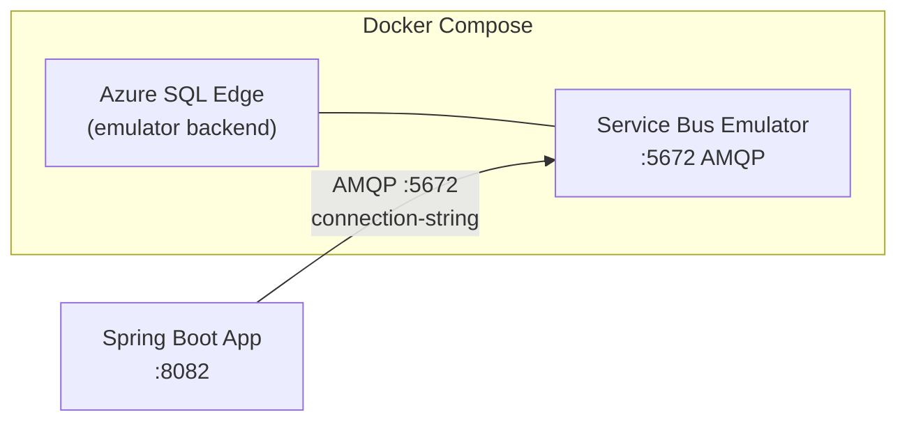

# Azure Service Bus Demo Implementation Plan

> **For agentic workers:** REQUIRED SUB-SKILL: Use superpowers:subagent-driven-development (recommended) or superpowers:executing-plans to implement this plan task-by-task. Steps use checkbox (`- [ ]`) syntax for tracking.

**Goal:** Add a runnable Azure Service Bus demo to `message-brokers/azure-service-bus/` following the same structure as the existing Kafka, RabbitMQ, Redis, and SQS demos.

**Architecture:** The Azure Service Bus emulator (Docker) backed by SQL Edge provides a local Service Bus namespace. A Spring Boot app on port 8082 demonstrates seven patterns — simple queue, work queue, pub/sub, routing (SQL filter subscriptions), DLQ, sessions (FIFO), and transactions — each exposed as a REST endpoint. Queue producers use `ServiceBusSenderClient` directly; queue/topic consumers use `@ServiceBusListener`; the session consumer and DLQ sub-queue consumer use `ServiceBusProcessorClient` started in `ApplicationRunner`.

**Tech Stack:** Java 21, Spring Boot 3.4.4, Spring Cloud Azure 5.22.0 (`spring-cloud-azure-starter-servicebus`), Lombok, SpringDoc/Swagger UI, Gatling 3.13.1, Docker Compose (SQL Edge + Service Bus Emulator)

---

## File Map

```
message-brokers/azure-service-bus/
├── docker/
│   ├── docker-compose.yml
│   └── config.json
├── spring-demo/
│   ├── pom.xml
│   └── src/
│       ├── main/java/com/testingai/servicebus/
│       │   ├── ServiceBusDemoApplication.java
│       │   ├── config/EntityNames.java
│       │   ├── util/FailureSimulator.java
│       │   ├── controller/DemoController.java
│       │   ├── simple/SimpleProducer.java
│       │   ├── simple/SimpleConsumer.java
│       │   ├── workqueue/WorkQueueProducer.java
│       │   ├── workqueue/WorkQueueConsumerA.java
│       │   ├── workqueue/WorkQueueConsumerB.java
│       │   ├── pubsub/PubSubPublisher.java
│       │   ├── pubsub/PubSubSubscriberA.java
│       │   ├── pubsub/PubSubSubscriberB.java
│       │   ├── routing/RoutingPublisher.java
│       │   ├── routing/RoutingConsumerAll.java
│       │   ├── routing/RoutingConsumerError.java
│       │   ├── dlq/DlqProducer.java
│       │   ├── dlq/DlqConsumer.java
│       │   ├── session/SessionProducer.java
│       │   ├── session/SessionConsumer.java
│       │   ├── transactions/TransactionalProducer.java
│       │   └── transactions/TransactionalConsumer.java
│       ├── main/resources/application.yml
│       └── test/java/com/testingai/servicebus/
│           ├── simple/SimpleProducerTest.java
│           ├── workqueue/WorkQueueProducerTest.java
│           ├── pubsub/PubSubPublisherTest.java
│           ├── routing/RoutingPublisherTest.java
│           ├── dlq/DlqProducerTest.java
│           ├── session/SessionProducerTest.java
│           ├── transactions/TransactionalProducerTest.java
│           └── performance/DemoSimulation.java
└── README.md
```

---

## Task 1: Docker infrastructure

**Files:**
- Create: `message-brokers/azure-service-bus/docker/docker-compose.yml`
- Create: `message-brokers/azure-service-bus/docker/config.json`

- [ ] **Step 1: Create docker-compose.yml**

```yaml
# message-brokers/azure-service-bus/docker/docker-compose.yml
name: azure-service-bus

services:
  sqledge:
    image: mcr.microsoft.com/azure-sql-edge
    container_name: sqledge
    environment:
      ACCEPT_EULA: "Y"
      SA_PASSWORD: "ServiceBus123!"
    healthcheck:
      test: ["CMD-SHELL", "echo > /dev/tcp/localhost/1433"]
      interval: 10s
      timeout: 5s
      retries: 15

  servicebus-emulator:
    image: mcr.microsoft.com/azure-messaging/servicebus-emulator:latest
    container_name: servicebus-emulator
    environment:
      ACCEPT_EULA: "Y"
      SQL_SERVER: sqledge
      MSSQL_SA_PASSWORD: "ServiceBus123!"
    ports:
      - "5672:5672"
    volumes:
      - ./config.json:/ServiceBus_Emulator/ConfigFiles/Config.json
    depends_on:
      sqledge:
        condition: service_healthy
    healthcheck:
      test: ["CMD-SHELL", "echo > /dev/tcp/localhost/5672"]
      interval: 5s
      timeout: 5s
      retries: 15
```

- [ ] **Step 2: Create config.json**

The `sub-all` subscription has no explicit `Rules` → emulator applies TrueFilter (all messages).
The `sub-error` subscription declares an explicit SqlFilter that overrides the default.

```json
{
  "UserConfig": {
    "Namespaces": [
      {
        "Name": "sbemulatorns",
        "Entities": {
          "Queues": [
            {
              "Name": "simple-queue",
              "Properties": {
                "DeadLetteringOnMessageExpiration": false,
                "DefaultMessageTimeToLive": "PT1H",
                "LockDuration": "PT1M",
                "MaxDeliveryCount": 10,
                "RequiresSession": false
              }
            },
            {
              "Name": "work-queue",
              "Properties": {
                "DeadLetteringOnMessageExpiration": false,
                "DefaultMessageTimeToLive": "PT1H",
                "LockDuration": "PT1M",
                "MaxDeliveryCount": 10,
                "RequiresSession": false
              }
            },
            {
              "Name": "dlq-queue",
              "Properties": {
                "DeadLetteringOnMessageExpiration": false,
                "DefaultMessageTimeToLive": "PT1H",
                "LockDuration": "PT30S",
                "MaxDeliveryCount": 3,
                "RequiresSession": false
              }
            },
            {
              "Name": "session-queue",
              "Properties": {
                "DeadLetteringOnMessageExpiration": false,
                "DefaultMessageTimeToLive": "PT1H",
                "LockDuration": "PT1M",
                "MaxDeliveryCount": 10,
                "RequiresSession": true
              }
            },
            {
              "Name": "tx-queue",
              "Properties": {
                "DeadLetteringOnMessageExpiration": false,
                "DefaultMessageTimeToLive": "PT1H",
                "LockDuration": "PT1M",
                "MaxDeliveryCount": 10,
                "RequiresSession": false
              }
            }
          ],
          "Topics": [
            {
              "Name": "pubsub-topic",
              "Properties": {
                "DefaultMessageTimeToLive": "PT1H"
              },
              "Subscriptions": [
                {
                  "Name": "sub-a",
                  "Properties": {
                    "DefaultMessageTimeToLive": "PT1H",
                    "LockDuration": "PT1M",
                    "MaxDeliveryCount": 10
                  }
                },
                {
                  "Name": "sub-b",
                  "Properties": {
                    "DefaultMessageTimeToLive": "PT1H",
                    "LockDuration": "PT1M",
                    "MaxDeliveryCount": 10
                  }
                }
              ]
            },
            {
              "Name": "routing-topic",
              "Properties": {
                "DefaultMessageTimeToLive": "PT1H"
              },
              "Subscriptions": [
                {
                  "Name": "sub-all",
                  "Properties": {
                    "DefaultMessageTimeToLive": "PT1H",
                    "LockDuration": "PT1M",
                    "MaxDeliveryCount": 10
                  }
                },
                {
                  "Name": "sub-error",
                  "Properties": {
                    "DefaultMessageTimeToLive": "PT1H",
                    "LockDuration": "PT1M",
                    "MaxDeliveryCount": 10
                  },
                  "Rules": [
                    {
                      "Name": "error-only",
                      "Properties": {
                        "FilterType": "SqlFilter",
                        "SqlExpression": "level = 'error'"
                      }
                    }
                  ]
                }
              ]
            }
          ]
        }
      }
    ],
    "Logging": {
      "Type": "Console"
    }
  }
}
```

- [ ] **Step 3: Commit**

```bash
git add message-brokers/azure-service-bus/docker/
git commit -m "feat(azure-service-bus): add Docker Compose and emulator config"
```

---

## Task 2: Maven project scaffold

**Files:**
- Create: `message-brokers/azure-service-bus/spring-demo/pom.xml`
- Create: `message-brokers/azure-service-bus/spring-demo/src/main/java/com/testingai/servicebus/ServiceBusDemoApplication.java`
- Create: `message-brokers/azure-service-bus/spring-demo/src/main/java/com/testingai/servicebus/config/EntityNames.java`
- Create: `message-brokers/azure-service-bus/spring-demo/src/main/java/com/testingai/servicebus/util/FailureSimulator.java`
- Create: `message-brokers/azure-service-bus/spring-demo/src/main/resources/application.yml`

- [ ] **Step 1: Create pom.xml**

```xml
<?xml version="1.0" encoding="UTF-8"?>
<project xmlns="http://maven.apache.org/POM/4.0.0"
         xmlns:xsi="http://www.w3.org/2001/XMLSchema-instance"
         xsi:schemaLocation="http://maven.apache.org/POM/4.0.0
             https://maven.apache.org/xsd/maven-4.0.0.xsd">
    <modelVersion>4.0.0</modelVersion>

    <parent>
        <groupId>org.springframework.boot</groupId>
        <artifactId>spring-boot-starter-parent</artifactId>
        <version>3.4.4</version>
        <relativePath/>
    </parent>

    <groupId>com.testingai</groupId>
    <artifactId>azure-service-bus-demo</artifactId>
    <version>0.0.1-SNAPSHOT</version>
    <name>azure-service-bus-demo</name>

    <properties>
        <java.version>21</java.version>
        <spring-cloud-azure.version>5.22.0</spring-cloud-azure.version>
        <springdoc.version>2.8.6</springdoc.version>
        <lombok.version>1.18.38</lombok.version>
        <gatling.version>3.13.1</gatling.version>
    </properties>

    <dependencyManagement>
        <dependencies>
            <dependency>
                <groupId>com.azure.spring</groupId>
                <artifactId>spring-cloud-azure-dependencies</artifactId>
                <version>${spring-cloud-azure.version}</version>
                <type>pom</type>
                <scope>import</scope>
            </dependency>
        </dependencies>
    </dependencyManagement>

    <dependencies>
        <dependency>
            <groupId>com.azure.spring</groupId>
            <artifactId>spring-cloud-azure-starter-servicebus</artifactId>
        </dependency>
        <dependency>
            <groupId>org.springframework.boot</groupId>
            <artifactId>spring-boot-starter-web</artifactId>
        </dependency>
        <dependency>
            <groupId>org.springdoc</groupId>
            <artifactId>springdoc-openapi-starter-webmvc-ui</artifactId>
            <version>${springdoc.version}</version>
        </dependency>
        <dependency>
            <groupId>org.projectlombok</groupId>
            <artifactId>lombok</artifactId>
            <version>${lombok.version}</version>
            <optional>true</optional>
        </dependency>
        <dependency>
            <groupId>org.springframework.boot</groupId>
            <artifactId>spring-boot-starter-test</artifactId>
            <scope>test</scope>
        </dependency>
        <dependency>
            <groupId>io.gatling.highcharts</groupId>
            <artifactId>gatling-charts-highcharts</artifactId>
            <version>${gatling.version}</version>
            <scope>test</scope>
        </dependency>
    </dependencies>

    <build>
        <plugins>
            <plugin>
                <groupId>org.apache.maven.plugins</groupId>
                <artifactId>maven-compiler-plugin</artifactId>
                <configuration>
                    <annotationProcessorPaths>
                        <path>
                            <groupId>org.projectlombok</groupId>
                            <artifactId>lombok</artifactId>
                            <version>${lombok.version}</version>
                        </path>
                    </annotationProcessorPaths>
                </configuration>
            </plugin>
            <plugin>
                <groupId>org.springframework.boot</groupId>
                <artifactId>spring-boot-maven-plugin</artifactId>
                <configuration>
                    <excludes>
                        <exclude>
                            <groupId>org.projectlombok</groupId>
                            <artifactId>lombok</artifactId>
                        </exclude>
                    </excludes>
                </configuration>
            </plugin>
            <plugin>
                <groupId>io.gatling</groupId>
                <artifactId>gatling-maven-plugin</artifactId>
                <version>4.10.2</version>
                <configuration>
                    <simulationClass>com.testingai.servicebus.performance.DemoSimulation</simulationClass>
                </configuration>
            </plugin>
            <plugin>
                <groupId>org.apache.maven.plugins</groupId>
                <artifactId>maven-surefire-plugin</artifactId>
                <configuration>
                    <excludes>
                        <exclude>**/performance/**</exclude>
                    </excludes>
                    <argLine>-Dnet.bytebuddy.experimental=true</argLine>
                </configuration>
            </plugin>
        </plugins>
    </build>
</project>
```

- [ ] **Step 2: Create ServiceBusDemoApplication.java**

```java
// src/main/java/com/testingai/servicebus/ServiceBusDemoApplication.java
package com.testingai.servicebus;

import org.springframework.boot.SpringApplication;
import org.springframework.boot.autoconfigure.SpringBootApplication;

@SpringBootApplication
public class ServiceBusDemoApplication {
    public static void main(String[] args) {
        SpringApplication.run(ServiceBusDemoApplication.class, args);
    }
}
```

- [ ] **Step 3: Create EntityNames.java**

```java
// src/main/java/com/testingai/servicebus/config/EntityNames.java
package com.testingai.servicebus.config;

public class EntityNames {

    private EntityNames() {}

    public static final String SIMPLE_QUEUE  = "simple-queue";
    public static final String WORK_QUEUE    = "work-queue";
    public static final String DLQ_QUEUE     = "dlq-queue";
    public static final String SESSION_QUEUE = "session-queue";
    public static final String TX_QUEUE      = "tx-queue";

    public static final String PUBSUB_TOPIC  = "pubsub-topic";
    public static final String ROUTING_TOPIC = "routing-topic";

    public static final String PUBSUB_SUB_A      = "sub-a";
    public static final String PUBSUB_SUB_B      = "sub-b";
    public static final String ROUTING_SUB_ALL   = "sub-all";
    public static final String ROUTING_SUB_ERROR = "sub-error";

    public static final String ROUTING_KEY = "level";
}
```

- [ ] **Step 4: Create FailureSimulator.java**

```java
// src/main/java/com/testingai/servicebus/util/FailureSimulator.java
package com.testingai.servicebus.util;

public class FailureSimulator {

    private FailureSimulator() {}

    public static boolean shouldFail() {
        return Math.random() < 0.50;
    }
}
```

- [ ] **Step 5: Create application.yml**

```yaml
server:
  port: 8082

spring:
  cloud:
    azure:
      servicebus:
        connection-string: "Endpoint=sb://localhost;SharedAccessKeyName=RootManageSharedAccessKey;SharedAccessKey=SAS_KEY_VALUE;UseDevelopmentEmulator=true;"

logging:
  level:
    com.testingai: INFO
    com.azure.messaging.servicebus: WARN
    com.azure.core: WARN
```

- [ ] **Step 6: Verify compilation**

```bash
cd message-brokers/azure-service-bus/spring-demo
mvn compile -q
```

Expected: `BUILD SUCCESS` with no errors.

- [ ] **Step 7: Commit**

```bash
git add message-brokers/azure-service-bus/spring-demo/pom.xml \
        message-brokers/azure-service-bus/spring-demo/src/main/java/com/testingai/servicebus/ServiceBusDemoApplication.java \
        message-brokers/azure-service-bus/spring-demo/src/main/java/com/testingai/servicebus/config/EntityNames.java \
        message-brokers/azure-service-bus/spring-demo/src/main/java/com/testingai/servicebus/util/FailureSimulator.java \
        message-brokers/azure-service-bus/spring-demo/src/main/resources/application.yml
git commit -m "feat(azure-service-bus): scaffold Maven project with EntityNames and FailureSimulator"
```

---

## Task 3: Simple pattern

**Files:**
- Create: `src/main/java/com/testingai/servicebus/simple/SimpleProducer.java`
- Create: `src/main/java/com/testingai/servicebus/simple/SimpleConsumer.java`
- Create: `src/test/java/com/testingai/servicebus/simple/SimpleProducerTest.java`

All paths relative to `message-brokers/azure-service-bus/spring-demo/`.

- [ ] **Step 1: Write SimpleProducerTest.java**

```java
// src/test/java/com/testingai/servicebus/simple/SimpleProducerTest.java
package com.testingai.servicebus.simple;

import com.azure.messaging.servicebus.ServiceBusClientBuilder;
import com.azure.messaging.servicebus.ServiceBusMessage;
import com.azure.messaging.servicebus.ServiceBusSenderClient;
import com.testingai.servicebus.config.EntityNames;
import org.junit.jupiter.api.BeforeEach;
import org.junit.jupiter.api.Test;
import org.junit.jupiter.api.extension.ExtendWith;
import org.mockito.ArgumentCaptor;
import org.mockito.Mock;
import org.mockito.junit.jupiter.MockitoExtension;

import static org.assertj.core.api.Assertions.assertThat;
import static org.mockito.Mockito.*;

@ExtendWith(MockitoExtension.class)
class SimpleProducerTest {

    @Mock private ServiceBusClientBuilder clientBuilder;
    @Mock private ServiceBusClientBuilder.ServiceBusSenderClientBuilder senderClientBuilder;
    @Mock private ServiceBusSenderClient senderClient;

    private SimpleProducer producer;

    @BeforeEach
    void setUp() {
        when(clientBuilder.sender()).thenReturn(senderClientBuilder);
        when(senderClientBuilder.queueName(EntityNames.SIMPLE_QUEUE)).thenReturn(senderClientBuilder);
        when(senderClientBuilder.buildClient()).thenReturn(senderClient);
        producer = new SimpleProducer(clientBuilder);
    }

    @Test
    void send_shouldSendMessageToSimpleQueue() {
        producer.send("hello");

        ArgumentCaptor<ServiceBusMessage> captor = ArgumentCaptor.forClass(ServiceBusMessage.class);
        verify(senderClient).sendMessage(captor.capture());
        assertThat(captor.getValue().getBody().toString()).isEqualTo("hello");
    }
}
```

- [ ] **Step 2: Run test — expect FAIL**

```bash
cd message-brokers/azure-service-bus/spring-demo
mvn test -pl . -Dtest=SimpleProducerTest -q
```

Expected: `FAIL` — `SimpleProducer` does not exist yet.

- [ ] **Step 3: Create SimpleProducer.java**

```java
// src/main/java/com/testingai/servicebus/simple/SimpleProducer.java
package com.testingai.servicebus.simple;

import com.azure.messaging.servicebus.ServiceBusClientBuilder;
import com.azure.messaging.servicebus.ServiceBusMessage;
import com.azure.messaging.servicebus.ServiceBusSenderClient;
import com.testingai.servicebus.config.EntityNames;
import lombok.extern.slf4j.Slf4j;
import org.springframework.stereotype.Component;

@Slf4j
@Component
public class SimpleProducer {

    private final ServiceBusSenderClient senderClient;

    public SimpleProducer(ServiceBusClientBuilder clientBuilder) {
        this.senderClient = clientBuilder
                .sender()
                .queueName(EntityNames.SIMPLE_QUEUE)
                .buildClient();
    }

    public void send(String message) {
        senderClient.sendMessage(new ServiceBusMessage(message));
        log.info("[simple] sent: {}", message);
    }
}
```

- [ ] **Step 4: Create SimpleConsumer.java**

```java
// src/main/java/com/testingai/servicebus/simple/SimpleConsumer.java
package com.testingai.servicebus.simple;

import com.azure.spring.messaging.servicebus.implementation.core.annotation.ServiceBusListener;
import com.testingai.servicebus.config.EntityNames;
import lombok.extern.slf4j.Slf4j;
import org.springframework.stereotype.Component;

@Slf4j
@Component
public class SimpleConsumer {

    @ServiceBusListener(destination = EntityNames.SIMPLE_QUEUE)
    public void receive(String message) {
        log.info("[simple] received: {}", message);
    }
}
```

- [ ] **Step 5: Run test — expect PASS**

```bash
mvn test -pl . -Dtest=SimpleProducerTest -q
```

Expected: `BUILD SUCCESS`.

- [ ] **Step 6: Commit**

```bash
git add message-brokers/azure-service-bus/spring-demo/src/
git commit -m "feat(azure-service-bus): add simple queue pattern"
```

---

## Task 4: Work queue pattern

**Files:**
- Create: `src/main/java/com/testingai/servicebus/workqueue/WorkQueueProducer.java`
- Create: `src/main/java/com/testingai/servicebus/workqueue/WorkQueueConsumerA.java`
- Create: `src/main/java/com/testingai/servicebus/workqueue/WorkQueueConsumerB.java`
- Create: `src/test/java/com/testingai/servicebus/workqueue/WorkQueueProducerTest.java`

- [ ] **Step 1: Write WorkQueueProducerTest.java**

```java
// src/test/java/com/testingai/servicebus/workqueue/WorkQueueProducerTest.java
package com.testingai.servicebus.workqueue;

import com.azure.messaging.servicebus.ServiceBusClientBuilder;
import com.azure.messaging.servicebus.ServiceBusMessage;
import com.azure.messaging.servicebus.ServiceBusSenderClient;
import com.testingai.servicebus.config.EntityNames;
import org.junit.jupiter.api.BeforeEach;
import org.junit.jupiter.api.Test;
import org.junit.jupiter.api.extension.ExtendWith;
import org.mockito.ArgumentCaptor;
import org.mockito.Mock;
import org.mockito.junit.jupiter.MockitoExtension;

import static org.assertj.core.api.Assertions.assertThat;
import static org.mockito.Mockito.*;

@ExtendWith(MockitoExtension.class)
class WorkQueueProducerTest {

    @Mock private ServiceBusClientBuilder clientBuilder;
    @Mock private ServiceBusClientBuilder.ServiceBusSenderClientBuilder senderClientBuilder;
    @Mock private ServiceBusSenderClient senderClient;

    private WorkQueueProducer producer;

    @BeforeEach
    void setUp() {
        when(clientBuilder.sender()).thenReturn(senderClientBuilder);
        when(senderClientBuilder.queueName(EntityNames.WORK_QUEUE)).thenReturn(senderClientBuilder);
        when(senderClientBuilder.buildClient()).thenReturn(senderClient);
        producer = new WorkQueueProducer(clientBuilder);
    }

    @Test
    void send_shouldSendMessageToWorkQueue() {
        producer.send("task-1");

        ArgumentCaptor<ServiceBusMessage> captor = ArgumentCaptor.forClass(ServiceBusMessage.class);
        verify(senderClient).sendMessage(captor.capture());
        assertThat(captor.getValue().getBody().toString()).isEqualTo("task-1");
    }
}
```

- [ ] **Step 2: Run test — expect FAIL**

```bash
mvn test -pl . -Dtest=WorkQueueProducerTest -q
```

Expected: `FAIL` — class does not exist yet.

- [ ] **Step 3: Create WorkQueueProducer.java**

```java
// src/main/java/com/testingai/servicebus/workqueue/WorkQueueProducer.java
package com.testingai.servicebus.workqueue;

import com.azure.messaging.servicebus.ServiceBusClientBuilder;
import com.azure.messaging.servicebus.ServiceBusMessage;
import com.azure.messaging.servicebus.ServiceBusSenderClient;
import com.testingai.servicebus.config.EntityNames;
import lombok.extern.slf4j.Slf4j;
import org.springframework.stereotype.Component;

@Slf4j
@Component
public class WorkQueueProducer {

    private final ServiceBusSenderClient senderClient;

    public WorkQueueProducer(ServiceBusClientBuilder clientBuilder) {
        this.senderClient = clientBuilder
                .sender()
                .queueName(EntityNames.WORK_QUEUE)
                .buildClient();
    }

    public void send(String message) {
        senderClient.sendMessage(new ServiceBusMessage(message));
        log.info("[work] sent: {}", message);
    }
}
```

- [ ] **Step 4: Create WorkQueueConsumerA.java**

```java
// src/main/java/com/testingai/servicebus/workqueue/WorkQueueConsumerA.java
package com.testingai.servicebus.workqueue;

import com.azure.spring.messaging.servicebus.implementation.core.annotation.ServiceBusListener;
import com.testingai.servicebus.config.EntityNames;
import lombok.extern.slf4j.Slf4j;
import org.springframework.stereotype.Component;

@Slf4j
@Component
public class WorkQueueConsumerA {

    @ServiceBusListener(destination = EntityNames.WORK_QUEUE)
    public void receive(String message) {
        log.info("[work][A] received: {}", message);
    }
}
```

- [ ] **Step 5: Create WorkQueueConsumerB.java**

```java
// src/main/java/com/testingai/servicebus/workqueue/WorkQueueConsumerB.java
package com.testingai.servicebus.workqueue;

import com.azure.spring.messaging.servicebus.implementation.core.annotation.ServiceBusListener;
import com.testingai.servicebus.config.EntityNames;
import lombok.extern.slf4j.Slf4j;
import org.springframework.stereotype.Component;

@Slf4j
@Component
public class WorkQueueConsumerB {

    @ServiceBusListener(destination = EntityNames.WORK_QUEUE)
    public void receive(String message) {
        log.info("[work][B] received: {}", message);
    }
}
```

- [ ] **Step 6: Run test — expect PASS**

```bash
mvn test -pl . -Dtest=WorkQueueProducerTest -q
```

Expected: `BUILD SUCCESS`.

- [ ] **Step 7: Commit**

```bash
git add message-brokers/azure-service-bus/spring-demo/src/
git commit -m "feat(azure-service-bus): add work queue pattern"
```

---

## Task 5: Pub/Sub pattern

**Files:**
- Create: `src/main/java/com/testingai/servicebus/pubsub/PubSubPublisher.java`
- Create: `src/main/java/com/testingai/servicebus/pubsub/PubSubSubscriberA.java`
- Create: `src/main/java/com/testingai/servicebus/pubsub/PubSubSubscriberB.java`
- Create: `src/test/java/com/testingai/servicebus/pubsub/PubSubPublisherTest.java`

- [ ] **Step 1: Write PubSubPublisherTest.java**

```java
// src/test/java/com/testingai/servicebus/pubsub/PubSubPublisherTest.java
package com.testingai.servicebus.pubsub;

import com.azure.messaging.servicebus.ServiceBusClientBuilder;
import com.azure.messaging.servicebus.ServiceBusMessage;
import com.azure.messaging.servicebus.ServiceBusSenderClient;
import com.testingai.servicebus.config.EntityNames;
import org.junit.jupiter.api.BeforeEach;
import org.junit.jupiter.api.Test;
import org.junit.jupiter.api.extension.ExtendWith;
import org.mockito.ArgumentCaptor;
import org.mockito.Mock;
import org.mockito.junit.jupiter.MockitoExtension;

import static org.assertj.core.api.Assertions.assertThat;
import static org.mockito.Mockito.*;

@ExtendWith(MockitoExtension.class)
class PubSubPublisherTest {

    @Mock private ServiceBusClientBuilder clientBuilder;
    @Mock private ServiceBusClientBuilder.ServiceBusSenderClientBuilder senderClientBuilder;
    @Mock private ServiceBusSenderClient senderClient;

    private PubSubPublisher publisher;

    @BeforeEach
    void setUp() {
        when(clientBuilder.sender()).thenReturn(senderClientBuilder);
        when(senderClientBuilder.topicName(EntityNames.PUBSUB_TOPIC)).thenReturn(senderClientBuilder);
        when(senderClientBuilder.buildClient()).thenReturn(senderClient);
        publisher = new PubSubPublisher(clientBuilder);
    }

    @Test
    void publish_shouldSendMessageToPubSubTopic() {
        publisher.publish("broadcast");

        ArgumentCaptor<ServiceBusMessage> captor = ArgumentCaptor.forClass(ServiceBusMessage.class);
        verify(senderClient).sendMessage(captor.capture());
        assertThat(captor.getValue().getBody().toString()).isEqualTo("broadcast");
    }
}
```

- [ ] **Step 2: Run test — expect FAIL**

```bash
mvn test -pl . -Dtest=PubSubPublisherTest -q
```

Expected: `FAIL`.

- [ ] **Step 3: Create PubSubPublisher.java**

```java
// src/main/java/com/testingai/servicebus/pubsub/PubSubPublisher.java
package com.testingai.servicebus.pubsub;

import com.azure.messaging.servicebus.ServiceBusClientBuilder;
import com.azure.messaging.servicebus.ServiceBusMessage;
import com.azure.messaging.servicebus.ServiceBusSenderClient;
import com.testingai.servicebus.config.EntityNames;
import lombok.extern.slf4j.Slf4j;
import org.springframework.stereotype.Component;

@Slf4j
@Component
public class PubSubPublisher {

    private final ServiceBusSenderClient senderClient;

    public PubSubPublisher(ServiceBusClientBuilder clientBuilder) {
        this.senderClient = clientBuilder
                .sender()
                .topicName(EntityNames.PUBSUB_TOPIC)
                .buildClient();
    }

    public void publish(String message) {
        senderClient.sendMessage(new ServiceBusMessage(message));
        log.info("[pubsub] published: {}", message);
    }
}
```

- [ ] **Step 4: Create PubSubSubscriberA.java**

```java
// src/main/java/com/testingai/servicebus/pubsub/PubSubSubscriberA.java
package com.testingai.servicebus.pubsub;

import com.azure.spring.messaging.servicebus.implementation.core.annotation.ServiceBusListener;
import com.testingai.servicebus.config.EntityNames;
import lombok.extern.slf4j.Slf4j;
import org.springframework.stereotype.Component;

@Slf4j
@Component
public class PubSubSubscriberA {

    @ServiceBusListener(destination = EntityNames.PUBSUB_TOPIC, group = EntityNames.PUBSUB_SUB_A)
    public void receive(String message) {
        log.info("[pubsub][sub-a] received: {}", message);
    }
}
```

- [ ] **Step 5: Create PubSubSubscriberB.java**

```java
// src/main/java/com/testingai/servicebus/pubsub/PubSubSubscriberB.java
package com.testingai.servicebus.pubsub;

import com.azure.spring.messaging.servicebus.implementation.core.annotation.ServiceBusListener;
import com.testingai.servicebus.config.EntityNames;
import lombok.extern.slf4j.Slf4j;
import org.springframework.stereotype.Component;

@Slf4j
@Component
public class PubSubSubscriberB {

    @ServiceBusListener(destination = EntityNames.PUBSUB_TOPIC, group = EntityNames.PUBSUB_SUB_B)
    public void receive(String message) {
        log.info("[pubsub][sub-b] received: {}", message);
    }
}
```

- [ ] **Step 6: Run test — expect PASS**

```bash
mvn test -pl . -Dtest=PubSubPublisherTest -q
```

Expected: `BUILD SUCCESS`.

- [ ] **Step 7: Commit**

```bash
git add message-brokers/azure-service-bus/spring-demo/src/
git commit -m "feat(azure-service-bus): add pub/sub pattern"
```

---

## Task 6: Routing pattern (SQL filter subscriptions)

**Files:**
- Create: `src/main/java/com/testingai/servicebus/routing/RoutingPublisher.java`
- Create: `src/main/java/com/testingai/servicebus/routing/RoutingConsumerAll.java`
- Create: `src/main/java/com/testingai/servicebus/routing/RoutingConsumerError.java`
- Create: `src/test/java/com/testingai/servicebus/routing/RoutingPublisherTest.java`

The `RoutingPublisher` sets application property `level=<key>` on each message. The emulator's `sub-error` SqlFilter (`level = 'error'`) means only error-level messages reach `RoutingConsumerError`; `sub-all` TrueFilter means `RoutingConsumerAll` receives everything.

- [ ] **Step 1: Write RoutingPublisherTest.java**

```java
// src/test/java/com/testingai/servicebus/routing/RoutingPublisherTest.java
package com.testingai.servicebus.routing;

import com.azure.messaging.servicebus.ServiceBusClientBuilder;
import com.azure.messaging.servicebus.ServiceBusMessage;
import com.azure.messaging.servicebus.ServiceBusSenderClient;
import com.testingai.servicebus.config.EntityNames;
import org.junit.jupiter.api.BeforeEach;
import org.junit.jupiter.api.Test;
import org.junit.jupiter.api.extension.ExtendWith;
import org.mockito.ArgumentCaptor;
import org.mockito.Mock;
import org.mockito.junit.jupiter.MockitoExtension;

import static org.assertj.core.api.Assertions.assertThat;
import static org.mockito.Mockito.*;

@ExtendWith(MockitoExtension.class)
class RoutingPublisherTest {

    @Mock private ServiceBusClientBuilder clientBuilder;
    @Mock private ServiceBusClientBuilder.ServiceBusSenderClientBuilder senderClientBuilder;
    @Mock private ServiceBusSenderClient senderClient;

    private RoutingPublisher publisher;

    @BeforeEach
    void setUp() {
        when(clientBuilder.sender()).thenReturn(senderClientBuilder);
        when(senderClientBuilder.topicName(EntityNames.ROUTING_TOPIC)).thenReturn(senderClientBuilder);
        when(senderClientBuilder.buildClient()).thenReturn(senderClient);
        publisher = new RoutingPublisher(clientBuilder);
    }

    @Test
    void publish_shouldSendMessageWithLevelProperty() {
        publisher.publish("error", "boom");

        ArgumentCaptor<ServiceBusMessage> captor = ArgumentCaptor.forClass(ServiceBusMessage.class);
        verify(senderClient).sendMessage(captor.capture());
        assertThat(captor.getValue().getBody().toString()).isEqualTo("boom");
        assertThat(captor.getValue().getApplicationProperties().get(EntityNames.ROUTING_KEY))
                .isEqualTo("error");
    }

    @Test
    void publish_shouldSetLevelPropertyFromKey() {
        publisher.publish("info", "hello");

        ArgumentCaptor<ServiceBusMessage> captor = ArgumentCaptor.forClass(ServiceBusMessage.class);
        verify(senderClient).sendMessage(captor.capture());
        assertThat(captor.getValue().getApplicationProperties().get(EntityNames.ROUTING_KEY))
                .isEqualTo("info");
    }
}
```

- [ ] **Step 2: Run test — expect FAIL**

```bash
mvn test -pl . -Dtest=RoutingPublisherTest -q
```

Expected: `FAIL`.

- [ ] **Step 3: Create RoutingPublisher.java**

```java
// src/main/java/com/testingai/servicebus/routing/RoutingPublisher.java
package com.testingai.servicebus.routing;

import com.azure.messaging.servicebus.ServiceBusClientBuilder;
import com.azure.messaging.servicebus.ServiceBusMessage;
import com.azure.messaging.servicebus.ServiceBusSenderClient;
import com.testingai.servicebus.config.EntityNames;
import lombok.extern.slf4j.Slf4j;
import org.springframework.stereotype.Component;

@Slf4j
@Component
public class RoutingPublisher {

    private final ServiceBusSenderClient senderClient;

    public RoutingPublisher(ServiceBusClientBuilder clientBuilder) {
        this.senderClient = clientBuilder
                .sender()
                .topicName(EntityNames.ROUTING_TOPIC)
                .buildClient();
    }

    public void publish(String level, String message) {
        ServiceBusMessage msg = new ServiceBusMessage(message);
        msg.getApplicationProperties().put(EntityNames.ROUTING_KEY, level);
        senderClient.sendMessage(msg);
        log.info("[routing] level={} sent={}", level, message);
    }
}
```

- [ ] **Step 4: Create RoutingConsumerAll.java**

```java
// src/main/java/com/testingai/servicebus/routing/RoutingConsumerAll.java
package com.testingai.servicebus.routing;

import com.azure.spring.messaging.servicebus.implementation.core.annotation.ServiceBusListener;
import com.testingai.servicebus.config.EntityNames;
import lombok.extern.slf4j.Slf4j;
import org.springframework.stereotype.Component;

@Slf4j
@Component
public class RoutingConsumerAll {

    @ServiceBusListener(destination = EntityNames.ROUTING_TOPIC, group = EntityNames.ROUTING_SUB_ALL)
    public void receive(String message) {
        log.info("[routing][sub-all] received: {}", message);
    }
}
```

- [ ] **Step 5: Create RoutingConsumerError.java**

```java
// src/main/java/com/testingai/servicebus/routing/RoutingConsumerError.java
package com.testingai.servicebus.routing;

import com.azure.spring.messaging.servicebus.implementation.core.annotation.ServiceBusListener;
import com.testingai.servicebus.config.EntityNames;
import lombok.extern.slf4j.Slf4j;
import org.springframework.stereotype.Component;

@Slf4j
@Component
public class RoutingConsumerError {

    @ServiceBusListener(destination = EntityNames.ROUTING_TOPIC, group = EntityNames.ROUTING_SUB_ERROR)
    public void receive(String message) {
        log.info("[routing][sub-error] received: {}", message);
    }
}
```

- [ ] **Step 6: Run test — expect PASS**

```bash
mvn test -pl . -Dtest=RoutingPublisherTest -q
```

Expected: `BUILD SUCCESS`.

- [ ] **Step 7: Commit**

```bash
git add message-brokers/azure-service-bus/spring-demo/src/
git commit -m "feat(azure-service-bus): add routing pattern with SQL filter subscriptions"
```

---

## Task 7: Dead Letter Queue pattern

**Files:**
- Create: `src/main/java/com/testingai/servicebus/dlq/DlqProducer.java`
- Create: `src/main/java/com/testingai/servicebus/dlq/DlqConsumer.java`
- Create: `src/test/java/com/testingai/servicebus/dlq/DlqProducerTest.java`

The main consumer (`@ServiceBusListener`) fails ~50% of the time. After `maxDeliveryCount=3` failures Service Bus moves the message to the dead-letter sub-queue automatically. The DLQ listener uses `ServiceBusProcessorClient` with `SubQueue.DEAD_LETTER` — `@ServiceBusListener` does not support sub-queue selection.

- [ ] **Step 1: Write DlqProducerTest.java**

```java
// src/test/java/com/testingai/servicebus/dlq/DlqProducerTest.java
package com.testingai.servicebus.dlq;

import com.azure.messaging.servicebus.ServiceBusClientBuilder;
import com.azure.messaging.servicebus.ServiceBusMessage;
import com.azure.messaging.servicebus.ServiceBusSenderClient;
import com.testingai.servicebus.config.EntityNames;
import org.junit.jupiter.api.BeforeEach;
import org.junit.jupiter.api.Test;
import org.junit.jupiter.api.extension.ExtendWith;
import org.mockito.ArgumentCaptor;
import org.mockito.Mock;
import org.mockito.junit.jupiter.MockitoExtension;

import static org.assertj.core.api.Assertions.assertThat;
import static org.mockito.Mockito.*;

@ExtendWith(MockitoExtension.class)
class DlqProducerTest {

    @Mock private ServiceBusClientBuilder clientBuilder;
    @Mock private ServiceBusClientBuilder.ServiceBusSenderClientBuilder senderClientBuilder;
    @Mock private ServiceBusSenderClient senderClient;

    private DlqProducer producer;

    @BeforeEach
    void setUp() {
        when(clientBuilder.sender()).thenReturn(senderClientBuilder);
        when(senderClientBuilder.queueName(EntityNames.DLQ_QUEUE)).thenReturn(senderClientBuilder);
        when(senderClientBuilder.buildClient()).thenReturn(senderClient);
        producer = new DlqProducer(clientBuilder);
    }

    @Test
    void send_shouldSendMessageToDlqQueue() {
        producer.send("risky-message");

        ArgumentCaptor<ServiceBusMessage> captor = ArgumentCaptor.forClass(ServiceBusMessage.class);
        verify(senderClient).sendMessage(captor.capture());
        assertThat(captor.getValue().getBody().toString()).isEqualTo("risky-message");
    }
}
```

- [ ] **Step 2: Run test — expect FAIL**

```bash
mvn test -pl . -Dtest=DlqProducerTest -q
```

Expected: `FAIL`.

- [ ] **Step 3: Create DlqProducer.java**

```java
// src/main/java/com/testingai/servicebus/dlq/DlqProducer.java
package com.testingai.servicebus.dlq;

import com.azure.messaging.servicebus.ServiceBusClientBuilder;
import com.azure.messaging.servicebus.ServiceBusMessage;
import com.azure.messaging.servicebus.ServiceBusSenderClient;
import com.testingai.servicebus.config.EntityNames;
import lombok.extern.slf4j.Slf4j;
import org.springframework.stereotype.Component;

@Slf4j
@Component
public class DlqProducer {

    private final ServiceBusSenderClient senderClient;

    public DlqProducer(ServiceBusClientBuilder clientBuilder) {
        this.senderClient = clientBuilder
                .sender()
                .queueName(EntityNames.DLQ_QUEUE)
                .buildClient();
    }

    public void send(String message) {
        senderClient.sendMessage(new ServiceBusMessage(message));
        log.info("[dlq] sent: {}", message);
    }
}
```

- [ ] **Step 4: Create DlqConsumer.java**

```java
// src/main/java/com/testingai/servicebus/dlq/DlqConsumer.java
package com.testingai.servicebus.dlq;

import com.azure.messaging.servicebus.ServiceBusClientBuilder;
import com.azure.messaging.servicebus.ServiceBusProcessorClient;
import com.azure.messaging.servicebus.models.SubQueue;
import com.azure.spring.messaging.servicebus.implementation.core.annotation.ServiceBusListener;
import com.testingai.servicebus.config.EntityNames;
import com.testingai.servicebus.util.FailureSimulator;
import lombok.extern.slf4j.Slf4j;
import org.springframework.boot.ApplicationArguments;
import org.springframework.boot.ApplicationRunner;
import org.springframework.stereotype.Component;

@Slf4j
@Component
public class DlqConsumer implements ApplicationRunner {

    private final ServiceBusClientBuilder clientBuilder;
    private ServiceBusProcessorClient dlqProcessorClient;

    public DlqConsumer(ServiceBusClientBuilder clientBuilder) {
        this.clientBuilder = clientBuilder;
    }

    @ServiceBusListener(destination = EntityNames.DLQ_QUEUE)
    public void receive(String message) {
        if (FailureSimulator.shouldFail()) {
            log.warn("[dlq] simulating failure for: {}", message);
            throw new RuntimeException("simulated processing failure");
        }
        log.info("[dlq] processed: {}", message);
    }

    @Override
    public void run(ApplicationArguments args) {
        dlqProcessorClient = clientBuilder
                .processor()
                .queueName(EntityNames.DLQ_QUEUE)
                .subQueue(SubQueue.DEAD_LETTER)
                .processMessage(ctx ->
                        log.warn("[dlq] dead-lettered after {} attempts: {}",
                                ctx.getMessage().getDeliveryCount(),
                                ctx.getMessage().getBody()))
                .processError(ctx -> log.error("[dlq] DLQ processor error", ctx.getException()))
                .buildProcessorClient();
        dlqProcessorClient.start();
    }
}
```

- [ ] **Step 5: Run test — expect PASS**

```bash
mvn test -pl . -Dtest=DlqProducerTest -q
```

Expected: `BUILD SUCCESS`.

- [ ] **Step 6: Commit**

```bash
git add message-brokers/azure-service-bus/spring-demo/src/
git commit -m "feat(azure-service-bus): add dead letter queue pattern"
```

---

## Task 8: Sessions pattern (FIFO ordering)

**Files:**
- Create: `src/main/java/com/testingai/servicebus/session/SessionProducer.java`
- Create: `src/main/java/com/testingai/servicebus/session/SessionConsumer.java`
- Create: `src/test/java/com/testingai/servicebus/session/SessionProducerTest.java`

`@ServiceBusListener` cannot consume session-enabled queues. `SessionConsumer` uses `ServiceBusProcessorClient` built with `.sessionProcessor()`, which guarantees in-order delivery per `sessionId`.

- [ ] **Step 1: Write SessionProducerTest.java**

```java
// src/test/java/com/testingai/servicebus/session/SessionProducerTest.java
package com.testingai.servicebus.session;

import com.azure.messaging.servicebus.ServiceBusClientBuilder;
import com.azure.messaging.servicebus.ServiceBusMessage;
import com.azure.messaging.servicebus.ServiceBusSenderClient;
import com.testingai.servicebus.config.EntityNames;
import org.junit.jupiter.api.BeforeEach;
import org.junit.jupiter.api.Test;
import org.junit.jupiter.api.extension.ExtendWith;
import org.mockito.ArgumentCaptor;
import org.mockito.Mock;
import org.mockito.junit.jupiter.MockitoExtension;

import static org.assertj.core.api.Assertions.assertThat;
import static org.mockito.Mockito.*;

@ExtendWith(MockitoExtension.class)
class SessionProducerTest {

    @Mock private ServiceBusClientBuilder clientBuilder;
    @Mock private ServiceBusClientBuilder.ServiceBusSenderClientBuilder senderClientBuilder;
    @Mock private ServiceBusSenderClient senderClient;

    private SessionProducer producer;

    @BeforeEach
    void setUp() {
        when(clientBuilder.sender()).thenReturn(senderClientBuilder);
        when(senderClientBuilder.queueName(EntityNames.SESSION_QUEUE)).thenReturn(senderClientBuilder);
        when(senderClientBuilder.buildClient()).thenReturn(senderClient);
        producer = new SessionProducer(clientBuilder);
    }

    @Test
    void send_shouldSetSessionIdOnMessage() {
        producer.send("hello", "session-42");

        ArgumentCaptor<ServiceBusMessage> captor = ArgumentCaptor.forClass(ServiceBusMessage.class);
        verify(senderClient).sendMessage(captor.capture());
        assertThat(captor.getValue().getSessionId()).isEqualTo("session-42");
        assertThat(captor.getValue().getBody().toString()).isEqualTo("hello");
    }
}
```

- [ ] **Step 2: Run test — expect FAIL**

```bash
mvn test -pl . -Dtest=SessionProducerTest -q
```

Expected: `FAIL`.

- [ ] **Step 3: Create SessionProducer.java**

```java
// src/main/java/com/testingai/servicebus/session/SessionProducer.java
package com.testingai.servicebus.session;

import com.azure.messaging.servicebus.ServiceBusClientBuilder;
import com.azure.messaging.servicebus.ServiceBusMessage;
import com.azure.messaging.servicebus.ServiceBusSenderClient;
import com.testingai.servicebus.config.EntityNames;
import lombok.extern.slf4j.Slf4j;
import org.springframework.stereotype.Component;

@Slf4j
@Component
public class SessionProducer {

    private final ServiceBusSenderClient senderClient;

    public SessionProducer(ServiceBusClientBuilder clientBuilder) {
        this.senderClient = clientBuilder
                .sender()
                .queueName(EntityNames.SESSION_QUEUE)
                .buildClient();
    }

    public void send(String message, String sessionId) {
        ServiceBusMessage msg = new ServiceBusMessage(message);
        msg.setSessionId(sessionId);
        senderClient.sendMessage(msg);
        log.info("[session] sessionId={} sent={}", sessionId, message);
    }
}
```

- [ ] **Step 4: Create SessionConsumer.java**

```java
// src/main/java/com/testingai/servicebus/session/SessionConsumer.java
package com.testingai.servicebus.session;

import com.azure.messaging.servicebus.ServiceBusClientBuilder;
import com.azure.messaging.servicebus.ServiceBusProcessorClient;
import com.testingai.servicebus.config.EntityNames;
import lombok.extern.slf4j.Slf4j;
import org.springframework.boot.ApplicationArguments;
import org.springframework.boot.ApplicationRunner;
import org.springframework.stereotype.Component;

@Slf4j
@Component
public class SessionConsumer implements ApplicationRunner {

    private final ServiceBusClientBuilder clientBuilder;
    private ServiceBusProcessorClient processorClient;

    public SessionConsumer(ServiceBusClientBuilder clientBuilder) {
        this.clientBuilder = clientBuilder;
    }

    @Override
    public void run(ApplicationArguments args) {
        processorClient = clientBuilder
                .sessionProcessor()
                .queueName(EntityNames.SESSION_QUEUE)
                .maxConcurrentSessions(2)
                .processMessage(ctx -> {
                    log.info("[session] sessionId={} received={}",
                            ctx.getMessage().getSessionId(),
                            ctx.getMessage().getBody());
                    ctx.complete();
                })
                .processError(ctx -> log.error("[session] error", ctx.getException()))
                .buildProcessorClient();
        processorClient.start();
    }
}
```

- [ ] **Step 5: Run test — expect PASS**

```bash
mvn test -pl . -Dtest=SessionProducerTest -q
```

Expected: `BUILD SUCCESS`.

- [ ] **Step 6: Commit**

```bash
git add message-brokers/azure-service-bus/spring-demo/src/
git commit -m "feat(azure-service-bus): add sessions (FIFO) pattern"
```

---

## Task 9: Transactions pattern

**Files:**
- Create: `src/main/java/com/testingai/servicebus/transactions/TransactionalProducer.java`
- Create: `src/main/java/com/testingai/servicebus/transactions/TransactionalConsumer.java`
- Create: `src/test/java/com/testingai/servicebus/transactions/TransactionalProducerTest.java`

All messages in a batch are committed atomically via `ServiceBusTransactionContext`. On exception, `rollbackTransaction` is called and no messages are delivered.

- [ ] **Step 1: Write TransactionalProducerTest.java**

```java
// src/test/java/com/testingai/servicebus/transactions/TransactionalProducerTest.java
package com.testingai.servicebus.transactions;

import com.azure.messaging.servicebus.ServiceBusClientBuilder;
import com.azure.messaging.servicebus.ServiceBusMessage;
import com.azure.messaging.servicebus.ServiceBusSenderClient;
import com.azure.messaging.servicebus.ServiceBusTransactionContext;
import com.testingai.servicebus.config.EntityNames;
import org.junit.jupiter.api.BeforeEach;
import org.junit.jupiter.api.Test;
import org.junit.jupiter.api.extension.ExtendWith;
import org.mockito.Mock;
import org.mockito.junit.jupiter.MockitoExtension;

import static org.mockito.ArgumentMatchers.any;
import static org.mockito.ArgumentMatchers.eq;
import static org.mockito.Mockito.*;

@ExtendWith(MockitoExtension.class)
class TransactionalProducerTest {

    @Mock private ServiceBusClientBuilder clientBuilder;
    @Mock private ServiceBusClientBuilder.ServiceBusSenderClientBuilder senderClientBuilder;
    @Mock private ServiceBusSenderClient senderClient;
    @Mock private ServiceBusTransactionContext txContext;

    private TransactionalProducer producer;

    @BeforeEach
    void setUp() {
        when(clientBuilder.sender()).thenReturn(senderClientBuilder);
        when(senderClientBuilder.queueName(EntityNames.TX_QUEUE)).thenReturn(senderClientBuilder);
        when(senderClientBuilder.buildClient()).thenReturn(senderClient);
        when(senderClient.createTransaction()).thenReturn(txContext);
        producer = new TransactionalProducer(clientBuilder);
    }

    @Test
    void send_shouldCommitAllMessagesInOneTransaction() {
        producer.send("hello", 3);

        verify(senderClient).createTransaction();
        verify(senderClient, times(3)).sendMessage(any(ServiceBusMessage.class), eq(txContext));
        verify(senderClient).commitTransaction(txContext);
        verify(senderClient, never()).rollbackTransaction(any());
    }
}
```

- [ ] **Step 2: Run test — expect FAIL**

```bash
mvn test -pl . -Dtest=TransactionalProducerTest -q
```

Expected: `FAIL`.

- [ ] **Step 3: Create TransactionalProducer.java**

```java
// src/main/java/com/testingai/servicebus/transactions/TransactionalProducer.java
package com.testingai.servicebus.transactions;

import com.azure.messaging.servicebus.ServiceBusClientBuilder;
import com.azure.messaging.servicebus.ServiceBusMessage;
import com.azure.messaging.servicebus.ServiceBusSenderClient;
import com.azure.messaging.servicebus.ServiceBusTransactionContext;
import com.testingai.servicebus.config.EntityNames;
import lombok.extern.slf4j.Slf4j;
import org.springframework.stereotype.Component;

@Slf4j
@Component
public class TransactionalProducer {

    private final ServiceBusSenderClient senderClient;

    public TransactionalProducer(ServiceBusClientBuilder clientBuilder) {
        this.senderClient = clientBuilder
                .sender()
                .queueName(EntityNames.TX_QUEUE)
                .buildClient();
    }

    public void send(String message, int count) {
        ServiceBusTransactionContext transaction = senderClient.createTransaction();
        try {
            for (int i = 0; i < count; i++) {
                senderClient.sendMessage(new ServiceBusMessage(message + "-" + i), transaction);
            }
            senderClient.commitTransaction(transaction);
            log.info("[transaction] committed {} messages", count);
        } catch (Exception e) {
            senderClient.rollbackTransaction(transaction);
            log.error("[transaction] rolled back", e);
            throw e;
        }
    }
}
```

- [ ] **Step 4: Create TransactionalConsumer.java**

```java
// src/main/java/com/testingai/servicebus/transactions/TransactionalConsumer.java
package com.testingai.servicebus.transactions;

import com.azure.spring.messaging.servicebus.implementation.core.annotation.ServiceBusListener;
import com.testingai.servicebus.config.EntityNames;
import lombok.extern.slf4j.Slf4j;
import org.springframework.stereotype.Component;

@Slf4j
@Component
public class TransactionalConsumer {

    @ServiceBusListener(destination = EntityNames.TX_QUEUE)
    public void receive(String message) {
        log.info("[transaction] received: {}", message);
    }
}
```

- [ ] **Step 5: Run test — expect PASS**

```bash
mvn test -pl . -Dtest=TransactionalProducerTest -q
```

Expected: `BUILD SUCCESS`.

- [ ] **Step 6: Commit**

```bash
git add message-brokers/azure-service-bus/spring-demo/src/
git commit -m "feat(azure-service-bus): add transactions pattern"
```

---

## Task 10: REST controller

**Files:**
- Create: `src/main/java/com/testingai/servicebus/controller/DemoController.java`

- [ ] **Step 1: Create DemoController.java**

```java
// src/main/java/com/testingai/servicebus/controller/DemoController.java
package com.testingai.servicebus.controller;

import com.testingai.servicebus.dlq.DlqProducer;
import com.testingai.servicebus.pubsub.PubSubPublisher;
import com.testingai.servicebus.routing.RoutingPublisher;
import com.testingai.servicebus.session.SessionProducer;
import com.testingai.servicebus.simple.SimpleProducer;
import com.testingai.servicebus.transactions.TransactionalProducer;
import com.testingai.servicebus.workqueue.WorkQueueProducer;
import io.swagger.v3.oas.annotations.Operation;
import io.swagger.v3.oas.annotations.tags.Tag;
import lombok.RequiredArgsConstructor;
import org.springframework.http.ResponseEntity;
import org.springframework.web.bind.annotation.*;

@RestController
@RequestMapping("/demo")
@RequiredArgsConstructor
@Tag(name = "Azure Service Bus Demo")
public class DemoController {

    private final SimpleProducer          simpleProducer;
    private final WorkQueueProducer       workQueueProducer;
    private final PubSubPublisher         pubSubPublisher;
    private final RoutingPublisher        routingPublisher;
    private final DlqProducer             dlqProducer;
    private final SessionProducer         sessionProducer;
    private final TransactionalProducer   transactionalProducer;

    @PostMapping("/simple")
    @Operation(summary = "Simple queue — send to simple-queue, single consumer receives it")
    public ResponseEntity<String> simple(@RequestParam String message) {
        simpleProducer.send(message);
        return ResponseEntity.ok("sent: " + message);
    }

    @PostMapping("/work")
    @Operation(summary = "Work queue — competing consumers A and B share work-queue")
    public ResponseEntity<String> work(
            @RequestParam String message,
            @RequestParam(defaultValue = "1") int count) {
        for (int i = 0; i < count; i++) {
            workQueueProducer.send(message);
        }
        return ResponseEntity.ok("sent " + count + " message(s)");
    }

    @PostMapping("/pubsub")
    @Operation(summary = "Pub/Sub — pubsub-topic delivers to sub-a AND sub-b independently")
    public ResponseEntity<String> pubsub(@RequestParam String message) {
        pubSubPublisher.publish(message);
        return ResponseEntity.ok("published: " + message);
    }

    @PostMapping("/routing")
    @Operation(summary = "Routing — SQL filter: sub-all receives all; sub-error receives level=error only")
    public ResponseEntity<String> routing(
            @RequestParam String key,
            @RequestParam String message) {
        routingPublisher.publish(key, message);
        return ResponseEntity.ok("published (level=" + key + "): " + message);
    }

    @PostMapping("/dlq")
    @Operation(summary = "DLQ — dlq-queue consumer fails ~50%; after 3 attempts message moves to DLQ")
    public ResponseEntity<String> dlq(
            @RequestParam String message,
            @RequestParam(defaultValue = "1") int count) {
        for (int i = 0; i < count; i++) {
            dlqProducer.send(message);
        }
        return ResponseEntity.ok("sent " + count + " message(s) to dlq queue");
    }

    @PostMapping("/session")
    @Operation(summary = "Sessions — ordered delivery per sessionId (FIFO within session)")
    public ResponseEntity<String> session(
            @RequestParam String message,
            @RequestParam(defaultValue = "demo-session") String sessionId) {
        sessionProducer.send(message, sessionId);
        return ResponseEntity.ok("sent (sessionId=" + sessionId + "): " + message);
    }

    @PostMapping("/transaction")
    @Operation(summary = "Transactions — atomic batch send to tx-queue; all or nothing")
    public ResponseEntity<String> transaction(
            @RequestParam String message,
            @RequestParam(defaultValue = "3") int count) {
        transactionalProducer.send(message, count);
        return ResponseEntity.ok("committed " + count + " message(s)");
    }
}
```

- [ ] **Step 2: Run all unit tests**

```bash
cd message-brokers/azure-service-bus/spring-demo
mvn test -q
```

Expected: `BUILD SUCCESS` — all 7 producer tests pass.

- [ ] **Step 3: Commit**

```bash
git add message-brokers/azure-service-bus/spring-demo/src/main/java/com/testingai/servicebus/controller/
git commit -m "feat(azure-service-bus): add REST controller with 7 endpoints"
```

---

## Task 11: Gatling performance simulation

**Files:**
- Create: `src/test/java/com/testingai/servicebus/performance/DemoSimulation.java`

- [ ] **Step 1: Create DemoSimulation.java**

```java
// src/test/java/com/testingai/servicebus/performance/DemoSimulation.java
package com.testingai.servicebus.performance;

import io.gatling.javaapi.core.*;
import io.gatling.javaapi.http.*;

import java.time.Duration;

import static io.gatling.javaapi.core.CoreDsl.*;
import static io.gatling.javaapi.http.HttpDsl.*;

public class DemoSimulation extends Simulation {

    HttpProtocolBuilder httpProtocol = http.baseUrl("http://localhost:8082");

    ScenarioBuilder simpleScenario = scenario("Simple Queue")
            .exec(http("POST /demo/simple")
                    .post("/demo/simple")
                    .queryParam("message", "perf-test")
                    .check(status().is(200)));

    ScenarioBuilder workScenario = scenario("Work Queue")
            .exec(http("POST /demo/work")
                    .post("/demo/work")
                    .queryParam("message", "perf-task")
                    .queryParam("count", "3")
                    .check(status().is(200)));

    ScenarioBuilder pubsubScenario = scenario("Pub/Sub")
            .exec(http("POST /demo/pubsub")
                    .post("/demo/pubsub")
                    .queryParam("message", "perf-broadcast")
                    .check(status().is(200)));

    ScenarioBuilder routingScenario = scenario("Routing")
            .exec(http("POST /demo/routing")
                    .post("/demo/routing")
                    .queryParam("key", "error")
                    .queryParam("message", "perf-route")
                    .check(status().is(200)));

    {
        setUp(
                simpleScenario.injectOpen(
                        rampUsersPerSec(1).to(10).during(Duration.ofSeconds(30)),
                        constantUsersPerSec(10).during(Duration.ofSeconds(30))
                ),
                workScenario.injectOpen(
                        rampUsersPerSec(1).to(10).during(Duration.ofSeconds(30)),
                        constantUsersPerSec(10).during(Duration.ofSeconds(30))
                ),
                pubsubScenario.injectOpen(
                        rampUsersPerSec(1).to(10).during(Duration.ofSeconds(30)),
                        constantUsersPerSec(10).during(Duration.ofSeconds(30))
                ),
                routingScenario.injectOpen(
                        rampUsersPerSec(1).to(10).during(Duration.ofSeconds(30)),
                        constantUsersPerSec(10).during(Duration.ofSeconds(30))
                )
        ).protocols(httpProtocol)
                .assertions(
                        global().responseTime().percentile(95).lt(500),
                        global().failedRequests().percent().lt(1.0)
                );
    }
}
```

- [ ] **Step 2: Commit**

```bash
git add message-brokers/azure-service-bus/spring-demo/src/test/java/com/testingai/servicebus/performance/
git commit -m "feat(azure-service-bus): add Gatling performance simulation"
```

---

## Task 12: README and update high-level broker README

**Files:**
- Create: `message-brokers/azure-service-bus/README.md`
- Modify: `message-brokers/README.md`

- [ ] **Step 1: Create message-brokers/azure-service-bus/README.md**

Follow the structure of `message-brokers/sqs/README.md` (managed-service style). Sections: Prerequisites, Start the emulator, Run the app, Trigger endpoints (all 7), Swagger UI, Run performance tests, Architecture (cluster topology mermaid + messaging patterns mermaid), Entity characteristics table, Cluster management commands, Stop.

Key details to include:

**Prerequisites:** Java 21, Maven 3.9+, Docker. Working directory: `message-brokers/azure-service-bus/`.

**Start:**
```bash
cd docker
docker compose up -d
```
Wait ~60 s for SQL Edge to init and the emulator to connect. Verify:
```bash
docker logs servicebus-emulator --tail 20
```
Look for: `Emulator Service is Successfully Up!`

**Trigger endpoints:**
```bash
curl -X POST "http://localhost:8082/demo/simple?message=hello"
curl -X POST "http://localhost:8082/demo/work?message=task&count=5"
curl -X POST "http://localhost:8082/demo/pubsub?message=broadcast"
curl -X POST "http://localhost:8082/demo/routing?key=error&message=boom"
curl -X POST "http://localhost:8082/demo/routing?key=info&message=ping"
curl -X POST "http://localhost:8082/demo/dlq?message=risky&count=3"
curl -X POST "http://localhost:8082/demo/session?message=ordered&sessionId=user-1"
curl -X POST "http://localhost:8082/demo/transaction?message=batch&count=3"
```

**Performance tests:**
```bash
cd spring-demo
mvn gatling:test
```

**Architecture — topology mermaid:**


**Architecture — patterns mermaid:** (one subgraph per pattern)

**Entity characteristics table:** Name, Type, Key config, Consumer(s)

**Inspect commands:**
```bash
# Emulator logs
docker logs servicebus-emulator -f

# Confirm emulator is ready
docker logs servicebus-emulator | grep "Emulator Service"
```

- [ ] **Step 2: Update message-brokers/README.md**

In the broker table at the top, add a row:
```
| [Azure Service Bus](azure-service-bus/) | Service Bus Emulator | Complex routing (SQL filters), sessions (FIFO), transactions, managed cloud queuing |
```

In the **Quick decision matrix** table, add a column for Azure Service Bus with appropriate values.

- [ ] **Step 3: Run full unit test suite one final time**

```bash
cd message-brokers/azure-service-bus/spring-demo
mvn test -q
```

Expected: `BUILD SUCCESS` — all 7 producer tests pass, no errors.

- [ ] **Step 4: Commit**

```bash
git add message-brokers/azure-service-bus/README.md message-brokers/README.md
git commit -m "docs(azure-service-bus): add README and update high-level broker comparison"
```

---

## Self-Review Checklist

- [x] **Spec coverage:** All 7 patterns (simple, work, pub/sub, routing, DLQ, sessions, transactions) have tasks. Infrastructure (docker-compose, config.json), controller, Gatling, and README all covered.
- [x] **No placeholders:** Every task has complete, runnable code.
- [x] **Type consistency:** `EntityNames` constants defined in Task 2 and used consistently in Tasks 3–10. `ServiceBusClientBuilder` / `ServiceBusSenderClient` / `ServiceBusMessage` types used consistently throughout. `FailureSimulator.shouldFail()` defined in Task 2, used in Task 7.
- [x] **Import note:** `@ServiceBusListener` import is `com.azure.spring.messaging.servicebus.implementation.core.annotation.ServiceBusListener`. If this import path differs in the resolved version of `spring-cloud-azure-starter-servicebus`, check the artifact's exported packages — the public API import may be `com.azure.spring.messaging.servicebus.core.annotation.ServiceBusListener` (without `implementation`). Adjust all consumer files accordingly.
