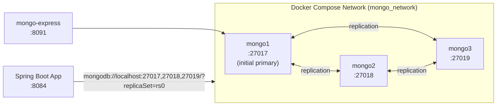
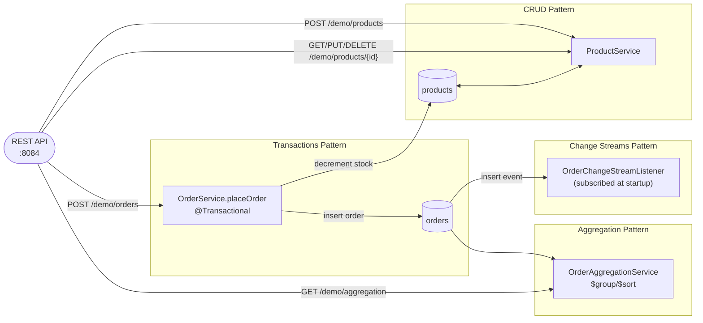

# MongoDB NoSQL Demo Implementation Plan

> **For agentic workers:** REQUIRED SUB-SKILL: Use superpowers:subagent-driven-development (recommended) or superpowers:executing-plans to implement this plan task-by-task. Steps use checkbox (`- [ ]`) syntax for tracking.

**Goal:** Build a new `noSQL/mongodb/` demo module — a 3-node MongoDB replica set (Docker Compose) and a Spring Boot app demonstrating CRUD, multi-document transactions, change streams, and aggregation pipelines around a product-catalog/orders domain.

**Architecture:** Mirrors `message-brokers/`'s structure exactly: a parent POM (`noSQL/pom.xml`) with one module per technology (`mongodb/spring-demo`), a Docker Compose cluster, a Spring Boot REST app, unit tests, and a Gatling performance test. Each of the four MongoDB patterns lives in its own package (`crud/`, `transaction/`, `changestream/`, `aggregation/`), all wired together by one `DemoController`.

**Tech Stack:** Java 21, Spring Boot 3.4.x, `spring-boot-starter-data-mongodb` (synchronous `MongoTemplate`), Docker Compose, MongoDB 7.0, Gatling.

## Global Constraints

- Spec: `docs/superpowers/specs/2026-06-18-mongodb-nosql-demo-design.md` — follow it exactly, with one explicit deviation noted below.
- **Testing approach deviates from the spec's text:** the spec mentions Testcontainers, but no module in this repo uses Testcontainers — every existing demo (Kafka, RabbitMQ, etc.) unit-tests by mocking the SDK/client object directly with Mockito (e.g. `RabbitMQ`'s `WorkQueueConsumerTest` mocks `Channel`; `Kafka`'s `DemoControllerTest` uses `@WebMvcTest` + `@MockitoBean`). This plan follows that established convention instead: all service tests mock `MongoTemplate` directly, `DemoControllerTest` uses `@WebMvcTest` + `@MockitoBean`, and `MongoDbDemoApplicationTest` is a trivial `new MongoDbDemoApplication()` smoke test — exactly like `KafkaDemoApplicationTest`. No test ever opens a real MongoDB connection; the live cluster is verified manually in Task 9.
- Cluster: 3-node MongoDB replica set named `rs0`, no authentication (matches Kafka/Redis's no-auth local-dev convention). Host ports `27017`/`27018`/`27019` (one per node, internal port stays the Mongo default `27017` on all three). `mongo-express` UI on host port `8091`.
- App: Spring Boot, port `8084`. Connection string: `mongodb://localhost:27017,localhost:27018,localhost:27019/ecommerce?replicaSet=rs0`.
- Domain: `products` collection (CRUD) and `orders` collection (transactions, change streams, aggregation). Placing an order atomically decrements product stock and inserts an order; insufficient stock throws and rolls back for real — no `FailureSimulator`-style artificial failure injection in this module.
- Code style: this repo's `.claude/rules/code-review.md` applies repo-wide (not just `message-brokers/`) except its `FailureSimulator` sub-rule, which is explicitly scoped to `message-brokers/` only. Use records for immutable DTOs (`PlaceOrderRequest`, `StatusSummary`); `Product`/`Order` stay Lombok `@Data` classes since they're mutable Spring Data entities with server-assigned IDs. All fields `private final` where applicable. No unnecessary `.toString()` in log statements.
- No changes to `message-brokers/README.md`'s broker comparison guide.

---

### Task 1: Repository scaffolding

**Files:**
- Create: `noSQL/pom.xml`
- Create: `noSQL/eclipse-formatter.xml` (copy of `message-brokers/eclipse-formatter.xml`)
- Create: `noSQL/README.md`
- Create: `noSQL/mongodb/spring-demo/pom.xml`
- Create: `noSQL/mongodb/spring-demo/src/main/java/com/testingai/mongodb/MongoDbDemoApplication.java`
- Create: `noSQL/mongodb/spring-demo/src/main/resources/application.yml`
- Create: `noSQL/mongodb/spring-demo/src/test/java/com/testingai/mongodb/MongoDbDemoApplicationTest.java`
- Modify: `.githooks/pre-commit`
- Modify: `CLAUDE.md`

**Interfaces:**
- Produces: a compilable, empty Spring Boot app skeleton on port `8084` that later tasks add packages/classes to. `mvn -f noSQL/pom.xml compile` (run from `noSQL/mongodb/spring-demo`) must succeed.

- [ ] **Step 1: Create the parent POM**

Create `noSQL/pom.xml`:

```xml
<?xml version="1.0" encoding="UTF-8"?>
<project xmlns="http://maven.apache.org/POM/4.0.0"
         xmlns:xsi="http://www.w3.org/2001/XMLSchema-instance"
         xsi:schemaLocation="http://maven.apache.org/POM/4.0.0 https://maven.apache.org/xsd/maven-4.0.0.xsd">
    <modelVersion>4.0.0</modelVersion>

    <parent>
        <groupId>org.springframework.boot</groupId>
        <artifactId>spring-boot-starter-parent</artifactId>
        <version>3.4.4</version>
    </parent>

    <groupId>com.testingai</groupId>
    <artifactId>nosql</artifactId>
    <version>1.0.0</version>
    <packaging>pom</packaging>
    <name>NoSQL</name>
    <description>Parent POM for all NoSQL database demo modules</description>

    <modules>
        <module>mongodb/spring-demo</module>
    </modules>

    <properties>
        <maven.compiler.release>21</maven.compiler.release>
        <project.build.sourceEncoding>UTF-8</project.build.sourceEncoding>
        <lombok.version>1.18.38</lombok.version>
        <springdoc.version>2.8.6</springdoc.version>
        <gatling.version>3.13.1</gatling.version>
        <gatling-maven-plugin.version>4.15.0</gatling-maven-plugin.version>
        <spotless.version>2.43.0</spotless.version>
    </properties>

    <dependencies>
        <dependency>
            <groupId>org.springframework.boot</groupId>
            <artifactId>spring-boot-starter-web</artifactId>
        </dependency>
        <dependency>
            <groupId>org.projectlombok</groupId>
            <artifactId>lombok</artifactId>
            <version>${lombok.version}</version>
            <optional>true</optional>
        </dependency>
        <dependency>
            <groupId>org.springdoc</groupId>
            <artifactId>springdoc-openapi-starter-webmvc-ui</artifactId>
            <version>${springdoc.version}</version>
        </dependency>
        <dependency>
            <groupId>org.springframework.boot</groupId>
            <artifactId>spring-boot-starter-test</artifactId>
            <scope>test</scope>
        </dependency>
        <dependency>
            <groupId>io.gatling.highcharts</groupId>
            <artifactId>gatling-charts-highcharts</artifactId>
            <version>${gatling.version}</version>
            <scope>test</scope>
        </dependency>
    </dependencies>

    <build>
        <plugins>
            <plugin>
                <groupId>org.apache.maven.plugins</groupId>
                <artifactId>maven-compiler-plugin</artifactId>
                <configuration>
                    <annotationProcessorPaths>
                        <path>
                            <groupId>org.projectlombok</groupId>
                            <artifactId>lombok</artifactId>
                            <version>${lombok.version}</version>
                        </path>
                    </annotationProcessorPaths>
                </configuration>
            </plugin>
            <plugin>
                <groupId>org.apache.maven.plugins</groupId>
                <artifactId>maven-surefire-plugin</artifactId>
                <configuration>
                    <argLine>-Dnet.bytebuddy.experimental=true</argLine>
                    <excludes>
                        <exclude>**/performance/**</exclude>
                    </excludes>
                </configuration>
            </plugin>
            <plugin>
                <groupId>io.gatling</groupId>
                <artifactId>gatling-maven-plugin</artifactId>
                <version>${gatling-maven-plugin.version}</version>
            </plugin>
            <plugin>
                <groupId>org.codehaus.mojo</groupId>
                <artifactId>exec-maven-plugin</artifactId>
                <executions>
                    <execution>
                        <id>install-git-hooks</id>
                        <phase>initialize</phase>
                        <goals>
                            <goal>exec</goal>
                        </goals>
                        <configuration>
                            <executable>git</executable>
                            <arguments>
                                <argument>config</argument>
                                <argument>core.hooksPath</argument>
                                <argument>.githooks</argument>
                            </arguments>
                        </configuration>
                    </execution>
                </executions>
            </plugin>
            <plugin>
                <groupId>com.diffplug.spotless</groupId>
                <artifactId>spotless-maven-plugin</artifactId>
                <version>${spotless.version}</version>
                <configuration>
                    <java>
                        <eclipse>
                            <version>4.31</version>
                            <!-- maven.multiModuleProjectDirectory always points to noSQL/ regardless of which module is being built -->
                            <file>${maven.multiModuleProjectDirectory}/eclipse-formatter.xml</file>
                        </eclipse>
                    </java>
                </configuration>
            </plugin>
        </plugins>
    </build>
</project>
```

- [ ] **Step 2: Copy the Eclipse formatter config**

Run: `cp /Users/admin/IdeaProjects/private/techmix-copy/message-brokers/eclipse-formatter.xml /Users/admin/IdeaProjects/private/techmix-copy/noSQL/eclipse-formatter.xml`

- [ ] **Step 3: Create the noSQL README index**

Create `noSQL/README.md`:

```markdown
# NoSQL Databases — Demos

This directory contains runnable demos for NoSQL database technologies, structured the same way as `../message-brokers/`: one Docker Compose cluster and one Spring Boot demo app per technology.

| Database | Demo | Best fit |
|---|---|---|
| [MongoDB](mongodb/) | 3-node replica set | Document storage, flexible schema, multi-document transactions, real-time change streams |

More NoSQL databases may be added here over time, at which point this README will grow into a comparison guide like `../message-brokers/README.md`.
```

- [ ] **Step 4: Create the mongodb-demo module POM**

Create `noSQL/mongodb/spring-demo/pom.xml`:

```xml
<?xml version="1.0" encoding="UTF-8"?>
<project xmlns="http://maven.apache.org/POM/4.0.0"
         xmlns:xsi="http://www.w3.org/2001/XMLSchema-instance"
         xsi:schemaLocation="http://maven.apache.org/POM/4.0.0 http://maven.apache.org/xsd/maven-4.0.0.xsd">
    <modelVersion>4.0.0</modelVersion>

    <parent>
        <groupId>com.testingai</groupId>
        <artifactId>nosql</artifactId>
        <version>1.0.0</version>
        <relativePath>../../pom.xml</relativePath>
    </parent>

    <artifactId>mongodb-demo</artifactId>
    <name>MongoDB Demo</name>
    <description>Learning and demonstration project for MongoDB NoSQL patterns</description>

    <dependencies>
        <dependency>
            <groupId>org.springframework.boot</groupId>
            <artifactId>spring-boot-starter-data-mongodb</artifactId>
        </dependency>
    </dependencies>

    <build>
        <plugins>
            <plugin>
                <groupId>org.springframework.boot</groupId>
                <artifactId>spring-boot-maven-plugin</artifactId>
                <configuration>
                    <mainClass>com.testingai.mongodb.MongoDbDemoApplication</mainClass>
                    <excludes>
                        <exclude>
                            <groupId>org.projectlombok</groupId>
                            <artifactId>lombok</artifactId>
                        </exclude>
                    </excludes>
                </configuration>
            </plugin>
            <plugin>
                <groupId>io.gatling</groupId>
                <artifactId>gatling-maven-plugin</artifactId>
                <configuration>
                    <simulationClass>com.testingai.mongodb.performance.DemoSimulation</simulationClass>
                </configuration>
            </plugin>
        </plugins>
    </build>
</project>
```

- [ ] **Step 5: Create the application skeleton**

Create `noSQL/mongodb/spring-demo/src/main/java/com/testingai/mongodb/MongoDbDemoApplication.java`:

```java
package com.testingai.mongodb;

import org.springframework.boot.SpringApplication;
import org.springframework.boot.autoconfigure.SpringBootApplication;

@SpringBootApplication
public class MongoDbDemoApplication {

	public static void main(String[] args) {
		SpringApplication.run(MongoDbDemoApplication.class, args);
	}
}
```

Create `noSQL/mongodb/spring-demo/src/main/resources/application.yml`:

```yaml
spring:
  data:
    mongodb:
      uri: mongodb://localhost:27017,localhost:27018,localhost:27019/ecommerce?replicaSet=rs0

server:
  port: 8084
```

- [ ] **Step 6: Create the application smoke test**

Create `noSQL/mongodb/spring-demo/src/test/java/com/testingai/mongodb/MongoDbDemoApplicationTest.java`:

```java
package com.testingai.mongodb;

import org.junit.jupiter.api.Test;

class MongoDbDemoApplicationTest {

	@Test
	void mainClassExists() {
		new MongoDbDemoApplication();
	}
}
```

- [ ] **Step 7: Compile and run the smoke test**

Run:
```bash
cd noSQL/mongodb/spring-demo
mvn -q test
```
Expected: build succeeds, 1 test passes (no real MongoDB connection attempted — this test never starts the Spring context).

- [ ] **Step 8: Fix the pre-commit hook to cover `noSQL/`**

Read `.githooks/pre-commit` first. It currently looks like:

```bash
#!/usr/bin/env bash
set -euo pipefail

ROOT=$(git rev-parse --show-toplevel)

# Collect staged Java files that live inside message-brokers
STAGED_JAVA=$(git diff --cached --name-only --diff-filter=ACM | grep '^message-brokers/.*\.java$' || true)

if [ -z "$STAGED_JAVA" ]; then
    exit 0
fi

echo "[pre-commit] Applying Spotless formatting to staged Java files..."
(cd "$ROOT/message-brokers" && mvn spotless:apply --quiet)

# Re-stage the originally staged files (now formatted)
echo "$STAGED_JAVA" | xargs git add

echo "[pre-commit] Spotless formatting applied."
```

Replace its entire contents with:

```bash
#!/usr/bin/env bash
set -euo pipefail

ROOT=$(git rev-parse --show-toplevel)

# Collect staged Java files and the Maven reactor root each one belongs to
STAGED_JAVA=$(git diff --cached --name-only --diff-filter=ACM | grep -E '^(message-brokers|noSQL)/.*\.java$' || true)

if [ -z "$STAGED_JAVA" ]; then
    exit 0
fi

if echo "$STAGED_JAVA" | grep -q '^message-brokers/'; then
    echo "[pre-commit] Applying Spotless formatting to staged message-brokers Java files..."
    (cd "$ROOT/message-brokers" && mvn spotless:apply --quiet)
fi

if echo "$STAGED_JAVA" | grep -q '^noSQL/'; then
    echo "[pre-commit] Applying Spotless formatting to staged noSQL Java files..."
    (cd "$ROOT/noSQL" && mvn spotless:apply --quiet)
fi

# Re-stage the originally staged files (now formatted)
echo "$STAGED_JAVA" | xargs git add

echo "[pre-commit] Spotless formatting applied."
```

- [ ] **Step 9: Add the noSQL section to CLAUDE.md**

In `CLAUDE.md`, find this table row in the "Repository layout" section:

```markdown
| `message-brokers/<broker>/spring-demo/` | Six independent Spring Boot 3.4.4 demo apps (Java 21, Lombok) |
```

Add a new row immediately after it:

```markdown
| `message-brokers/<broker>/spring-demo/` | Six independent Spring Boot 3.4.4 demo apps (Java 21, Lombok) |
| `noSQL/<database>/spring-demo/` | NoSQL database demo apps, same conventions as `message-brokers/` (currently: MongoDB) |
```

Find this block in the "Commands" section:

```markdown
### Message broker demos (all six modules — run from the module root)

```bash
cd message-brokers/<broker>/spring-demo

mvn clean package                    # build
mvn test                             # unit tests (Gatling excluded automatically)
mvn test -Dtest=ClassName            # single test class
mvn gatling:test                     # load test — requires the app to be running first
```
```

Add a new subsection immediately after it (before the "Backend REST API" subsection):

```markdown
### NoSQL database demos (run from the module root)

```bash
cd noSQL/<database>/spring-demo

mvn clean package                    # build
mvn test                             # unit tests (Gatling excluded automatically)
mvn test -Dtest=ClassName            # single test class
mvn gatling:test                     # load test — requires the app to be running first
```
```

- [ ] **Step 10: Commit**

```bash
git add noSQL/pom.xml noSQL/eclipse-formatter.xml noSQL/README.md noSQL/mongodb/spring-demo/pom.xml noSQL/mongodb/spring-demo/src .githooks/pre-commit CLAUDE.md
git commit -m "$(cat <<'EOF'
feat(nosql): scaffold noSQL category with MongoDB demo module skeleton

New parent POM mirroring message-brokers/'s structure, with
mongodb/spring-demo as the first module. Extends the pre-commit hook's
Spotless formatting to cover noSQL/ Java files and documents the new
category in CLAUDE.md.
EOF
)"
```

---

### Task 2: MongoDB replica set cluster

**Files:**
- Create: `noSQL/mongodb/docker/docker-compose.yml`

**Interfaces:**
- Produces: a running 3-node MongoDB replica set (`rs0`) reachable at `mongodb://localhost:27017,localhost:27018,localhost:27019/?replicaSet=rs0`, plus `mongo-express` at `http://localhost:8091`. Tasks 3-9 depend on this being up for manual verification (not for automated tests, per Global Constraints).

- [ ] **Step 1: Write the docker-compose.yml**

Create `noSQL/mongodb/docker/docker-compose.yml`:

```yaml
name: mongodb-cluster

services:
  mongo1:
    image: mongo:7.0
    hostname: mongo1
    container_name: mongo1
    command: ["mongod", "--replSet", "rs0", "--bind_ip_all"]
    ports:
      - "27017:27017"
    volumes:
      - mongo1-data:/data/db
    networks:
      - mongo_network
    healthcheck:
      test: ["CMD", "mongosh", "--quiet", "--eval", "db.adminCommand('ping')"]
      interval: 10s
      timeout: 5s
      retries: 10

  mongo2:
    image: mongo:7.0
    hostname: mongo2
    container_name: mongo2
    command: ["mongod", "--replSet", "rs0", "--bind_ip_all"]
    ports:
      - "27018:27017"
    volumes:
      - mongo2-data:/data/db
    networks:
      - mongo_network
    healthcheck:
      test: ["CMD", "mongosh", "--quiet", "--eval", "db.adminCommand('ping')"]
      interval: 10s
      timeout: 5s
      retries: 10

  mongo3:
    image: mongo:7.0
    hostname: mongo3
    container_name: mongo3
    command: ["mongod", "--replSet", "rs0", "--bind_ip_all"]
    ports:
      - "27019:27017"
    volumes:
      - mongo3-data:/data/db
    networks:
      - mongo_network
    healthcheck:
      test: ["CMD", "mongosh", "--quiet", "--eval", "db.adminCommand('ping')"]
      interval: 10s
      timeout: 5s
      retries: 10

  mongo-init:
    image: mongo:7.0
    container_name: mongo-init
    entrypoint: ["/bin/bash", "-c"]
    command:
      - >
        mongosh --host mongo1:27017 --eval
        '
        rs.initiate({
          _id: "rs0",
          members: [
            { _id: 0, host: "mongo1:27017" },
            { _id: 1, host: "mongo2:27017" },
            { _id: 2, host: "mongo3:27017" }
          ]
        })
        ' || true
    depends_on:
      mongo1:
        condition: service_healthy
      mongo2:
        condition: service_healthy
      mongo3:
        condition: service_healthy
    networks:
      - mongo_network

  mongo-express:
    image: mongo-express:1.0.2
    container_name: mongo-express
    ports:
      - "8091:8081"
    environment:
      ME_CONFIG_MONGODB_SERVER: mongo1
      ME_CONFIG_MONGODB_PORT: "27017"
      ME_CONFIG_BASICAUTH: "false"
    depends_on:
      mongo-init:
        condition: service_completed_successfully
    networks:
      - mongo_network

networks:
  mongo_network:
    driver: bridge

volumes:
  mongo1-data:
  mongo2-data:
  mongo3-data:
```

- [ ] **Step 2: Bring the cluster up**

Run:
```bash
cd noSQL/mongodb/docker
docker compose up -d
```
Wait ~30 seconds, then check:
```bash
docker compose ps
```
Expected: `mongo1`, `mongo2`, `mongo3` healthy; `mongo-init` exited 0; `mongo-express` running.

- [ ] **Step 3: Verify the replica set formed correctly**

Run:
```bash
docker exec mongo1 mongosh --quiet --eval "rs.status().members.map(m => ({name: m.name, state: m.stateStr}))"
```
Expected: an array of 3 objects, one with `state: 'PRIMARY'` and two with `state: 'SECONDARY'`. If any member shows `STARTUP` or the command errors, wait another 10 seconds and retry — election can take a few seconds after `rs.initiate()`.

- [ ] **Step 4: Verify mongo-express is reachable**

Run: `curl -s -o /dev/null -w "%{http_code}\n" http://localhost:8091`
Expected: `200`

- [ ] **Step 5: Commit**

```bash
git add noSQL/mongodb/docker/docker-compose.yml
git commit -m "$(cat <<'EOF'
feat(nosql): add MongoDB 3-node replica set Docker Compose cluster

mongo1/2/3 form replica set "rs0" via a one-shot mongo-init container
(idempotent — tolerates re-runs against existing data). No auth,
matching this repo's Kafka/Redis no-auth local-dev convention.
mongo-express provides a browsing UI on :8091.
EOF
)"
```

---

### Task 3: CRUD pattern (Product)

**Files:**
- Create: `noSQL/mongodb/spring-demo/src/main/java/com/testingai/mongodb/config/MongoConfig.java`
- Create: `noSQL/mongodb/spring-demo/src/main/java/com/testingai/mongodb/crud/Product.java`
- Create: `noSQL/mongodb/spring-demo/src/main/java/com/testingai/mongodb/crud/ProductService.java`
- Test: `noSQL/mongodb/spring-demo/src/test/java/com/testingai/mongodb/crud/ProductServiceTest.java`

**Interfaces:**
- Produces: `Product` (fields: `id: String`, `name: String`, `price: double`, `stock: int`, with Lombok `@Data @NoArgsConstructor @AllArgsConstructor`) and `ProductService` with methods `create(Product): Product`, `findById(String): Product`, `update(String, Product): Product`, `delete(String): void`. Task 4 (`OrderService`) consumes `Product` directly. Task 7 (`DemoController`) consumes `ProductService`.
- The `MongoTransactionManager` bean from `MongoConfig` is consumed by Task 4's `@Transactional` `OrderService.placeOrder`.

- [ ] **Step 1: Write the failing test**

Create `noSQL/mongodb/spring-demo/src/test/java/com/testingai/mongodb/crud/ProductServiceTest.java`:

```java
package com.testingai.mongodb.crud;

import org.junit.jupiter.api.Test;
import org.junit.jupiter.api.extension.ExtendWith;
import org.mockito.InjectMocks;
import org.mockito.Mock;
import org.mockito.junit.jupiter.MockitoExtension;
import org.springframework.data.mongodb.core.MongoTemplate;
import org.springframework.data.mongodb.core.query.Query;

import static org.assertj.core.api.Assertions.assertThat;
import static org.mockito.ArgumentMatchers.any;
import static org.mockito.ArgumentMatchers.eq;
import static org.mockito.Mockito.verify;
import static org.mockito.Mockito.when;

@ExtendWith(MockitoExtension.class)
class ProductServiceTest {

	@InjectMocks
	private ProductService productService;

	@Mock
	private MongoTemplate mongoTemplate;

	@Test
	void create_shouldSaveAndReturnProduct() {
		Product product = new Product(null, "Widget", 9.99, 100);
		when(mongoTemplate.save(product)).thenReturn(product);

		Product result = productService.create(product);

		assertThat(result).isEqualTo(product);
		verify(mongoTemplate).save(product);
	}

	@Test
	void findById_shouldReturnProduct() {
		Product product = new Product("abc123", "Widget", 9.99, 100);
		when(mongoTemplate.findById("abc123", Product.class)).thenReturn(product);

		Product result = productService.findById("abc123");

		assertThat(result).isEqualTo(product);
	}

	@Test
	void update_shouldSetIdAndSave() {
		Product update = new Product(null, "Widget v2", 12.99, 50);
		when(mongoTemplate.save(any(Product.class))).thenAnswer(invocation -> invocation.getArgument(0));

		Product result = productService.update("abc123", update);

		assertThat(result.getId()).isEqualTo("abc123");
		verify(mongoTemplate).save(update);
	}

	@Test
	void delete_shouldRemoveById() {
		productService.delete("abc123");

		verify(mongoTemplate).remove(any(Query.class), eq(Product.class));
	}
}
```

- [ ] **Step 2: Run test to verify it fails**

Run: `cd noSQL/mongodb/spring-demo && mvn -q test -Dtest=ProductServiceTest`
Expected: FAIL with compilation errors — `Product` and `ProductService` don't exist yet.

- [ ] **Step 3: Write the minimal implementation**

Create `noSQL/mongodb/spring-demo/src/main/java/com/testingai/mongodb/crud/Product.java`:

```java
package com.testingai.mongodb.crud;

import lombok.AllArgsConstructor;
import lombok.Data;
import lombok.NoArgsConstructor;
import org.springframework.data.annotation.Id;
import org.springframework.data.mongodb.core.mapping.Document;

@Data
@NoArgsConstructor
@AllArgsConstructor
@Document(collection = "products")
public class Product {

	@Id
	private String id;
	private String name;
	private double price;
	private int stock;
}
```

Create `noSQL/mongodb/spring-demo/src/main/java/com/testingai/mongodb/crud/ProductService.java`:

```java
package com.testingai.mongodb.crud;

import lombok.RequiredArgsConstructor;
import org.springframework.data.mongodb.core.MongoTemplate;
import org.springframework.data.mongodb.core.query.Query;
import org.springframework.stereotype.Service;

import static org.springframework.data.mongodb.core.query.Criteria.where;

@Service
@RequiredArgsConstructor
public class ProductService {

	private final MongoTemplate mongoTemplate;

	public Product create(Product product) {
		return mongoTemplate.save(product);
	}

	public Product findById(String id) {
		return mongoTemplate.findById(id, Product.class);
	}

	public Product update(String id, Product updated) {
		updated.setId(id);
		return mongoTemplate.save(updated);
	}

	public void delete(String id) {
		mongoTemplate.remove(new Query(where("_id").is(id)), Product.class);
	}
}
```

Create `noSQL/mongodb/spring-demo/src/main/java/com/testingai/mongodb/config/MongoConfig.java`:

```java
package com.testingai.mongodb.config;

import org.springframework.context.annotation.Bean;
import org.springframework.context.annotation.Configuration;
import org.springframework.data.mongodb.MongoDatabaseFactory;
import org.springframework.data.mongodb.MongoTransactionManager;

@Configuration
public class MongoConfig {

	@Bean
	public MongoTransactionManager transactionManager(MongoDatabaseFactory dbFactory) {
		return new MongoTransactionManager(dbFactory);
	}
}
```

- [ ] **Step 4: Run test to verify it passes**

Run: `cd noSQL/mongodb/spring-demo && mvn -q test -Dtest=ProductServiceTest`
Expected: PASS, 4/4 tests green.

- [ ] **Step 5: Commit**

```bash
git add noSQL/mongodb/spring-demo/src/main/java/com/testingai/mongodb/crud noSQL/mongodb/spring-demo/src/main/java/com/testingai/mongodb/config noSQL/mongodb/spring-demo/src/test/java/com/testingai/mongodb/crud
git commit -m "$(cat <<'EOF'
feat(nosql): add MongoDB CRUD pattern (Product)

ProductService wraps MongoTemplate save/findById/save/remove for the
products collection. MongoConfig adds the MongoTransactionManager bean
the transactions pattern (Task 4) will need.
EOF
)"
```

---

### Task 4: Transactions pattern (Order)

**Files:**
- Create: `noSQL/mongodb/spring-demo/src/main/java/com/testingai/mongodb/transaction/Order.java`
- Create: `noSQL/mongodb/spring-demo/src/main/java/com/testingai/mongodb/transaction/PlaceOrderRequest.java`
- Create: `noSQL/mongodb/spring-demo/src/main/java/com/testingai/mongodb/transaction/OrderService.java`
- Test: `noSQL/mongodb/spring-demo/src/test/java/com/testingai/mongodb/transaction/OrderServiceTest.java`

**Interfaces:**
- Consumes: `Product` (Task 3, `crud` package — fields `id`, `name`, `price`, `stock`).
- Produces: `Order` (fields: `id: String`, `productId: String`, `quantity: int`, `unitPrice: double`, `lineTotal: double`, `status: String`, Lombok `@Data @NoArgsConstructor @AllArgsConstructor`); `PlaceOrderRequest` (record: `productId: String`, `quantity: int`); `OrderService.placeOrder(String productId, int quantity): Order`, annotated `@Transactional`, throws `IllegalArgumentException` if the product doesn't exist and `IllegalStateException` if `quantity > stock`. Task 5 (`OrderChangeStreamListener`) and Task 6 (`OrderAggregationService`) read from the same `orders` collection this task writes to. Task 7 (`DemoController`) consumes `OrderService` and `PlaceOrderRequest`.

- [ ] **Step 1: Write the failing test**

Create `noSQL/mongodb/spring-demo/src/test/java/com/testingai/mongodb/transaction/OrderServiceTest.java`:

```java
package com.testingai.mongodb.transaction;

import com.testingai.mongodb.crud.Product;
import org.junit.jupiter.api.Test;
import org.junit.jupiter.api.extension.ExtendWith;
import org.mockito.InjectMocks;
import org.mockito.Mock;
import org.mockito.junit.jupiter.MockitoExtension;
import org.springframework.data.mongodb.core.MongoTemplate;

import static org.assertj.core.api.Assertions.assertThat;
import static org.assertj.core.api.Assertions.assertThatThrownBy;
import static org.mockito.ArgumentMatchers.any;
import static org.mockito.Mockito.never;
import static org.mockito.Mockito.verify;
import static org.mockito.Mockito.when;

@ExtendWith(MockitoExtension.class)
class OrderServiceTest {

	@InjectMocks
	private OrderService orderService;

	@Mock
	private MongoTemplate mongoTemplate;

	@Test
	void placeOrder_shouldDecrementStockAndInsertOrder() {
		Product product = new Product("p1", "Widget", 10.0, 5);
		when(mongoTemplate.findById("p1", Product.class)).thenReturn(product);
		when(mongoTemplate.save(any(Product.class))).thenAnswer(invocation -> invocation.getArgument(0));
		when(mongoTemplate.insert(any(Order.class))).thenAnswer(invocation -> invocation.getArgument(0));

		Order order = orderService.placeOrder("p1", 3);

		assertThat(order.getProductId()).isEqualTo("p1");
		assertThat(order.getQuantity()).isEqualTo(3);
		assertThat(order.getUnitPrice()).isEqualTo(10.0);
		assertThat(order.getLineTotal()).isEqualTo(30.0);
		assertThat(order.getStatus()).isEqualTo("PLACED");
		assertThat(product.getStock()).isEqualTo(2);
		verify(mongoTemplate).save(product);
		verify(mongoTemplate).insert(any(Order.class));
	}

	@Test
	void placeOrder_shouldThrowAndNotPersistWhenProductMissing() {
		when(mongoTemplate.findById("missing", Product.class)).thenReturn(null);

		assertThatThrownBy(() -> orderService.placeOrder("missing", 1)).isInstanceOf(IllegalArgumentException.class)
				.hasMessageContaining("missing");

		verify(mongoTemplate, never()).save(any(Product.class));
		verify(mongoTemplate, never()).insert(any(Order.class));
	}

	@Test
	void placeOrder_shouldThrowAndNotPersistWhenStockInsufficient() {
		Product product = new Product("p1", "Widget", 10.0, 2);
		when(mongoTemplate.findById("p1", Product.class)).thenReturn(product);

		assertThatThrownBy(() -> orderService.placeOrder("p1", 5)).isInstanceOf(IllegalStateException.class)
				.hasMessageContaining("p1");

		verify(mongoTemplate, never()).save(any(Product.class));
		verify(mongoTemplate, never()).insert(any(Order.class));
	}
}
```

- [ ] **Step 2: Run test to verify it fails**

Run: `cd noSQL/mongodb/spring-demo && mvn -q test -Dtest=OrderServiceTest`
Expected: FAIL with compilation errors — `Order` and `OrderService` don't exist yet.

- [ ] **Step 3: Write the minimal implementation**

Create `noSQL/mongodb/spring-demo/src/main/java/com/testingai/mongodb/transaction/Order.java`:

```java
package com.testingai.mongodb.transaction;

import lombok.AllArgsConstructor;
import lombok.Data;
import lombok.NoArgsConstructor;
import org.springframework.data.annotation.Id;
import org.springframework.data.mongodb.core.mapping.Document;

@Data
@NoArgsConstructor
@AllArgsConstructor
@Document(collection = "orders")
public class Order {

	@Id
	private String id;
	private String productId;
	private int quantity;
	private double unitPrice;
	private double lineTotal;
	private String status;
}
```

Create `noSQL/mongodb/spring-demo/src/main/java/com/testingai/mongodb/transaction/PlaceOrderRequest.java`:

```java
package com.testingai.mongodb.transaction;

public record PlaceOrderRequest(String productId, int quantity) {
}
```

Create `noSQL/mongodb/spring-demo/src/main/java/com/testingai/mongodb/transaction/OrderService.java`:

```java
package com.testingai.mongodb.transaction;

import com.testingai.mongodb.crud.Product;
import lombok.RequiredArgsConstructor;
import org.springframework.data.mongodb.core.MongoTemplate;
import org.springframework.stereotype.Service;
import org.springframework.transaction.annotation.Transactional;

@Service
@RequiredArgsConstructor
public class OrderService {

	private final MongoTemplate mongoTemplate;

	@Transactional
	public Order placeOrder(String productId, int quantity) {
		Product product = mongoTemplate.findById(productId, Product.class);
		if (product == null) {
			throw new IllegalArgumentException("Product not found: " + productId);
		}
		if (product.getStock() < quantity) {
			throw new IllegalStateException("Insufficient stock for product: " + productId);
		}

		product.setStock(product.getStock() - quantity);
		mongoTemplate.save(product);

		Order order = new Order(null, productId, quantity, product.getPrice(), product.getPrice() * quantity,
				"PLACED");
		return mongoTemplate.insert(order);
	}
}
```

- [ ] **Step 4: Run test to verify it passes**

Run: `cd noSQL/mongodb/spring-demo && mvn -q test -Dtest=OrderServiceTest`
Expected: PASS, 3/3 tests green.

- [ ] **Step 5: Commit**

```bash
git add noSQL/mongodb/spring-demo/src/main/java/com/testingai/mongodb/transaction noSQL/mongodb/spring-demo/src/test/java/com/testingai/mongodb/transaction
git commit -m "$(cat <<'EOF'
feat(nosql): add MongoDB transactions pattern (Order)

OrderService.placeOrder is @Transactional: atomically decrements
product stock and inserts an order. Insufficient stock or a missing
product throws before anything is persisted — a real rollback case,
not simulated failure.
EOF
)"
```

---

### Task 5: Change streams pattern

**Files:**
- Create: `noSQL/mongodb/spring-demo/src/main/java/com/testingai/mongodb/changestream/OrderChangeStreamListener.java`
- Test: `noSQL/mongodb/spring-demo/src/test/java/com/testingai/mongodb/changestream/OrderChangeStreamListenerTest.java`

**Interfaces:**
- Consumes: `Order` (Task 4, `transaction` package).
- Produces: `OrderChangeStreamListener` with a public `onChange(Message<?, Order> message)` method (registered against the `orders` collection in `@PostConstruct start()`, deregistered in `@PreDestroy stop()`). Nothing in later tasks calls this directly — it self-registers at startup, mirroring how the Redis demo's pub/sub subscribers wire themselves up.

- [ ] **Step 1: Write the failing test**

Create `noSQL/mongodb/spring-demo/src/test/java/com/testingai/mongodb/changestream/OrderChangeStreamListenerTest.java`:

```java
package com.testingai.mongodb.changestream;

import com.testingai.mongodb.transaction.Order;
import org.junit.jupiter.api.Test;
import org.junit.jupiter.api.extension.ExtendWith;
import org.mockito.InjectMocks;
import org.mockito.Mock;
import org.mockito.junit.jupiter.MockitoExtension;
import org.springframework.data.mongodb.core.MongoTemplate;
import org.springframework.data.mongodb.core.messaging.Message;

import static org.assertj.core.api.Assertions.assertThatCode;
import static org.mockito.Mockito.mock;
import static org.mockito.Mockito.when;

@ExtendWith(MockitoExtension.class)
class OrderChangeStreamListenerTest {

	@InjectMocks
	private OrderChangeStreamListener listener;

	@Mock
	private MongoTemplate mongoTemplate;

	@Test
	void onChange_shouldNotThrowForAnOrderEvent() {
		Order order = new Order("o1", "p1", 2, 10.0, 20.0, "PLACED");
		@SuppressWarnings("unchecked")
		Message<?, Order> message = mock(Message.class);
		when(message.getBody()).thenReturn(order);

		assertThatCode(() -> listener.onChange(message)).doesNotThrowAnyException();
	}
}
```

- [ ] **Step 2: Run test to verify it fails**

Run: `cd noSQL/mongodb/spring-demo && mvn -q test -Dtest=OrderChangeStreamListenerTest`
Expected: FAIL with compilation errors — `OrderChangeStreamListener` doesn't exist yet.

- [ ] **Step 3: Write the minimal implementation**

Create `noSQL/mongodb/spring-demo/src/main/java/com/testingai/mongodb/changestream/OrderChangeStreamListener.java`:

```java
package com.testingai.mongodb.changestream;

import com.testingai.mongodb.transaction.Order;
import jakarta.annotation.PostConstruct;
import jakarta.annotation.PreDestroy;
import lombok.RequiredArgsConstructor;
import lombok.extern.slf4j.Slf4j;
import org.springframework.data.mongodb.core.MongoTemplate;
import org.springframework.data.mongodb.core.messaging.ChangeStreamRequest;
import org.springframework.data.mongodb.core.messaging.DefaultMessageListenerContainer;
import org.springframework.data.mongodb.core.messaging.Message;
import org.springframework.data.mongodb.core.messaging.MessageListenerContainer;
import org.springframework.stereotype.Component;

@Component
@Slf4j
@RequiredArgsConstructor
public class OrderChangeStreamListener {

	private final MongoTemplate mongoTemplate;
	private MessageListenerContainer container;

	@PostConstruct
	public void start() {
		container = new DefaultMessageListenerContainer(mongoTemplate);
		container.start();
		ChangeStreamRequest<Order> request = ChangeStreamRequest.builder(this::onChange).collection("orders")
				.build();
		container.register(request, Order.class);
	}

	public void onChange(Message<?, Order> message) {
		Order order = message.getBody();
		log.info("[OrderChangeStreamListener] Order changed: {}", order);
	}

	@PreDestroy
	public void stop() {
		container.stop();
	}
}
```

- [ ] **Step 4: Run test to verify it passes**

Run: `cd noSQL/mongodb/spring-demo && mvn -q test -Dtest=OrderChangeStreamListenerTest`
Expected: PASS, 1/1 test green.

- [ ] **Step 5: Commit**

```bash
git add noSQL/mongodb/spring-demo/src/main/java/com/testingai/mongodb/changestream noSQL/mongodb/spring-demo/src/test/java/com/testingai/mongodb/changestream
git commit -m "$(cat <<'EOF'
feat(nosql): add MongoDB change streams pattern

OrderChangeStreamListener subscribes to the orders collection at
startup and logs every insert — the NoSQL analogue of the broker
demos' pub/sub pattern, naturally triggered by OrderService.placeOrder.
EOF
)"
```

---

### Task 6: Aggregation pattern

**Files:**
- Create: `noSQL/mongodb/spring-demo/src/main/java/com/testingai/mongodb/aggregation/StatusSummary.java`
- Create: `noSQL/mongodb/spring-demo/src/main/java/com/testingai/mongodb/aggregation/OrderAggregationService.java`
- Test: `noSQL/mongodb/spring-demo/src/test/java/com/testingai/mongodb/aggregation/OrderAggregationServiceTest.java`

**Interfaces:**
- Produces: `StatusSummary` (record: `id: String`, `orderCount: long`, `totalRevenue: double`); `OrderAggregationService.summarizeByStatus(): List<StatusSummary>`. Task 7 (`DemoController`) consumes both.

- [ ] **Step 1: Write the failing test**

Create `noSQL/mongodb/spring-demo/src/test/java/com/testingai/mongodb/aggregation/OrderAggregationServiceTest.java`:

```java
package com.testingai.mongodb.aggregation;

import org.junit.jupiter.api.Test;
import org.junit.jupiter.api.extension.ExtendWith;
import org.mockito.InjectMocks;
import org.mockito.Mock;
import org.mockito.junit.jupiter.MockitoExtension;
import org.springframework.data.mongodb.core.MongoTemplate;
import org.springframework.data.mongodb.core.aggregation.Aggregation;
import org.springframework.data.mongodb.core.aggregation.AggregationResults;

import java.util.List;

import static org.assertj.core.api.Assertions.assertThat;
import static org.mockito.ArgumentMatchers.any;
import static org.mockito.ArgumentMatchers.eq;
import static org.mockito.Mockito.mock;
import static org.mockito.Mockito.when;

@ExtendWith(MockitoExtension.class)
class OrderAggregationServiceTest {

	@InjectMocks
	private OrderAggregationService aggregationService;

	@Mock
	private MongoTemplate mongoTemplate;

	@Test
	void summarizeByStatus_shouldReturnMappedResults() {
		List<StatusSummary> expected = List.of(new StatusSummary("PLACED", 2, 50.0));
		@SuppressWarnings("unchecked")
		AggregationResults<StatusSummary> results = mock(AggregationResults.class);
		when(results.getMappedResults()).thenReturn(expected);
		when(mongoTemplate.aggregate(any(Aggregation.class), eq("orders"), eq(StatusSummary.class)))
				.thenReturn(results);

		List<StatusSummary> actual = aggregationService.summarizeByStatus();

		assertThat(actual).isEqualTo(expected);
	}
}
```

- [ ] **Step 2: Run test to verify it fails**

Run: `cd noSQL/mongodb/spring-demo && mvn -q test -Dtest=OrderAggregationServiceTest`
Expected: FAIL with compilation errors — `StatusSummary` and `OrderAggregationService` don't exist yet.

- [ ] **Step 3: Write the minimal implementation**

Create `noSQL/mongodb/spring-demo/src/main/java/com/testingai/mongodb/aggregation/StatusSummary.java`:

```java
package com.testingai.mongodb.aggregation;

import org.springframework.data.mongodb.core.mapping.Field;

public record StatusSummary(@Field("_id") String id, long orderCount, double totalRevenue) {
}
```

Create `noSQL/mongodb/spring-demo/src/main/java/com/testingai/mongodb/aggregation/OrderAggregationService.java`:

```java
package com.testingai.mongodb.aggregation;

import lombok.RequiredArgsConstructor;
import org.springframework.data.domain.Sort;
import org.springframework.data.mongodb.core.MongoTemplate;
import org.springframework.data.mongodb.core.aggregation.Aggregation;
import org.springframework.stereotype.Service;

import java.util.List;

@Service
@RequiredArgsConstructor
public class OrderAggregationService {

	private final MongoTemplate mongoTemplate;

	public List<StatusSummary> summarizeByStatus() {
		Aggregation aggregation = Aggregation.newAggregation(
				Aggregation.group("status").count().as("orderCount").sum("lineTotal").as("totalRevenue"),
				Aggregation.sort(Sort.Direction.ASC, "_id"));
		return mongoTemplate.aggregate(aggregation, "orders", StatusSummary.class).getMappedResults();
	}
}
```

- [ ] **Step 4: Run test to verify it passes**

Run: `cd noSQL/mongodb/spring-demo && mvn -q test -Dtest=OrderAggregationServiceTest`
Expected: PASS, 1/1 test green.

- [ ] **Step 5: Commit**

```bash
git add noSQL/mongodb/spring-demo/src/main/java/com/testingai/mongodb/aggregation noSQL/mongodb/spring-demo/src/test/java/com/testingai/mongodb/aggregation
git commit -m "$(cat <<'EOF'
feat(nosql): add MongoDB aggregation pattern

OrderAggregationService runs a $group/$sort pipeline over the orders
collection, returning revenue and order count per status.
EOF
)"
```

---

### Task 7: DemoController

**Files:**
- Create: `noSQL/mongodb/spring-demo/src/main/java/com/testingai/mongodb/controller/DemoController.java`
- Test: `noSQL/mongodb/spring-demo/src/test/java/com/testingai/mongodb/controller/DemoControllerTest.java`

**Interfaces:**
- Consumes: `ProductService` (Task 3), `OrderService` + `PlaceOrderRequest` (Task 4), `OrderAggregationService` + `StatusSummary` (Task 6).
- Produces: the REST API at `/demo/*` that Task 8 (Gatling) and Task 9 (manual verification) exercise.

- [ ] **Step 1: Write the failing test**

Create `noSQL/mongodb/spring-demo/src/test/java/com/testingai/mongodb/controller/DemoControllerTest.java`:

```java
package com.testingai.mongodb.controller;

import com.fasterxml.jackson.databind.ObjectMapper;
import com.testingai.mongodb.aggregation.OrderAggregationService;
import com.testingai.mongodb.aggregation.StatusSummary;
import com.testingai.mongodb.crud.Product;
import com.testingai.mongodb.crud.ProductService;
import com.testingai.mongodb.transaction.Order;
import com.testingai.mongodb.transaction.OrderService;
import org.junit.jupiter.api.Test;
import org.springframework.beans.factory.annotation.Autowired;
import org.springframework.boot.test.autoconfigure.web.servlet.WebMvcTest;
import org.springframework.test.context.bean.override.mockito.MockitoBean;
import org.springframework.test.web.servlet.MockMvc;

import java.util.List;

import static org.mockito.Mockito.verify;
import static org.mockito.Mockito.when;
import static org.springframework.test.web.servlet.request.MockMvcRequestBuilders.delete;
import static org.springframework.test.web.servlet.request.MockMvcRequestBuilders.get;
import static org.springframework.test.web.servlet.request.MockMvcRequestBuilders.post;
import static org.springframework.test.web.servlet.request.MockMvcRequestBuilders.put;
import static org.springframework.test.web.servlet.result.MockMvcResultMatchers.status;

@WebMvcTest(DemoController.class)
class DemoControllerTest {

	@Autowired
	private MockMvc mockMvc;

	@Autowired
	private ObjectMapper objectMapper;

	@MockitoBean
	private ProductService productService;
	@MockitoBean
	private OrderService orderService;
	@MockitoBean
	private OrderAggregationService aggregationService;

	@Test
	void createProduct_shouldReturn200AndDelegate() throws Exception {
		Product product = new Product(null, "Widget", 9.99, 100);
		when(productService.create(product)).thenReturn(product);

		mockMvc.perform(post("/demo/products").contentType("application/json")
				.content(objectMapper.writeValueAsString(product))).andExpect(status().isOk());

		verify(productService).create(product);
	}

	@Test
	void getProduct_shouldReturn200AndDelegate() throws Exception {
		mockMvc.perform(get("/demo/products/abc123")).andExpect(status().isOk());
		verify(productService).findById("abc123");
	}

	@Test
	void updateProduct_shouldReturn200AndDelegate() throws Exception {
		Product update = new Product(null, "Widget v2", 12.99, 50);
		mockMvc.perform(put("/demo/products/abc123").contentType("application/json")
				.content(objectMapper.writeValueAsString(update))).andExpect(status().isOk());
		verify(productService).update("abc123", update);
	}

	@Test
	void deleteProduct_shouldReturn200AndDelegate() throws Exception {
		mockMvc.perform(delete("/demo/products/abc123")).andExpect(status().isOk());
		verify(productService).delete("abc123");
	}

	@Test
	void placeOrder_shouldReturn200AndDelegate() throws Exception {
		Order order = new Order("o1", "p1", 2, 10.0, 20.0, "PLACED");
		when(orderService.placeOrder("p1", 2)).thenReturn(order);

		mockMvc.perform(post("/demo/orders").contentType("application/json")
				.content("{\"productId\":\"p1\",\"quantity\":2}")).andExpect(status().isOk());

		verify(orderService).placeOrder("p1", 2);
	}

	@Test
	void aggregation_shouldReturn200AndDelegate() throws Exception {
		when(aggregationService.summarizeByStatus()).thenReturn(List.of(new StatusSummary("PLACED", 1, 20.0)));

		mockMvc.perform(get("/demo/aggregation")).andExpect(status().isOk());

		verify(aggregationService).summarizeByStatus();
	}
}
```

- [ ] **Step 2: Run test to verify it fails**

Run: `cd noSQL/mongodb/spring-demo && mvn -q test -Dtest=DemoControllerTest`
Expected: FAIL with compilation errors — `DemoController` doesn't exist yet.

- [ ] **Step 3: Write the minimal implementation**

Create `noSQL/mongodb/spring-demo/src/main/java/com/testingai/mongodb/controller/DemoController.java`:

```java
package com.testingai.mongodb.controller;

import com.testingai.mongodb.aggregation.OrderAggregationService;
import com.testingai.mongodb.aggregation.StatusSummary;
import com.testingai.mongodb.crud.Product;
import com.testingai.mongodb.crud.ProductService;
import com.testingai.mongodb.transaction.Order;
import com.testingai.mongodb.transaction.OrderService;
import com.testingai.mongodb.transaction.PlaceOrderRequest;
import lombok.RequiredArgsConstructor;
import org.springframework.web.bind.annotation.DeleteMapping;
import org.springframework.web.bind.annotation.GetMapping;
import org.springframework.web.bind.annotation.PathVariable;
import org.springframework.web.bind.annotation.PostMapping;
import org.springframework.web.bind.annotation.PutMapping;
import org.springframework.web.bind.annotation.RequestBody;
import org.springframework.web.bind.annotation.RequestMapping;
import org.springframework.web.bind.annotation.RestController;

import java.util.List;

@RestController
@RequestMapping("/demo")
@RequiredArgsConstructor
public class DemoController {

	private final ProductService productService;
	private final OrderService orderService;
	private final OrderAggregationService aggregationService;

	@PostMapping("/products")
	public Product createProduct(@RequestBody Product product) {
		return productService.create(product);
	}

	@GetMapping("/products/{id}")
	public Product getProduct(@PathVariable String id) {
		return productService.findById(id);
	}

	@PutMapping("/products/{id}")
	public Product updateProduct(@PathVariable String id, @RequestBody Product product) {
		return productService.update(id, product);
	}

	@DeleteMapping("/products/{id}")
	public void deleteProduct(@PathVariable String id) {
		productService.delete(id);
	}

	@PostMapping("/orders")
	public Order placeOrder(@RequestBody PlaceOrderRequest request) {
		return orderService.placeOrder(request.productId(), request.quantity());
	}

	@GetMapping("/aggregation")
	public List<StatusSummary> aggregation() {
		return aggregationService.summarizeByStatus();
	}
}
```

- [ ] **Step 4: Run test to verify it passes**

Run: `cd noSQL/mongodb/spring-demo && mvn -q test -Dtest=DemoControllerTest`
Expected: PASS, 6/6 tests green.

- [ ] **Step 5: Run the full unit test suite**

Run: `cd noSQL/mongodb/spring-demo && mvn -q test`
Expected: all tests across every package pass (Tasks 1, 3-7 combined).

- [ ] **Step 6: Commit**

```bash
git add noSQL/mongodb/spring-demo/src/main/java/com/testingai/mongodb/controller noSQL/mongodb/spring-demo/src/test/java/com/testingai/mongodb/controller
git commit -m "$(cat <<'EOF'
feat(nosql): add DemoController wiring all four MongoDB patterns

REST endpoints for CRUD (/demo/products), transactions (/demo/orders),
and aggregation (/demo/aggregation). Change streams have no dedicated
endpoint — placing an order naturally triggers the listener from Task 5.
EOF
)"
```

---

### Task 8: Gatling performance test

**Files:**
- Create: `noSQL/mongodb/spring-demo/src/test/java/com/testingai/mongodb/performance/DemoSimulation.java`

**Interfaces:**
- Consumes: the live REST API from Task 7 (`POST /demo/products`, `POST /demo/orders`, `GET /demo/aggregation`) — requires the app and cluster running, same as every other module's Gatling test.

- [ ] **Step 1: Write the simulation**

Create `noSQL/mongodb/spring-demo/src/test/java/com/testingai/mongodb/performance/DemoSimulation.java`:

```java
package com.testingai.mongodb.performance;

import io.gatling.javaapi.core.ScenarioBuilder;
import io.gatling.javaapi.core.Simulation;
import io.gatling.javaapi.http.HttpProtocolBuilder;

import java.time.Duration;

import static io.gatling.javaapi.core.CoreDsl.atOnceUsers;
import static io.gatling.javaapi.core.CoreDsl.exec;
import static io.gatling.javaapi.core.CoreDsl.scenario;
import static io.gatling.javaapi.http.HttpDsl.http;
import static io.gatling.javaapi.http.HttpDsl.status;

public class DemoSimulation extends Simulation {

	private final HttpProtocolBuilder httpProtocol = http.baseUrl("http://localhost:8084")
			.acceptHeader("application/json").contentTypeHeader("application/json");

	private final ScenarioBuilder createProductScenario = scenario("Create Product")
			.exec(exec(http("Create Product")
					.post("/demo/products")
					.body(io.gatling.javaapi.core.CoreDsl.StringBody(
							"{\"name\":\"Load Test Widget\",\"price\":9.99,\"stock\":1000}"))
					.check(status().is(200))));

	private final ScenarioBuilder aggregationScenario = scenario("Aggregation")
			.exec(exec(http("Aggregation").get("/demo/aggregation").check(status().is(200))));

	{
		setUp(createProductScenario.injectOpen(atOnceUsers(10)),
				aggregationScenario.injectOpen(atOnceUsers(10))).protocols(httpProtocol)
				.maxDuration(Duration.ofSeconds(30));
	}
}
```

- [ ] **Step 2: Compile the test sources**

Run: `cd noSQL/mongodb/spring-demo && mvn -q test-compile`
Expected: build succeeds with no compilation errors.

- [ ] **Step 3: Commit**

```bash
git add noSQL/mongodb/spring-demo/src/test/java/com/testingai/mongodb/performance
git commit -m "$(cat <<'EOF'
feat(nosql): add Gatling performance test

Load-tests product creation and the aggregation read endpoint, same
convention as the six message broker demos (mvn gatling:test).
EOF
)"
```

---

### Task 9: README and full end-to-end verification

**Files:**
- Create: `noSQL/mongodb/README.md`

**Interfaces:**
- Consumes: the cluster (Task 2) and the full app (Tasks 1, 3-8) — this is where the live system gets exercised for the first time end-to-end.

- [ ] **Step 1: Write the README**

Create `noSQL/mongodb/README.md`:

```markdown
# MongoDB Demo

A 3-node MongoDB replica set and a Spring Boot demo app demonstrating four NoSQL patterns: CRUD, multi-document transactions, change streams, and aggregation pipelines, around a product-catalog/orders domain.

## Prerequisites

- Java 21
- Maven 3.9+
- Docker

All commands below assume your working directory is `noSQL/mongodb/`.

## Start the cluster

```bash
cd docker
docker compose up -d
```

Wait ~30 seconds for the replica set to form, then verify:

```bash
docker exec mongo1 mongosh --quiet --eval "rs.status().members.map(m => ({name: m.name, state: m.stateStr}))"
```

Expected: one `PRIMARY`, two `SECONDARY`.

mongo-express: http://localhost:8091

## Run the app

```bash
cd spring-demo
mvn spring-boot:run
```

## Trigger endpoints

```bash
# Create a product
curl -X POST "http://localhost:8084/demo/products" \
  -H "Content-Type: application/json" \
  -d '{"name":"Widget","price":9.99,"stock":100}'

# Read a product (replace <id> with the id returned above)
curl "http://localhost:8084/demo/products/<id>"

# Update a product
curl -X PUT "http://localhost:8084/demo/products/<id>" \
  -H "Content-Type: application/json" \
  -d '{"name":"Widget v2","price":12.99,"stock":50}'

# Place an order — atomically decrements stock and triggers the change-stream listener
curl -X POST "http://localhost:8084/demo/orders" \
  -H "Content-Type: application/json" \
  -d '{"productId":"<id>","quantity":3}'

# Aggregation — revenue and order count per status
curl "http://localhost:8084/demo/aggregation"

# Delete a product
curl -X DELETE "http://localhost:8084/demo/products/<id>"
```

## Swagger UI

http://localhost:8084/swagger-ui/index.html

## Run performance tests

Requires the cluster and app to be running. Start the app in a separate terminal if needed, then run:

```bash
cd spring-demo
mvn gatling:test
```

HTML report: `target/gatling/<timestamp>/index.html`

## Architecture

### Cluster topology

Three MongoDB nodes form a replica set named `rs0`. The Spring Boot app connects via a replica-set-aware connection string listing all three; mongo-express connects directly to `mongo1`.



### Messaging patterns and data flows



## Collection characteristics

| Collection | Pattern(s) | Notes |
|---|---|---|
| `products` | CRUD, Transactions | `id`, `name`, `price`, `stock` |
| `orders` | Transactions, Change Streams, Aggregation | `id`, `productId`, `quantity`, `unitPrice`, `lineTotal`, `status` — `unitPrice`/`lineTotal` are snapshotted from the product's price at order time |

## Replica set admin commands

```bash
# Replica set status — member states, who's primary
docker exec mongo1 mongosh --quiet --eval "rs.status()"

# Step down the current primary (triggers an election)
docker exec mongo1 mongosh --quiet --eval "rs.stepDown()"

# Inspect a collection
docker exec mongo1 mongosh ecommerce --quiet --eval "db.orders.find().pretty()"
```

## Stop the cluster

```bash
cd docker
docker compose down
```
```

- [ ] **Step 2: Bring the cluster up and confirm health**

```bash
cd noSQL/mongodb/docker
docker compose up -d
```
Wait ~30 seconds, then:
```bash
docker compose ps
```
Expected: `mongo1`, `mongo2`, `mongo3` healthy; `mongo-init` exited 0; `mongo-express` running.

- [ ] **Step 3: Start the app**

```bash
cd ../spring-demo
mvn spring-boot:run > /tmp/mongo-app.log 2>&1 &
sleep 20
grep -i "Started MongoDbDemoApplication" /tmp/mongo-app.log
```
Expected: a line containing `Started MongoDbDemoApplication`.

- [ ] **Step 4: Exercise the CRUD pattern**

```bash
PRODUCT=$(curl -s -X POST "http://localhost:8084/demo/products" -H "Content-Type: application/json" -d '{"name":"Widget","price":9.99,"stock":100}')
echo "$PRODUCT"
PRODUCT_ID=$(echo "$PRODUCT" | python3 -c "import json,sys;print(json.load(sys.stdin)['id'])")
curl -s "http://localhost:8084/demo/products/$PRODUCT_ID"
```
Expected: both calls return the product JSON with matching `id`, `name`, `price`, `stock`.

- [ ] **Step 5: Exercise the transactions pattern (success and rollback)**

```bash
curl -s -X POST "http://localhost:8084/demo/orders" -H "Content-Type: application/json" \
  -d "{\"productId\":\"$PRODUCT_ID\",\"quantity\":5}"
curl -s "http://localhost:8084/demo/products/$PRODUCT_ID"
```
Expected: the order response shows `quantity: 5`, `lineTotal: 49.95`, `status: "PLACED"`; the product's `stock` dropped from `100` to `95`.

```bash
curl -s -o /dev/null -w "%{http_code}\n" -X POST "http://localhost:8084/demo/orders" -H "Content-Type: application/json" \
  -d "{\"productId\":\"$PRODUCT_ID\",\"quantity\":10000}"
curl -s "http://localhost:8084/demo/products/$PRODUCT_ID"
```
Expected: the first call returns a non-200 status (the unhandled `IllegalStateException` becomes a 500); the product's `stock` is still `95` — confirming the transaction rolled back and did not partially apply.

- [ ] **Step 6: Confirm the change-stream listener fired**

```bash
grep "OrderChangeStreamListener" /tmp/mongo-app.log
```
Expected: at least one line like `[OrderChangeStreamListener] Order changed: Order(id=..., productId=..., quantity=5, ...)`, logged after Step 5's successful order.

- [ ] **Step 7: Exercise the aggregation pattern**

```bash
curl -s "http://localhost:8084/demo/aggregation"
```
Expected: a JSON array with one entry where `id: "PLACED"`, `orderCount: 1`, `totalRevenue: 49.95`.

- [ ] **Step 8: Run the full unit test suite one more time**

```bash
cd /Users/admin/IdeaProjects/private/techmix-copy/noSQL/mongodb/spring-demo
mvn -q test
```
Expected: all tests pass.

- [ ] **Step 9: Stop the app and tear down**

```bash
pkill -f "MongoDbDemoApplication" 2>/dev/null; pkill -f "spring-boot:run" 2>/dev/null
cd ../docker
docker compose down
```

- [ ] **Step 10: Commit**

```bash
git add noSQL/mongodb/README.md
git commit -m "$(cat <<'EOF'
docs(nosql): add MongoDB demo README

Cluster topology and pattern data-flow diagrams, collection
characteristics, curl examples for all four patterns, and replica set
admin commands — same format as the message broker demo READMEs.
EOF
)"
```

If any step in this task surfaced a problem, go back and fix the relevant file in Tasks 1-8, re-commit, and re-run verification from Step 2.
