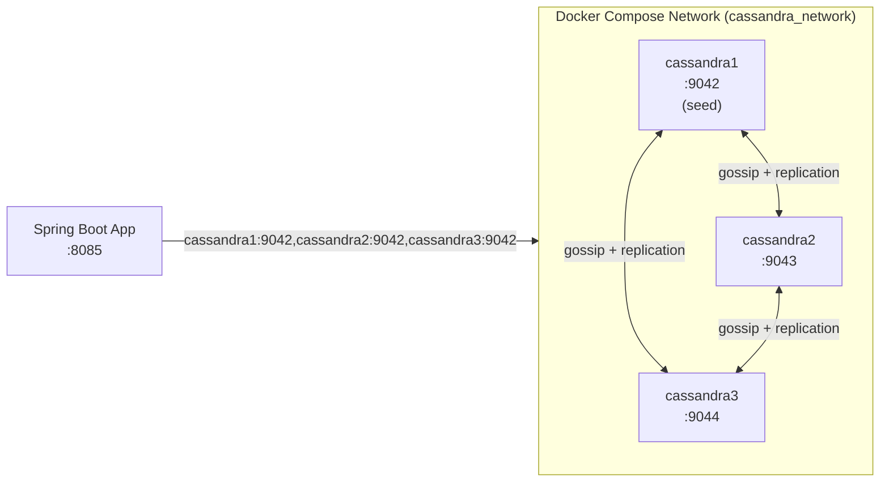
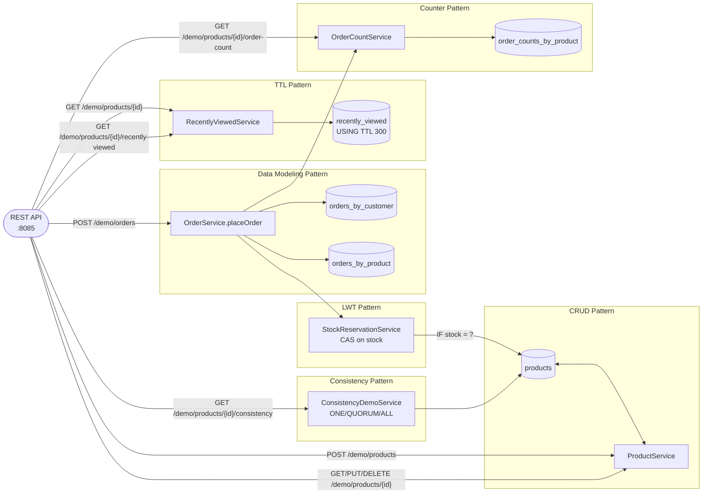

# Cassandra NoSQL Demo Implementation Plan

> **For agentic workers:** REQUIRED SUB-SKILL: Use superpowers:subagent-driven-development (recommended) or superpowers:executing-plans to implement this plan task-by-task. Steps use checkbox (`- [ ]`) syntax for tracking.

**Goal:** Add a `noSQL/cassandra/` module — a 3-node Cassandra ring (Docker Compose) plus a Spring Boot demo app — covering six wide-column-specific patterns (CRUD, query-first data modeling, lightweight transactions, tunable consistency, TTL, counters) over the same product-catalog/orders domain as the existing `noSQL/mongodb` module.

**Architecture:** One Spring Boot app (`com.testingai.cassandra`), package-per-pattern like every other module in this repo. `crud/` and `datamodeling/` use `CassandraTemplate` (Spring Data Cassandra) for plain entity reads/writes; `lwt/`, `consistency/`, `ttl/`, and `counter/` use the injected `CqlSession` directly with `SimpleStatement`, because each needs a capability (arbitrary-column IF-conditions, per-statement consistency override, TTL, counter arithmetic) that `CassandraOperations` doesn't model. A single `DemoController` exposes all ten endpoints and orchestrates cross-pattern composition (e.g. recording a `ttl` view on every `crud` read) rather than services depending on each other outside of `placeOrder`.

**Tech Stack:** Spring Boot 3.4.4, Java 21, Spring Data Cassandra (`spring-boot-starter-data-cassandra`), DataStax Java Driver 4.x (`CqlSession`/`SimpleStatement`), Lombok, springdoc-openapi, Gatling, Cassandra 5.0 (Docker), Prometheus + Grafana + `prometheus/jmx_exporter` javaagent.

**Spec:** `docs/superpowers/specs/2026-08-27-cassandra-nosql-demo-design.md`

## Global Constraints

- Java 21, Spring Boot 3.4.4 (inherited from `noSQL/pom.xml` parent) — do not introduce a different Spring Boot version.
- Module artifactId: `cassandra-demo`; base package: `com.testingai.cassandra`.
- App port: `8085`. Cassandra native transport (host): `9042`/`9043`/`9044`. Prometheus: `9096`. Grafana: `3003`.
- Keyspace: `ecommerce`, replication factor 3.
- `crud/` and `datamodeling/` use `CassandraTemplate`; `lwt/`, `consistency/`, `ttl/`, `counter/` use the injected `CqlSession` + `SimpleStatement` directly — do not mix these within one service.
- Field style matches `noSQL/mongodb`: Lombok `@Data`/`@NoArgsConstructor`/`@AllArgsConstructor` on entities, `@RequiredArgsConstructor` + `private final` on services, tab indentation (the `spotless-maven-plugin`/eclipse-formatter wired into `noSQL/pom.xml` reformats on commit via `.githooks/pre-commit`, so exact whitespace in this plan's code blocks is not load-bearing).
- Unit tests mock `CassandraTemplate`/`CqlSession`/`ResultSet` with Mockito — no live cluster required for `mvn test`. Only `mvn gatling:test` and manual `curl` verification need the Docker Compose cluster and the app running.
- If a `CassandraOperations`/`CqlSession` method signature in this plan doesn't match the actual library version, consult the Spring Data Cassandra / DataStax driver docs (or `context7`) for the current signature rather than guessing — the intent (what the call must achieve) is authoritative, not the exact syntax shown here.

---

## Task 1: Module scaffolding

**Files:**
- Modify: `noSQL/pom.xml` (add module)
- Modify: `noSQL/README.md` (add Cassandra row)
- Create: `noSQL/cassandra/spring-demo/pom.xml`
- Create: `noSQL/cassandra/spring-demo/src/main/java/com/testingai/cassandra/CassandraDemoApplication.java`
- Create: `noSQL/cassandra/spring-demo/src/main/resources/application.yml`
- Test: `noSQL/cassandra/spring-demo/src/test/java/com/testingai/cassandra/CassandraDemoApplicationTest.java`

**Interfaces:**
- Produces: a buildable, empty Spring Boot module registered in the `noSQL` Maven reactor, port `8085`, connecting to `cassandra1:9042,cassandra2:9042,cassandra3:9042` / keyspace `ecommerce` when the context actually starts (not exercised by this task's test).

- [ ] **Step 1: Register the module and add the pom**

Add to `noSQL/pom.xml` inside `<modules>`:

```xml
<module>cassandra/spring-demo</module>
```

Create `noSQL/cassandra/spring-demo/pom.xml`:

```xml
<?xml version="1.0" encoding="UTF-8"?>
<project xmlns="http://maven.apache.org/POM/4.0.0"
         xmlns:xsi="http://www.w3.org/2001/XMLSchema-instance"
         xsi:schemaLocation="http://maven.apache.org/POM/4.0.0 http://maven.apache.org/xsd/maven-4.0.0.xsd">
    <modelVersion>4.0.0</modelVersion>

    <parent>
        <groupId>com.testingai</groupId>
        <artifactId>nosql</artifactId>
        <version>1.0.0</version>
        <relativePath>../../pom.xml</relativePath>
    </parent>

    <artifactId>cassandra-demo</artifactId>
    <name>Cassandra Demo</name>
    <description>Learning and demonstration project for Cassandra wide-column NoSQL patterns</description>

    <dependencies>
        <dependency>
            <groupId>org.springframework.boot</groupId>
            <artifactId>spring-boot-starter-data-cassandra</artifactId>
        </dependency>
    </dependencies>

    <build>
        <plugins>
            <plugin>
                <groupId>org.springframework.boot</groupId>
                <artifactId>spring-boot-maven-plugin</artifactId>
                <configuration>
                    <mainClass>com.testingai.cassandra.CassandraDemoApplication</mainClass>
                    <excludes>
                        <exclude>
                            <groupId>org.projectlombok</groupId>
                            <artifactId>lombok</artifactId>
                        </exclude>
                    </excludes>
                </configuration>
            </plugin>
            <plugin>
                <groupId>io.gatling</groupId>
                <artifactId>gatling-maven-plugin</artifactId>
                <configuration>
                    <simulationClass>com.testingai.cassandra.performance.DemoSimulation</simulationClass>
                </configuration>
            </plugin>
        </plugins>
    </build>
</project>
```

- [ ] **Step 2: Write the application class and config**

`noSQL/cassandra/spring-demo/src/main/java/com/testingai/cassandra/CassandraDemoApplication.java`:

```java
package com.testingai.cassandra;

import org.springframework.boot.SpringApplication;
import org.springframework.boot.autoconfigure.SpringBootApplication;

@SpringBootApplication
public class CassandraDemoApplication {

	public static void main(String[] args) {
		SpringApplication.run(CassandraDemoApplication.class, args);
	}
}
```

`noSQL/cassandra/spring-demo/src/main/resources/application.yml`:

```yaml
spring:
  cassandra:
    contact-points: cassandra1:9042,cassandra2:9042,cassandra3:9042
    local-datacenter: datacenter1
    keyspace-name: ecommerce
    schema-action: none

server:
  port: 8085
```

- [ ] **Step 3: Write the trivial application test**

`noSQL/cassandra/spring-demo/src/test/java/com/testingai/cassandra/CassandraDemoApplicationTest.java`:

```java
package com.testingai.cassandra;

import org.junit.jupiter.api.Test;

class CassandraDemoApplicationTest {

	@Test
	void mainClassExists() {
		new CassandraDemoApplication();
	}
}
```

This mirrors `noSQL/mongodb`'s `MongoDbDemoApplicationTest` exactly — it instantiates the class directly rather than loading the Spring context (`@SpringBootTest`), so it needs no Cassandra connectivity.

- [ ] **Step 4: Run the build to verify the module compiles and the test passes**

Run: `cd noSQL && mvn -pl cassandra/spring-demo test`
Expected: `BUILD SUCCESS`, one test run (`CassandraDemoApplicationTest`), 0 failures.

- [ ] **Step 5: Add the Cassandra row to `noSQL/README.md`**

Edit the comparison table:

```markdown
| Database | Demo | Best fit |
|---|---|---|
| [MongoDB](mongodb/) | 3-node replica set | Document storage, flexible schema, multi-document transactions, real-time change streams |
| [Cassandra](cassandra/) | 3-node ring, RF=3 | Wide-column, write-heavy workloads, tunable consistency, linear scalability |
```

- [ ] **Step 6: Commit**

```bash
cd /Users/admin/IdeaProjects/private/techmix-copy
git add noSQL/pom.xml noSQL/README.md noSQL/cassandra/spring-demo/pom.xml \
        noSQL/cassandra/spring-demo/src/main/java/com/testingai/cassandra/CassandraDemoApplication.java \
        noSQL/cassandra/spring-demo/src/main/resources/application.yml \
        noSQL/cassandra/spring-demo/src/test/java/com/testingai/cassandra/CassandraDemoApplicationTest.java
git commit -m "feat(cassandra): scaffold cassandra-demo module"
```

---

## Task 2: Docker Compose cluster with monitoring

**Files:**
- Create: `noSQL/cassandra/docker/docker-compose.yml`
- Create: `noSQL/cassandra/docker/init/init-keyspace.cql`
- Create: `noSQL/cassandra/docker/cassandra-metrics/Dockerfile`
- Create: `noSQL/cassandra/docker/cassandra-metrics/cassandra.yml`
- Create: `noSQL/cassandra/docker/prometheus/prometheus.yml`
- Create: `noSQL/cassandra/docker/grafana/provisioning/datasources/prometheus.yml`
- Create: `noSQL/cassandra/docker/grafana/provisioning/dashboards/provider.yml`
- Create: `noSQL/cassandra/docker/grafana/dashboards/cassandra.json`

**Interfaces:**
- Produces: a running 3-node `ecommerce` keyspace (RF=3) with all 6 tables from the spec, reachable from the host at `cassandra1:9042`/`cassandra2:9042`/`cassandra3:9042` (via `/etc/hosts`), monitored via Prometheus (`:9096`) and Grafana (`:3003`).

- [ ] **Step 1: Write the keyspace/table init script**

`noSQL/cassandra/docker/init/init-keyspace.cql`:

```sql
CREATE KEYSPACE IF NOT EXISTS ecommerce
    WITH replication = {'class': 'SimpleStrategy', 'replication_factor': 3};

USE ecommerce;

CREATE TABLE IF NOT EXISTS products (
    id uuid PRIMARY KEY,
    name text,
    price decimal,
    stock int
);

CREATE TABLE IF NOT EXISTS orders_by_customer (
    customer_id text,
    order_id timeuuid,
    product_id uuid,
    quantity int,
    unit_price decimal,
    line_total decimal,
    PRIMARY KEY (customer_id, order_id)
) WITH CLUSTERING ORDER BY (order_id DESC);

CREATE TABLE IF NOT EXISTS orders_by_product (
    product_id uuid,
    order_id timeuuid,
    customer_id text,
    quantity int,
    unit_price decimal,
    line_total decimal,
    PRIMARY KEY (product_id, order_id)
) WITH CLUSTERING ORDER BY (order_id DESC);

CREATE TABLE IF NOT EXISTS recently_viewed (
    product_id uuid,
    viewed_at timeuuid,
    PRIMARY KEY (product_id, viewed_at)
) WITH CLUSTERING ORDER BY (viewed_at DESC);

CREATE TABLE IF NOT EXISTS order_counts_by_product (
    product_id uuid PRIMARY KEY,
    order_count counter
);
```

- [ ] **Step 2: Write the metrics image (jmx_exporter javaagent)**

`noSQL/cassandra/docker/cassandra-metrics/cassandra.yml`:

```yaml
---
lowercaseOutputName: true
lowercaseOutputLabelNames: true
rules:
  - pattern: ".*"
```

`noSQL/cassandra/docker/cassandra-metrics/Dockerfile`:

```dockerfile
FROM cassandra:5.0

RUN curl -fsSL -o /opt/jmx_prometheus_javaagent.jar \
    https://repo1.maven.org/maven2/io/prometheus/jmx/jmx_prometheus_javaagent/0.20.0/jmx_prometheus_javaagent-0.20.0.jar

COPY cassandra.yml /etc/jmx-exporter/cassandra.yml
```

- [ ] **Step 3: Write the Compose file**

`noSQL/cassandra/docker/docker-compose.yml`:

```yaml
name: cassandra-cluster

services:
  cassandra1:
    build: ./cassandra-metrics
    hostname: cassandra1
    container_name: cassandra1
    environment:
      CASSANDRA_SEEDS: cassandra1
      CASSANDRA_CLUSTER_NAME: ecommerce_cluster
      CASSANDRA_ENDPOINT_SNITCH: SimpleSnitch
      CASSANDRA_DC: datacenter1
      CASSANDRA_RACK: rack1
      JVM_EXTRA_OPTS: "-javaagent:/opt/jmx_prometheus_javaagent.jar=7070:/etc/jmx-exporter/cassandra.yml"
    ports:
      - "9042:9042"
    volumes:
      - cassandra1-data:/var/lib/cassandra
    networks:
      - cassandra_network
    healthcheck:
      test: ["CMD-SHELL", "cqlsh -e 'SELECT release_version FROM system.local' || exit 1"]
      interval: 15s
      timeout: 10s
      retries: 20

  cassandra2:
    build: ./cassandra-metrics
    hostname: cassandra2
    container_name: cassandra2
    environment:
      CASSANDRA_SEEDS: cassandra1
      CASSANDRA_CLUSTER_NAME: ecommerce_cluster
      CASSANDRA_ENDPOINT_SNITCH: SimpleSnitch
      CASSANDRA_DC: datacenter1
      CASSANDRA_RACK: rack1
      JVM_EXTRA_OPTS: "-javaagent:/opt/jmx_prometheus_javaagent.jar=7070:/etc/jmx-exporter/cassandra.yml"
    ports:
      - "9043:9042"
    volumes:
      - cassandra2-data:/var/lib/cassandra
    networks:
      - cassandra_network
    depends_on:
      cassandra1:
        condition: service_healthy
    healthcheck:
      test: ["CMD-SHELL", "cqlsh -e 'SELECT release_version FROM system.local' || exit 1"]
      interval: 15s
      timeout: 10s
      retries: 20

  cassandra3:
    build: ./cassandra-metrics
    hostname: cassandra3
    container_name: cassandra3
    environment:
      CASSANDRA_SEEDS: cassandra1
      CASSANDRA_CLUSTER_NAME: ecommerce_cluster
      CASSANDRA_ENDPOINT_SNITCH: SimpleSnitch
      CASSANDRA_DC: datacenter1
      CASSANDRA_RACK: rack1
      JVM_EXTRA_OPTS: "-javaagent:/opt/jmx_prometheus_javaagent.jar=7070:/etc/jmx-exporter/cassandra.yml"
    ports:
      - "9044:9042"
    volumes:
      - cassandra3-data:/var/lib/cassandra
    networks:
      - cassandra_network
    depends_on:
      cassandra2:
        condition: service_healthy
    healthcheck:
      test: ["CMD-SHELL", "cqlsh -e 'SELECT release_version FROM system.local' || exit 1"]
      interval: 15s
      timeout: 10s
      retries: 20

  cassandra-init:
    image: cassandra:5.0
    container_name: cassandra-init
    entrypoint: ["/bin/bash", "-c"]
    command: ["cqlsh cassandra1 -f /init/init-keyspace.cql"]
    volumes:
      - ./init:/init:ro
    depends_on:
      cassandra1:
        condition: service_healthy
      cassandra2:
        condition: service_healthy
      cassandra3:
        condition: service_healthy
    networks:
      - cassandra_network

  prometheus:
    image: prom/prometheus:v2.53.0
    container_name: cassandra-prometheus
    ports:
      - "9096:9090"
    volumes:
      - ./prometheus/prometheus.yml:/etc/prometheus/prometheus.yml:ro
    command:
      - --config.file=/etc/prometheus/prometheus.yml
      - --storage.tsdb.path=/prometheus
      - --storage.tsdb.retention.time=7d
    depends_on:
      - cassandra1
      - cassandra2
      - cassandra3
    networks:
      - cassandra_network

  grafana:
    image: grafana/grafana:11.1.0
    container_name: cassandra-grafana
    ports:
      - "3003:3000"
    environment:
      GF_SECURITY_ADMIN_USER: admin
      GF_SECURITY_ADMIN_PASSWORD: admin
      GF_USERS_ALLOW_SIGN_UP: "false"
    volumes:
      - ./grafana/provisioning:/etc/grafana/provisioning:ro
      - ./grafana/dashboards:/var/lib/grafana/dashboards:ro
    depends_on:
      - prometheus
    networks:
      - cassandra_network

networks:
  cassandra_network:
    driver: bridge

volumes:
  cassandra1-data:
  cassandra2-data:
  cassandra3-data:
```

- [ ] **Step 4: Write the Prometheus and Grafana provisioning files**

`noSQL/cassandra/docker/prometheus/prometheus.yml`:

```yaml
global:
  scrape_interval: 15s

scrape_configs:
  - job_name: 'cassandra'
    static_configs:
      - targets: ['cassandra1:7070', 'cassandra2:7070', 'cassandra3:7070']
```

`noSQL/cassandra/docker/grafana/provisioning/datasources/prometheus.yml`:

```yaml
apiVersion: 1

datasources:
  - name: Prometheus
    type: prometheus
    access: proxy
    url: http://prometheus:9090
    isDefault: true
```

`noSQL/cassandra/docker/grafana/provisioning/dashboards/provider.yml`:

```yaml
apiVersion: 1

providers:
  - name: default
    orgId: 1
    folder: ''
    type: file
    options:
      path: /var/lib/grafana/dashboards
```

`noSQL/cassandra/docker/grafana/dashboards/cassandra.json` — a minimal provisioned dashboard with 4 panels (node up/down, client request latency, pending compactions, JVM heap used), one row per Cassandra instance label:

```json
{
  "title": "Cassandra Demo Cluster",
  "uid": "cassandra-demo",
  "schemaVersion": 39,
  "version": 1,
  "panels": [
    {
      "id": 1,
      "title": "Nodes Up",
      "type": "stat",
      "gridPos": { "h": 6, "w": 6, "x": 0, "y": 0 },
      "targets": [{ "expr": "up{job=\"cassandra\"}", "legendFormat": "{{instance}}" }]
    },
    {
      "id": 2,
      "title": "Client Request Latency (read, 99th pct)",
      "type": "timeseries",
      "gridPos": { "h": 8, "w": 12, "x": 6, "y": 0 },
      "targets": [{ "expr": "org_apache_cassandra_metrics_clientrequest_read_latency{quantile=\"0.99\"}", "legendFormat": "{{instance}}" }]
    },
    {
      "id": 3,
      "title": "Pending Compactions",
      "type": "timeseries",
      "gridPos": { "h": 8, "w": 9, "x": 0, "y": 6 },
      "targets": [{ "expr": "org_apache_cassandra_metrics_compaction_pendingtasks", "legendFormat": "{{instance}}" }]
    },
    {
      "id": 4,
      "title": "JVM Heap Used",
      "type": "timeseries",
      "gridPos": { "h": 8, "w": 9, "x": 9, "y": 8 },
      "targets": [{ "expr": "jvm_memory_bytes_used{area=\"heap\"}", "legendFormat": "{{instance}}" }]
    }
  ]
}
```

- [ ] **Step 5: Bring the cluster up and verify**

Run:
```bash
echo "127.0.0.1 cassandra1" | sudo tee -a /etc/hosts
echo "127.0.0.1 cassandra2" | sudo tee -a /etc/hosts
echo "127.0.0.1 cassandra3" | sudo tee -a /etc/hosts
cd noSQL/cassandra/docker
docker compose up -d
```

Wait ~60–90 seconds (three nodes forming a ring is slower than MongoDB's replica-set election), then verify:
```bash
docker exec cassandra1 nodetool status
```
Expected: three `UN` (Up/Normal) rows under datacenter `datacenter1`.

```bash
docker exec cassandra1 cqlsh -e "DESCRIBE KEYSPACE ecommerce"
```
Expected: the keyspace with `replication_factor: 3` and all 6 tables listed.

```bash
curl -s http://localhost:9096/api/v1/targets | grep -o '"health":"[a-z]*"'
```
Expected: three `"health":"up"` entries (Prometheus successfully scraping all 3 nodes' jmx_exporter endpoints). If any target is down, check `docker logs cassandra1` for javaagent startup errors before proceeding — this is the step most likely to need troubleshooting (see the design spec's monitoring section for the single-node fallback).

Open Grafana at `http://localhost:3003` (admin/admin) and confirm the "Cassandra Demo Cluster" dashboard is present with data flowing into at least the "Nodes Up" panel. The `up{job="cassandra"}` expression is exact (Prometheus always names this metric `up`), but the other three panels' exact metric names depend on how the jmx_exporter catch-all rule renders Cassandra's dropwizard-style MBeans (histograms/timers can expose per-percentile or per-rate suffixes that vary by exporter version) — if a panel shows "No data", open Prometheus at `http://localhost:9096/graph`, use the metric-name autocomplete to find the actual name (search `clientrequest`, `compaction`, `jvm_memory`), and update that panel's `expr` in `noSQL/cassandra/docker/grafana/dashboards/cassandra.json` to match, then `docker compose restart grafana`. This is expected troubleshooting, not a sign the setup is broken — the design spec flags this monitoring piece as the part most likely to need iteration.

- [ ] **Step 6: Commit**

```bash
cd /Users/admin/IdeaProjects/private/techmix-copy
git add noSQL/cassandra/docker/
git commit -m "feat(cassandra): add 3-node Docker Compose cluster with monitoring"
```

---

## Task 3: `crud/` — Product entity and ProductService

**Files:**
- Create: `noSQL/cassandra/spring-demo/src/main/java/com/testingai/cassandra/crud/Product.java`
- Create: `noSQL/cassandra/spring-demo/src/main/java/com/testingai/cassandra/crud/ProductService.java`
- Test: `noSQL/cassandra/spring-demo/src/test/java/com/testingai/cassandra/crud/ProductServiceTest.java`

**Interfaces:**
- Produces: `Product` (fields: `UUID id`, `String name`, `BigDecimal price`, `int stock`), `ProductService.create(Product)`, `.findById(UUID)`, `.update(UUID, Product)`, `.delete(UUID)` — all returning/consuming `Product`, all used by `controller/DemoController` (Task 9) and `lwt/StockReservationService` (Task 4, reads `Product`).

- [ ] **Step 1: Write the entity**

`noSQL/cassandra/spring-demo/src/main/java/com/testingai/cassandra/crud/Product.java`:

```java
package com.testingai.cassandra.crud;

import java.math.BigDecimal;
import java.util.UUID;

import lombok.AllArgsConstructor;
import lombok.Data;
import lombok.NoArgsConstructor;
import org.springframework.data.cassandra.core.mapping.PrimaryKey;
import org.springframework.data.cassandra.core.mapping.Table;

@Data
@NoArgsConstructor
@AllArgsConstructor
@Table("products")
public class Product {

	@PrimaryKey
	private UUID id;
	private String name;
	private BigDecimal price;
	private int stock;
}
```

- [ ] **Step 2: Write the failing test**

`noSQL/cassandra/spring-demo/src/test/java/com/testingai/cassandra/crud/ProductServiceTest.java`:

```java
package com.testingai.cassandra.crud;

import java.math.BigDecimal;
import java.util.UUID;

import org.junit.jupiter.api.Test;
import org.junit.jupiter.api.extension.ExtendWith;
import org.mockito.InjectMocks;
import org.mockito.Mock;
import org.mockito.junit.jupiter.MockitoExtension;
import org.springframework.data.cassandra.core.CassandraTemplate;
import org.springframework.data.cassandra.core.query.Query;

import static org.assertj.core.api.Assertions.assertThat;
import static org.mockito.ArgumentMatchers.any;
import static org.mockito.ArgumentMatchers.eq;
import static org.mockito.Mockito.verify;
import static org.mockito.Mockito.when;

@ExtendWith(MockitoExtension.class)
class ProductServiceTest {

	@InjectMocks
	private ProductService productService;

	@Mock
	private CassandraTemplate cassandraTemplate;

	@Test
	void create_shouldGenerateIdAndSave() {
		Product product = new Product(null, "Widget", new BigDecimal("9.99"), 100);
		when(cassandraTemplate.insert(any(Product.class))).thenAnswer(invocation -> invocation.getArgument(0));

		Product result = productService.create(product);

		assertThat(result.getId()).isNotNull();
		verify(cassandraTemplate).insert(product);
	}

	@Test
	void findById_shouldReturnProduct() {
		UUID id = UUID.randomUUID();
		Product product = new Product(id, "Widget", new BigDecimal("9.99"), 100);
		when(cassandraTemplate.selectOneById(id, Product.class)).thenReturn(product);

		Product result = productService.findById(id);

		assertThat(result).isEqualTo(product);
	}

	@Test
	void update_shouldSetIdAndSave() {
		UUID id = UUID.randomUUID();
		Product update = new Product(null, "Widget v2", new BigDecimal("12.99"), 50);
		when(cassandraTemplate.update(any(Product.class))).thenAnswer(invocation -> invocation.getArgument(0));

		Product result = productService.update(id, update);

		assertThat(result.getId()).isEqualTo(id);
		verify(cassandraTemplate).update(update);
	}

	@Test
	void delete_shouldRemoveById() {
		UUID id = UUID.randomUUID();

		productService.delete(id);

		verify(cassandraTemplate).delete(any(Query.class), eq(Product.class));
	}
}
```

- [ ] **Step 3: Run the test to verify it fails**

Run: `cd noSQL && mvn -pl cassandra/spring-demo test -Dtest=ProductServiceTest`
Expected: FAIL — `ProductService` does not exist (compile error).

- [ ] **Step 4: Write the implementation**

`noSQL/cassandra/spring-demo/src/main/java/com/testingai/cassandra/crud/ProductService.java`:

```java
package com.testingai.cassandra.crud;

import java.util.UUID;

import lombok.RequiredArgsConstructor;
import org.springframework.data.cassandra.core.CassandraTemplate;
import org.springframework.data.cassandra.core.query.Query;
import org.springframework.stereotype.Service;

import static org.springframework.data.cassandra.core.query.Criteria.where;

@Service
@RequiredArgsConstructor
public class ProductService {

	private final CassandraTemplate cassandraTemplate;

	public Product create(Product product) {
		if (product.getId() == null) {
			product.setId(UUID.randomUUID());
		}
		return cassandraTemplate.insert(product);
	}

	public Product findById(UUID id) {
		return cassandraTemplate.selectOneById(id, Product.class);
	}

	public Product update(UUID id, Product updated) {
		updated.setId(id);
		return cassandraTemplate.update(updated);
	}

	public void delete(UUID id) {
		cassandraTemplate.delete(Query.query(where("id").is(id)), Product.class);
	}
}
```

- [ ] **Step 5: Run the test to verify it passes**

Run: `cd noSQL && mvn -pl cassandra/spring-demo test -Dtest=ProductServiceTest`
Expected: PASS, 4 tests.

- [ ] **Step 6: Commit**

```bash
cd /Users/admin/IdeaProjects/private/techmix-copy
git add noSQL/cassandra/spring-demo/src/main/java/com/testingai/cassandra/crud/ \
        noSQL/cassandra/spring-demo/src/test/java/com/testingai/cassandra/crud/
git commit -m "feat(cassandra): add crud pattern (Product/ProductService)"
```

---

## Task 4: `lwt/` — StockReservationService

**Files:**
- Create: `noSQL/cassandra/spring-demo/src/main/java/com/testingai/cassandra/lwt/StockReservationService.java`
- Test: `noSQL/cassandra/spring-demo/src/test/java/com/testingai/cassandra/lwt/StockReservationServiceTest.java`

**Interfaces:**
- Consumes: `com.testingai.cassandra.crud.Product` (Task 3).
- Produces: `StockReservationService.decrementIfAvailable(UUID productId, int quantity)` returning `Product` (the product as read, pre-decrement — callers read `.getPrice()` off it) — used by `datamodeling/OrderService` (Task 6). Throws `IllegalArgumentException` if the product doesn't exist, `IllegalStateException` if stock is insufficient or the CAS write is lost to a concurrent writer.

- [ ] **Step 1: Write the failing test**

`noSQL/cassandra/spring-demo/src/test/java/com/testingai/cassandra/lwt/StockReservationServiceTest.java`:

```java
package com.testingai.cassandra.lwt;

import java.math.BigDecimal;
import java.util.UUID;

import com.datastax.oss.driver.api.core.CqlSession;
import com.datastax.oss.driver.api.core.cql.ResultSet;
import com.testingai.cassandra.crud.Product;
import org.junit.jupiter.api.Test;
import org.junit.jupiter.api.extension.ExtendWith;
import org.mockito.InjectMocks;
import org.mockito.Mock;
import org.mockito.junit.jupiter.MockitoExtension;
import org.springframework.data.cassandra.core.CassandraTemplate;

import static org.assertj.core.api.Assertions.assertThat;
import static org.assertj.core.api.Assertions.assertThatThrownBy;
import static org.mockito.ArgumentMatchers.any;
import static org.mockito.Mockito.when;

@ExtendWith(MockitoExtension.class)
class StockReservationServiceTest {

	@InjectMocks
	private StockReservationService stockReservationService;

	@Mock
	private CassandraTemplate cassandraTemplate;

	@Mock
	private CqlSession cqlSession;

	@Mock
	private ResultSet resultSet;

	@Test
	void decrementIfAvailable_shouldApplyCasWriteWhenStockSufficient() {
		UUID id = UUID.randomUUID();
		Product product = new Product(id, "Widget", new BigDecimal("9.99"), 10);
		when(cassandraTemplate.selectOneById(id, Product.class)).thenReturn(product);
		when(cqlSession.execute(any(com.datastax.oss.driver.api.core.cql.Statement.class))).thenReturn(resultSet);
		when(resultSet.wasApplied()).thenReturn(true);

		Product result = stockReservationService.decrementIfAvailable(id, 4);

		assertThat(result).isEqualTo(product);
	}

	@Test
	void decrementIfAvailable_shouldThrowWhenProductMissing() {
		UUID id = UUID.randomUUID();
		when(cassandraTemplate.selectOneById(id, Product.class)).thenReturn(null);

		assertThatThrownBy(() -> stockReservationService.decrementIfAvailable(id, 1))
				.isInstanceOf(IllegalArgumentException.class);
	}

	@Test
	void decrementIfAvailable_shouldThrowWhenStockInsufficient() {
		UUID id = UUID.randomUUID();
		Product product = new Product(id, "Widget", new BigDecimal("9.99"), 2);
		when(cassandraTemplate.selectOneById(id, Product.class)).thenReturn(product);

		assertThatThrownBy(() -> stockReservationService.decrementIfAvailable(id, 5))
				.isInstanceOf(IllegalStateException.class);
	}

	@Test
	void decrementIfAvailable_shouldThrowWhenCasWriteLost() {
		UUID id = UUID.randomUUID();
		Product product = new Product(id, "Widget", new BigDecimal("9.99"), 10);
		when(cassandraTemplate.selectOneById(id, Product.class)).thenReturn(product);
		when(cqlSession.execute(any(com.datastax.oss.driver.api.core.cql.Statement.class))).thenReturn(resultSet);
		when(resultSet.wasApplied()).thenReturn(false);

		assertThatThrownBy(() -> stockReservationService.decrementIfAvailable(id, 4))
				.isInstanceOf(IllegalStateException.class);
	}
}
```

- [ ] **Step 2: Run the test to verify it fails**

Run: `cd noSQL && mvn -pl cassandra/spring-demo test -Dtest=StockReservationServiceTest`
Expected: FAIL — `StockReservationService` does not exist (compile error).

- [ ] **Step 3: Write the implementation**

`noSQL/cassandra/spring-demo/src/main/java/com/testingai/cassandra/lwt/StockReservationService.java`:

```java
package com.testingai.cassandra.lwt;

import java.util.UUID;

import com.datastax.oss.driver.api.core.CqlSession;
import com.datastax.oss.driver.api.core.cql.ResultSet;
import com.datastax.oss.driver.api.core.cql.SimpleStatement;
import com.testingai.cassandra.crud.Product;
import lombok.RequiredArgsConstructor;
import org.springframework.data.cassandra.core.CassandraTemplate;
import org.springframework.stereotype.Service;

@Service
@RequiredArgsConstructor
public class StockReservationService {

	private static final String CAS_UPDATE = "UPDATE products SET stock = ? WHERE id = ? IF stock = ?";

	private final CassandraTemplate cassandraTemplate;
	private final CqlSession cqlSession;

	public Product decrementIfAvailable(UUID productId, int quantity) {
		Product product = cassandraTemplate.selectOneById(productId, Product.class);
		if (product == null) {
			throw new IllegalArgumentException("Product not found: " + productId);
		}
		if (product.getStock() < quantity) {
			throw new IllegalStateException("Insufficient stock for product: " + productId);
		}

		int newStock = product.getStock() - quantity;
		SimpleStatement statement = SimpleStatement.newInstance(CAS_UPDATE, newStock, productId, product.getStock());
		ResultSet resultSet = cqlSession.execute(statement);
		if (!resultSet.wasApplied()) {
			throw new IllegalStateException("Concurrent modification detected for product: " + productId);
		}

		return product;
	}
}
```

- [ ] **Step 4: Run the test to verify it passes**

Run: `cd noSQL && mvn -pl cassandra/spring-demo test -Dtest=StockReservationServiceTest`
Expected: PASS, 4 tests.

- [ ] **Step 5: Commit**

```bash
cd /Users/admin/IdeaProjects/private/techmix-copy
git add noSQL/cassandra/spring-demo/src/main/java/com/testingai/cassandra/lwt/ \
        noSQL/cassandra/spring-demo/src/test/java/com/testingai/cassandra/lwt/
git commit -m "feat(cassandra): add lwt pattern (compare-and-swap stock decrement)"
```

---

## Task 5: `counter/` — OrderCountService

**Files:**
- Create: `noSQL/cassandra/spring-demo/src/main/java/com/testingai/cassandra/counter/OrderCountService.java`
- Test: `noSQL/cassandra/spring-demo/src/test/java/com/testingai/cassandra/counter/OrderCountServiceTest.java`

**Interfaces:**
- Produces: `OrderCountService.increment(UUID productId)` (void), `.getCount(UUID productId)` returning `long` (0 if no row exists yet) — used by `datamodeling/OrderService` (Task 6) and `controller/DemoController` (Task 9).

- [ ] **Step 1: Write the failing test**

`noSQL/cassandra/spring-demo/src/test/java/com/testingai/cassandra/counter/OrderCountServiceTest.java`:

```java
package com.testingai.cassandra.counter;

import java.util.UUID;

import com.datastax.oss.driver.api.core.CqlSession;
import com.datastax.oss.driver.api.core.cql.ResultSet;
import com.datastax.oss.driver.api.core.cql.Row;
import com.datastax.oss.driver.api.core.cql.Statement;
import org.junit.jupiter.api.Test;
import org.junit.jupiter.api.extension.ExtendWith;
import org.mockito.InjectMocks;
import org.mockito.Mock;
import org.mockito.junit.jupiter.MockitoExtension;

import static org.assertj.core.api.Assertions.assertThat;
import static org.mockito.ArgumentMatchers.any;
import static org.mockito.Mockito.verify;
import static org.mockito.Mockito.when;

@ExtendWith(MockitoExtension.class)
class OrderCountServiceTest {

	@InjectMocks
	private OrderCountService orderCountService;

	@Mock
	private CqlSession cqlSession;

	@Mock
	private ResultSet resultSet;

	@Mock
	private Row row;

	@Test
	void increment_shouldExecuteCounterUpdate() {
		UUID id = UUID.randomUUID();

		orderCountService.increment(id);

		verify(cqlSession).execute(any(Statement.class));
	}

	@Test
	void getCount_shouldReturnCounterValue() {
		UUID id = UUID.randomUUID();
		when(cqlSession.execute(any(Statement.class))).thenReturn(resultSet);
		when(resultSet.one()).thenReturn(row);
		when(row.getLong("order_count")).thenReturn(3L);

		long count = orderCountService.getCount(id);

		assertThat(count).isEqualTo(3L);
	}

	@Test
	void getCount_shouldReturnZeroWhenNoRow() {
		UUID id = UUID.randomUUID();
		when(cqlSession.execute(any(Statement.class))).thenReturn(resultSet);
		when(resultSet.one()).thenReturn(null);

		long count = orderCountService.getCount(id);

		assertThat(count).isZero();
	}
}
```

- [ ] **Step 2: Run the test to verify it fails**

Run: `cd noSQL && mvn -pl cassandra/spring-demo test -Dtest=OrderCountServiceTest`
Expected: FAIL — `OrderCountService` does not exist (compile error).

- [ ] **Step 3: Write the implementation**

`noSQL/cassandra/spring-demo/src/main/java/com/testingai/cassandra/counter/OrderCountService.java`:

```java
package com.testingai.cassandra.counter;

import java.util.UUID;

import com.datastax.oss.driver.api.core.CqlSession;
import com.datastax.oss.driver.api.core.cql.ResultSet;
import com.datastax.oss.driver.api.core.cql.Row;
import com.datastax.oss.driver.api.core.cql.SimpleStatement;
import lombok.RequiredArgsConstructor;
import org.springframework.stereotype.Service;

@Service
@RequiredArgsConstructor
public class OrderCountService {

	private static final String INCREMENT = "UPDATE order_counts_by_product SET order_count = order_count + 1 WHERE product_id = ?";
	private static final String SELECT = "SELECT order_count FROM order_counts_by_product WHERE product_id = ?";

	private final CqlSession cqlSession;

	public void increment(UUID productId) {
		cqlSession.execute(SimpleStatement.newInstance(INCREMENT, productId));
	}

	public long getCount(UUID productId) {
		ResultSet resultSet = cqlSession.execute(SimpleStatement.newInstance(SELECT, productId));
		Row row = resultSet.one();
		return row == null ? 0L : row.getLong("order_count");
	}
}
```

- [ ] **Step 4: Run the test to verify it passes**

Run: `cd noSQL && mvn -pl cassandra/spring-demo test -Dtest=OrderCountServiceTest`
Expected: PASS, 3 tests.

- [ ] **Step 5: Commit**

```bash
cd /Users/admin/IdeaProjects/private/techmix-copy
git add noSQL/cassandra/spring-demo/src/main/java/com/testingai/cassandra/counter/ \
        noSQL/cassandra/spring-demo/src/test/java/com/testingai/cassandra/counter/
git commit -m "feat(cassandra): add counter pattern (order count per product)"
```

---

## Task 6: `datamodeling/` — denormalized order tables and OrderService

**Files:**
- Create: `noSQL/cassandra/spring-demo/src/main/java/com/testingai/cassandra/datamodeling/OrderByCustomer.java`
- Create: `noSQL/cassandra/spring-demo/src/main/java/com/testingai/cassandra/datamodeling/OrderByProduct.java`
- Create: `noSQL/cassandra/spring-demo/src/main/java/com/testingai/cassandra/datamodeling/PlaceOrderRequest.java`
- Create: `noSQL/cassandra/spring-demo/src/main/java/com/testingai/cassandra/datamodeling/OrderService.java`
- Test: `noSQL/cassandra/spring-demo/src/test/java/com/testingai/cassandra/datamodeling/OrderServiceTest.java`

**Interfaces:**
- Consumes: `StockReservationService.decrementIfAvailable(UUID, int)` → `Product` (Task 4); `OrderCountService.increment(UUID)` (Task 5).
- Produces: `OrderService.placeOrder(String customerId, UUID productId, int quantity)` returning `OrderByCustomer` — used by `controller/DemoController` (Task 9). `OrderService.findByCustomer(String customerId)` → `List<OrderByCustomer>`, `.findByProduct(UUID productId)` → `List<OrderByProduct>` — also used by the controller.

- [ ] **Step 1: Write the entities and request record**

`noSQL/cassandra/spring-demo/src/main/java/com/testingai/cassandra/datamodeling/OrderByCustomer.java`:

```java
package com.testingai.cassandra.datamodeling;

import java.math.BigDecimal;
import java.util.UUID;

import lombok.AllArgsConstructor;
import lombok.Data;
import lombok.NoArgsConstructor;
import org.springframework.data.cassandra.core.cql.Ordering;
import org.springframework.data.cassandra.core.cql.PrimaryKeyType;
import org.springframework.data.cassandra.core.mapping.Column;
import org.springframework.data.cassandra.core.mapping.PrimaryKeyColumn;
import org.springframework.data.cassandra.core.mapping.Table;

@Data
@NoArgsConstructor
@AllArgsConstructor
@Table("orders_by_customer")
public class OrderByCustomer {

	@PrimaryKeyColumn(name = "customer_id", type = PrimaryKeyType.PARTITIONED)
	private String customerId;

	@PrimaryKeyColumn(name = "order_id", type = PrimaryKeyType.CLUSTERED, ordering = Ordering.DESCENDING)
	private UUID orderId;

	@Column("product_id")
	private UUID productId;

	private int quantity;

	@Column("unit_price")
	private BigDecimal unitPrice;

	@Column("line_total")
	private BigDecimal lineTotal;
}
```

`noSQL/cassandra/spring-demo/src/main/java/com/testingai/cassandra/datamodeling/OrderByProduct.java`:

```java
package com.testingai.cassandra.datamodeling;

import java.math.BigDecimal;
import java.util.UUID;

import lombok.AllArgsConstructor;
import lombok.Data;
import lombok.NoArgsConstructor;
import org.springframework.data.cassandra.core.cql.Ordering;
import org.springframework.data.cassandra.core.cql.PrimaryKeyType;
import org.springframework.data.cassandra.core.mapping.Column;
import org.springframework.data.cassandra.core.mapping.PrimaryKeyColumn;
import org.springframework.data.cassandra.core.mapping.Table;

@Data
@NoArgsConstructor
@AllArgsConstructor
@Table("orders_by_product")
public class OrderByProduct {

	@PrimaryKeyColumn(name = "product_id", type = PrimaryKeyType.PARTITIONED)
	private UUID productId;

	@PrimaryKeyColumn(name = "order_id", type = PrimaryKeyType.CLUSTERED, ordering = Ordering.DESCENDING)
	private UUID orderId;

	@Column("customer_id")
	private String customerId;

	private int quantity;

	@Column("unit_price")
	private BigDecimal unitPrice;

	@Column("line_total")
	private BigDecimal lineTotal;
}
```

`noSQL/cassandra/spring-demo/src/main/java/com/testingai/cassandra/datamodeling/PlaceOrderRequest.java`:

```java
package com.testingai.cassandra.datamodeling;

import java.util.UUID;

public record PlaceOrderRequest(String customerId, UUID productId, int quantity) {
}
```

- [ ] **Step 2: Write the failing test**

`noSQL/cassandra/spring-demo/src/test/java/com/testingai/cassandra/datamodeling/OrderServiceTest.java`:

```java
package com.testingai.cassandra.datamodeling;

import java.math.BigDecimal;
import java.util.List;
import java.util.UUID;

import com.testingai.cassandra.counter.OrderCountService;
import com.testingai.cassandra.crud.Product;
import com.testingai.cassandra.lwt.StockReservationService;
import org.junit.jupiter.api.Test;
import org.junit.jupiter.api.extension.ExtendWith;
import org.mockito.InjectMocks;
import org.mockito.Mock;
import org.mockito.junit.jupiter.MockitoExtension;
import org.springframework.data.cassandra.core.CassandraTemplate;
import org.springframework.data.cassandra.core.query.Query;

import static org.assertj.core.api.Assertions.assertThat;
import static org.mockito.ArgumentMatchers.any;
import static org.mockito.Mockito.verify;
import static org.mockito.Mockito.when;

@ExtendWith(MockitoExtension.class)
class OrderServiceTest {

	@InjectMocks
	private OrderService orderService;

	@Mock
	private CassandraTemplate cassandraTemplate;

	@Mock
	private StockReservationService stockReservationService;

	@Mock
	private OrderCountService orderCountService;

	@Test
	void placeOrder_shouldReserveStockWriteBothTablesAndIncrementCounter() {
		UUID productId = UUID.randomUUID();
		Product product = new Product(productId, "Widget", new BigDecimal("10.00"), 20);
		when(stockReservationService.decrementIfAvailable(productId, 3)).thenReturn(product);
		when(cassandraTemplate.insert(any(OrderByCustomer.class))).thenAnswer(invocation -> invocation.getArgument(0));
		when(cassandraTemplate.insert(any(OrderByProduct.class))).thenAnswer(invocation -> invocation.getArgument(0));

		OrderByCustomer result = orderService.placeOrder("cust-1", productId, 3);

		assertThat(result.getCustomerId()).isEqualTo("cust-1");
		assertThat(result.getProductId()).isEqualTo(productId);
		assertThat(result.getQuantity()).isEqualTo(3);
		assertThat(result.getUnitPrice()).isEqualByComparingTo("10.00");
		assertThat(result.getLineTotal()).isEqualByComparingTo("30.00");
		assertThat(result.getOrderId()).isNotNull();
		verify(cassandraTemplate).insert(any(OrderByCustomer.class));
		verify(cassandraTemplate).insert(any(OrderByProduct.class));
		verify(orderCountService).increment(productId);
	}

	@Test
	void findByCustomer_shouldSelectFromOrdersByCustomer() {
		when(cassandraTemplate.select(any(Query.class), org.mockito.ArgumentMatchers.eq(OrderByCustomer.class)))
				.thenReturn(List.of());

		List<OrderByCustomer> result = orderService.findByCustomer("cust-1");

		assertThat(result).isEmpty();
	}

	@Test
	void findByProduct_shouldSelectFromOrdersByProduct() {
		UUID productId = UUID.randomUUID();
		when(cassandraTemplate.select(any(Query.class), org.mockito.ArgumentMatchers.eq(OrderByProduct.class)))
				.thenReturn(List.of());

		List<OrderByProduct> result = orderService.findByProduct(productId);

		assertThat(result).isEmpty();
	}
}
```

- [ ] **Step 3: Run the test to verify it fails**

Run: `cd noSQL && mvn -pl cassandra/spring-demo test -Dtest=OrderServiceTest`
Expected: FAIL — `OrderService` does not exist (compile error).

- [ ] **Step 4: Write the implementation**

`noSQL/cassandra/spring-demo/src/main/java/com/testingai/cassandra/datamodeling/OrderService.java`:

```java
package com.testingai.cassandra.datamodeling;

import java.math.BigDecimal;
import java.util.List;
import java.util.UUID;

import com.datastax.oss.driver.api.core.uuid.Uuids;
import com.testingai.cassandra.counter.OrderCountService;
import com.testingai.cassandra.crud.Product;
import com.testingai.cassandra.lwt.StockReservationService;
import lombok.RequiredArgsConstructor;
import org.springframework.data.cassandra.core.CassandraTemplate;
import org.springframework.data.cassandra.core.query.Query;
import org.springframework.stereotype.Service;

import static org.springframework.data.cassandra.core.query.Criteria.where;

@Service
@RequiredArgsConstructor
public class OrderService {

	private final CassandraTemplate cassandraTemplate;
	private final StockReservationService stockReservationService;
	private final OrderCountService orderCountService;

	public OrderByCustomer placeOrder(String customerId, UUID productId, int quantity) {
		Product product = stockReservationService.decrementIfAvailable(productId, quantity);

		UUID orderId = Uuids.timeBased();
		BigDecimal unitPrice = product.getPrice();
		BigDecimal lineTotal = unitPrice.multiply(BigDecimal.valueOf(quantity));

		OrderByCustomer byCustomer = new OrderByCustomer(customerId, orderId, productId, quantity, unitPrice, lineTotal);
		OrderByProduct byProduct = new OrderByProduct(productId, orderId, customerId, quantity, unitPrice, lineTotal);
		cassandraTemplate.insert(byCustomer);
		cassandraTemplate.insert(byProduct);

		orderCountService.increment(productId);

		return byCustomer;
	}

	public List<OrderByCustomer> findByCustomer(String customerId) {
		return cassandraTemplate.select(Query.query(where("customer_id").is(customerId)), OrderByCustomer.class);
	}

	public List<OrderByProduct> findByProduct(UUID productId) {
		return cassandraTemplate.select(Query.query(where("product_id").is(productId)), OrderByProduct.class);
	}
}
```

- [ ] **Step 5: Run the test to verify it passes**

Run: `cd noSQL && mvn -pl cassandra/spring-demo test -Dtest=OrderServiceTest`
Expected: PASS, 3 tests.

- [ ] **Step 6: Commit**

```bash
cd /Users/admin/IdeaProjects/private/techmix-copy
git add noSQL/cassandra/spring-demo/src/main/java/com/testingai/cassandra/datamodeling/ \
        noSQL/cassandra/spring-demo/src/test/java/com/testingai/cassandra/datamodeling/
git commit -m "feat(cassandra): add datamodeling pattern (denormalized order tables)"
```

---

## Task 7: `consistency/` — ConsistencyDemoService

**Files:**
- Create: `noSQL/cassandra/spring-demo/src/main/java/com/testingai/cassandra/consistency/ConsistencyReadResult.java`
- Create: `noSQL/cassandra/spring-demo/src/main/java/com/testingai/cassandra/consistency/ConsistencyDemoService.java`
- Test: `noSQL/cassandra/spring-demo/src/test/java/com/testingai/cassandra/consistency/ConsistencyDemoServiceTest.java`

**Interfaces:**
- Produces: `ConsistencyDemoService.readAt(UUID productId, String consistencyLevel)` returning `ConsistencyReadResult` (record: `product` `Product`, `consistencyLevel` `String`, `elapsedMillis` `long`) — used by `controller/DemoController` (Task 9). Throws `IllegalArgumentException` if `consistencyLevel` isn't one of `ONE`/`QUORUM`/`ALL`, and if the row doesn't exist.

- [ ] **Step 1: Write the result record**

`noSQL/cassandra/spring-demo/src/main/java/com/testingai/cassandra/consistency/ConsistencyReadResult.java`:

```java
package com.testingai.cassandra.consistency;

import com.testingai.cassandra.crud.Product;

public record ConsistencyReadResult(Product product, String consistencyLevel, long elapsedMillis) {
}
```

- [ ] **Step 2: Write the failing test**

`noSQL/cassandra/spring-demo/src/test/java/com/testingai/cassandra/consistency/ConsistencyDemoServiceTest.java`:

```java
package com.testingai.cassandra.consistency;

import java.math.BigDecimal;
import java.util.UUID;

import com.datastax.oss.driver.api.core.CqlSession;
import com.datastax.oss.driver.api.core.cql.ResultSet;
import com.datastax.oss.driver.api.core.cql.Row;
import com.datastax.oss.driver.api.core.cql.Statement;
import org.junit.jupiter.api.Test;
import org.junit.jupiter.api.extension.ExtendWith;
import org.mockito.InjectMocks;
import org.mockito.Mock;
import org.mockito.junit.jupiter.MockitoExtension;

import static org.assertj.core.api.Assertions.assertThat;
import static org.assertj.core.api.Assertions.assertThatThrownBy;
import static org.mockito.ArgumentMatchers.any;
import static org.mockito.Mockito.when;

@ExtendWith(MockitoExtension.class)
class ConsistencyDemoServiceTest {

	@InjectMocks
	private ConsistencyDemoService consistencyDemoService;

	@Mock
	private CqlSession cqlSession;

	@Mock
	private ResultSet resultSet;

	@Mock
	private Row row;

	@Test
	void readAt_shouldReadProductAtRequestedConsistencyLevel() {
		UUID id = UUID.randomUUID();
		when(cqlSession.execute(any(Statement.class))).thenReturn(resultSet);
		when(resultSet.one()).thenReturn(row);
		when(row.getUuid("id")).thenReturn(id);
		when(row.getString("name")).thenReturn("Widget");
		when(row.getBigDecimal("price")).thenReturn(new BigDecimal("9.99"));
		when(row.getInt("stock")).thenReturn(100);

		ConsistencyReadResult result = consistencyDemoService.readAt(id, "QUORUM");

		assertThat(result.product().getId()).isEqualTo(id);
		assertThat(result.product().getName()).isEqualTo("Widget");
		assertThat(result.consistencyLevel()).isEqualTo("QUORUM");
	}

	@Test
	void readAt_shouldThrowWhenProductMissing() {
		UUID id = UUID.randomUUID();
		when(cqlSession.execute(any(Statement.class))).thenReturn(resultSet);
		when(resultSet.one()).thenReturn(null);

		assertThatThrownBy(() -> consistencyDemoService.readAt(id, "ONE"))
				.isInstanceOf(IllegalArgumentException.class);
	}

	@Test
	void readAt_shouldRejectUnknownConsistencyLevel() {
		UUID id = UUID.randomUUID();

		assertThatThrownBy(() -> consistencyDemoService.readAt(id, "NOT_A_LEVEL"))
				.isInstanceOf(IllegalArgumentException.class);
	}
}
```

- [ ] **Step 3: Run the test to verify it fails**

Run: `cd noSQL && mvn -pl cassandra/spring-demo test -Dtest=ConsistencyDemoServiceTest`
Expected: FAIL — `ConsistencyDemoService` does not exist (compile error).

- [ ] **Step 4: Write the implementation**

`noSQL/cassandra/spring-demo/src/main/java/com/testingai/cassandra/consistency/ConsistencyDemoService.java`:

```java
package com.testingai.cassandra.consistency;

import java.util.UUID;

import com.datastax.oss.driver.api.core.ConsistencyLevel;
import com.datastax.oss.driver.api.core.CqlSession;
import com.datastax.oss.driver.api.core.DefaultConsistencyLevel;
import com.datastax.oss.driver.api.core.cql.ResultSet;
import com.datastax.oss.driver.api.core.cql.Row;
import com.datastax.oss.driver.api.core.cql.SimpleStatement;
import com.testingai.cassandra.crud.Product;
import lombok.RequiredArgsConstructor;
import org.springframework.stereotype.Service;

@Service
@RequiredArgsConstructor
public class ConsistencyDemoService {

	private static final String SELECT = "SELECT id, name, price, stock FROM products WHERE id = ?";

	private final CqlSession cqlSession;

	public ConsistencyReadResult readAt(UUID productId, String consistencyLevel) {
		ConsistencyLevel level = parseConsistencyLevel(consistencyLevel);

		long start = System.currentTimeMillis();
		SimpleStatement statement = SimpleStatement.newInstance(SELECT, productId).setConsistencyLevel(level);
		ResultSet resultSet = cqlSession.execute(statement);
		Row row = resultSet.one();
		long elapsed = System.currentTimeMillis() - start;

		if (row == null) {
			throw new IllegalArgumentException("Product not found: " + productId);
		}

		Product product = new Product(row.getUuid("id"), row.getString("name"), row.getBigDecimal("price"),
				row.getInt("stock"));
		return new ConsistencyReadResult(product, consistencyLevel, elapsed);
	}

	private ConsistencyLevel parseConsistencyLevel(String consistencyLevel) {
		try {
			return DefaultConsistencyLevel.valueOf(consistencyLevel);
		} catch (IllegalArgumentException e) {
			throw new IllegalArgumentException("Unsupported consistency level: " + consistencyLevel, e);
		}
	}
}
```

- [ ] **Step 5: Run the test to verify it passes**

Run: `cd noSQL && mvn -pl cassandra/spring-demo test -Dtest=ConsistencyDemoServiceTest`
Expected: PASS, 3 tests.

- [ ] **Step 6: Commit**

```bash
cd /Users/admin/IdeaProjects/private/techmix-copy
git add noSQL/cassandra/spring-demo/src/main/java/com/testingai/cassandra/consistency/ \
        noSQL/cassandra/spring-demo/src/test/java/com/testingai/cassandra/consistency/
git commit -m "feat(cassandra): add consistency pattern (tunable read consistency level)"
```

---

## Task 8: `ttl/` — RecentlyViewedService

**Files:**
- Create: `noSQL/cassandra/spring-demo/src/main/java/com/testingai/cassandra/ttl/ProductView.java`
- Create: `noSQL/cassandra/spring-demo/src/main/java/com/testingai/cassandra/ttl/RecentlyViewedService.java`
- Test: `noSQL/cassandra/spring-demo/src/test/java/com/testingai/cassandra/ttl/RecentlyViewedServiceTest.java`

**Interfaces:**
- Produces: `ProductView` (record: `UUID productId`, `UUID viewedAt`); `RecentlyViewedService.recordView(UUID productId)` (void), `.listViews(UUID productId)` returning `List<ProductView>` — both used by `controller/DemoController` (Task 9).

- [ ] **Step 1: Write the view record**

`noSQL/cassandra/spring-demo/src/main/java/com/testingai/cassandra/ttl/ProductView.java`:

```java
package com.testingai.cassandra.ttl;

import java.util.UUID;

public record ProductView(UUID productId, UUID viewedAt) {
}
```

- [ ] **Step 2: Write the failing test**

`noSQL/cassandra/spring-demo/src/test/java/com/testingai/cassandra/ttl/RecentlyViewedServiceTest.java`:

```java
package com.testingai.cassandra.ttl;

import java.util.List;
import java.util.UUID;

import com.datastax.oss.driver.api.core.CqlSession;
import com.datastax.oss.driver.api.core.cql.ResultSet;
import com.datastax.oss.driver.api.core.cql.Row;
import com.datastax.oss.driver.api.core.cql.Statement;
import org.junit.jupiter.api.Test;
import org.junit.jupiter.api.extension.ExtendWith;
import org.mockito.InjectMocks;
import org.mockito.Mock;
import org.mockito.junit.jupiter.MockitoExtension;

import static org.assertj.core.api.Assertions.assertThat;
import static org.mockito.ArgumentMatchers.any;
import static org.mockito.Mockito.verify;
import static org.mockito.Mockito.when;

@ExtendWith(MockitoExtension.class)
class RecentlyViewedServiceTest {

	@InjectMocks
	private RecentlyViewedService recentlyViewedService;

	@Mock
	private CqlSession cqlSession;

	@Mock
	private ResultSet resultSet;

	@Mock
	private Row row;

	@Test
	void recordView_shouldInsertWithTtl() {
		UUID productId = UUID.randomUUID();

		recentlyViewedService.recordView(productId);

		verify(cqlSession).execute(any(Statement.class));
	}

	@Test
	void listViews_shouldReturnLiveRows() {
		UUID productId = UUID.randomUUID();
		UUID viewedAt = UUID.randomUUID();
		when(cqlSession.execute(any(Statement.class))).thenReturn(resultSet);
		when(resultSet.all()).thenReturn(List.of(row));
		when(row.getUuid("product_id")).thenReturn(productId);
		when(row.getUuid("viewed_at")).thenReturn(viewedAt);

		List<ProductView> result = recentlyViewedService.listViews(productId);

		assertThat(result).containsExactly(new ProductView(productId, viewedAt));
	}
}
```

- [ ] **Step 3: Run the test to verify it fails**

Run: `cd noSQL && mvn -pl cassandra/spring-demo test -Dtest=RecentlyViewedServiceTest`
Expected: FAIL — `RecentlyViewedService` does not exist (compile error).

- [ ] **Step 4: Write the implementation**

`noSQL/cassandra/spring-demo/src/main/java/com/testingai/cassandra/ttl/RecentlyViewedService.java`:

```java
package com.testingai.cassandra.ttl;

import java.util.List;
import java.util.UUID;

import com.datastax.oss.driver.api.core.CqlSession;
import com.datastax.oss.driver.api.core.cql.ResultSet;
import com.datastax.oss.driver.api.core.cql.SimpleStatement;
import com.datastax.oss.driver.api.core.uuid.Uuids;
import lombok.RequiredArgsConstructor;
import org.springframework.stereotype.Service;

@Service
@RequiredArgsConstructor
public class RecentlyViewedService {

	private static final int TTL_SECONDS = 300;
	private static final String INSERT = "INSERT INTO recently_viewed (product_id, viewed_at) VALUES (?, ?) USING TTL " + TTL_SECONDS;
	private static final String SELECT = "SELECT product_id, viewed_at FROM recently_viewed WHERE product_id = ?";

	private final CqlSession cqlSession;

	public void recordView(UUID productId) {
		cqlSession.execute(SimpleStatement.newInstance(INSERT, productId, Uuids.timeBased()));
	}

	public List<ProductView> listViews(UUID productId) {
		ResultSet resultSet = cqlSession.execute(SimpleStatement.newInstance(SELECT, productId));
		return resultSet.all().stream()
				.map(row -> new ProductView(row.getUuid("product_id"), row.getUuid("viewed_at")))
				.toList();
	}
}
```

- [ ] **Step 5: Run the test to verify it passes**

Run: `cd noSQL && mvn -pl cassandra/spring-demo test -Dtest=RecentlyViewedServiceTest`
Expected: PASS, 2 tests.

- [ ] **Step 6: Commit**

```bash
cd /Users/admin/IdeaProjects/private/techmix-copy
git add noSQL/cassandra/spring-demo/src/main/java/com/testingai/cassandra/ttl/ \
        noSQL/cassandra/spring-demo/src/test/java/com/testingai/cassandra/ttl/
git commit -m "feat(cassandra): add ttl pattern (recently viewed products)"
```

---

## Task 9: `controller/` — DemoController

**Files:**
- Create: `noSQL/cassandra/spring-demo/src/main/java/com/testingai/cassandra/controller/DemoController.java`
- Test: `noSQL/cassandra/spring-demo/src/test/java/com/testingai/cassandra/controller/DemoControllerTest.java`

**Interfaces:**
- Consumes: `ProductService` (Task 3), `OrderService` (Task 6), `ConsistencyDemoService` (Task 7), `RecentlyViewedService` (Task 8), `OrderCountService` (Task 5) — all as constructor-injected fields.
- Produces: the ten HTTP endpoints listed in the spec's API surface table.

- [ ] **Step 1: Write the failing test**

`noSQL/cassandra/spring-demo/src/test/java/com/testingai/cassandra/controller/DemoControllerTest.java`:

```java
package com.testingai.cassandra.controller;

import java.math.BigDecimal;
import java.util.List;
import java.util.UUID;

import com.fasterxml.jackson.databind.ObjectMapper;
import com.testingai.cassandra.consistency.ConsistencyDemoService;
import com.testingai.cassandra.consistency.ConsistencyReadResult;
import com.testingai.cassandra.counter.OrderCountService;
import com.testingai.cassandra.crud.Product;
import com.testingai.cassandra.crud.ProductService;
import com.testingai.cassandra.datamodeling.OrderByCustomer;
import com.testingai.cassandra.datamodeling.OrderByProduct;
import com.testingai.cassandra.datamodeling.OrderService;
import com.testingai.cassandra.ttl.ProductView;
import com.testingai.cassandra.ttl.RecentlyViewedService;
import org.junit.jupiter.api.Test;
import org.springframework.beans.factory.annotation.Autowired;
import org.springframework.boot.test.autoconfigure.web.servlet.WebMvcTest;
import org.springframework.test.context.bean.override.mockito.MockitoBean;
import org.springframework.test.web.servlet.MockMvc;

import static org.mockito.Mockito.verify;
import static org.mockito.Mockito.when;
import static org.springframework.test.web.servlet.request.MockMvcRequestBuilders.delete;
import static org.springframework.test.web.servlet.request.MockMvcRequestBuilders.get;
import static org.springframework.test.web.servlet.request.MockMvcRequestBuilders.post;
import static org.springframework.test.web.servlet.request.MockMvcRequestBuilders.put;
import static org.springframework.test.web.servlet.result.MockMvcResultMatchers.status;

@WebMvcTest(DemoController.class)
class DemoControllerTest {

	@Autowired
	private MockMvc mockMvc;

	@Autowired
	private ObjectMapper objectMapper;

	@MockitoBean
	private ProductService productService;
	@MockitoBean
	private OrderService orderService;
	@MockitoBean
	private ConsistencyDemoService consistencyDemoService;
	@MockitoBean
	private RecentlyViewedService recentlyViewedService;
	@MockitoBean
	private OrderCountService orderCountService;

	@Test
	void createProduct_shouldReturn200AndDelegate() throws Exception {
		Product product = new Product(null, "Widget", new BigDecimal("9.99"), 100);
		when(productService.create(product)).thenReturn(product);

		mockMvc.perform(post("/demo/products").contentType("application/json")
				.content(objectMapper.writeValueAsString(product))).andExpect(status().isOk());

		verify(productService).create(product);
	}

	@Test
	void getProduct_shouldReturn200RecordViewAndDelegate() throws Exception {
		UUID id = UUID.randomUUID();
		Product product = new Product(id, "Widget", new BigDecimal("9.99"), 100);
		when(productService.findById(id)).thenReturn(product);

		mockMvc.perform(get("/demo/products/" + id)).andExpect(status().isOk());

		verify(productService).findById(id);
		verify(recentlyViewedService).recordView(id);
	}

	@Test
	void updateProduct_shouldReturn200AndDelegate() throws Exception {
		UUID id = UUID.randomUUID();
		Product update = new Product(null, "Widget v2", new BigDecimal("12.99"), 50);
		mockMvc.perform(put("/demo/products/" + id).contentType("application/json")
				.content(objectMapper.writeValueAsString(update))).andExpect(status().isOk());
		verify(productService).update(id, update);
	}

	@Test
	void deleteProduct_shouldReturn200AndDelegate() throws Exception {
		UUID id = UUID.randomUUID();
		mockMvc.perform(delete("/demo/products/" + id)).andExpect(status().isOk());
		verify(productService).delete(id);
	}

	@Test
	void placeOrder_shouldReturn200AndDelegate() throws Exception {
		UUID productId = UUID.randomUUID();
		UUID orderId = UUID.randomUUID();
		OrderByCustomer order = new OrderByCustomer("cust-1", orderId, productId, 2, new BigDecimal("10.00"),
				new BigDecimal("20.00"));
		when(orderService.placeOrder("cust-1", productId, 2)).thenReturn(order);

		mockMvc.perform(post("/demo/orders").contentType("application/json")
				.content("{\"customerId\":\"cust-1\",\"productId\":\"" + productId + "\",\"quantity\":2}"))
				.andExpect(status().isOk());

		verify(orderService).placeOrder("cust-1", productId, 2);
	}

	@Test
	void ordersByCustomer_shouldReturn200AndDelegate() throws Exception {
		when(orderService.findByCustomer("cust-1")).thenReturn(List.of());

		mockMvc.perform(get("/demo/orders/by-customer/cust-1")).andExpect(status().isOk());

		verify(orderService).findByCustomer("cust-1");
	}

	@Test
	void ordersByProduct_shouldReturn200AndDelegate() throws Exception {
		UUID productId = UUID.randomUUID();
		when(orderService.findByProduct(productId)).thenReturn(List.<OrderByProduct>of());

		mockMvc.perform(get("/demo/orders/by-product/" + productId)).andExpect(status().isOk());

		verify(orderService).findByProduct(productId);
	}

	@Test
	void consistencyRead_shouldReturn200AndDelegate() throws Exception {
		UUID productId = UUID.randomUUID();
		Product product = new Product(productId, "Widget", new BigDecimal("9.99"), 100);
		when(consistencyDemoService.readAt(productId, "QUORUM"))
				.thenReturn(new ConsistencyReadResult(product, "QUORUM", 5L));

		mockMvc.perform(get("/demo/products/" + productId + "/consistency").param("level", "QUORUM"))
				.andExpect(status().isOk());

		verify(consistencyDemoService).readAt(productId, "QUORUM");
	}

	@Test
	void recentlyViewed_shouldReturn200AndDelegate() throws Exception {
		UUID productId = UUID.randomUUID();
		when(recentlyViewedService.listViews(productId)).thenReturn(List.of());

		mockMvc.perform(get("/demo/products/" + productId + "/recently-viewed")).andExpect(status().isOk());

		verify(recentlyViewedService).listViews(productId);
	}

	@Test
	void orderCount_shouldReturn200AndDelegate() throws Exception {
		UUID productId = UUID.randomUUID();
		when(orderCountService.getCount(productId)).thenReturn(7L);

		mockMvc.perform(get("/demo/products/" + productId + "/order-count")).andExpect(status().isOk());

		verify(orderCountService).getCount(productId);
	}
}
```

- [ ] **Step 2: Run the test to verify it fails**

Run: `cd noSQL && mvn -pl cassandra/spring-demo test -Dtest=DemoControllerTest`
Expected: FAIL — `DemoController` does not exist (compile error).

- [ ] **Step 3: Write the implementation**

`noSQL/cassandra/spring-demo/src/main/java/com/testingai/cassandra/controller/DemoController.java`:

```java
package com.testingai.cassandra.controller;

import java.util.List;
import java.util.UUID;

import com.testingai.cassandra.consistency.ConsistencyDemoService;
import com.testingai.cassandra.consistency.ConsistencyReadResult;
import com.testingai.cassandra.counter.OrderCountService;
import com.testingai.cassandra.crud.Product;
import com.testingai.cassandra.crud.ProductService;
import com.testingai.cassandra.datamodeling.OrderByCustomer;
import com.testingai.cassandra.datamodeling.OrderByProduct;
import com.testingai.cassandra.datamodeling.OrderService;
import com.testingai.cassandra.datamodeling.PlaceOrderRequest;
import com.testingai.cassandra.ttl.ProductView;
import com.testingai.cassandra.ttl.RecentlyViewedService;
import lombok.RequiredArgsConstructor;
import org.springframework.web.bind.annotation.DeleteMapping;
import org.springframework.web.bind.annotation.GetMapping;
import org.springframework.web.bind.annotation.PathVariable;
import org.springframework.web.bind.annotation.PostMapping;
import org.springframework.web.bind.annotation.PutMapping;
import org.springframework.web.bind.annotation.RequestBody;
import org.springframework.web.bind.annotation.RequestMapping;
import org.springframework.web.bind.annotation.RequestParam;
import org.springframework.web.bind.annotation.RestController;

@RestController
@RequestMapping("/demo")
@RequiredArgsConstructor
public class DemoController {

	private final ProductService productService;
	private final OrderService orderService;
	private final ConsistencyDemoService consistencyDemoService;
	private final RecentlyViewedService recentlyViewedService;
	private final OrderCountService orderCountService;

	@PostMapping("/products")
	public Product createProduct(@RequestBody Product product) {
		return productService.create(product);
	}

	@GetMapping("/products/{id}")
	public Product getProduct(@PathVariable UUID id) {
		Product product = productService.findById(id);
		recentlyViewedService.recordView(id);
		return product;
	}

	@PutMapping("/products/{id}")
	public Product updateProduct(@PathVariable UUID id, @RequestBody Product product) {
		return productService.update(id, product);
	}

	@DeleteMapping("/products/{id}")
	public void deleteProduct(@PathVariable UUID id) {
		productService.delete(id);
	}

	@PostMapping("/orders")
	public OrderByCustomer placeOrder(@RequestBody PlaceOrderRequest request) {
		return orderService.placeOrder(request.customerId(), request.productId(), request.quantity());
	}

	@GetMapping("/orders/by-customer/{customerId}")
	public List<OrderByCustomer> ordersByCustomer(@PathVariable String customerId) {
		return orderService.findByCustomer(customerId);
	}

	@GetMapping("/orders/by-product/{productId}")
	public List<OrderByProduct> ordersByProduct(@PathVariable UUID productId) {
		return orderService.findByProduct(productId);
	}

	@GetMapping("/products/{id}/consistency")
	public ConsistencyReadResult consistencyRead(@PathVariable UUID id, @RequestParam String level) {
		return consistencyDemoService.readAt(id, level);
	}

	@GetMapping("/products/{id}/recently-viewed")
	public List<ProductView> recentlyViewed(@PathVariable UUID id) {
		return recentlyViewedService.listViews(id);
	}

	@GetMapping("/products/{id}/order-count")
	public long orderCount(@PathVariable UUID id) {
		return orderCountService.getCount(id);
	}
}
```

- [ ] **Step 4: Run the test to verify it passes**

Run: `cd noSQL && mvn -pl cassandra/spring-demo test -Dtest=DemoControllerTest`
Expected: PASS, 10 tests.

- [ ] **Step 5: Run the full module test suite**

Run: `cd noSQL && mvn -pl cassandra/spring-demo test`
Expected: `BUILD SUCCESS`, all tests across every package pass (no live cluster needed — everything is mocked).

- [ ] **Step 6: Commit**

```bash
cd /Users/admin/IdeaProjects/private/techmix-copy
git add noSQL/cassandra/spring-demo/src/main/java/com/testingai/cassandra/controller/ \
        noSQL/cassandra/spring-demo/src/test/java/com/testingai/cassandra/controller/
git commit -m "feat(cassandra): add DemoController wiring all six patterns"
```

---

## Task 10: Gatling performance simulation

**Files:**
- Create: `noSQL/cassandra/spring-demo/src/test/java/com/testingai/cassandra/performance/DemoSimulation.java`

**Interfaces:**
- Consumes: nothing (drives the running app over HTTP).
- Produces: a Gatling `Simulation` runnable via `mvn gatling:test`, excluded from `mvn test` by the inherited `noSQL/pom.xml` surefire `**/performance/**` exclude.

- [ ] **Step 1: Write the simulation**

`noSQL/cassandra/spring-demo/src/test/java/com/testingai/cassandra/performance/DemoSimulation.java`:

```java
package com.testingai.cassandra.performance;

import io.gatling.javaapi.core.ScenarioBuilder;
import io.gatling.javaapi.core.Simulation;
import io.gatling.javaapi.http.HttpProtocolBuilder;

import static io.gatling.javaapi.core.CoreDsl.atOnceUsers;
import static io.gatling.javaapi.core.CoreDsl.exec;
import static io.gatling.javaapi.core.CoreDsl.feed;
import static io.gatling.javaapi.core.CoreDsl.jsonPath;
import static io.gatling.javaapi.core.CoreDsl.scenario;
import static io.gatling.javaapi.http.HttpDsl.http;
import static io.gatling.javaapi.http.HttpDsl.status;

import java.util.Iterator;
import java.util.Map;
import java.util.UUID;
import java.util.stream.Stream;

public class DemoSimulation extends Simulation {

	private final HttpProtocolBuilder httpProtocol = http.baseUrl("http://localhost:8085")
			.acceptHeader("application/json").contentTypeHeader("application/json");

	private final Iterator<Map<String, Object>> productFeeder = Stream
			.generate(() -> Map.<String, Object>of("name", "Widget-" + UUID.randomUUID(), "price", 9.99, "stock", 100))
			.iterator();

	private final ScenarioBuilder demoScenario = scenario("Cassandra Demo")
			.feed(productFeeder)
			.exec(http("Create Product").post("/demo/products")
					.body(io.gatling.javaapi.core.CoreDsl.StringBody(
							"{\"name\":\"#{name}\",\"price\":#{price},\"stock\":#{stock}}"))
					.check(status().is(200)).check(jsonPath("$.id").saveAs("productId")))
			.exec(http("Get Product (records TTL view)").get("/demo/products/#{productId}").check(status().is(200)))
			.exec(http("Consistency Read - ONE").get("/demo/products/#{productId}/consistency?level=ONE")
					.check(status().is(200)))
			.exec(http("Consistency Read - QUORUM").get("/demo/products/#{productId}/consistency?level=QUORUM")
					.check(status().is(200)))
			.exec(http("Place Order").post("/demo/orders")
					.body(io.gatling.javaapi.core.CoreDsl.StringBody(
							"{\"customerId\":\"cust-#{productId}\",\"productId\":\"#{productId}\",\"quantity\":2}"))
					.check(status().is(200)))
			.exec(http("Order Count").get("/demo/products/#{productId}/order-count").check(status().is(200)))
			.exec(http("Recently Viewed").get("/demo/products/#{productId}/recently-viewed").check(status().is(200)));

	{
		setUp(demoScenario.injectOpen(atOnceUsers(10))).protocols(httpProtocol);
	}
}
```

- [ ] **Step 2: Verify it compiles**

Run: `cd noSQL && mvn -pl cassandra/spring-demo test-compile`
Expected: `BUILD SUCCESS` (the surefire exclude keeps `mvn test` from running this as a JUnit test, but `test-compile` still compiles it).

- [ ] **Step 3: Commit**

```bash
cd /Users/admin/IdeaProjects/private/techmix-copy
git add noSQL/cassandra/spring-demo/src/test/java/com/testingai/cassandra/performance/
git commit -m "feat(cassandra): add Gatling performance simulation"
```

---

## Task 11: README and cross-repo documentation

**Files:**
- Create: `noSQL/cassandra/README.md`
- Modify: `CLAUDE.md`
- Modify: `README.md` (repo root)

**Interfaces:** none — documentation only.

- [ ] **Step 1: Write `noSQL/cassandra/README.md`**

Follow `noSQL/mongodb/README.md`'s structure exactly, substituting Cassandra-specific content:

```markdown
# Cassandra Demo

A 3-node Cassandra ring and a Spring Boot demo app demonstrating six wide-column NoSQL patterns: CRUD, query-first data modeling (denormalized tables), lightweight transactions (compare-and-swap), tunable consistency levels, TTL (expiring rows), and counters, around a product-catalog/orders domain.

## Prerequisites

- Java 21
- Maven 3.9+
- Docker
- `cassandra1`, `cassandra2`, `cassandra3` resolvable from the host machine (see below)

All commands below assume your working directory is `noSQL/cassandra/`.

### One-time host setup

The Spring Boot app (running on the host, not in Docker) connects to the ring using the containers' hostnames. Add these lines to `/etc/hosts` once:

```
127.0.0.1 cassandra1
127.0.0.1 cassandra2
127.0.0.1 cassandra3
```

```bash
echo "127.0.0.1 cassandra1" | sudo tee -a /etc/hosts && echo "127.0.0.1 cassandra2" | sudo tee -a /etc/hosts && echo "127.0.0.1 cassandra3" | sudo tee -a /etc/hosts
```

## Start the cluster

```bash
cd docker
docker compose up -d
```

Wait 60-90 seconds for the ring to form, then verify:

```bash
docker exec cassandra1 nodetool status
```

Expected: three `UN` (Up/Normal) rows.

Grafana: http://localhost:3003 (admin/admin)
Prometheus: http://localhost:9096

## Run the app

```bash
cd spring-demo
mvn spring-boot:run
```

## Trigger endpoints

```bash
# Create a product
curl -X POST "http://localhost:8085/demo/products" \
  -H "Content-Type: application/json" \
  -d '{"name":"Widget","price":9.99,"stock":100}'

# Read a product (replace <id> with the id returned above) — also records a TTL'd "recently viewed" row
curl "http://localhost:8085/demo/products/<id>"

# Update a product
curl -X PUT "http://localhost:8085/demo/products/<id>" \
  -H "Content-Type: application/json" \
  -d '{"name":"Widget v2","price":12.99,"stock":50}'

# Place an order — LWT-decrements stock, writes to both orders_by_customer and orders_by_product, increments the counter
curl -X POST "http://localhost:8085/demo/orders" \
  -H "Content-Type: application/json" \
  -d '{"customerId":"cust-1","productId":"<id>","quantity":3}'

# Orders for a customer (orders_by_customer table)
curl "http://localhost:8085/demo/orders/by-customer/cust-1"

# Orders for a product (orders_by_product table)
curl "http://localhost:8085/demo/orders/by-product/<id>"

# Read at a tunable consistency level (ONE, QUORUM, or ALL)
curl "http://localhost:8085/demo/products/<id>/consistency?level=ONE"
curl "http://localhost:8085/demo/products/<id>/consistency?level=QUORUM"

# List still-live recently-viewed rows (5-minute TTL)
curl "http://localhost:8085/demo/products/<id>/recently-viewed"

# Current order count for a product (counter table)
curl "http://localhost:8085/demo/products/<id>/order-count"

# Delete a product
curl -X DELETE "http://localhost:8085/demo/products/<id>"
```

## Swagger UI

http://localhost:8085/swagger-ui/index.html

## Run performance tests

Requires the cluster and app to be running. Start the app in a separate terminal if needed, then run:

```bash
cd spring-demo
mvn gatling:test
```

HTML report: `target/gatling/<timestamp>/index.html`

## Architecture

### Cluster topology

Three Cassandra nodes form one ring in datacenter `datacenter1`. The Spring Boot app connects via all three contact points; `nodetool`/`cqlsh` are used via `docker exec` for administration (no maintained web UI exists for Cassandra, unlike MongoDB's mongo-express).



### Patterns and data flows



## Table characteristics

| Table | Pattern(s) | Notes |
|---|---|---|
| `products` | CRUD, LWT, Consistency | `id`, `name`, `price`, `stock` — single-partition table, target of the compare-and-swap stock decrement |
| `orders_by_customer` | Data Modeling | Partition key `customer_id`, clustering key `order_id` (timeuuid, DESC) — one query-optimized copy of each order |
| `orders_by_product` | Data Modeling | Partition key `product_id`, clustering key `order_id` (timeuuid, DESC) — the same order, denormalized for the other query shape |
| `recently_viewed` | TTL | Partition key `product_id`, clustering key `viewed_at` — rows expire 5 minutes after insert |
| `order_counts_by_product` | Counter | Partition key `product_id`, single `counter` column — increment-only |

## Verify the patterns directly

```bash
# LWT: attempt to over-decrement stock, watch [applied] come back false on the second concurrent attempt
docker exec cassandra1 cqlsh ecommerce -e "SELECT id, stock FROM products LIMIT 5"

# Consistency: compare latency of ONE vs QUORUM vs ALL for the same product
curl -w "\n%{time_total}s\n" "http://localhost:8085/demo/products/<id>/consistency?level=ONE"
curl -w "\n%{time_total}s\n" "http://localhost:8085/demo/products/<id>/consistency?level=ALL"

# TTL: rows disappear from query results after 5 minutes without any deletion
docker exec cassandra1 cqlsh ecommerce -e "SELECT * FROM recently_viewed WHERE product_id = <id>"

# Counter: raw counter value
docker exec cassandra1 cqlsh ecommerce -e "SELECT * FROM order_counts_by_product WHERE product_id = <id>"
```

## Monitoring

Each Cassandra node runs the `prometheus/jmx_exporter` Java agent directly in its JVM (no separate exporter container), exposing metrics on port `7070`. Prometheus scrapes all three nodes every 15 seconds; Grafana visualizes the result.

| URL | Purpose |
|---|---|
| http://localhost:9096 | Prometheus — query metrics directly, check scrape target health under `/targets` |
| http://localhost:3003 | Grafana (admin/admin) — pre-loaded "Cassandra Demo Cluster" dashboard |

**Dashboard panels:** nodes up/down, client request read latency (99th percentile), pending compactions, JVM heap used.

## Ring admin commands

```bash
# Ring status — which nodes are up, token ownership
docker exec cassandra1 nodetool status

# Detailed ring/token info
docker exec cassandra1 nodetool ring

# Inspect a table
docker exec cassandra1 cqlsh ecommerce -e "SELECT * FROM orders_by_customer"
```

## Stop the cluster

```bash
cd docker
docker compose down
```
```

- [ ] **Step 2: Add the Cassandra section to `CLAUDE.md`**

Add a new command section (alphabetically/logically after the "NoSQL database demos" generic section, matching how other per-technology sections are added):

```markdown
### Cassandra demo (run from the module root)

```bash
cd noSQL/cassandra

docker compose -f docker/docker-compose.yml up -d   # 3-node ring + Prometheus/Grafana

cd spring-demo
mvn clean package                    # build
mvn test                             # unit tests (Gatling excluded automatically, mocks only — no cluster needed)
mvn test -Dtest=ClassName            # single test class
mvn spring-boot:run                  # run the app (:8085)
mvn gatling:test                     # load test — requires the cluster and app running first
```
```

Add a row to the repository layout table:

```markdown
| `noSQL/cassandra/spring-demo/` | Wide-column NoSQL demo — CRUD, query-first denormalized data modeling, lightweight transactions (compare-and-swap), tunable consistency levels, TTL, and counters, over a 3-node Cassandra ring; `mvn test` needs no external infrastructure, but running the app needs `docker compose -f noSQL/cassandra/docker/docker-compose.yml up -d` first |
```

- [ ] **Step 3: Update the repo-root `README.md`**

Change line 16 from:
```markdown
| `noSQL/` | NoSQL database demos (currently MongoDB) |
```
to:
```markdown
| `noSQL/` | NoSQL database demos (currently MongoDB, Cassandra) |
```

- [ ] **Step 4: Commit**

```bash
cd /Users/admin/IdeaProjects/private/techmix-copy
git add noSQL/cassandra/README.md CLAUDE.md README.md
git commit -m "docs(cassandra): add module README and CLAUDE.md command section"
```

---

## Task 12: End-to-end verification

**Files:** none — verification only.

**Interfaces:** none.

- [ ] **Step 1: Full clean build**

Run: `cd noSQL && mvn clean package`
Expected: `BUILD SUCCESS` for every module including `cassandra-demo`.

- [ ] **Step 2: Bring up the cluster (if not already running from Task 2) and the app**

```bash
cd noSQL/cassandra/docker && docker compose up -d
# wait for nodetool status to show 3x UN
cd ../spring-demo && mvn spring-boot:run
```

- [ ] **Step 3: Walk every endpoint from the README and confirm expected behavior**

Run each `curl` command from `noSQL/cassandra/README.md`'s "Trigger endpoints" section in order, substituting the real `<id>` returned by the create call. Confirm:
- Create/read/update/delete all return `200` with the expected JSON shape.
- Placing an order for more than available stock returns a `5xx` (uncaught `IllegalStateException`, matching `noSQL/mongodb`'s behavior for the same case) rather than silently succeeding.
- `orders/by-customer/<id>` and `orders/by-product/<id>` both return the same order after placing it.
- `consistency?level=ONE` and `consistency?level=QUORUM` both succeed and return the same product data.
- `recently-viewed` returns at least one row immediately after a `GET /demo/products/{id}` call.
- `order-count` increases by 1 after each successful `placeOrder`.

- [ ] **Step 4: Run the Gatling load test**

Run: `cd noSQL/cassandra/spring-demo && mvn gatling:test`
Expected: `BUILD SUCCESS`, an HTML report generated under `target/gatling/`, all Gatling checks (`status().is(200)`) passing.

- [ ] **Step 5: Tear down**

```bash
cd noSQL/cassandra/docker
docker compose down
```

- [ ] **Step 6: Final commit (if any fixes were needed during verification)**

If Steps 1–4 required any code fixes, commit them:

```bash
cd /Users/admin/IdeaProjects/private/techmix-copy
git add -A noSQL/cassandra/
git commit -m "fix(cassandra): address issues found during end-to-end verification"
```

If no fixes were needed, skip this step — there is nothing to commit.
