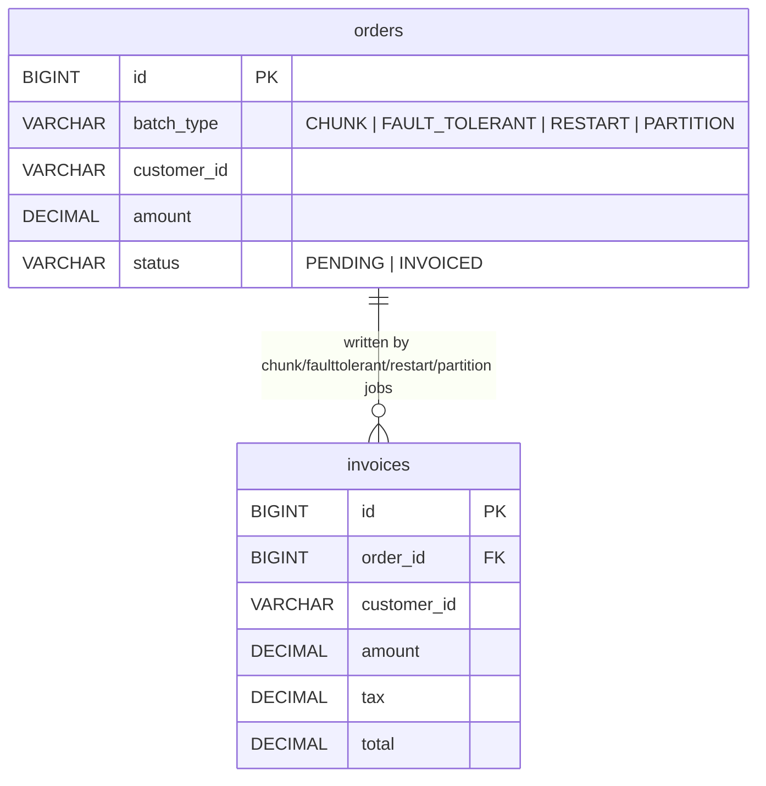
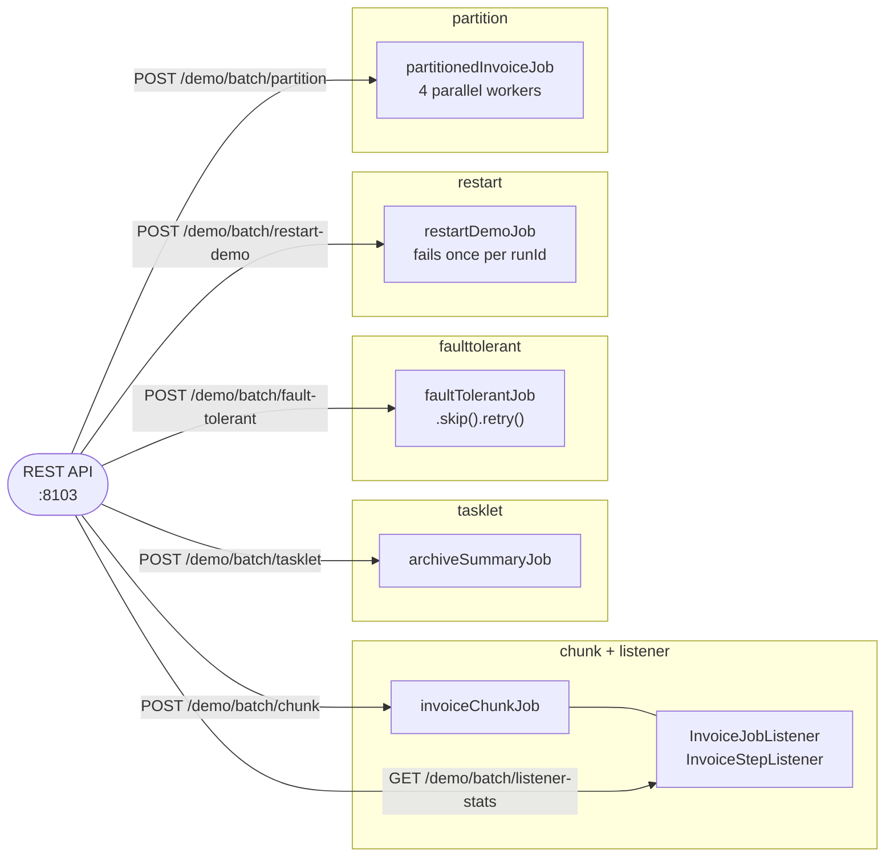

# Spring Batch Demo Implementation Plan

> **For agentic workers:** REQUIRED SUB-SKILL: Use superpowers:subagent-driven-development (recommended) or superpowers:executing-plans to implement this plan task-by-task. Steps use checkbox (`- [ ]`) syntax for tracking.

**Goal:** Add a `batch-processing/spring-batch/` module — a single Spring Boot app, H2-only, no Docker — covering six Spring Batch patterns (chunk-oriented ETL, lifecycle listeners, tasklet steps, skip/retry fault tolerance, job restart, partitioned steps) over an order-invoicing domain.

**Architecture:** Package-per-pattern under `com.testingai.batch`, five independent `Job` beans (listeners attach to the chunk job rather than needing a sixth). `crud`-style plain JDBC (`JdbcTemplate`/`JdbcCursorItemReader`) throughout — no JPA. A single `DemoController` launches jobs via a shared `BatchLaunchService` and exposes inspection endpoints, matching every other module's "one controller triggers all patterns" convention.

**Tech Stack:** Spring Boot 3.4.4, Spring Batch 5.2.x (bundled), Spring JDBC, H2 (in-memory, `DB_CLOSE_DELAY=-1`), Lombok, springdoc-openapi, Gatling, `spring-batch-test` (`@SpringBatchTest`/`JobLauncherTestUtils`).

**Spec:** `docs/superpowers/specs/2026-08-27-spring-batch-demo-design.md`

## Global Constraints

- Java 21, Spring Boot 3.4.4. Module artifactId: `spring-batch-demo`; base package: `com.testingai.batch`.
- App port `8103`. No Docker — H2 only (`jdbc:h2:mem:batchdb;DB_CLOSE_DELAY=-1`), `spring.batch.jdbc.initialize-schema=always`, `spring.batch.job.enabled=false` (jobs launch only via REST, never at startup).
- `orders.batch_type` discriminator (`CHUNK`/`FAULT_TOLERANT`/`RESTART`/`PARTITION`) keeps each pattern's demo data isolated in one shared `orders` table.
- Every reader's SQL includes `ORDER BY id` — required for `JdbcCursorItemReader`'s restart position (row number) to reliably map to the same records across separate reader instances. `restart/RestartJobConfig`'s reader is the one exception to filtering on `status = 'PENDING'` — filtering there would shrink the result set after a restart (once committed rows flip to `INVOICED`), which breaks the row-count-based restart position; see that reader's own comment.
- `chunk/InvoiceProcessor` and `chunk/InvoiceItemWriter` are reused by `faulttolerant/` and `partition/` (writer) and `partition/` (processor) — do not duplicate this logic per package.
- Job-launch endpoints add a unique `timestamp` `JobParameter` on every call so they can be re-triggered repeatedly (`chunk`, `tasklet`, `faulttolerant`, `partition`) — **except** `restart-demo`, which deliberately uses only the caller-supplied `runId` with no other parameter, since reusing identical `JobParameters` across calls is what identifies it as the same job instance to restart.
- Partition grid size is fixed at `4` in the step definition (`TaskExecutorPartitionHandler`'s grid size is set at bean-definition time, not re-readable per request without a custom `PartitionHandler`) — no `gridSize` REST parameter.
- Job-config integration tests use `@SpringBootTest(classes = { com.testingai.batch.testsupport.BatchTestConfig.class, ...that job's own beans... })` + `@SpringBatchTest` — never the full application context — because with all five `Job` beans loaded, `@SpringBatchTest`'s auto-wired `JobLauncherTestUtils` cannot unambiguously resolve which `Job` to bind. `BatchTestConfig` (a test-only `@SpringBootConfiguration @EnableAutoConfiguration` marker with no `@ComponentScan`, created in Task 6) is required in every such `classes` list: `@SpringBootTest(classes = ...)` skips Spring Boot's auto-configuration entirely (no `DataSource`, no Batch infrastructure) unless one of the listed classes carries `@SpringBootConfiguration` — confirmed by hitting `NoSuchBeanDefinitionException: DataSource` without it. `BatchTestConfig` lives in its own `com.testingai.batch.testsupport` package, not `com.testingai.batch` — placing it alongside `BatchDemoApplication` breaks `@WebMvcTest`'s config auto-detection for *other* test classes (e.g. `DemoControllerTest` in Task 11), which walks up from the test's package and errors on finding two `@SpringBootConfiguration` classes. Every job-config test's `@BeforeEach` clears **both** `orders` and `invoices` tables fully (not scoped to its own `batch_type`) — all job-config tests share one persistent H2 instance for the whole `mvn test` run.
- No custom `@ControllerAdvice`/exception handling — job-launch endpoints let `JobExecutionAlreadyRunningException`/`JobRestartException`/`JobInstanceAlreadyCompleteException`/`JobParametersInvalidException` propagate to Spring's default error handling, matching how `noSQL/mongodb` and `noSQL/cassandra` let `IllegalStateException` propagate uncaught.
- Field style matches every other module: Lombok `@Data`/`@NoArgsConstructor`/`@AllArgsConstructor` on POJOs, `@RequiredArgsConstructor` + `private final` on services, `@Slf4j` for logging (already used elsewhere in this repo, e.g. `workflow-engines/camunda`). Tab indentation — the `spotless-maven-plugin`/eclipse-formatter wired into `batch-processing/pom.xml` reformats on commit via `.githooks/pre-commit`, so exact whitespace in this plan's code blocks is not load-bearing.
- If a Spring Batch API signature in this plan doesn't match the actual library version, consult the Spring Batch 5.x docs (or `context7`, library id `/spring-projects/spring-batch/v5.2.5`) for the current signature rather than guessing — every signature in this plan was verified against that source before writing.

---

## Task 1: Category and module scaffolding

**Files:**
- Create: `batch-processing/pom.xml`
- Create: `batch-processing/eclipse-formatter.xml`
- Create: `batch-processing/README.md`
- Create: `batch-processing/spring-batch/spring-demo/pom.xml`
- Create: `batch-processing/spring-batch/spring-demo/src/main/java/com/testingai/batch/BatchDemoApplication.java`
- Create: `batch-processing/spring-batch/spring-demo/src/main/resources/application.yml`
- Create: `batch-processing/spring-batch/spring-demo/src/main/resources/schema.sql`
- Test: `batch-processing/spring-batch/spring-demo/src/test/java/com/testingai/batch/BatchDemoApplicationTest.java`
- Modify: `.githooks/pre-commit`

**Interfaces:**
- Produces: a buildable, empty Spring Boot module (Maven reactor `batch-processing`), port `8103`, H2 datasource `jdbc:h2:mem:batchdb;DB_CLOSE_DELAY=-1` with `orders`/`invoices` tables created on startup via `schema.sql`, Spring Batch's own metadata schema initialized (`spring.batch.jdbc.initialize-schema=always`), no job auto-run (`spring.batch.job.enabled=false`).

- [ ] **Step 1: Write the category parent POM**

`batch-processing/pom.xml`:

```xml
<?xml version="1.0" encoding="UTF-8"?>
<project xmlns="http://maven.apache.org/POM/4.0.0"
         xmlns:xsi="http://www.w3.org/2001/XMLSchema-instance"
         xsi:schemaLocation="http://maven.apache.org/POM/4.0.0 https://maven.apache.org/xsd/maven-4.0.0.xsd">
    <modelVersion>4.0.0</modelVersion>

    <parent>
        <groupId>org.springframework.boot</groupId>
        <artifactId>spring-boot-starter-parent</artifactId>
        <version>3.4.4</version>
    </parent>

    <groupId>com.testingai</groupId>
    <artifactId>batch-processing</artifactId>
    <version>1.0.0</version>
    <packaging>pom</packaging>
    <name>Batch Processing</name>
    <description>Parent POM for all batch-processing demo modules</description>

    <modules>
        <module>spring-batch/spring-demo</module>
    </modules>

    <properties>
        <maven.compiler.release>21</maven.compiler.release>
        <project.build.sourceEncoding>UTF-8</project.build.sourceEncoding>
        <lombok.version>1.18.38</lombok.version>
        <springdoc.version>2.8.6</springdoc.version>
        <gatling.version>3.13.1</gatling.version>
        <gatling-maven-plugin.version>4.15.0</gatling-maven-plugin.version>
        <spotless.version>2.43.0</spotless.version>
    </properties>

    <dependencies>
        <dependency>
            <groupId>org.springframework.boot</groupId>
            <artifactId>spring-boot-starter-web</artifactId>
        </dependency>
        <dependency>
            <groupId>org.projectlombok</groupId>
            <artifactId>lombok</artifactId>
            <version>${lombok.version}</version>
            <optional>true</optional>
        </dependency>
        <dependency>
            <groupId>org.springdoc</groupId>
            <artifactId>springdoc-openapi-starter-webmvc-ui</artifactId>
            <version>${springdoc.version}</version>
        </dependency>
        <dependency>
            <groupId>org.springframework.boot</groupId>
            <artifactId>spring-boot-starter-test</artifactId>
            <scope>test</scope>
        </dependency>
        <dependency>
            <groupId>io.gatling.highcharts</groupId>
            <artifactId>gatling-charts-highcharts</artifactId>
            <version>${gatling.version}</version>
            <scope>test</scope>
        </dependency>
    </dependencies>

    <build>
        <plugins>
            <plugin>
                <groupId>org.apache.maven.plugins</groupId>
                <artifactId>maven-compiler-plugin</artifactId>
                <configuration>
                    <annotationProcessorPaths>
                        <path>
                            <groupId>org.projectlombok</groupId>
                            <artifactId>lombok</artifactId>
                            <version>${lombok.version}</version>
                        </path>
                    </annotationProcessorPaths>
                </configuration>
            </plugin>
            <plugin>
                <groupId>org.apache.maven.plugins</groupId>
                <artifactId>maven-surefire-plugin</artifactId>
                <configuration>
                    <argLine>-Dnet.bytebuddy.experimental=true</argLine>
                    <excludes>
                        <exclude>**/performance/**</exclude>
                    </excludes>
                </configuration>
            </plugin>
            <plugin>
                <groupId>io.gatling</groupId>
                <artifactId>gatling-maven-plugin</artifactId>
                <version>${gatling-maven-plugin.version}</version>
            </plugin>
            <plugin>
                <groupId>org.codehaus.mojo</groupId>
                <artifactId>exec-maven-plugin</artifactId>
                <executions>
                    <execution>
                        <id>install-git-hooks</id>
                        <phase>initialize</phase>
                        <goals>
                            <goal>exec</goal>
                        </goals>
                        <configuration>
                            <executable>git</executable>
                            <arguments>
                                <argument>config</argument>
                                <argument>core.hooksPath</argument>
                                <argument>.githooks</argument>
                            </arguments>
                        </configuration>
                    </execution>
                </executions>
            </plugin>
            <plugin>
                <groupId>com.diffplug.spotless</groupId>
                <artifactId>spotless-maven-plugin</artifactId>
                <version>${spotless.version}</version>
                <configuration>
                    <java>
                        <eclipse>
                            <version>4.31</version>
                            <file>${maven.multiModuleProjectDirectory}/eclipse-formatter.xml</file>
                        </eclipse>
                    </java>
                </configuration>
            </plugin>
        </plugins>
    </build>
</project>
```

- [ ] **Step 2: Copy the eclipse formatter**

`batch-processing/eclipse-formatter.xml`:

```xml
<?xml version="1.0" encoding="UTF-8" standalone="no"?>
<profiles version="21">
    <profile kind="CodeFormatterProfile" name="techmix" version="21">
        <setting id="org.eclipse.jdt.core.formatter.lineSplit" value="120"/>
        <setting id="org.eclipse.jdt.core.formatter.comment.line_length" value="120"/>
        <setting id="org.eclipse.jdt.core.formatter.comment.format_javadoc_comments" value="true"/>
        <setting id="org.eclipse.jdt.core.formatter.comment.format_block_comments" value="true"/>
        <setting id="org.eclipse.jdt.core.formatter.tabulation.char" value="tab"/>
        <setting id="org.eclipse.jdt.core.formatter.tabulation.size" value="4"/>
        <setting id="org.eclipse.jdt.core.formatter.indentation.size" value="4"/>
    </profile>
</profiles>
```

- [ ] **Step 3: Write the module POM**

`batch-processing/spring-batch/spring-demo/pom.xml`:

```xml
<?xml version="1.0" encoding="UTF-8"?>
<project xmlns="http://maven.apache.org/POM/4.0.0"
         xmlns:xsi="http://www.w3.org/2001/XMLSchema-instance"
         xsi:schemaLocation="http://maven.apache.org/POM/4.0.0 http://maven.apache.org/xsd/maven-4.0.0.xsd">
    <modelVersion>4.0.0</modelVersion>

    <parent>
        <groupId>com.testingai</groupId>
        <artifactId>batch-processing</artifactId>
        <version>1.0.0</version>
        <relativePath>../../pom.xml</relativePath>
    </parent>

    <artifactId>spring-batch-demo</artifactId>
    <name>Spring Batch Demo</name>
    <description>Learning and demonstration project for Spring Batch patterns over an order-invoicing domain</description>

    <dependencies>
        <dependency>
            <groupId>org.springframework.boot</groupId>
            <artifactId>spring-boot-starter-batch</artifactId>
        </dependency>
        <dependency>
            <groupId>org.springframework.boot</groupId>
            <artifactId>spring-boot-starter-jdbc</artifactId>
        </dependency>
        <dependency>
            <groupId>com.h2database</groupId>
            <artifactId>h2</artifactId>
            <scope>runtime</scope>
        </dependency>
        <dependency>
            <groupId>org.springframework.batch</groupId>
            <artifactId>spring-batch-test</artifactId>
            <scope>test</scope>
        </dependency>
    </dependencies>

    <build>
        <plugins>
            <plugin>
                <groupId>org.springframework.boot</groupId>
                <artifactId>spring-boot-maven-plugin</artifactId>
                <configuration>
                    <mainClass>com.testingai.batch.BatchDemoApplication</mainClass>
                    <excludes>
                        <exclude>
                            <groupId>org.projectlombok</groupId>
                            <artifactId>lombok</artifactId>
                        </exclude>
                    </excludes>
                </configuration>
            </plugin>
            <plugin>
                <groupId>io.gatling</groupId>
                <artifactId>gatling-maven-plugin</artifactId>
                <configuration>
                    <simulationClass>com.testingai.batch.performance.DemoSimulation</simulationClass>
                </configuration>
            </plugin>
        </plugins>
    </build>
</project>
```

- [ ] **Step 4: Write the application class, config, and schema**

`batch-processing/spring-batch/spring-demo/src/main/java/com/testingai/batch/BatchDemoApplication.java`:

```java
package com.testingai.batch;

import org.springframework.boot.SpringApplication;
import org.springframework.boot.autoconfigure.SpringBootApplication;

@SpringBootApplication
public class BatchDemoApplication {

	public static void main(String[] args) {
		SpringApplication.run(BatchDemoApplication.class, args);
	}
}
```

`batch-processing/spring-batch/spring-demo/src/main/resources/application.yml`:

```yaml
spring:
  datasource:
    url: jdbc:h2:mem:batchdb;DB_CLOSE_DELAY=-1
  batch:
    job:
      enabled: false
    jdbc:
      initialize-schema: always

server:
  port: 8103
```

`batch-processing/spring-batch/spring-demo/src/main/resources/schema.sql`:

```sql
CREATE TABLE IF NOT EXISTS orders (
    id BIGINT AUTO_INCREMENT PRIMARY KEY,
    batch_type VARCHAR(20) NOT NULL,
    customer_id VARCHAR(50) NOT NULL,
    amount DECIMAL(10,2) NOT NULL,
    status VARCHAR(20) NOT NULL DEFAULT 'PENDING',
    created_at TIMESTAMP NOT NULL DEFAULT CURRENT_TIMESTAMP
);

CREATE TABLE IF NOT EXISTS invoices (
    id BIGINT AUTO_INCREMENT PRIMARY KEY,
    order_id BIGINT NOT NULL,
    customer_id VARCHAR(50) NOT NULL,
    amount DECIMAL(10,2) NOT NULL,
    tax DECIMAL(10,2) NOT NULL,
    total DECIMAL(10,2) NOT NULL,
    created_at TIMESTAMP NOT NULL DEFAULT CURRENT_TIMESTAMP
);
```

- [ ] **Step 5: Write the trivial application test**

`batch-processing/spring-batch/spring-demo/src/test/java/com/testingai/batch/BatchDemoApplicationTest.java`:

```java
package com.testingai.batch;

import org.junit.jupiter.api.Test;

class BatchDemoApplicationTest {

	@Test
	void mainClassExists() {
		new BatchDemoApplication();
	}
}
```

- [ ] **Step 6: Run the build to verify the module compiles and the test passes**

Run: `cd batch-processing && mvn -pl spring-batch/spring-demo test`
Expected: `BUILD SUCCESS`, one test run, 0 failures.

- [ ] **Step 7: Write the category README**

`batch-processing/README.md`:

```markdown
# Batch Processing — Demos

This directory contains runnable demos for batch-processing frameworks, structured the same way as `../concurrency-patterns/`: one Spring Boot demo app per framework, no external infrastructure required.

| Framework | Demo | Best fit |
|---|---|---|
| [Spring Batch](spring-batch/) | Chunk ETL, listeners, tasklet, skip/retry, restart, partitioning | Scheduled/triggered bulk data processing (ETL, billing runs, imports) with restartability and fault tolerance as first-class concerns |

More batch-processing frameworks may be added here over time.
```

- [ ] **Step 8: Register the category in `.githooks/pre-commit`**

Add `batch-processing` to the staged-file grep pattern on line 7 (change `^(message-brokers|noSQL|...` to include `batch-processing`):

```bash
STAGED_JAVA=$(git diff --cached --name-only --diff-filter=ACM | grep -E '^(message-brokers|noSQL|cqrs-event-sourcing|template-engines|distributed-transactions|spring-boot-starters|communication-protocols|reactive-programming|workflow-engines|domain-driven-design|concurrency-patterns|data-integration|batch-processing)/.*\.java$' || true)
```

Add a matching block (after the `concurrency-patterns` block):

```bash
if echo "$STAGED_JAVA" | grep -q '^batch-processing/'; then
    echo "[pre-commit] Applying Spotless formatting to staged batch-processing Java files..."
    (cd "$ROOT/batch-processing" && mvn spotless:apply --quiet)
fi
```

- [ ] **Step 9: Commit**

```bash
cd /Users/admin/IdeaProjects/private/techmix-copy
git add batch-processing/ .githooks/pre-commit
git commit -m "feat(spring-batch): scaffold batch-processing category and spring-batch-demo module"
```

---

## Task 2: `domain/` — POJOs, row mapper, invoice calculator

**Files:**
- Create: `batch-processing/spring-batch/spring-demo/src/main/java/com/testingai/batch/domain/BatchType.java`
- Create: `batch-processing/spring-batch/spring-demo/src/main/java/com/testingai/batch/domain/OrderStatus.java`
- Create: `batch-processing/spring-batch/spring-demo/src/main/java/com/testingai/batch/domain/Order.java`
- Create: `batch-processing/spring-batch/spring-demo/src/main/java/com/testingai/batch/domain/Invoice.java`
- Create: `batch-processing/spring-batch/spring-demo/src/main/java/com/testingai/batch/domain/OrderRowMapper.java`
- Create: `batch-processing/spring-batch/spring-demo/src/main/java/com/testingai/batch/domain/InvoiceCalculator.java`
- Test: `batch-processing/spring-batch/spring-demo/src/test/java/com/testingai/batch/domain/InvoiceCalculatorTest.java`

**Interfaces:**
- Produces: `Order` (fields: `Long id`, `BatchType batchType`, `String customerId`, `BigDecimal amount`, `OrderStatus status`, `LocalDateTime createdAt`), `Invoice` (fields: `Long id`, `Long orderId`, `String customerId`, `BigDecimal amount`, `BigDecimal tax`, `BigDecimal total`, `LocalDateTime createdAt`), `InvoiceCalculator.toInvoice(Order) -> Invoice` — used by `chunk.InvoiceProcessor` (Task 6), `faulttolerant.FaultTolerantProcessor` (Task 9), `restart.RestartProcessor` (Task 10). `OrderRowMapper implements RowMapper<Order>` — used by every `JdbcCursorItemReader<Order>` bean (Tasks 6, 9, 10, 11).

- [ ] **Step 1: Write the enums and POJOs**

`batch-processing/spring-batch/spring-demo/src/main/java/com/testingai/batch/domain/BatchType.java`:

```java
package com.testingai.batch.domain;

public enum BatchType {
	CHUNK, FAULT_TOLERANT, RESTART, PARTITION
}
```

`batch-processing/spring-batch/spring-demo/src/main/java/com/testingai/batch/domain/OrderStatus.java`:

```java
package com.testingai.batch.domain;

public enum OrderStatus {
	PENDING, INVOICED
}
```

`batch-processing/spring-batch/spring-demo/src/main/java/com/testingai/batch/domain/Order.java`:

```java
package com.testingai.batch.domain;

import java.math.BigDecimal;
import java.time.LocalDateTime;

import lombok.AllArgsConstructor;
import lombok.Data;
import lombok.NoArgsConstructor;

@Data
@NoArgsConstructor
@AllArgsConstructor
public class Order {

	private Long id;
	private BatchType batchType;
	private String customerId;
	private BigDecimal amount;
	private OrderStatus status;
	private LocalDateTime createdAt;
}
```

`batch-processing/spring-batch/spring-demo/src/main/java/com/testingai/batch/domain/Invoice.java`:

```java
package com.testingai.batch.domain;

import java.math.BigDecimal;
import java.time.LocalDateTime;

import lombok.AllArgsConstructor;
import lombok.Data;
import lombok.NoArgsConstructor;

@Data
@NoArgsConstructor
@AllArgsConstructor
public class Invoice {

	private Long id;
	private Long orderId;
	private String customerId;
	private BigDecimal amount;
	private BigDecimal tax;
	private BigDecimal total;
	private LocalDateTime createdAt;
}
```

- [ ] **Step 2: Write the row mapper**

`batch-processing/spring-batch/spring-demo/src/main/java/com/testingai/batch/domain/OrderRowMapper.java`:

```java
package com.testingai.batch.domain;

import java.sql.ResultSet;
import java.sql.SQLException;

import org.springframework.jdbc.core.RowMapper;

public class OrderRowMapper implements RowMapper<Order> {

	@Override
	public Order mapRow(ResultSet rs, int rowNum) throws SQLException {
		Order order = new Order();
		order.setId(rs.getLong("id"));
		order.setBatchType(BatchType.valueOf(rs.getString("batch_type")));
		order.setCustomerId(rs.getString("customer_id"));
		order.setAmount(rs.getBigDecimal("amount"));
		order.setStatus(OrderStatus.valueOf(rs.getString("status")));
		order.setCreatedAt(rs.getTimestamp("created_at").toLocalDateTime());
		return order;
	}
}
```

- [ ] **Step 3: Write the failing test for InvoiceCalculator**

`batch-processing/spring-batch/spring-demo/src/test/java/com/testingai/batch/domain/InvoiceCalculatorTest.java`:

```java
package com.testingai.batch.domain;

import java.math.BigDecimal;

import org.junit.jupiter.api.Test;

import static org.assertj.core.api.Assertions.assertThat;

class InvoiceCalculatorTest {

	@Test
	void toInvoice_shouldComputeTaxAndTotal() {
		Order order = new Order(1L, BatchType.CHUNK, "cust-1", new BigDecimal("100.00"), OrderStatus.PENDING, null);

		Invoice invoice = InvoiceCalculator.toInvoice(order);

		assertThat(invoice.getOrderId()).isEqualTo(1L);
		assertThat(invoice.getCustomerId()).isEqualTo("cust-1");
		assertThat(invoice.getAmount()).isEqualByComparingTo("100.00");
		assertThat(invoice.getTax()).isEqualByComparingTo("8.00");
		assertThat(invoice.getTotal()).isEqualByComparingTo("108.00");
	}
}
```

- [ ] **Step 4: Run the test to verify it fails**

Run: `cd batch-processing && mvn -pl spring-batch/spring-demo test -Dtest=InvoiceCalculatorTest`
Expected: FAIL — `InvoiceCalculator` does not exist (compile error).

- [ ] **Step 5: Write the implementation**

`batch-processing/spring-batch/spring-demo/src/main/java/com/testingai/batch/domain/InvoiceCalculator.java`:

```java
package com.testingai.batch.domain;

import java.math.BigDecimal;
import java.math.RoundingMode;

public final class InvoiceCalculator {

	private static final BigDecimal TAX_RATE = new BigDecimal("0.08");

	private InvoiceCalculator() {
	}

	public static Invoice toInvoice(Order order) {
		BigDecimal tax = order.getAmount().multiply(TAX_RATE).setScale(2, RoundingMode.HALF_UP);
		BigDecimal total = order.getAmount().add(tax);

		Invoice invoice = new Invoice();
		invoice.setOrderId(order.getId());
		invoice.setCustomerId(order.getCustomerId());
		invoice.setAmount(order.getAmount());
		invoice.setTax(tax);
		invoice.setTotal(total);
		return invoice;
	}
}
```

- [ ] **Step 6: Run the test to verify it passes**

Run: `cd batch-processing && mvn -pl spring-batch/spring-demo test -Dtest=InvoiceCalculatorTest`
Expected: PASS, 1 test.

- [ ] **Step 7: Commit**

```bash
cd /Users/admin/IdeaProjects/private/techmix-copy
git add batch-processing/spring-batch/spring-demo/src/main/java/com/testingai/batch/domain/ \
        batch-processing/spring-batch/spring-demo/src/test/java/com/testingai/batch/domain/
git commit -m "feat(spring-batch): add domain model (Order/Invoice/InvoiceCalculator)"
```

---

## Task 3: `util/` — FailureSimulator

**Files:**
- Create: `batch-processing/spring-batch/spring-demo/src/main/java/com/testingai/batch/util/FailureSimulator.java`
- Test: `batch-processing/spring-batch/spring-demo/src/test/java/com/testingai/batch/util/FailureSimulatorTest.java`

**Interfaces:**
- Produces: `FailureSimulator.maybeThrow(String context)` (static, void, throws `RuntimeException` ~5% of the time) — used by `faulttolerant.FaultTolerantProcessor` (Task 9).

- [ ] **Step 1: Write the failing test**

`batch-processing/spring-batch/spring-demo/src/test/java/com/testingai/batch/util/FailureSimulatorTest.java` (matches the `concurrency-patterns/lmax-disruptor` module's convention exactly):

```java
package com.testingai.batch.util;

import org.junit.jupiter.api.Test;

import static org.assertj.core.api.Assertions.assertThat;

class FailureSimulatorTest {

	@Test
	void maybeThrowFailsWithinExpectedRateBand() {
		int failures = 0;
		for (int i = 0; i < 1000; i++) {
			try {
				FailureSimulator.maybeThrow("test");
			} catch (RuntimeException ignored) {
				failures++;
			}
		}

		// With a 5% failure rate, expect roughly 50 failures; accept a 5-200 range to avoid flakiness.
		assertThat(failures).isBetween(5, 200);
	}
}
```

- [ ] **Step 2: Run the test to verify it fails**

Run: `cd batch-processing && mvn -pl spring-batch/spring-demo test -Dtest=FailureSimulatorTest`
Expected: FAIL — `FailureSimulator` does not exist (compile error).

- [ ] **Step 3: Write the implementation**

`batch-processing/spring-batch/spring-demo/src/main/java/com/testingai/batch/util/FailureSimulator.java`:

```java
package com.testingai.batch.util;

public class FailureSimulator {

	private static final double FAILURE_RATE = 0.05;

	private FailureSimulator() {
	}

	public static void maybeThrow(String context) {
		if (Math.random() < FAILURE_RATE) {
			throw new RuntimeException("Simulated 5% failure in " + context);
		}
	}
}
```

- [ ] **Step 4: Run the test to verify it passes**

Run: `cd batch-processing && mvn -pl spring-batch/spring-demo test -Dtest=FailureSimulatorTest`
Expected: PASS, 1 test.

- [ ] **Step 5: Commit**

```bash
cd /Users/admin/IdeaProjects/private/techmix-copy
git add batch-processing/spring-batch/spring-demo/src/main/java/com/testingai/batch/util/ \
        batch-processing/spring-batch/spring-demo/src/test/java/com/testingai/batch/util/
git commit -m "feat(spring-batch): add FailureSimulator util (Kafka-module convention)"
```

---

## Task 4: `seed/` — OrderSeedService

**Files:**
- Create: `batch-processing/spring-batch/spring-demo/src/main/java/com/testingai/batch/seed/OrderSeedService.java`
- Test: `batch-processing/spring-batch/spring-demo/src/test/java/com/testingai/batch/seed/OrderSeedServiceTest.java`

**Interfaces:**
- Consumes: `com.testingai.batch.domain.BatchType` (Task 2).
- Produces: `OrderSeedService.seed(BatchType batchType, int count) -> int` (returns the number of rows inserted) — used by `controller.DemoController` (Task 12).

- [ ] **Step 1: Write the failing test**

`batch-processing/spring-batch/spring-demo/src/test/java/com/testingai/batch/seed/OrderSeedServiceTest.java`:

```java
package com.testingai.batch.seed;

import java.util.List;

import com.testingai.batch.domain.BatchType;
import org.junit.jupiter.api.Test;
import org.junit.jupiter.api.extension.ExtendWith;
import org.mockito.ArgumentCaptor;
import org.mockito.InjectMocks;
import org.mockito.Mock;
import org.mockito.junit.jupiter.MockitoExtension;
import org.springframework.jdbc.core.JdbcTemplate;

import static org.assertj.core.api.Assertions.assertThat;
import static org.mockito.ArgumentMatchers.any;
import static org.mockito.ArgumentMatchers.anyString;
import static org.mockito.Mockito.verify;
import static org.mockito.Mockito.when;

@ExtendWith(MockitoExtension.class)
class OrderSeedServiceTest {

	@InjectMocks
	private OrderSeedService orderSeedService;

	@Mock
	private JdbcTemplate jdbcTemplate;

	@SuppressWarnings("unchecked")
	@Test
	void seed_shouldInsertRequestedCountAndReturnIt() {
		when(jdbcTemplate.batchUpdate(anyString(), any(List.class))).thenReturn(new int[5]);

		int result = orderSeedService.seed(BatchType.CHUNK, 5);

		assertThat(result).isEqualTo(5);

		ArgumentCaptor<List<Object[]>> captor = ArgumentCaptor.forClass(List.class);
		verify(jdbcTemplate).batchUpdate(anyString(), captor.capture());
		assertThat(captor.getValue()).hasSize(5);
	}
}
```

- [ ] **Step 2: Run the test to verify it fails**

Run: `cd batch-processing && mvn -pl spring-batch/spring-demo test -Dtest=OrderSeedServiceTest`
Expected: FAIL — `OrderSeedService` does not exist (compile error).

- [ ] **Step 3: Write the implementation**

`batch-processing/spring-batch/spring-demo/src/main/java/com/testingai/batch/seed/OrderSeedService.java`:

```java
package com.testingai.batch.seed;

import java.math.BigDecimal;
import java.math.RoundingMode;
import java.util.List;
import java.util.UUID;
import java.util.concurrent.ThreadLocalRandom;
import java.util.stream.IntStream;

import com.testingai.batch.domain.BatchType;
import lombok.RequiredArgsConstructor;
import org.springframework.jdbc.core.JdbcTemplate;
import org.springframework.stereotype.Service;

@Service
@RequiredArgsConstructor
public class OrderSeedService {

	private static final String INSERT = "INSERT INTO orders (batch_type, customer_id, amount, status) VALUES (?, ?, ?, 'PENDING')";

	private final JdbcTemplate jdbcTemplate;

	public int seed(BatchType batchType, int count) {
		List<Object[]> batchArgs = IntStream.range(0, count)
				.mapToObj(i -> new Object[] { batchType.name(), "cust-" + UUID.randomUUID(), randomAmount() })
				.toList();
		int[] results = jdbcTemplate.batchUpdate(INSERT, batchArgs);
		return results.length;
	}

	private BigDecimal randomAmount() {
		return BigDecimal.valueOf(ThreadLocalRandom.current().nextDouble(10, 500)).setScale(2, RoundingMode.HALF_UP);
	}
}
```

- [ ] **Step 4: Run the test to verify it passes**

Run: `cd batch-processing && mvn -pl spring-batch/spring-demo test -Dtest=OrderSeedServiceTest`
Expected: PASS, 1 test.

- [ ] **Step 5: Commit**

```bash
cd /Users/admin/IdeaProjects/private/techmix-copy
git add batch-processing/spring-batch/spring-demo/src/main/java/com/testingai/batch/seed/ \
        batch-processing/spring-batch/spring-demo/src/test/java/com/testingai/batch/seed/
git commit -m "feat(spring-batch): add order seeding endpoint support"
```

---

## Task 5: `listener/` — ListenerStats and the JobExecutionListener/StepExecutionListener

**Files:**
- Create: `batch-processing/spring-batch/spring-demo/src/main/java/com/testingai/batch/listener/ListenerStats.java`
- Create: `batch-processing/spring-batch/spring-demo/src/main/java/com/testingai/batch/listener/ListenerStatsService.java`
- Create: `batch-processing/spring-batch/spring-demo/src/main/java/com/testingai/batch/listener/InvoiceJobListener.java`
- Create: `batch-processing/spring-batch/spring-demo/src/main/java/com/testingai/batch/listener/InvoiceStepListener.java`
- Test: `batch-processing/spring-batch/spring-demo/src/test/java/com/testingai/batch/listener/ListenerStatsServiceTest.java`

**Interfaces:**
- Produces: `ListenerStats` (record: `jobName`, `status`, `startTime`, `endTime`, `durationMillis`, `readCount`, `writeCount`, `skipCount`), `ListenerStatsService.record(ListenerStats)` / `.getLatest() -> ListenerStats` (null before any record) — used by `controller.DemoController` (Task 12). `InvoiceJobListener` (`JobExecutionListener`) and `InvoiceStepListener` (`StepExecutionListener`) — attached to the chunk job in `chunk.ChunkJobConfig` (Task 6); `InvoiceJobListener` is the one that calls `ListenerStatsService.record(...)`, `InvoiceStepListener` logs per-step lifecycle events and passes through the step's `ExitStatus` unchanged.

- [ ] **Step 1: Write the record and the failing test for ListenerStatsService**

`batch-processing/spring-batch/spring-demo/src/main/java/com/testingai/batch/listener/ListenerStats.java`:

```java
package com.testingai.batch.listener;

import java.time.LocalDateTime;

public record ListenerStats(String jobName, String status, LocalDateTime startTime, LocalDateTime endTime,
		long durationMillis, int readCount, int writeCount, int skipCount) {
}
```

`batch-processing/spring-batch/spring-demo/src/test/java/com/testingai/batch/listener/ListenerStatsServiceTest.java`:

```java
package com.testingai.batch.listener;

import java.time.LocalDateTime;

import org.junit.jupiter.api.Test;

import static org.assertj.core.api.Assertions.assertThat;

class ListenerStatsServiceTest {

	private final ListenerStatsService listenerStatsService = new ListenerStatsService();

	@Test
	void getLatest_shouldReturnNullBeforeAnyRecord() {
		assertThat(listenerStatsService.getLatest()).isNull();
	}

	@Test
	void record_shouldOverwritePreviousStats() {
		ListenerStats first = new ListenerStats("job", "COMPLETED", LocalDateTime.now(), LocalDateTime.now(), 100, 5,
				5, 0);
		ListenerStats second = new ListenerStats("job", "FAILED", LocalDateTime.now(), LocalDateTime.now(), 50, 2, 1,
				1);

		listenerStatsService.record(first);
		listenerStatsService.record(second);

		assertThat(listenerStatsService.getLatest()).isEqualTo(second);
	}
}
```

- [ ] **Step 2: Run the test to verify it fails**

Run: `cd batch-processing && mvn -pl spring-batch/spring-demo test -Dtest=ListenerStatsServiceTest`
Expected: FAIL — `ListenerStatsService` does not exist (compile error).

- [ ] **Step 3: Write the implementation**

`batch-processing/spring-batch/spring-demo/src/main/java/com/testingai/batch/listener/ListenerStatsService.java`:

```java
package com.testingai.batch.listener;

import java.util.concurrent.atomic.AtomicReference;

import org.springframework.stereotype.Service;

@Service
public class ListenerStatsService {

	private final AtomicReference<ListenerStats> latest = new AtomicReference<>();

	public void record(ListenerStats stats) {
		latest.set(stats);
	}

	public ListenerStats getLatest() {
		return latest.get();
	}
}
```

- [ ] **Step 4: Run the test to verify it passes**

Run: `cd batch-processing && mvn -pl spring-batch/spring-demo test -Dtest=ListenerStatsServiceTest`
Expected: PASS, 2 tests.

- [ ] **Step 5: Write the job and step listeners (no dedicated test — exercised by `ChunkJobConfigTest` in Task 6)**

`batch-processing/spring-batch/spring-demo/src/main/java/com/testingai/batch/listener/InvoiceJobListener.java`:

```java
package com.testingai.batch.listener;

import java.time.Duration;

import lombok.RequiredArgsConstructor;
import org.springframework.batch.core.JobExecution;
import org.springframework.batch.core.JobExecutionListener;
import org.springframework.batch.core.StepExecution;
import org.springframework.stereotype.Component;

@Component
@RequiredArgsConstructor
public class InvoiceJobListener implements JobExecutionListener {

	private final ListenerStatsService listenerStatsService;

	@Override
	public void afterJob(JobExecution jobExecution) {
		int readCount = 0;
		int writeCount = 0;
		int skipCount = 0;
		for (StepExecution stepExecution : jobExecution.getStepExecutions()) {
			readCount += stepExecution.getReadCount();
			writeCount += stepExecution.getWriteCount();
			skipCount += stepExecution.getSkipCount();
		}

		long durationMillis = 0;
		if (jobExecution.getStartTime() != null && jobExecution.getEndTime() != null) {
			durationMillis = Duration.between(jobExecution.getStartTime(), jobExecution.getEndTime()).toMillis();
		}

		listenerStatsService.record(new ListenerStats(jobExecution.getJobInstance().getJobName(),
				jobExecution.getStatus().name(), jobExecution.getStartTime(), jobExecution.getEndTime(),
				durationMillis, readCount, writeCount, skipCount));
	}
}
```

`batch-processing/spring-batch/spring-demo/src/main/java/com/testingai/batch/listener/InvoiceStepListener.java`:

```java
package com.testingai.batch.listener;

import lombok.extern.slf4j.Slf4j;
import org.springframework.batch.core.ExitStatus;
import org.springframework.batch.core.StepExecution;
import org.springframework.batch.core.StepExecutionListener;
import org.springframework.stereotype.Component;

@Slf4j
@Component
public class InvoiceStepListener implements StepExecutionListener {

	@Override
	public void beforeStep(StepExecution stepExecution) {
		log.info("[InvoiceStepListener] Starting step '{}'", stepExecution.getStepName());
	}

	@Override
	public ExitStatus afterStep(StepExecution stepExecution) {
		log.info("[InvoiceStepListener] Step '{}' finished: read={}, write={}, skip={}", stepExecution.getStepName(),
				stepExecution.getReadCount(), stepExecution.getWriteCount(), stepExecution.getSkipCount());
		return stepExecution.getExitStatus();
	}
}
```

- [ ] **Step 6: Verify the module still compiles**

Run: `cd batch-processing && mvn -pl spring-batch/spring-demo test-compile`
Expected: `BUILD SUCCESS`.

- [ ] **Step 7: Commit**

```bash
cd /Users/admin/IdeaProjects/private/techmix-copy
git add batch-processing/spring-batch/spring-demo/src/main/java/com/testingai/batch/listener/ \
        batch-processing/spring-batch/spring-demo/src/test/java/com/testingai/batch/listener/
git commit -m "feat(spring-batch): add listener pattern (job/step lifecycle stats)"
```

---

## Task 6: `chunk/` — the core chunk-oriented ETL job

**Files:**
- Create: `batch-processing/spring-batch/spring-demo/src/main/java/com/testingai/batch/chunk/InvoiceProcessor.java`
- Create: `batch-processing/spring-batch/spring-demo/src/main/java/com/testingai/batch/chunk/InvoiceItemWriter.java`
- Create: `batch-processing/spring-batch/spring-demo/src/main/java/com/testingai/batch/chunk/ChunkJobConfig.java`
- Create: `batch-processing/spring-batch/spring-demo/src/test/java/com/testingai/batch/testsupport/BatchTestConfig.java` (shared by every job-config test in Tasks 6–10)
- Test: `batch-processing/spring-batch/spring-demo/src/test/java/com/testingai/batch/chunk/ChunkJobConfigTest.java`

**Interfaces:**
- Consumes: `domain.Order`, `domain.Invoice`, `domain.OrderRowMapper`, `domain.InvoiceCalculator` (Task 2); `listener.InvoiceJobListener`, `listener.InvoiceStepListener`, `listener.ListenerStatsService` (Task 5).
- Produces: `InvoiceProcessor` (`ItemProcessor<Order,Invoice>`), `InvoiceItemWriter` (`ItemWriter<Invoice>`) — both reused by `faulttolerant/` (Task 9) and `partition/` (Task 11). `Job invoiceChunkJob` bean — used by `controller.DemoController` (Task 12).

- [ ] **Step 1: Write the processor and writer**

`batch-processing/spring-batch/spring-demo/src/main/java/com/testingai/batch/chunk/InvoiceProcessor.java`:

```java
package com.testingai.batch.chunk;

import com.testingai.batch.domain.Invoice;
import com.testingai.batch.domain.InvoiceCalculator;
import com.testingai.batch.domain.Order;
import org.springframework.batch.item.ItemProcessor;
import org.springframework.stereotype.Component;

@Component
public class InvoiceProcessor implements ItemProcessor<Order, Invoice> {

	@Override
	public Invoice process(Order order) {
		return InvoiceCalculator.toInvoice(order);
	}
}
```

`batch-processing/spring-batch/spring-demo/src/main/java/com/testingai/batch/chunk/InvoiceItemWriter.java`:

```java
package com.testingai.batch.chunk;

import java.util.List;

import com.testingai.batch.domain.Invoice;
import lombok.RequiredArgsConstructor;
import org.springframework.batch.item.Chunk;
import org.springframework.batch.item.ItemWriter;
import org.springframework.jdbc.core.JdbcTemplate;
import org.springframework.stereotype.Component;

@Component
@RequiredArgsConstructor
public class InvoiceItemWriter implements ItemWriter<Invoice> {

	private static final String INSERT_INVOICE = "INSERT INTO invoices (order_id, customer_id, amount, tax, total) VALUES (?, ?, ?, ?, ?)";
	private static final String MARK_INVOICED = "UPDATE orders SET status = 'INVOICED' WHERE id = ?";

	private final JdbcTemplate jdbcTemplate;

	@Override
	public void write(Chunk<? extends Invoice> chunk) {
		List<? extends Invoice> invoices = chunk.getItems();

		jdbcTemplate.batchUpdate(INSERT_INVOICE, invoices, invoices.size(), (ps, invoice) -> {
			ps.setLong(1, invoice.getOrderId());
			ps.setString(2, invoice.getCustomerId());
			ps.setBigDecimal(3, invoice.getAmount());
			ps.setBigDecimal(4, invoice.getTax());
			ps.setBigDecimal(5, invoice.getTotal());
		});

		jdbcTemplate.batchUpdate(MARK_INVOICED, invoices, invoices.size(),
				(ps, invoice) -> ps.setLong(1, invoice.getOrderId()));
	}
}
```

- [ ] **Step 2: Write the shared test bootstrap config and the failing integration test**

`batch-processing/spring-batch/spring-demo/src/test/java/com/testingai/batch/testsupport/BatchTestConfig.java` — a minimal bootstrap for job-config integration tests: `@SpringBootConfiguration` + `@EnableAutoConfiguration` (DataSource, Batch infrastructure, schema init) without `@ComponentScan`, so including it alongside one job's own beans in `@SpringBootTest(classes = ...)` gives full Spring Boot auto-configuration without dragging in the other four `Job` beans. It lives in its own `testsupport` package rather than `com.testingai.batch` directly — sitting alongside `BatchDemoApplication` there would break `@WebMvcTest`'s config auto-detection for other test classes (e.g. `DemoControllerTest` in Task 11), which walks up from the test's own package looking for exactly one `@SpringBootConfiguration` class:

```java
package com.testingai.batch.testsupport;

import org.springframework.boot.SpringBootConfiguration;
import org.springframework.boot.autoconfigure.EnableAutoConfiguration;

@SpringBootConfiguration
@EnableAutoConfiguration
public class BatchTestConfig {
}
```

`batch-processing/spring-batch/spring-demo/src/test/java/com/testingai/batch/chunk/ChunkJobConfigTest.java`:

```java
package com.testingai.batch.chunk;

import java.math.BigDecimal;

import com.testingai.batch.testsupport.BatchTestConfig;
import com.testingai.batch.domain.BatchType;
import com.testingai.batch.launch.BatchLaunchService;
import com.testingai.batch.launch.JobRunResult;
import com.testingai.batch.listener.InvoiceJobListener;
import com.testingai.batch.listener.InvoiceStepListener;
import com.testingai.batch.listener.ListenerStats;
import com.testingai.batch.listener.ListenerStatsService;
import org.junit.jupiter.api.BeforeEach;
import org.junit.jupiter.api.Test;
import org.springframework.batch.core.BatchStatus;
import org.springframework.batch.core.Job;
import org.springframework.batch.core.JobExecution;
import org.springframework.batch.core.JobParametersBuilder;
import org.springframework.batch.test.JobLauncherTestUtils;
import org.springframework.batch.test.context.SpringBatchTest;
import org.springframework.beans.factory.annotation.Autowired;
import org.springframework.boot.test.context.SpringBootTest;
import org.springframework.jdbc.core.JdbcTemplate;

import static org.assertj.core.api.Assertions.assertThat;

@SpringBootTest(classes = { BatchTestConfig.class, ChunkJobConfig.class, InvoiceProcessor.class,
		InvoiceItemWriter.class, InvoiceJobListener.class, InvoiceStepListener.class, ListenerStatsService.class,
		BatchLaunchService.class })
@SpringBatchTest
class ChunkJobConfigTest {

	@Autowired
	private JobLauncherTestUtils jobLauncherTestUtils;

	@Autowired
	private JdbcTemplate jdbcTemplate;

	@Autowired
	private ListenerStatsService listenerStatsService;

	@Autowired
	private BatchLaunchService batchLaunchService;

	@Autowired
	private Job invoiceChunkJob;

	@BeforeEach
	void setUp() {
		jobLauncherTestUtils.setJob(invoiceChunkJob);
		jdbcTemplate.update("DELETE FROM invoices");
		jdbcTemplate.update("DELETE FROM orders");
		for (int i = 0; i < 15; i++) {
			jdbcTemplate.update(
					"INSERT INTO orders (batch_type, customer_id, amount, status) VALUES (?, ?, ?, 'PENDING')",
					BatchType.CHUNK.name(), "cust-" + i, BigDecimal.valueOf(100));
		}
	}

	@Test
	void invoiceChunkJob_shouldWriteInvoicesMarkOrdersInvoicedAndRecordListenerStats() throws Exception {
		JobExecution jobExecution = jobLauncherTestUtils.launchJob(
				new JobParametersBuilder().addLong("timestamp", System.currentTimeMillis()).toJobParameters());

		assertThat(jobExecution.getStatus()).isEqualTo(BatchStatus.COMPLETED);

		Integer invoiceCount = jdbcTemplate.queryForObject("SELECT COUNT(*) FROM invoices", Integer.class);
		assertThat(invoiceCount).isEqualTo(15);

		Integer pendingCount = jdbcTemplate.queryForObject(
				"SELECT COUNT(*) FROM orders WHERE batch_type = 'CHUNK' AND status = 'PENDING'", Integer.class);
		assertThat(pendingCount).isZero();

		ListenerStats stats = listenerStatsService.getLatest();
		assertThat(stats.status()).isEqualTo("COMPLETED");
		assertThat(stats.readCount()).isEqualTo(15);
		assertThat(stats.writeCount()).isEqualTo(15);
	}

	@Test
	void batchLaunchService_shouldAggregateRealJobExecutionIntoJobRunResult() throws Exception {
		jdbcTemplate.update("DELETE FROM invoices");
		jdbcTemplate.update("DELETE FROM orders");
		for (int i = 0; i < 5; i++) {
			jdbcTemplate.update(
					"INSERT INTO orders (batch_type, customer_id, amount, status) VALUES (?, ?, ?, 'PENDING')",
					BatchType.CHUNK.name(), "cust-" + i, BigDecimal.valueOf(100));
		}

		JobRunResult result = batchLaunchService.launch(invoiceChunkJob,
				new JobParametersBuilder().addLong("timestamp", System.currentTimeMillis() + 1).toJobParameters());

		assertThat(result.jobName()).isEqualTo("invoiceChunkJob");
		assertThat(result.status()).isEqualTo("COMPLETED");
		assertThat(result.readCount()).isEqualTo(5);
		assertThat(result.writeCount()).isEqualTo(5);
		assertThat(result.skipCount()).isZero();
	}
}
```

- [ ] **Step 3: Run the test to verify it fails**

Run: `cd batch-processing && mvn -pl spring-batch/spring-demo test -Dtest=ChunkJobConfigTest`
Expected: FAIL — `ChunkJobConfig`, `BatchLaunchService`, `JobRunResult` do not exist yet (compile errors).

- [ ] **Step 4: Write `JobRunResult`, `BatchLaunchService`, and `ChunkJobConfig`**

`batch-processing/spring-batch/spring-demo/src/main/java/com/testingai/batch/launch/JobRunResult.java`:

```java
package com.testingai.batch.launch;

public record JobRunResult(Long jobExecutionId, String jobName, String status, int readCount, int writeCount,
		int skipCount, long durationMillis) {
}
```

`batch-processing/spring-batch/spring-demo/src/main/java/com/testingai/batch/launch/BatchLaunchService.java`:

```java
package com.testingai.batch.launch;

import java.time.Duration;

import lombok.RequiredArgsConstructor;
import org.springframework.batch.core.Job;
import org.springframework.batch.core.JobExecution;
import org.springframework.batch.core.JobParameters;
import org.springframework.batch.core.JobParametersInvalidException;
import org.springframework.batch.core.StepExecution;
import org.springframework.batch.core.launch.JobLauncher;
import org.springframework.batch.core.repository.JobExecutionAlreadyRunningException;
import org.springframework.batch.core.repository.JobInstanceAlreadyCompleteException;
import org.springframework.batch.core.repository.JobRestartException;
import org.springframework.stereotype.Service;

@Service
@RequiredArgsConstructor
public class BatchLaunchService {

	private final JobLauncher jobLauncher;

	public JobRunResult launch(Job job, JobParameters jobParameters) throws JobExecutionAlreadyRunningException,
			JobRestartException, JobInstanceAlreadyCompleteException, JobParametersInvalidException {
		JobExecution jobExecution = jobLauncher.run(job, jobParameters);

		int readCount = 0;
		int writeCount = 0;
		int skipCount = 0;
		for (StepExecution stepExecution : jobExecution.getStepExecutions()) {
			readCount += stepExecution.getReadCount();
			writeCount += stepExecution.getWriteCount();
			skipCount += stepExecution.getSkipCount();
		}

		long durationMillis = 0;
		if (jobExecution.getStartTime() != null && jobExecution.getEndTime() != null) {
			durationMillis = Duration.between(jobExecution.getStartTime(), jobExecution.getEndTime()).toMillis();
		}

		return new JobRunResult(jobExecution.getId(), jobExecution.getJobInstance().getJobName(),
				jobExecution.getStatus().name(), readCount, writeCount, skipCount, durationMillis);
	}
}
```

`batch-processing/spring-batch/spring-demo/src/main/java/com/testingai/batch/chunk/ChunkJobConfig.java`:

```java
package com.testingai.batch.chunk;

import javax.sql.DataSource;

import com.testingai.batch.domain.Invoice;
import com.testingai.batch.domain.Order;
import com.testingai.batch.domain.OrderRowMapper;
import com.testingai.batch.listener.InvoiceJobListener;
import com.testingai.batch.listener.InvoiceStepListener;
import lombok.RequiredArgsConstructor;
import org.springframework.batch.core.Job;
import org.springframework.batch.core.Step;
import org.springframework.batch.core.job.builder.JobBuilder;
import org.springframework.batch.core.repository.JobRepository;
import org.springframework.batch.core.step.builder.StepBuilder;
import org.springframework.batch.item.database.JdbcCursorItemReader;
import org.springframework.batch.item.database.builder.JdbcCursorItemReaderBuilder;
import org.springframework.context.annotation.Bean;
import org.springframework.context.annotation.Configuration;
import org.springframework.transaction.PlatformTransactionManager;

@Configuration
@RequiredArgsConstructor
public class ChunkJobConfig {

	private final DataSource dataSource;
	private final InvoiceProcessor invoiceProcessor;
	private final InvoiceItemWriter invoiceItemWriter;
	private final InvoiceJobListener invoiceJobListener;
	private final InvoiceStepListener invoiceStepListener;

	@Bean
	public JdbcCursorItemReader<Order> chunkOrderReader() {
		return new JdbcCursorItemReaderBuilder<Order>().name("chunkOrderReader").dataSource(dataSource)
				.sql("SELECT id, batch_type, customer_id, amount, status, created_at FROM orders WHERE batch_type = 'CHUNK' AND status = 'PENDING' ORDER BY id")
				.rowMapper(new OrderRowMapper()).build();
	}

	@Bean
	public Step invoiceChunkStep(JobRepository jobRepository, PlatformTransactionManager transactionManager) {
		return new StepBuilder("invoiceChunkStep", jobRepository).<Order, Invoice>chunk(10, transactionManager)
				.reader(chunkOrderReader()).processor(invoiceProcessor).writer(invoiceItemWriter)
				.listener(invoiceStepListener).build();
	}

	@Bean
	public Job invoiceChunkJob(JobRepository jobRepository, Step invoiceChunkStep) {
		return new JobBuilder("invoiceChunkJob", jobRepository).start(invoiceChunkStep).listener(invoiceJobListener)
				.build();
	}
}
```

- [ ] **Step 5: Run the test to verify it passes**

Run: `cd batch-processing && mvn -pl spring-batch/spring-demo test -Dtest=ChunkJobConfigTest`
Expected: PASS, 2 tests.

- [ ] **Step 6: Commit**

```bash
cd /Users/admin/IdeaProjects/private/techmix-copy
git add batch-processing/spring-batch/spring-demo/src/main/java/com/testingai/batch/chunk/ \
        batch-processing/spring-batch/spring-demo/src/main/java/com/testingai/batch/launch/ \
        batch-processing/spring-batch/spring-demo/src/test/java/com/testingai/batch/chunk/
git commit -m "feat(spring-batch): add chunk pattern (core ETL job) and BatchLaunchService"
```

---

## Task 7: `tasklet/` — simple non-chunked step

**Files:**
- Create: `batch-processing/spring-batch/spring-demo/src/main/java/com/testingai/batch/tasklet/ArchiveSummaryTasklet.java`
- Create: `batch-processing/spring-batch/spring-demo/src/main/java/com/testingai/batch/tasklet/TaskletJobConfig.java`
- Test: `batch-processing/spring-batch/spring-demo/src/test/java/com/testingai/batch/tasklet/TaskletJobConfigTest.java`

**Interfaces:**
- Produces: `Job archiveSummaryJob` bean — used by `controller.DemoController` (Task 12).

- [ ] **Step 1: Write the failing integration test**

`batch-processing/spring-batch/spring-demo/src/test/java/com/testingai/batch/tasklet/TaskletJobConfigTest.java`:

```java
package com.testingai.batch.tasklet;

import com.testingai.batch.testsupport.BatchTestConfig;
import org.junit.jupiter.api.BeforeEach;
import org.junit.jupiter.api.Test;
import org.springframework.batch.core.BatchStatus;
import org.springframework.batch.core.Job;
import org.springframework.batch.core.JobExecution;
import org.springframework.batch.core.JobParametersBuilder;
import org.springframework.batch.test.JobLauncherTestUtils;
import org.springframework.batch.test.context.SpringBatchTest;
import org.springframework.beans.factory.annotation.Autowired;
import org.springframework.boot.test.context.SpringBootTest;
import org.springframework.jdbc.core.JdbcTemplate;

import static org.assertj.core.api.Assertions.assertThat;

@SpringBootTest(classes = { BatchTestConfig.class, TaskletJobConfig.class, ArchiveSummaryTasklet.class })
@SpringBatchTest
class TaskletJobConfigTest {

	@Autowired
	private JobLauncherTestUtils jobLauncherTestUtils;

	@Autowired
	private JdbcTemplate jdbcTemplate;

	@Autowired
	private Job archiveSummaryJob;

	@BeforeEach
	void setUp() {
		jobLauncherTestUtils.setJob(archiveSummaryJob);
		jdbcTemplate.update("DELETE FROM invoices");
		jdbcTemplate.update("DELETE FROM orders");
	}

	@Test
	void archiveSummaryJob_shouldCompleteAsANonChunkedStep() throws Exception {
		JobExecution jobExecution = jobLauncherTestUtils.launchJob(
				new JobParametersBuilder().addLong("timestamp", System.currentTimeMillis()).toJobParameters());

		assertThat(jobExecution.getStatus()).isEqualTo(BatchStatus.COMPLETED);
	}
}
```

- [ ] **Step 2: Run the test to verify it fails**

Run: `cd batch-processing && mvn -pl spring-batch/spring-demo test -Dtest=TaskletJobConfigTest`
Expected: FAIL — `TaskletJobConfig`/`ArchiveSummaryTasklet` do not exist (compile error).

- [ ] **Step 3: Write the implementation**

`batch-processing/spring-batch/spring-demo/src/main/java/com/testingai/batch/tasklet/ArchiveSummaryTasklet.java`:

```java
package com.testingai.batch.tasklet;

import lombok.RequiredArgsConstructor;
import lombok.extern.slf4j.Slf4j;
import org.springframework.batch.core.StepContribution;
import org.springframework.batch.core.scope.context.ChunkContext;
import org.springframework.batch.core.step.tasklet.Tasklet;
import org.springframework.batch.repeat.RepeatStatus;
import org.springframework.jdbc.core.JdbcTemplate;
import org.springframework.stereotype.Component;

@Slf4j
@Component
@RequiredArgsConstructor
public class ArchiveSummaryTasklet implements Tasklet {

	private final JdbcTemplate jdbcTemplate;

	@Override
	public RepeatStatus execute(StepContribution contribution, ChunkContext chunkContext) {
		Integer invoiceCount = jdbcTemplate.queryForObject("SELECT COUNT(*) FROM invoices", Integer.class);
		log.info("[ArchiveSummaryTasklet] Archive summary: {} invoices on file", invoiceCount);
		return RepeatStatus.FINISHED;
	}
}
```

`batch-processing/spring-batch/spring-demo/src/main/java/com/testingai/batch/tasklet/TaskletJobConfig.java`:

```java
package com.testingai.batch.tasklet;

import lombok.RequiredArgsConstructor;
import org.springframework.batch.core.Job;
import org.springframework.batch.core.Step;
import org.springframework.batch.core.job.builder.JobBuilder;
import org.springframework.batch.core.repository.JobRepository;
import org.springframework.batch.core.step.builder.StepBuilder;
import org.springframework.context.annotation.Bean;
import org.springframework.context.annotation.Configuration;
import org.springframework.transaction.PlatformTransactionManager;

@Configuration
@RequiredArgsConstructor
public class TaskletJobConfig {

	private final ArchiveSummaryTasklet archiveSummaryTasklet;

	@Bean
	public Step archiveSummaryStep(JobRepository jobRepository, PlatformTransactionManager transactionManager) {
		return new StepBuilder("archiveSummaryStep", jobRepository).tasklet(archiveSummaryTasklet, transactionManager)
				.build();
	}

	@Bean
	public Job archiveSummaryJob(JobRepository jobRepository, Step archiveSummaryStep) {
		return new JobBuilder("archiveSummaryJob", jobRepository).start(archiveSummaryStep).build();
	}
}
```

- [ ] **Step 4: Run the test to verify it passes**

Run: `cd batch-processing && mvn -pl spring-batch/spring-demo test -Dtest=TaskletJobConfigTest`
Expected: PASS, 1 test.

- [ ] **Step 5: Commit**

```bash
cd /Users/admin/IdeaProjects/private/techmix-copy
git add batch-processing/spring-batch/spring-demo/src/main/java/com/testingai/batch/tasklet/ \
        batch-processing/spring-batch/spring-demo/src/test/java/com/testingai/batch/tasklet/
git commit -m "feat(spring-batch): add tasklet pattern (archive summary step)"
```

---

## Task 8: `faulttolerant/` — skip + retry

**Files:**
- Create: `batch-processing/spring-batch/spring-demo/src/main/java/com/testingai/batch/faulttolerant/FaultTolerantProcessor.java`
- Create: `batch-processing/spring-batch/spring-demo/src/main/java/com/testingai/batch/faulttolerant/FaultTolerantJobConfig.java`
- Test: `batch-processing/spring-batch/spring-demo/src/test/java/com/testingai/batch/faulttolerant/FaultTolerantJobConfigTest.java`

**Interfaces:**
- Consumes: `util.FailureSimulator` (Task 3), `domain.InvoiceCalculator` (Task 2), `chunk.InvoiceItemWriter` (Task 6, reused).
- Produces: `Job faultTolerantJob` bean — used by `controller.DemoController` (Task 12).

- [ ] **Step 1: Write the failing integration test**

`batch-processing/spring-batch/spring-demo/src/test/java/com/testingai/batch/faulttolerant/FaultTolerantJobConfigTest.java`:

```java
package com.testingai.batch.faulttolerant;

import java.math.BigDecimal;

import com.testingai.batch.testsupport.BatchTestConfig;
import com.testingai.batch.chunk.InvoiceItemWriter;
import com.testingai.batch.domain.BatchType;
import org.junit.jupiter.api.BeforeEach;
import org.junit.jupiter.api.Test;
import org.springframework.batch.core.BatchStatus;
import org.springframework.batch.core.Job;
import org.springframework.batch.core.JobExecution;
import org.springframework.batch.core.JobParametersBuilder;
import org.springframework.batch.core.StepExecution;
import org.springframework.batch.test.JobLauncherTestUtils;
import org.springframework.batch.test.context.SpringBatchTest;
import org.springframework.beans.factory.annotation.Autowired;
import org.springframework.boot.test.context.SpringBootTest;
import org.springframework.jdbc.core.JdbcTemplate;

import static org.assertj.core.api.Assertions.assertThat;

@SpringBootTest(classes = { BatchTestConfig.class, FaultTolerantJobConfig.class, FaultTolerantProcessor.class,
		InvoiceItemWriter.class })
@SpringBatchTest
class FaultTolerantJobConfigTest {

	@Autowired
	private JobLauncherTestUtils jobLauncherTestUtils;

	@Autowired
	private JdbcTemplate jdbcTemplate;

	@Autowired
	private Job faultTolerantJob;

	@BeforeEach
	void setUp() {
		jobLauncherTestUtils.setJob(faultTolerantJob);
		jdbcTemplate.update("DELETE FROM invoices");
		jdbcTemplate.update("DELETE FROM orders");
		for (int i = 0; i < 100; i++) {
			jdbcTemplate.update(
					"INSERT INTO orders (batch_type, customer_id, amount, status) VALUES (?, ?, ?, 'PENDING')",
					BatchType.FAULT_TOLERANT.name(), "cust-" + i, BigDecimal.valueOf(50));
		}
	}

	@Test
	void faultTolerantJob_shouldCompleteAndAccountForEveryItem() throws Exception {
		JobExecution jobExecution = jobLauncherTestUtils.launchJob(
				new JobParametersBuilder().addLong("timestamp", System.currentTimeMillis()).toJobParameters());

		assertThat(jobExecution.getStatus()).isEqualTo(BatchStatus.COMPLETED);

		// StepExecution's count getters return long, not int -- mapToLong (mapToInt fails to compile against a
		// method reference returning long, unlike the += narrowing BatchLaunchService/InvoiceJobListener rely on).
		long totalAccounted = jobExecution.getStepExecutions().stream().mapToLong(StepExecution::getWriteCount).sum()
				+ jobExecution.getStepExecutions().stream().mapToLong(StepExecution::getSkipCount).sum();
		assertThat(totalAccounted).isEqualTo(100);
	}
}
```

- [ ] **Step 2: Run the test to verify it fails**

Run: `cd batch-processing && mvn -pl spring-batch/spring-demo test -Dtest=FaultTolerantJobConfigTest`
Expected: FAIL — `FaultTolerantJobConfig`/`FaultTolerantProcessor` do not exist (compile error).

- [ ] **Step 3: Write the implementation**

`batch-processing/spring-batch/spring-demo/src/main/java/com/testingai/batch/faulttolerant/FaultTolerantProcessor.java`:

```java
package com.testingai.batch.faulttolerant;

import com.testingai.batch.domain.Invoice;
import com.testingai.batch.domain.InvoiceCalculator;
import com.testingai.batch.domain.Order;
import com.testingai.batch.util.FailureSimulator;
import org.springframework.batch.item.ItemProcessor;
import org.springframework.stereotype.Component;

@Component
public class FaultTolerantProcessor implements ItemProcessor<Order, Invoice> {

	@Override
	public Invoice process(Order order) {
		FailureSimulator.maybeThrow("fault-tolerant-invoice");
		return InvoiceCalculator.toInvoice(order);
	}
}
```

`batch-processing/spring-batch/spring-demo/src/main/java/com/testingai/batch/faulttolerant/FaultTolerantJobConfig.java`:

```java
package com.testingai.batch.faulttolerant;

import javax.sql.DataSource;

import com.testingai.batch.chunk.InvoiceItemWriter;
import com.testingai.batch.domain.Invoice;
import com.testingai.batch.domain.Order;
import com.testingai.batch.domain.OrderRowMapper;
import lombok.RequiredArgsConstructor;
import org.springframework.batch.core.Job;
import org.springframework.batch.core.Step;
import org.springframework.batch.core.job.builder.JobBuilder;
import org.springframework.batch.core.repository.JobRepository;
import org.springframework.batch.core.step.builder.StepBuilder;
import org.springframework.batch.item.database.JdbcCursorItemReader;
import org.springframework.batch.item.database.builder.JdbcCursorItemReaderBuilder;
import org.springframework.context.annotation.Bean;
import org.springframework.context.annotation.Configuration;
import org.springframework.transaction.PlatformTransactionManager;

@Configuration
@RequiredArgsConstructor
public class FaultTolerantJobConfig {

	private final DataSource dataSource;
	private final FaultTolerantProcessor faultTolerantProcessor;
	private final InvoiceItemWriter invoiceItemWriter;

	@Bean
	public JdbcCursorItemReader<Order> faultTolerantOrderReader() {
		return new JdbcCursorItemReaderBuilder<Order>().name("faultTolerantOrderReader").dataSource(dataSource)
				.sql("SELECT id, batch_type, customer_id, amount, status, created_at FROM orders WHERE batch_type = 'FAULT_TOLERANT' AND status = 'PENDING' ORDER BY id")
				.rowMapper(new OrderRowMapper()).build();
	}

	@Bean
	public Step faultTolerantStep(JobRepository jobRepository, PlatformTransactionManager transactionManager) {
		return new StepBuilder("faultTolerantStep", jobRepository).<Order, Invoice>chunk(10, transactionManager)
				.reader(faultTolerantOrderReader()).processor(faultTolerantProcessor).writer(invoiceItemWriter)
				.faultTolerant().skip(RuntimeException.class).skipLimit(50).retry(RuntimeException.class)
				.retryLimit(3).build();
	}

	@Bean
	public Job faultTolerantJob(JobRepository jobRepository, Step faultTolerantStep) {
		return new JobBuilder("faultTolerantJob", jobRepository).start(faultTolerantStep).build();
	}
}
```

- [ ] **Step 4: Run the test to verify it passes**

Run: `cd batch-processing && mvn -pl spring-batch/spring-demo test -Dtest=FaultTolerantJobConfigTest`
Expected: PASS, 1 test. Note: with `retryLimit(3)`, an item only ends up skipped if `FailureSimulator` fails it on all 3 attempts (≈0.0125% per item at a 5% independent rate) — this test intentionally asserts `write+skip == 100` (always true) rather than `skipCount > 0` (rare enough at N=100 to make the test flaky). The README (Task 13) explains this rarity and how to actually observe a skip.

- [ ] **Step 5: Commit**

```bash
cd /Users/admin/IdeaProjects/private/techmix-copy
git add batch-processing/spring-batch/spring-demo/src/main/java/com/testingai/batch/faulttolerant/ \
        batch-processing/spring-batch/spring-demo/src/test/java/com/testingai/batch/faulttolerant/
git commit -m "feat(spring-batch): add faulttolerant pattern (skip/retry)"
```

---

## Task 9: `restart/` — job restart

**Files:**
- Create: `batch-processing/spring-batch/spring-demo/src/main/java/com/testingai/batch/restart/RestartFailureTracker.java`
- Create: `batch-processing/spring-batch/spring-demo/src/main/java/com/testingai/batch/restart/RestartProcessor.java`
- Create: `batch-processing/spring-batch/spring-demo/src/main/java/com/testingai/batch/restart/RestartJobConfig.java`
- Test: `batch-processing/spring-batch/spring-demo/src/test/java/com/testingai/batch/restart/RestartJobConfigTest.java`

**Interfaces:**
- Consumes: `domain.InvoiceCalculator` (Task 2), `chunk.InvoiceItemWriter` (Task 6, reused).
- Produces: `Job restartDemoJob` bean — used by `controller.DemoController` (Task 12).

- [ ] **Step 1: Write the failing integration test**

`batch-processing/spring-batch/spring-demo/src/test/java/com/testingai/batch/restart/RestartJobConfigTest.java`:

```java
package com.testingai.batch.restart;

import java.math.BigDecimal;

import com.testingai.batch.testsupport.BatchTestConfig;
import com.testingai.batch.chunk.InvoiceItemWriter;
import com.testingai.batch.domain.BatchType;
import org.junit.jupiter.api.BeforeEach;
import org.junit.jupiter.api.Test;
import org.springframework.batch.core.BatchStatus;
import org.springframework.batch.core.Job;
import org.springframework.batch.core.JobExecution;
import org.springframework.batch.core.JobParametersBuilder;
import org.springframework.batch.test.JobLauncherTestUtils;
import org.springframework.batch.test.context.SpringBatchTest;
import org.springframework.beans.factory.annotation.Autowired;
import org.springframework.boot.test.context.SpringBootTest;
import org.springframework.jdbc.core.JdbcTemplate;

import static org.assertj.core.api.Assertions.assertThat;

@SpringBootTest(classes = { BatchTestConfig.class, RestartJobConfig.class, RestartProcessor.class,
		RestartFailureTracker.class, InvoiceItemWriter.class })
@SpringBatchTest
class RestartJobConfigTest {

	@Autowired
	private JobLauncherTestUtils jobLauncherTestUtils;

	@Autowired
	private JdbcTemplate jdbcTemplate;

	@Autowired
	private Job restartDemoJob;

	@BeforeEach
	void setUp() {
		jobLauncherTestUtils.setJob(restartDemoJob);
		jdbcTemplate.update("DELETE FROM invoices");
		jdbcTemplate.update("DELETE FROM orders");
		for (int i = 0; i < 6; i++) {
			jdbcTemplate.update(
					"INSERT INTO orders (batch_type, customer_id, amount, status) VALUES (?, ?, ?, 'PENDING')",
					BatchType.RESTART.name(), "cust-" + i, BigDecimal.valueOf(50));
		}
	}

	@Test
	void restartDemoJob_shouldFailThenResumeFromLastCommittedChunk() throws Exception {
		String runId = "test-restart-" + System.currentTimeMillis();

		JobExecution firstExecution = jobLauncherTestUtils
				.launchJob(new JobParametersBuilder().addString("runId", runId).toJobParameters());
		assertThat(firstExecution.getStatus()).isEqualTo(BatchStatus.FAILED);

		Integer invoicesAfterFailure = jdbcTemplate.queryForObject("SELECT COUNT(*) FROM invoices", Integer.class);
		assertThat(invoicesAfterFailure).isEqualTo(3);

		JobExecution secondExecution = jobLauncherTestUtils
				.launchJob(new JobParametersBuilder().addString("runId", runId).toJobParameters());
		assertThat(secondExecution.getStatus()).isEqualTo(BatchStatus.COMPLETED);

		Integer invoicesAfterRestart = jdbcTemplate.queryForObject("SELECT COUNT(*) FROM invoices", Integer.class);
		assertThat(invoicesAfterRestart).isEqualTo(6);
	}
}
```

- [ ] **Step 2: Run the test to verify it fails**

Run: `cd batch-processing && mvn -pl spring-batch/spring-demo test -Dtest=RestartJobConfigTest`
Expected: FAIL — `RestartJobConfig`/`RestartProcessor`/`RestartFailureTracker` do not exist (compile error).

- [ ] **Step 3: Write the implementation**

`batch-processing/spring-batch/spring-demo/src/main/java/com/testingai/batch/restart/RestartFailureTracker.java`:

```java
package com.testingai.batch.restart;

import java.util.concurrent.ConcurrentHashMap;
import java.util.concurrent.atomic.AtomicInteger;

import org.springframework.stereotype.Component;

@Component
public class RestartFailureTracker {

	private static final int FAIL_ON_ITEM_NUMBER = 5;

	private final ConcurrentHashMap<String, AtomicInteger> itemsProcessed = new ConcurrentHashMap<>();

	/**
	 * Returns true exactly once per runId — on whichever call happens to be the 5th
	 * process() call for that runId, across however many launches it takes to get there.
	 * The counter never resets, so once it passes 5 it can never equal 5 again for the
	 * same runId, which is what makes this a one-time failure rather than a repeating one.
	 */
	public boolean shouldFailNow(String runId) {
		int itemNumber = itemsProcessed.computeIfAbsent(runId, id -> new AtomicInteger(0)).incrementAndGet();
		return itemNumber == FAIL_ON_ITEM_NUMBER;
	}
}
```

`batch-processing/spring-batch/spring-demo/src/main/java/com/testingai/batch/restart/RestartProcessor.java`:

```java
package com.testingai.batch.restart;

import com.testingai.batch.domain.Invoice;
import com.testingai.batch.domain.InvoiceCalculator;
import com.testingai.batch.domain.Order;
import lombok.RequiredArgsConstructor;
import org.springframework.batch.core.configuration.annotation.StepScope;
import org.springframework.batch.item.ItemProcessor;
import org.springframework.beans.factory.annotation.Value;
import org.springframework.stereotype.Component;

@Component
@StepScope
@RequiredArgsConstructor
public class RestartProcessor implements ItemProcessor<Order, Invoice> {

	private final RestartFailureTracker restartFailureTracker;

	@Value("#{jobParameters['runId']}")
	private String runId;

	@Override
	public Invoice process(Order order) {
		if (restartFailureTracker.shouldFailNow(runId)) {
			throw new RuntimeException("Simulated failure for restart demo, runId=" + runId);
		}
		return InvoiceCalculator.toInvoice(order);
	}
}
```

`batch-processing/spring-batch/spring-demo/src/main/java/com/testingai/batch/restart/RestartJobConfig.java`:

```java
package com.testingai.batch.restart;

import javax.sql.DataSource;

import com.testingai.batch.chunk.InvoiceItemWriter;
import com.testingai.batch.domain.Invoice;
import com.testingai.batch.domain.Order;
import com.testingai.batch.domain.OrderRowMapper;
import lombok.RequiredArgsConstructor;
import org.springframework.batch.core.Job;
import org.springframework.batch.core.Step;
import org.springframework.batch.core.job.builder.JobBuilder;
import org.springframework.batch.core.repository.JobRepository;
import org.springframework.batch.core.step.builder.StepBuilder;
import org.springframework.batch.item.database.JdbcCursorItemReader;
import org.springframework.batch.item.database.builder.JdbcCursorItemReaderBuilder;
import org.springframework.context.annotation.Bean;
import org.springframework.context.annotation.Configuration;
import org.springframework.transaction.PlatformTransactionManager;

@Configuration
@RequiredArgsConstructor
public class RestartJobConfig {

	private final DataSource dataSource;
	private final RestartProcessor restartProcessor;
	private final InvoiceItemWriter invoiceItemWriter;

	/**
	 * Unlike every other reader in this module, this query is NOT filtered by status = 'PENDING'.
	 * JdbcCursorItemReader's restart mechanism resumes by re-running this exact query and skipping
	 * forward N rows (N = however many it had already read at the last successful commit) -- that
	 * only works if the query returns the same rows in the same order across restarts. Filtering by
	 * status would shrink the result set after the writer flips committed rows to INVOICED, silently
	 * skipping past unprocessed rows on restart instead of resuming at the right one.
	 */
	@Bean
	public JdbcCursorItemReader<Order> restartOrderReader() {
		return new JdbcCursorItemReaderBuilder<Order>().name("restartOrderReader").dataSource(dataSource)
				.sql("SELECT id, batch_type, customer_id, amount, status, created_at FROM orders WHERE batch_type = 'RESTART' ORDER BY id")
				.rowMapper(new OrderRowMapper()).saveState(true).build();
	}

	@Bean
	public Step restartDemoStep(JobRepository jobRepository, PlatformTransactionManager transactionManager) {
		return new StepBuilder("restartDemoStep", jobRepository).<Order, Invoice>chunk(3, transactionManager)
				.reader(restartOrderReader()).processor(restartProcessor).writer(invoiceItemWriter).build();
	}

	@Bean
	public Job restartDemoJob(JobRepository jobRepository, Step restartDemoStep) {
		return new JobBuilder("restartDemoJob", jobRepository).start(restartDemoStep).build();
	}
}
```

Chunk size 3 with a failure on the 5th processed item means chunk 1 (orders 1-3) commits successfully, and the failure happens partway through chunk 2 (orders 4-5), rolling that chunk back entirely — so order 4 is reprocessed on restart too, not just order 5. That's why the test asserts exactly 3 invoices after the first (failed) execution, and 6 after the second (completed) one.

- [ ] **Step 4: Run the test to verify it passes**

Run: `cd batch-processing && mvn -pl spring-batch/spring-demo test -Dtest=RestartJobConfigTest`
Expected: PASS, 1 test.

- [ ] **Step 5: Commit**

```bash
cd /Users/admin/IdeaProjects/private/techmix-copy
git add batch-processing/spring-batch/spring-demo/src/main/java/com/testingai/batch/restart/ \
        batch-processing/spring-batch/spring-demo/src/test/java/com/testingai/batch/restart/
git commit -m "feat(spring-batch): add restart pattern (deterministic one-time failure + resume)"
```

---

## Task 10: `partition/` — partitioned step

**Files:**
- Create: `batch-processing/spring-batch/spring-demo/src/main/java/com/testingai/batch/partition/OrderRangePartitioner.java`
- Create: `batch-processing/spring-batch/spring-demo/src/main/java/com/testingai/batch/partition/PartitionJobConfig.java`
- Test: `batch-processing/spring-batch/spring-demo/src/test/java/com/testingai/batch/partition/PartitionJobConfigTest.java`

**Interfaces:**
- Consumes: `chunk.InvoiceProcessor`, `chunk.InvoiceItemWriter` (Task 6, reused).
- Produces: `Job partitionedInvoiceJob` bean — used by `controller.DemoController` (Task 12).

- [ ] **Step 1: Write the failing integration test**

`batch-processing/spring-batch/spring-demo/src/test/java/com/testingai/batch/partition/PartitionJobConfigTest.java`:

```java
package com.testingai.batch.partition;

import java.math.BigDecimal;

import com.testingai.batch.testsupport.BatchTestConfig;
import com.testingai.batch.chunk.InvoiceItemWriter;
import com.testingai.batch.chunk.InvoiceProcessor;
import com.testingai.batch.domain.BatchType;
import org.junit.jupiter.api.BeforeEach;
import org.junit.jupiter.api.Test;
import org.springframework.batch.core.BatchStatus;
import org.springframework.batch.core.Job;
import org.springframework.batch.core.JobExecution;
import org.springframework.batch.core.JobParametersBuilder;
import org.springframework.batch.test.JobLauncherTestUtils;
import org.springframework.batch.test.context.SpringBatchTest;
import org.springframework.beans.factory.annotation.Autowired;
import org.springframework.boot.test.context.SpringBootTest;
import org.springframework.jdbc.core.JdbcTemplate;

import static org.assertj.core.api.Assertions.assertThat;

@SpringBootTest(classes = { BatchTestConfig.class, PartitionJobConfig.class, OrderRangePartitioner.class,
		InvoiceProcessor.class, InvoiceItemWriter.class })
@SpringBatchTest
class PartitionJobConfigTest {

	@Autowired
	private JobLauncherTestUtils jobLauncherTestUtils;

	@Autowired
	private JdbcTemplate jdbcTemplate;

	@Autowired
	private Job partitionedInvoiceJob;

	@BeforeEach
	void setUp() {
		jobLauncherTestUtils.setJob(partitionedInvoiceJob);
		jdbcTemplate.update("DELETE FROM invoices");
		jdbcTemplate.update("DELETE FROM orders");
		for (int i = 0; i < 20; i++) {
			jdbcTemplate.update(
					"INSERT INTO orders (batch_type, customer_id, amount, status) VALUES (?, ?, ?, 'PENDING')",
					BatchType.PARTITION.name(), "cust-" + i, BigDecimal.valueOf(75));
		}
	}

	@Test
	void partitionedInvoiceJob_shouldProcessAllOrdersAcrossPartitions() throws Exception {
		JobExecution jobExecution = jobLauncherTestUtils.launchJob(
				new JobParametersBuilder().addLong("timestamp", System.currentTimeMillis()).toJobParameters());

		assertThat(jobExecution.getStatus()).isEqualTo(BatchStatus.COMPLETED);
		Integer invoiceCount = jdbcTemplate.queryForObject("SELECT COUNT(*) FROM invoices", Integer.class);
		assertThat(invoiceCount).isEqualTo(20);
	}
}
```

- [ ] **Step 2: Run the test to verify it fails**

Run: `cd batch-processing && mvn -pl spring-batch/spring-demo test -Dtest=PartitionJobConfigTest`
Expected: FAIL — `PartitionJobConfig`/`OrderRangePartitioner` do not exist (compile error).

- [ ] **Step 3: Write the implementation**

`batch-processing/spring-batch/spring-demo/src/main/java/com/testingai/batch/partition/OrderRangePartitioner.java`:

```java
package com.testingai.batch.partition;

import java.util.HashMap;
import java.util.Map;

import javax.sql.DataSource;

import org.springframework.batch.core.partition.support.Partitioner;
import org.springframework.batch.item.ExecutionContext;
import org.springframework.jdbc.core.JdbcTemplate;
import org.springframework.stereotype.Component;

@Component
public class OrderRangePartitioner implements Partitioner {

	private static final String SELECT_MIN = "SELECT COALESCE(MIN(id), 0) FROM orders WHERE batch_type = 'PARTITION' AND status = 'PENDING'";
	private static final String SELECT_MAX = "SELECT COALESCE(MAX(id), 0) FROM orders WHERE batch_type = 'PARTITION' AND status = 'PENDING'";

	private final JdbcTemplate jdbcTemplate;

	public OrderRangePartitioner(DataSource dataSource) {
		this.jdbcTemplate = new JdbcTemplate(dataSource);
	}

	@Override
	public Map<String, ExecutionContext> partition(int gridSize) {
		Long minId = jdbcTemplate.queryForObject(SELECT_MIN, Long.class);
		Long maxId = jdbcTemplate.queryForObject(SELECT_MAX, Long.class);

		Map<String, ExecutionContext> partitions = new HashMap<>();
		if (minId == 0 && maxId == 0) {
			ExecutionContext context = new ExecutionContext();
			context.putLong("minId", 0L);
			context.putLong("maxId", -1L);
			partitions.put("partition0", context);
			return partitions;
		}

		long targetSize = (maxId - minId) / gridSize + 1;
		long start = minId;
		long end = start + targetSize - 1;

		for (int i = 0; i < gridSize; i++) {
			ExecutionContext context = new ExecutionContext();
			context.putLong("minId", start);
			context.putLong("maxId", Math.min(end, maxId));
			partitions.put("partition" + i, context);
			start = end + 1;
			end = start + targetSize - 1;
		}
		return partitions;
	}
}
```

`batch-processing/spring-batch/spring-demo/src/main/java/com/testingai/batch/partition/PartitionJobConfig.java`:

```java
package com.testingai.batch.partition;

import javax.sql.DataSource;

import com.testingai.batch.chunk.InvoiceItemWriter;
import com.testingai.batch.chunk.InvoiceProcessor;
import com.testingai.batch.domain.Invoice;
import com.testingai.batch.domain.Order;
import com.testingai.batch.domain.OrderRowMapper;
import lombok.RequiredArgsConstructor;
import org.springframework.batch.core.Job;
import org.springframework.batch.core.Step;
import org.springframework.batch.core.configuration.annotation.StepScope;
import org.springframework.batch.core.job.builder.JobBuilder;
import org.springframework.batch.core.repository.JobRepository;
import org.springframework.batch.core.step.builder.StepBuilder;
import org.springframework.batch.item.database.JdbcCursorItemReader;
import org.springframework.batch.item.database.builder.JdbcCursorItemReaderBuilder;
import org.springframework.beans.factory.annotation.Value;
import org.springframework.context.annotation.Bean;
import org.springframework.context.annotation.Configuration;
import org.springframework.core.task.SimpleAsyncTaskExecutor;
import org.springframework.transaction.PlatformTransactionManager;

@Configuration
@RequiredArgsConstructor
public class PartitionJobConfig {

	private static final int GRID_SIZE = 4;

	private final DataSource dataSource;
	private final OrderRangePartitioner orderRangePartitioner;
	private final InvoiceProcessor invoiceProcessor;
	private final InvoiceItemWriter invoiceItemWriter;

	@Bean
	@StepScope
	public JdbcCursorItemReader<Order> partitionOrderReader(@Value("#{stepExecutionContext['minId']}") Long minId,
			@Value("#{stepExecutionContext['maxId']}") Long maxId) {
		return new JdbcCursorItemReaderBuilder<Order>().name("partitionOrderReader").dataSource(dataSource)
				.sql("SELECT id, batch_type, customer_id, amount, status, created_at FROM orders WHERE batch_type = 'PARTITION' AND status = 'PENDING' AND id BETWEEN ? AND ? ORDER BY id")
				.preparedStatementSetter(ps -> {
					ps.setLong(1, minId);
					ps.setLong(2, maxId);
				}).rowMapper(new OrderRowMapper()).build();
	}

	@Bean
	public Step partitionWorkerStep(JobRepository jobRepository, PlatformTransactionManager transactionManager,
			JdbcCursorItemReader<Order> partitionOrderReader) {
		return new StepBuilder("partitionWorkerStep", jobRepository).<Order, Invoice>chunk(10, transactionManager)
				.reader(partitionOrderReader).processor(invoiceProcessor).writer(invoiceItemWriter).build();
	}

	@Bean
	public Step partitionedInvoiceStep(JobRepository jobRepository, Step partitionWorkerStep) {
		return new StepBuilder("partitionedInvoiceStep", jobRepository)
				.partitioner("partitionWorkerStep", orderRangePartitioner).step(partitionWorkerStep)
				.gridSize(GRID_SIZE).taskExecutor(new SimpleAsyncTaskExecutor()).build();
	}

	@Bean
	public Job partitionedInvoiceJob(JobRepository jobRepository, Step partitionedInvoiceStep) {
		return new JobBuilder("partitionedInvoiceJob", jobRepository).start(partitionedInvoiceStep).build();
	}
}
```

- [ ] **Step 4: Run the test to verify it passes**

Run: `cd batch-processing && mvn -pl spring-batch/spring-demo test -Dtest=PartitionJobConfigTest`
Expected: PASS, 1 test.

- [ ] **Step 5: Commit**

```bash
cd /Users/admin/IdeaProjects/private/techmix-copy
git add batch-processing/spring-batch/spring-demo/src/main/java/com/testingai/batch/partition/ \
        batch-processing/spring-batch/spring-demo/src/test/java/com/testingai/batch/partition/
git commit -m "feat(spring-batch): add partition pattern (id-range partitioned step)"
```

---

## Task 11: `controller/` — DemoController

**Files:**
- Create: `batch-processing/spring-batch/spring-demo/src/main/java/com/testingai/batch/controller/DemoController.java`
- Test: `batch-processing/spring-batch/spring-demo/src/test/java/com/testingai/batch/controller/DemoControllerTest.java`

**Interfaces:**
- Consumes: `OrderSeedService` (Task 4), `BatchLaunchService`, `JobRunResult` (Task 6), `ListenerStatsService`, `ListenerStats` (Task 5), the five `Job` beans (`invoiceChunkJob` Task 6, `archiveSummaryJob` Task 7, `faultTolerantJob` Task 8, `restartDemoJob` Task 9, `partitionedInvoiceJob` Task 10), `Invoice` (Task 2).
- Produces: the eight HTTP endpoints from the spec's API surface table.

- [ ] **Step 1: Write the failing test**

`batch-processing/spring-batch/spring-demo/src/test/java/com/testingai/batch/controller/DemoControllerTest.java`:

```java
package com.testingai.batch.controller;

import java.util.List;

import com.testingai.batch.domain.Invoice;
import com.testingai.batch.launch.BatchLaunchService;
import com.testingai.batch.launch.JobRunResult;
import com.testingai.batch.listener.ListenerStats;
import com.testingai.batch.listener.ListenerStatsService;
import com.testingai.batch.seed.OrderSeedService;
import org.junit.jupiter.api.Test;
import org.springframework.batch.core.Job;
import org.springframework.beans.factory.annotation.Autowired;
import org.springframework.boot.test.autoconfigure.web.servlet.WebMvcTest;
import org.springframework.jdbc.core.JdbcTemplate;
import org.springframework.test.context.bean.override.mockito.MockitoBean;
import org.springframework.test.web.servlet.MockMvc;

import static org.mockito.ArgumentMatchers.any;
import static org.mockito.ArgumentMatchers.eq;
import static org.mockito.Mockito.verify;
import static org.mockito.Mockito.when;
import static org.springframework.test.web.servlet.request.MockMvcRequestBuilders.get;
import static org.springframework.test.web.servlet.request.MockMvcRequestBuilders.post;
import static org.springframework.test.web.servlet.result.MockMvcResultMatchers.status;

@WebMvcTest(DemoController.class)
class DemoControllerTest {

	@Autowired
	private MockMvc mockMvc;

	@MockitoBean
	private OrderSeedService orderSeedService;
	@MockitoBean
	private BatchLaunchService batchLaunchService;
	@MockitoBean
	private ListenerStatsService listenerStatsService;
	@MockitoBean
	private JdbcTemplate jdbcTemplate;
	// Each Job-typed @MockitoBean needs an explicit name -- with 5 fields of the same
	// type, Spring can't disambiguate which one overrides which real bean otherwise
	// ("Unable to select a bean to override: found N beans of type ... Job").
	@MockitoBean(name = "invoiceChunkJob")
	private Job invoiceChunkJob;
	@MockitoBean(name = "archiveSummaryJob")
	private Job archiveSummaryJob;
	@MockitoBean(name = "faultTolerantJob")
	private Job faultTolerantJob;
	@MockitoBean(name = "restartDemoJob")
	private Job restartDemoJob;
	@MockitoBean(name = "partitionedInvoiceJob")
	private Job partitionedInvoiceJob;

	@Test
	void seedOrders_shouldReturn200AndDelegate() throws Exception {
		when(orderSeedService.seed(any(), eq(10))).thenReturn(10);

		mockMvc.perform(post("/demo/orders/seed").param("type", "CHUNK").param("count", "10"))
				.andExpect(status().isOk());

		verify(orderSeedService).seed(any(), eq(10));
	}

	@Test
	void launchChunk_shouldReturn200AndDelegate() throws Exception {
		when(batchLaunchService.launch(eq(invoiceChunkJob), any()))
				.thenReturn(new JobRunResult(1L, "invoiceChunkJob", "COMPLETED", 5, 5, 0, 100L));

		mockMvc.perform(post("/demo/batch/chunk")).andExpect(status().isOk());

		verify(batchLaunchService).launch(eq(invoiceChunkJob), any());
	}

	@Test
	void listenerStats_shouldReturn200AndDelegate() throws Exception {
		when(listenerStatsService.getLatest()).thenReturn(null);

		mockMvc.perform(get("/demo/batch/listener-stats")).andExpect(status().isOk());

		verify(listenerStatsService).getLatest();
	}

	@Test
	void launchTasklet_shouldReturn200AndDelegate() throws Exception {
		when(batchLaunchService.launch(eq(archiveSummaryJob), any()))
				.thenReturn(new JobRunResult(2L, "archiveSummaryJob", "COMPLETED", 0, 0, 0, 10L));

		mockMvc.perform(post("/demo/batch/tasklet")).andExpect(status().isOk());

		verify(batchLaunchService).launch(eq(archiveSummaryJob), any());
	}

	@Test
	void launchFaultTolerant_shouldReturn200AndDelegate() throws Exception {
		when(batchLaunchService.launch(eq(faultTolerantJob), any()))
				.thenReturn(new JobRunResult(3L, "faultTolerantJob", "COMPLETED", 100, 99, 1, 500L));

		mockMvc.perform(post("/demo/batch/fault-tolerant")).andExpect(status().isOk());

		verify(batchLaunchService).launch(eq(faultTolerantJob), any());
	}

	@Test
	void launchRestartDemo_shouldReturn200AndDelegate() throws Exception {
		when(batchLaunchService.launch(eq(restartDemoJob), any()))
				.thenReturn(new JobRunResult(4L, "restartDemoJob", "FAILED", 5, 3, 0, 200L));

		mockMvc.perform(post("/demo/batch/restart-demo").param("runId", "demo-1")).andExpect(status().isOk());

		verify(batchLaunchService).launch(eq(restartDemoJob), any());
	}

	@Test
	void launchPartition_shouldReturn200AndDelegate() throws Exception {
		when(batchLaunchService.launch(eq(partitionedInvoiceJob), any()))
				.thenReturn(new JobRunResult(5L, "partitionedInvoiceJob", "COMPLETED", 20, 20, 0, 300L));

		mockMvc.perform(post("/demo/batch/partition")).andExpect(status().isOk());

		verify(batchLaunchService).launch(eq(partitionedInvoiceJob), any());
	}

	@SuppressWarnings("unchecked")
	@Test
	void invoices_shouldReturn200AndDelegate() throws Exception {
		when(jdbcTemplate.query(org.mockito.ArgumentMatchers.anyString(),
				org.mockito.ArgumentMatchers.any(org.springframework.jdbc.core.RowMapper.class)))
				.thenReturn(List.of());

		mockMvc.perform(get("/demo/invoices")).andExpect(status().isOk());
	}
}
```

- [ ] **Step 2: Run the test to verify it fails**

Run: `cd batch-processing && mvn -pl spring-batch/spring-demo test -Dtest=DemoControllerTest`
Expected: FAIL — `DemoController` does not exist (compile error).

- [ ] **Step 3: Write the implementation**

`batch-processing/spring-batch/spring-demo/src/main/java/com/testingai/batch/controller/DemoController.java`:

```java
package com.testingai.batch.controller;

import java.util.List;
import java.util.Map;

import com.testingai.batch.domain.BatchType;
import com.testingai.batch.domain.Invoice;
import com.testingai.batch.launch.BatchLaunchService;
import com.testingai.batch.launch.JobRunResult;
import com.testingai.batch.listener.ListenerStats;
import com.testingai.batch.listener.ListenerStatsService;
import com.testingai.batch.seed.OrderSeedService;
import lombok.RequiredArgsConstructor;
import org.springframework.batch.core.Job;
import org.springframework.batch.core.JobParametersBuilder;
import org.springframework.batch.core.JobParametersInvalidException;
import org.springframework.batch.core.repository.JobExecutionAlreadyRunningException;
import org.springframework.batch.core.repository.JobInstanceAlreadyCompleteException;
import org.springframework.batch.core.repository.JobRestartException;
import org.springframework.jdbc.core.BeanPropertyRowMapper;
import org.springframework.jdbc.core.JdbcTemplate;
import org.springframework.web.bind.annotation.GetMapping;
import org.springframework.web.bind.annotation.PostMapping;
import org.springframework.web.bind.annotation.RequestMapping;
import org.springframework.web.bind.annotation.RequestParam;
import org.springframework.web.bind.annotation.RestController;

@RestController
@RequestMapping("/demo")
@RequiredArgsConstructor
public class DemoController {

	private final OrderSeedService orderSeedService;
	private final BatchLaunchService batchLaunchService;
	private final ListenerStatsService listenerStatsService;
	private final JdbcTemplate jdbcTemplate;
	private final Job invoiceChunkJob;
	private final Job archiveSummaryJob;
	private final Job faultTolerantJob;
	private final Job restartDemoJob;
	private final Job partitionedInvoiceJob;

	@PostMapping("/orders/seed")
	public Map<String, Integer> seedOrders(@RequestParam BatchType type, @RequestParam int count) {
		return Map.of("seeded", orderSeedService.seed(type, count));
	}

	@PostMapping("/batch/chunk")
	public JobRunResult launchChunk() throws JobExecutionAlreadyRunningException, JobRestartException,
			JobInstanceAlreadyCompleteException, JobParametersInvalidException {
		return batchLaunchService.launch(invoiceChunkJob, uniqueParameters());
	}

	@GetMapping("/batch/listener-stats")
	public ListenerStats listenerStats() {
		return listenerStatsService.getLatest();
	}

	@PostMapping("/batch/tasklet")
	public JobRunResult launchTasklet() throws JobExecutionAlreadyRunningException, JobRestartException,
			JobInstanceAlreadyCompleteException, JobParametersInvalidException {
		return batchLaunchService.launch(archiveSummaryJob, uniqueParameters());
	}

	@PostMapping("/batch/fault-tolerant")
	public JobRunResult launchFaultTolerant() throws JobExecutionAlreadyRunningException, JobRestartException,
			JobInstanceAlreadyCompleteException, JobParametersInvalidException {
		return batchLaunchService.launch(faultTolerantJob, uniqueParameters());
	}

	@PostMapping("/batch/restart-demo")
	public JobRunResult launchRestartDemo(@RequestParam String runId) throws JobExecutionAlreadyRunningException,
			JobRestartException, JobInstanceAlreadyCompleteException, JobParametersInvalidException {
		return batchLaunchService.launch(restartDemoJob,
				new JobParametersBuilder().addString("runId", runId).toJobParameters());
	}

	@PostMapping("/batch/partition")
	public JobRunResult launchPartition() throws JobExecutionAlreadyRunningException, JobRestartException,
			JobInstanceAlreadyCompleteException, JobParametersInvalidException {
		return batchLaunchService.launch(partitionedInvoiceJob, uniqueParameters());
	}

	@GetMapping("/invoices")
	public List<Invoice> invoices() {
		return jdbcTemplate.query("SELECT * FROM invoices ORDER BY id", new BeanPropertyRowMapper<>(Invoice.class));
	}

	private org.springframework.batch.core.JobParameters uniqueParameters() {
		return new JobParametersBuilder().addLong("timestamp", System.currentTimeMillis()).toJobParameters();
	}
}
```

- [ ] **Step 4: Run the test to verify it passes**

Run: `cd batch-processing && mvn -pl spring-batch/spring-demo test -Dtest=DemoControllerTest`
Expected: PASS, 7 tests.

- [ ] **Step 5: Run the full module test suite**

Run: `cd batch-processing && mvn -pl spring-batch/spring-demo test`
Expected: `BUILD SUCCESS`, all tests across every package pass.

- [ ] **Step 6: Commit**

```bash
cd /Users/admin/IdeaProjects/private/techmix-copy
git add batch-processing/spring-batch/spring-demo/src/main/java/com/testingai/batch/controller/ \
        batch-processing/spring-batch/spring-demo/src/test/java/com/testingai/batch/controller/
git commit -m "feat(spring-batch): add DemoController wiring all five jobs"
```

---

## Task 12: Gatling performance simulation

**Files:**
- Create: `batch-processing/spring-batch/spring-demo/src/test/java/com/testingai/batch/performance/DemoSimulation.java`

**Interfaces:**
- Produces: a Gatling `Simulation` runnable via `mvn gatling:test`, excluded from `mvn test` by the inherited `batch-processing/pom.xml` surefire `**/performance/**` exclude.

- [ ] **Step 1: Write the simulation**

`batch-processing/spring-batch/spring-demo/src/test/java/com/testingai/batch/performance/DemoSimulation.java`:

```java
package com.testingai.batch.performance;

import io.gatling.javaapi.core.CoreDsl;
import io.gatling.javaapi.core.ScenarioBuilder;
import io.gatling.javaapi.core.Simulation;
import io.gatling.javaapi.http.HttpProtocolBuilder;

import static io.gatling.javaapi.core.CoreDsl.atOnceUsers;
import static io.gatling.javaapi.core.CoreDsl.exec;
import static io.gatling.javaapi.core.CoreDsl.scenario;
import static io.gatling.javaapi.http.HttpDsl.http;
import static io.gatling.javaapi.http.HttpDsl.status;

public class DemoSimulation extends Simulation {

	private final HttpProtocolBuilder httpProtocol = http.baseUrl("http://localhost:8103")
			.acceptHeader("application/json").contentTypeHeader("application/json");

	private final ScenarioBuilder demoScenario = scenario("Spring Batch Demo")
			.exec(http("Seed Chunk Orders").post("/demo/orders/seed?type=CHUNK&count=20").check(status().is(200)))
			.exec(http("Seed FaultTolerant Orders").post("/demo/orders/seed?type=FAULT_TOLERANT&count=20")
					.check(status().is(200)))
			.exec(http("Seed Partition Orders").post("/demo/orders/seed?type=PARTITION&count=20")
					.check(status().is(200)))
			.exec(http("Launch Chunk Job").post("/demo/batch/chunk").check(status().is(200)))
			.exec(http("Listener Stats").get("/demo/batch/listener-stats").check(status().is(200)))
			.exec(http("Launch Tasklet Job").post("/demo/batch/tasklet").check(status().is(200)))
			.exec(http("Launch FaultTolerant Job").post("/demo/batch/fault-tolerant").check(status().is(200)))
			.exec(http("Launch Partition Job").post("/demo/batch/partition").check(status().is(200)))
			.exec(http("List Invoices").get("/demo/invoices").check(status().is(200)));

	{
		setUp(demoScenario.injectOpen(atOnceUsers(5))).protocols(httpProtocol);
	}
}
```

Restart is deliberately excluded from the Gatling scenario: it needs the same `runId` across two sequential calls with no unique parameter, which doesn't fit Gatling's concurrent-user injection model and is already covered by `RestartJobConfigTest`.

- [ ] **Step 2: Verify it compiles**

Run: `cd batch-processing && mvn -pl spring-batch/spring-demo test-compile`
Expected: `BUILD SUCCESS`.

- [ ] **Step 3: Commit**

```bash
cd /Users/admin/IdeaProjects/private/techmix-copy
git add batch-processing/spring-batch/spring-demo/src/test/java/com/testingai/batch/performance/
git commit -m "feat(spring-batch): add Gatling performance simulation"
```

---

## Task 13: README and cross-repo documentation

**Files:**
- Create: `batch-processing/spring-batch/spring-demo/README.md`
- Modify: `CLAUDE.md`
- Modify: `README.md` (repo root)

**Interfaces:** none — documentation only.

- [ ] **Step 1: Write `batch-processing/spring-batch/spring-demo/README.md`**

```markdown
# Spring Batch Demo

A Spring Boot app demonstrating six Spring Batch patterns — chunk-oriented ETL, lifecycle listeners, a tasklet step, skip/retry fault tolerance, job restart, and partitioned steps — around an order-invoicing domain (a nightly billing run that reads pending orders and writes invoices). No external infrastructure required: H2 only.

## Prerequisites

- Java 21
- Maven 3.9+

All commands below assume your working directory is `batch-processing/spring-batch/spring-demo`.

## Run the app

```bash
mvn spring-boot:run
```

## Trigger endpoints

```bash
# Seed 20 pending orders for the chunk pattern (type is CHUNK, FAULT_TOLERANT, RESTART, or PARTITION)
curl -X POST "http://localhost:8103/demo/orders/seed?type=CHUNK&count=20"

# Chunk-oriented ETL: reads pending CHUNK orders, writes invoices, marks orders INVOICED
curl -X POST "http://localhost:8103/demo/batch/chunk"

# Listener stats captured from the chunk job's JobExecutionListener/StepExecutionListener
curl "http://localhost:8103/demo/batch/listener-stats"

# Tasklet step: counts invoices on file, logs a summary (no chunk read/write/skip counts — see below)
curl -X POST "http://localhost:8103/demo/batch/tasklet"

# Skip + retry: seed FAULT_TOLERANT orders first, then launch
curl -X POST "http://localhost:8103/demo/orders/seed?type=FAULT_TOLERANT&count=200"
curl -X POST "http://localhost:8103/demo/batch/fault-tolerant"

# Restart: seed RESTART orders, then launch twice with the SAME runId
curl -X POST "http://localhost:8103/demo/orders/seed?type=RESTART&count=6"
curl -X POST "http://localhost:8103/demo/batch/restart-demo?runId=demo-1"   # -> FAILED, 3 invoices written
curl -X POST "http://localhost:8103/demo/batch/restart-demo?runId=demo-1"   # -> COMPLETED, 3 more invoices (6 total)

# Partitioning: seed PARTITION orders, then launch (fixed at 4 partitions)
curl -X POST "http://localhost:8103/demo/orders/seed?type=PARTITION&count=40"
curl -X POST "http://localhost:8103/demo/batch/partition"

# Inspect the invoices written so far
curl "http://localhost:8103/demo/invoices"
```

## Swagger UI

http://localhost:8103/swagger-ui/index.html

## Run performance tests

```bash
mvn gatling:test
```

HTML report: `target/gatling/<timestamp>/index.html`. The restart pattern is excluded from the load test (see `DemoSimulation`'s comment) — exercise it via `curl` or `RestartJobConfigTest`.

## Architecture

### Domain tables



### Five jobs, six patterns



## Patterns demonstrated

| Pattern | Job | Notes |
|---|---|---|
| Chunk-oriented ETL | `invoiceChunkJob` | `JdbcCursorItemReader` → `ItemProcessor` → custom `ItemWriter`, chunk size 10, transactional per chunk |
| Lifecycle listeners | (attached to `invoiceChunkJob`) | `JobExecutionListener` aggregates stats into `ListenerStatsService`; `StepExecutionListener` logs per-step lifecycle |
| Tasklet | `archiveSummaryJob` | Single non-chunked step — its `JobRunResult` naturally shows `readCount`/`writeCount`/`skipCount` of `0`, since tasklets aren't chunk-oriented |
| Skip + retry | `faultTolerantJob` | `.faultTolerant().skip(RuntimeException.class).skipLimit(50).retry(RuntimeException.class).retryLimit(3)`, driven by `FailureSimulator`'s real 5% failure rate. With retry enabled, an item only ends up *skipped* if it fails all 3 attempts (≈0.0125% per item) — seed a large batch (200+) to have a realistic chance of observing a nonzero skip count, or read `FaultTolerantProcessor`/`FailureSimulator` and lower `retryLimit` temporarily to see skips more often |
| Restart | `restartDemoJob` | Fails deterministically on the 5th order processed for a given `runId` (once, ever); relaunching with the same `runId` resumes from the last committed chunk rather than reprocessing everything |
| Partitioning | `partitionedInvoiceJob` | `OrderRangePartitioner` splits pending `PARTITION` orders into 4 id-range partitions, each run by its own worker step via `TaskExecutorPartitionHandler` |

## Stop the app

`Ctrl+C` in the terminal running `mvn spring-boot:run` — H2 is in-memory, so all data (orders, invoices, and Spring Batch's own job history) resets on restart.
```

- [ ] **Step 2: Add the batch-processing row to `CLAUDE.md`**

Add a new command section (after the "LMAX Disruptor demo" section, matching the existing per-category style):

```markdown
### Spring Batch demo (run from the module root, no docker infrastructure required)

```bash
cd batch-processing/spring-batch/spring-demo

mvn clean package                    # build
mvn test                             # unit + integration tests (Gatling excluded automatically)
mvn test -Dtest=ClassName            # single test class
mvn spring-boot:run                  # run the app (:8103)
mvn gatling:test                     # load test — requires the app to be running first
```
```

Add a row to the repository layout table:

```markdown
| `batch-processing/spring-batch/spring-demo/` | Spring Batch demo — chunk-oriented ETL, lifecycle listeners, tasklet steps, skip/retry fault tolerance, job restart, and partitioned steps, over an order-invoicing domain; H2 only, no Docker required |
```

- [ ] **Step 3: Update the repo-root `README.md`**

Add a `batch-processing/` row to the module table (near the `concurrency-patterns/`/`distributed-transactions/` rows):

```markdown
| `batch-processing/` | Spring Batch demos (chunk ETL, listeners, tasklet, skip/retry, restart, partitioning) |
```

- [ ] **Step 4: Commit**

```bash
cd /Users/admin/IdeaProjects/private/techmix-copy
git add batch-processing/spring-batch/spring-demo/README.md CLAUDE.md README.md
git commit -m "docs(spring-batch): add module README and CLAUDE.md command section"
```

---

## Task 14: End-to-end verification

**Files:** none — verification only.

**Interfaces:** none.

- [ ] **Step 1: Full clean build**

Run: `cd batch-processing && mvn clean package`
Expected: `BUILD SUCCESS` for `spring-batch-demo`.

- [ ] **Step 2: Run the app**

```bash
cd batch-processing/spring-batch/spring-demo && mvn spring-boot:run
```

- [ ] **Step 3: Walk every endpoint from the README and confirm expected behavior**

Run each `curl` command from `batch-processing/spring-batch/spring-demo/README.md`'s "Trigger endpoints" section in order. Confirm:
- Seeding returns `{"seeded": N}` matching the requested count.
- `POST /demo/batch/chunk` returns `status: "COMPLETED"`, `readCount`/`writeCount` equal to the seeded `CHUNK` order count, `skipCount: 0`.
- `GET /demo/batch/listener-stats` returns the same counts as the chunk job's `JobRunResult`.
- `POST /demo/batch/tasklet` returns `status: "COMPLETED"` with `readCount`/`writeCount`/`skipCount` all `0`.
- `POST /demo/batch/fault-tolerant` (after seeding 200 `FAULT_TOLERANT` orders) returns `status: "COMPLETED"` with `writeCount + skipCount` equal to 200.
- The restart sequence: first `POST /demo/batch/restart-demo?runId=demo-1` returns `status: "FAILED"`; `GET /demo/invoices` shows exactly 3 new invoices from that run; the second identical call returns `status: "COMPLETED"`; `GET /demo/invoices` now shows all 6.
- `POST /demo/batch/partition` (after seeding 40 `PARTITION` orders) returns `status: "COMPLETED"`, `writeCount: 40`.
- `GET /demo/invoices` reflects the cumulative total across every job launched so far.

- [ ] **Step 4: Run the Gatling load test**

Run: `cd batch-processing/spring-batch/spring-demo && mvn gatling:test`
Expected: `BUILD SUCCESS`, an HTML report generated under `target/gatling/`, all Gatling checks (`status().is(200)`) passing.

- [ ] **Step 5: Stop the app**

`Ctrl+C` in the terminal running `mvn spring-boot:run`.

- [ ] **Step 6: Final commit (if any fixes were needed during verification)**

If Steps 1–4 required any code fixes, commit them:

```bash
cd /Users/admin/IdeaProjects/private/techmix-copy
git add -A batch-processing/
git commit -m "fix(spring-batch): address issues found during end-to-end verification"
```

If no fixes were needed, skip this step — there is nothing to commit.
