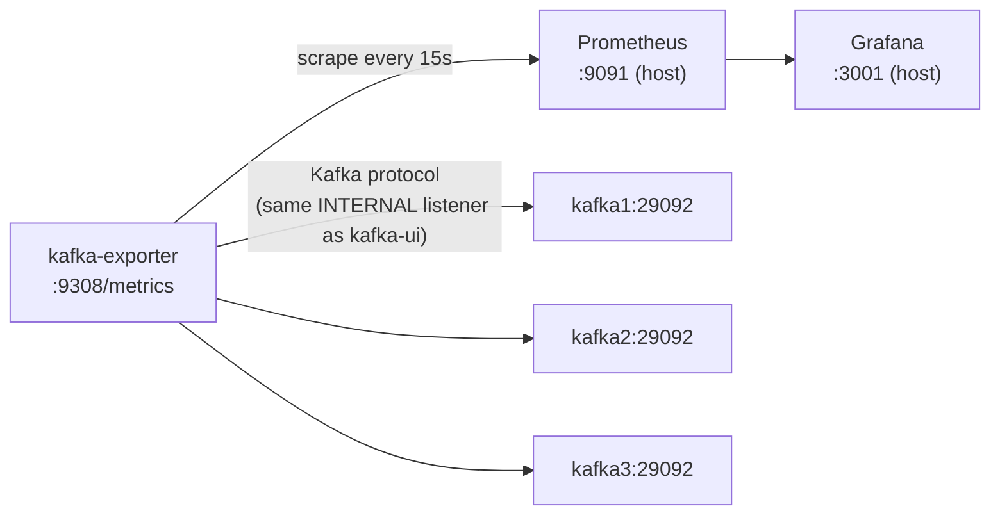

# Kafka Prometheus & Grafana Monitoring Design

**Date:** 2026-06-17
**Status:** Approved

## Overview

Add Prometheus and Grafana monitoring to the Kafka demo's 3-broker cluster, mirroring the structure of the existing RabbitMQ monitoring setup (`message-brokers/rabbitmq/docker/`, added in commit `8669965`): a metrics exporter, a Prometheus instance scraping it, and a Grafana instance with an auto-provisioned datasource and a pre-loaded dashboard.

## Why a sidecar exporter, not a JMX agent

RabbitMQ exposes Prometheus metrics natively via the `rabbitmq_prometheus` plugin — there was nothing else to stand up. Kafka has no built-in Prometheus endpoint; the two standard ways to get metrics out are:

1. **JMX Prometheus exporter Java agent**, attached to each broker JVM via `KAFKA_OPTS=-javaagent:...`. Exposes the full breadth of JVM/broker-internal metrics (request latency percentiles, network/IO thread idle %, controller state) but requires vendoring or downloading the agent JAR and modifying the three already-working `kafka1`/`kafka2`/`kafka3` service definitions.
2. **`kafka-exporter` sidecar** (`danielqsj/kafka-exporter`) — a separate container that talks to the brokers over the normal Kafka client protocol (the same way `kafka-ui` already does) and exposes topic/partition/consumer-group/replication metrics in Prometheus format. No JAR, no broker config changes.

This design uses **option 2**. It's the closer match to RabbitMQ's "flip on a metrics endpoint, nothing else changes" simplicity, and it doesn't touch the broker service definitions that already work and were reviewed for the replication-factor changes.

## Architecture



New services added to `message-brokers/kafka/docker/docker-compose.yml`:

| Service | Image | Purpose | Host port |
|---|---|---|---|
| `kafka-exporter` | `danielqsj/kafka-exporter:latest` | Polls `kafka1:29092,kafka2:29092,kafka3:29092` over the Kafka protocol; exposes `/metrics` | — (internal only, scraped by Prometheus over the `kafka_network`) |
| `prometheus` | `prom/prometheus:v2.53.0` | Scrapes `kafka-exporter:9308` every 15s | `9091` |
| `grafana` | `grafana/grafana:11.1.0` | Visualizes Prometheus data; admin/admin | `3001` |

### Port choice

RabbitMQ's stack already publishes Prometheus on `9090` and Grafana on `3000`. To let both demos run simultaneously without a port collision, Kafka's stack uses `9091` and `3001` instead.

### kafka-exporter configuration

```
--kafka.server=kafka1:29092
--kafka.server=kafka2:29092
--kafka.server=kafka3:29092
```

Connects via the existing `INTERNAL` listener (same addresses `kafka-ui` already uses), on the existing `kafka_network` bridge network. `depends_on: kafka1 (service_healthy)`.

## Grafana dashboard

A new "Kafka Demo Cluster" dashboard (`message-brokers/kafka/docker/grafana/dashboards/kafka.json`), matching RabbitMQ's dashboard in scope (6 panels) but tailored to Kafka concepts, including replication health (relevant after the recent replication-factor work on this cluster):

1. Messages in/sec per topic (`kafka_topic_partition_current_offset` rate, summed per topic)
2. Consumer group lag per group/topic (`kafka_consumergroup_lag`)
3. Under-replicated partitions (`kafka_topic_partition_under_replicated_partition`) — replication health
4. Broker count (`kafka_brokers`) — cluster up/down at a glance
5. Partition count per topic (`kafka_topic_partitions`)
6. Topic count (count of distinct topics reporting metrics)

## Files

```
message-brokers/kafka/docker/
├── docker-compose.yml                              (modified: + kafka-exporter, prometheus, grafana services)
├── prometheus/
│   └── prometheus.yml                              (new — scrape config, mirrors rabbitmq/docker/prometheus/prometheus.yml structure)
└── grafana/
    ├── provisioning/
    │   ├── datasources/prometheus.yml               (new — auto-provisioned Prometheus datasource, identical structure to RabbitMQ's)
    │   └── dashboards/provider.yml                   (new — identical structure to RabbitMQ's, label changed to "Kafka")
    └── dashboards/
        └── kafka.json                                (new — the 6-panel dashboard described above)
```

`message-brokers/kafka/README.md` gets a new short section documenting the Grafana (`http://localhost:3001`) and Prometheus (`http://localhost:9091`) URLs and default Grafana credentials (admin/admin), plus a one-line mention in the architecture section noting the monitoring stack exists. (RabbitMQ's README was never updated with the equivalent section when its monitoring stack was added — out of scope to retrofit that here, but Kafka's README will have it from the start.)

## Testing / verification

Since this is pure infrastructure (no Java code), verify by actually bringing the stack up:

1. `docker compose up -d` from `message-brokers/kafka/docker/` — confirm all services (including the three new ones) report healthy/running.
2. Hit `http://localhost:9091/targets` — confirm the `kafka-exporter` scrape target is `UP`.
3. Run the Kafka demo app and exercise a couple of endpoints (e.g. `/demo/simple`, `/demo/work`) to generate traffic.
4. Hit `http://localhost:3001`, log in with admin/admin, open the "Kafka Demo Cluster" dashboard, and confirm panels show non-empty data (message rate, partition counts, broker count = 3, under-replicated partitions = 0).
5. `docker compose down` to tear down cleanly.

## Scope limits

- No JMX agent / broker-internal JVM metrics (latency percentiles, thread pool idle %) — out of scope per the chosen approach; `kafka-exporter`'s topic/partition/consumer-group/replication metrics are sufficient for this demo's purpose.
- No retrofit of RabbitMQ's README to add its missing monitoring section — unrelated to this task.
- No changes to `kafka1`/`kafka2`/`kafka3` service definitions.
