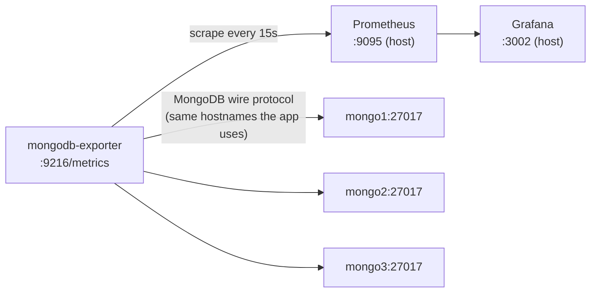

# MongoDB Cluster Observability Design

**Date:** 2026-06-18
**Status:** Approved

## Overview

Add Prometheus and Grafana monitoring to the MongoDB demo's 3-node replica set, mirroring the structure of the existing Kafka monitoring setup (`message-brokers/kafka/docker/`, added 2026-06-17): a metrics exporter, a Prometheus instance scraping it, and a Grafana instance with an auto-provisioned datasource and a pre-loaded dashboard.

## Why an exporter sidecar

MongoDB has no built-in Prometheus endpoint — same situation as Kafka. Unlike Kafka (which had a real choice between a JMX agent and a protocol-based exporter), MongoDB has one standard, actively-maintained option: **`percona/mongodb_exporter`**, a sidecar that connects to the replica set over the native MongoDB wire protocol (the same way the demo app and `mongo-express` already do) and exposes Prometheus-format metrics. No changes to the `mongo1`/`mongo2`/`mongo3` service definitions.

`mongo-express` (added when the cluster was first built) already covers this stack's "admin UI" role, so this design adds only the metrics pipeline — no new browsing UI.

## Architecture



New services added to `noSQL/mongodb/docker/docker-compose.yml`:

| Service | Image | Purpose | Host port |
|---|---|---|---|
| `mongodb-exporter` | `percona/mongodb_exporter:0.44` | Connects to the replica set via `mongo1:27017,mongo2:27017,mongo3:27017/?replicaSet=rs0`; exposes `/metrics` | — (internal only, scraped by Prometheus over `mongo_network`) |
| `prometheus` | `prom/prometheus:v2.53.0` | Scrapes `mongodb-exporter:9216` every 15s | `9095` |
| `grafana` | `grafana/grafana:11.1.0` | Visualizes Prometheus data; admin/admin | `3002` |

### Port choice

RabbitMQ's stack uses `9090`/`3000`; Kafka's uses `9091`/`3001`. MongoDB's stack uses `9095`/`3002` — chosen clear of every port already in use anywhere in the repo, including Kafka's broker ports `9092`-`9094`, so all monitoring stacks can run side by side without collisions.

### mongodb-exporter configuration

```
--mongodb.uri=mongodb://mongo1:27017,mongo2:27017,mongo3:27017/?replicaSet=rs0
--collect-all
```

Connects via the existing internal hostnames (same ones the app and `mongo-express` already use), on the existing `mongo_network` bridge network. `depends_on: mongo-init (service_completed_successfully)`.

## Grafana dashboard

A new "MongoDB Demo Cluster" dashboard (`noSQL/mongodb/docker/grafana/dashboards/mongodb.json`), matching the established 6-panel scope, tailored to MongoDB/replica-set concepts:

1. Replica set member state (primary/secondary health, one of this cluster's core stories)
2. Replication lag (oplog lag between primary and secondaries)
3. Op counters (insert/query/update/delete rate) — ties to the CRUD pattern
4. Active connections
5. WiredTiger cache / memory usage
6. Document counts for `products` and `orders` — ties to the demo's domain data growth as the transactions/CRUD patterns are exercised

Exact PromQL expressions are pinned down during implementation by inspecting the exporter's live `/metrics` output — `percona/mongodb_exporter`'s exact metric names have changed across versions, so this design fixes the image tag (`0.44`) for reproducibility rather than guessing metric names that may not match.

## Files

```
noSQL/mongodb/docker/
├── docker-compose.yml                              (modified: + mongodb-exporter, prometheus, grafana services)
├── prometheus/
│   └── prometheus.yml                              (new — scrape config, mirrors kafka's prometheus.yml structure)
└── grafana/
    ├── provisioning/
    │   ├── datasources/prometheus.yml               (new — auto-provisioned Prometheus datasource, identical structure to Kafka's)
    │   └── dashboards/provider.yml                   (new — identical structure to Kafka's, label changed to "MongoDB")
    └── dashboards/
        └── mongodb.json                              (new — the 6-panel dashboard described above)
```

`noSQL/mongodb/README.md` gets a new short section documenting the Grafana (`http://localhost:3002`) and Prometheus (`http://localhost:9095`) URLs and default Grafana credentials (admin/admin), plus a one-line mention in the architecture section noting the monitoring stack exists.

## Testing / verification

Pure infrastructure (no Java code) — verify by actually running the stack:

1. `docker compose up -d` from `noSQL/mongodb/docker/` — confirm all services (including the three new ones) report healthy/running, including the existing replica-set health check.
2. Hit `http://localhost:9095/api/v1/targets` — confirm the `mongodb-exporter` scrape target is `UP`.
3. Run the demo app and exercise a couple of endpoints (e.g. create a product, place an order) to generate real traffic and op-counter movement.
4. Hit `http://localhost:3002`, log in with admin/admin, open the "MongoDB Demo Cluster" dashboard, and confirm panels show non-empty data (replica set state = 3 members, op counters moving, document counts matching what was created).
5. `docker compose down` to tear down cleanly.

## Scope limits

- No new admin/browsing UI — `mongo-express` already covers that role for this stack.
- No changes to `mongo1`/`mongo2`/`mongo3` service definitions.
- No changes to the message broker demos' existing monitoring stacks (Kafka, RabbitMQ).
