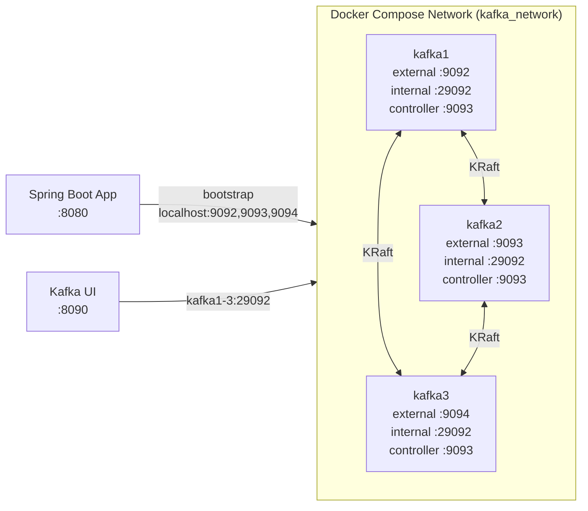
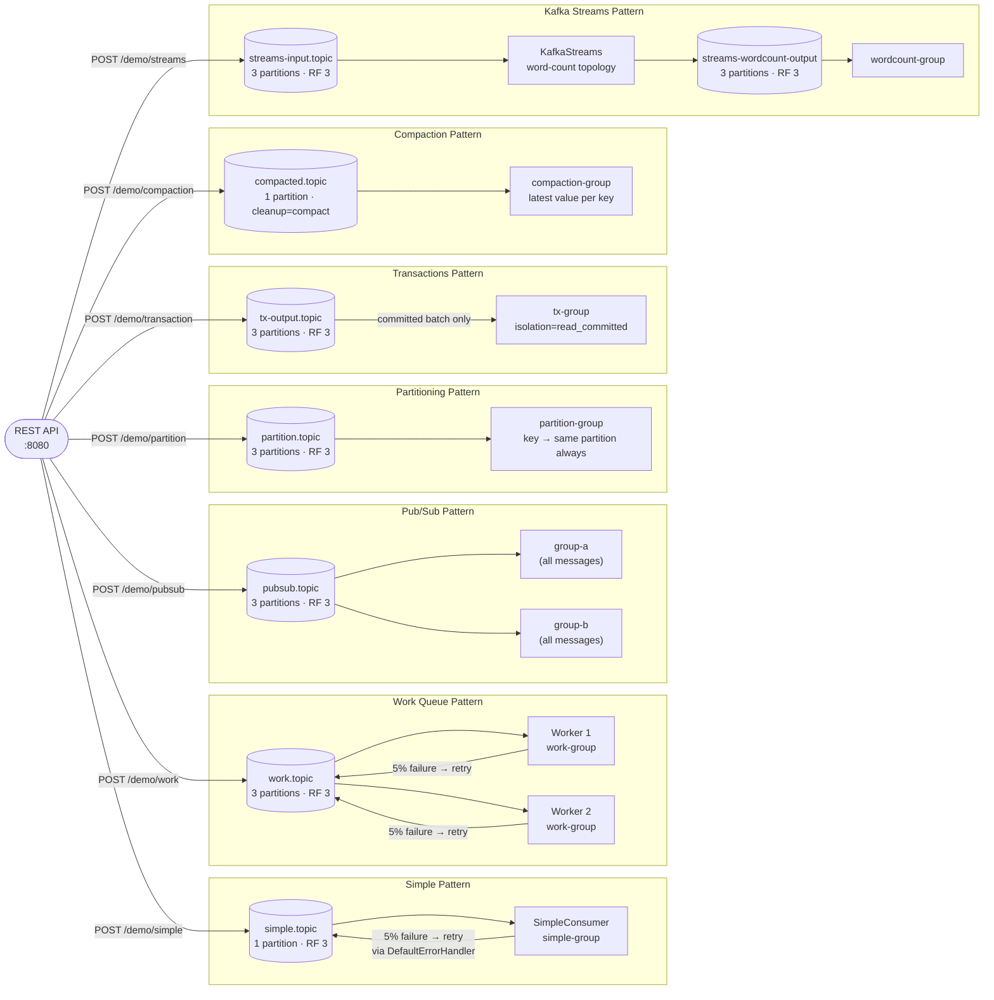

# Kafka Demo

A 3-broker KRaft Kafka cluster and a Spring Boot demo app demonstrating seven messaging patterns: simple, work queue, pub/sub, partitioning, transactions (exactly-once), log compaction, and Kafka Streams.

## Prerequisites

- Java 21
- Maven 3.9+
- Docker

All commands below assume your working directory is `message-brokers/kafka/`.

## Start the cluster

```bash
cd docker
docker compose up -d
```

Wait ~30 seconds for the cluster to form, then verify:

```bash
docker exec kafka1 kafka-broker-api-versions --bootstrap-server localhost:9092
```

Kafka UI: http://localhost:8090

## Run the app

```bash
cd spring-demo
mvn spring-boot:run
```

## Trigger endpoints

```bash
# Simple topic
curl -X POST "http://localhost:8080/demo/simple?message=hello"

# Work queue (dispatches 5 messages by default)
curl -X POST "http://localhost:8080/demo/work?message=task..&count=5"

# Pub/Sub — both consumer groups receive the message
curl -X POST "http://localhost:8080/demo/pubsub?message=broadcast"

# Partitioning — key determines the partition (info | warning | error)
curl -X POST "http://localhost:8080/demo/partition?key=error&message=boom"

# Transactions — sends a batch atomically (exactly-once)
curl -X POST "http://localhost:8080/demo/transaction?message=hello&count=3"

# Compaction — upserts a key/value pair; only the latest per key is retained
curl -X POST "http://localhost:8080/demo/compaction?key=user-1&value=Alice"

# Kafka Streams — sends text through the word-count topology
curl -X POST "http://localhost:8080/demo/streams?message=hello+world+hello"
```

## Swagger UI

http://localhost:8080/swagger-ui/index.html

## Run performance tests

Requires the cluster and app to be running. Start the app in a separate terminal if needed, then run:

```bash
cd spring-demo
mvn gatling:test
```

HTML report: `target/gatling/<timestamp>/index.html`

## Architecture

### Cluster topology

Three Kafka brokers run in KRaft combined mode (each node is both broker and controller). No ZooKeeper is required. The Spring Boot app connects to all three via their external listeners; Kafka UI connects via the internal Docker network.



### Messaging patterns and data flows



## Topic characteristics

| Topic | Partitions | Replication | Consumer group(s) | Special config |
|---|---|---|---|---|
| `simple.topic` | 1 | 3 | `simple-group` | — |
| `work.topic` | 3 | 3 | `work-group` | Two listeners share partitions |
| `pubsub.topic` | 3 | 3 | `group-a`, `group-b` | Each group receives all messages independently |
| `partition.topic` | 3 | 3 | `partition-group` | Keyed — same key always routed to the same partition |
| `tx-output.topic` | 3 | 3 | `tx-group` | Transactional producer; consumer uses `isolation.level=read_committed` |
| `compacted.topic` | 1 | 3 | `compaction-group` | `cleanup.policy=compact`, `segment.ms=5000`, `min.cleanable.dirty.ratio=0.01` |
| `streams-input.topic` | 3 | 3 | `kafka-demo-streams` | Input to Kafka Streams topology |
| `streams-wordcount-output` | 3 | 3 | `wordcount-group` | Output of word-count Streams topology |

**Failure simulation:** `SimpleConsumer` and `WorkQueueConsumer` call `FailureSimulator.maybeThrow()` (5% probability). The `DefaultErrorHandler` retries up to 2 times with a 500 ms back-off before the message is sent to the dead-letter topic (if configured) or dropped.

### KRaft mode notes

- **No ZooKeeper** — metadata is managed by the brokers themselves via the Raft consensus protocol. Each broker holds both `broker` and `controller` roles.
- **Controller quorum** — the three nodes form a quorum (`1@kafka1:9093,2@kafka2:9093,3@kafka3:9093`). A majority (2 of 3) is required to elect a leader and commit metadata changes.
- **Replication** — all topics use `replication-factor=3`. Writes are acknowledged by the ISR (in-sync replica set); a partition remains available as long as at least one ISR member is up.
- **Exactly-once** — the transactional producer uses `transaction-id-prefix=tx-demo-`. Combined with `isolation.level=read_committed` on the consumer, uncommitted messages are never delivered to the application.
- **Log compaction** — Kafka retains only the latest record per key for `compacted.topic`. Old segments are eligible for compaction after `segment.ms=5000` with a dirty ratio of 1%.

## Cluster management

### Verify cluster health

```bash
# Broker API versions (confirms broker is reachable)
docker exec kafka1 kafka-broker-api-versions --bootstrap-server localhost:9092

# KRaft quorum status — shows leader, voters, and log end offsets
docker exec kafka1 kafka-metadata-quorum --bootstrap-server localhost:9092 describe --status

# List all brokers
docker exec kafka1 kafka-broker-api-versions --bootstrap-server localhost:9092 2>&1 | grep "^kafka"
```

### Inspect topics

```bash
# List all topics
docker exec kafka1 kafka-topics --bootstrap-server localhost:9092 --list

# Describe a topic — partitions, leaders, replicas, ISR
docker exec kafka1 kafka-topics --bootstrap-server localhost:9092 \
  --describe --topic work.topic

# Consume from the beginning (useful for compacted topic)
docker exec kafka1 kafka-console-consumer --bootstrap-server localhost:9092 \
  --topic compacted.topic --from-beginning --property print.key=true \
  --property key.separator=": " --max-messages 20
```

### Inspect consumer groups

```bash
# List all consumer groups
docker exec kafka1 kafka-consumer-groups --bootstrap-server localhost:9092 --list

# Describe a group — current offset, end offset, and lag per partition
docker exec kafka1 kafka-consumer-groups --bootstrap-server localhost:9092 \
  --describe --group work-group

# Reset offsets to beginning (re-consume all messages)
docker exec kafka1 kafka-consumer-groups --bootstrap-server localhost:9092 \
  --group work-group --topic work.topic --reset-offsets --to-earliest --execute
```

### Produce a test message

```bash
docker exec -it kafka1 kafka-console-producer --bootstrap-server localhost:9092 \
  --topic simple.topic
# Type a message and press Enter; Ctrl+C to exit
```

### Kafka UI shortcuts

| URL | Purpose |
|---|---|
| http://localhost:8090 | Cluster overview — broker count, topic count, throughput |
| http://localhost:8090/ui/clusters/local/topics | Per-topic partition list, message counts, configs |
| http://localhost:8090/ui/clusters/local/consumer-groups | Consumer group lag per partition |

## Stop the cluster

```bash
cd docker
docker compose down
```
