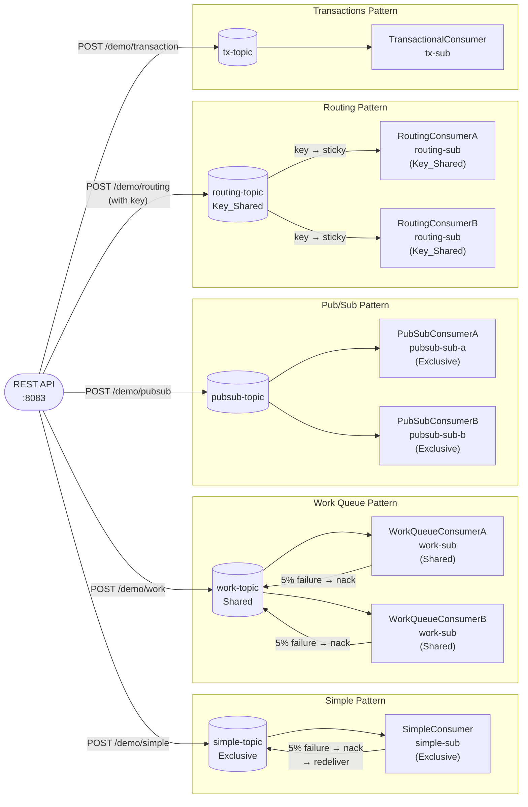

# Apache Pulsar Demo

A Pulsar standalone broker and a Spring Boot demo app demonstrating five messaging patterns: simple (Exclusive subscription), work queue (Shared subscription), pub/sub (independent subscriptions), routing (Key_Shared subscription), and transactions.

## Prerequisites

- Java 21
- Maven 3.9+
- Docker

All commands below assume your working directory is `message-brokers/pulsar/`.

## Start the broker

```bash
cd docker
docker compose up -d
```

Wait ~30 seconds for the broker to initialise, then verify:

```bash
docker exec pulsar bin/pulsar-admin brokers healthcheck
```

Expected output: `ok`

Admin UI (REST): http://localhost:8085/admin/v2/clusters

## Run the app

```bash
cd spring-demo
mvn spring-boot:run
```

## Trigger endpoints

```bash
# Simple topic — Exclusive subscription
curl -X POST "http://localhost:8083/demo/simple?message=hello"

# Work queue — Shared subscription, A and B compete for each message
curl -X POST "http://localhost:8083/demo/work?message=task..&count=5"

# Pub/Sub — two independent Exclusive subscriptions, both receive every message
curl -X POST "http://localhost:8083/demo/pubsub?message=broadcast"

# Routing — Key_Shared subscription, same key always reaches the same consumer
curl -X POST "http://localhost:8083/demo/routing?key=error&message=boom"

# Transactions — sends a batch atomically (requires transactionCoordinatorEnabled on broker)
curl -X POST "http://localhost:8083/demo/transaction?message=hello&count=3"
```

## Swagger UI

http://localhost:8083/swagger-ui/index.html

## Run performance tests

Requires the broker and app to be running. Start the app in a separate terminal if needed, then run:

```bash
cd spring-demo
mvn gatling:test
```

HTML report: `target/gatling/<timestamp>/index.html`

## Architecture

### Broker topology

Pulsar runs in standalone mode — a single JVM process that includes the broker, BookKeeper bookie, and ZooKeeper. All state is local. This is the recommended setup for development.

```
┌──────────────────────────────────────┐
│  Docker container: pulsar            │
│                                      │
│  ┌──────────────┐  ┌──────────────┐  │
│  │   Broker     │  │  BookKeeper  │  │
│  │   :6650      │  │  (embedded)  │  │
│  └──────────────┘  └──────────────┘  │
│  ┌──────────────┐                    │
│  │   ZooKeeper  │                    │
│  │  (embedded)  │                    │
│  └──────────────┘                    │
│                                      │
│  Binary  :6650  (host)               │
│  Admin   :8085  (host → 8080)        │
└──────────────────────────────────────┘

Spring Boot App :8083
  └─ pulsar://localhost:6650
```

### Messaging patterns and data flows



## Topic characteristics

| Topic | Pulsar name | Pattern | Subscription type | Notes |
|---|---|---|---|---|
| `simple-topic` | `persistent://public/default/simple-topic` | Simple | Exclusive | One active consumer; 5% failure → nack → redeliver |
| `work-topic` | `persistent://public/default/work-topic` | Work Queue | Shared | A and B share one subscription; each message delivered to exactly one |
| `pubsub-topic` | `persistent://public/default/pubsub-topic` | Pub/Sub | Exclusive × 2 | Two independent subscriptions; each receives every message |
| `routing-topic` | `persistent://public/default/routing-topic` | Routing | Key_Shared | Messages with the same key always go to the same consumer instance |
| `tx-topic` | `persistent://public/default/tx-topic` | Transactions | Exclusive | Atomic batch publish; full transactions require `transactionCoordinatorEnabled=true` |

**Failure simulation:** `SimpleConsumer` and `WorkQueueConsumerA/B` call `FailureSimulator.maybeThrow()` (5% probability). A thrown exception negatively acknowledges the message, which Pulsar redelivers after the acknowledgement timeout.

## Pulsar subscription types

Pulsar's subscription model is its most distinctive feature — the same topic can be consumed simultaneously by multiple subscriptions of different types, each maintaining its own cursor.

| Type | Behaviour | Used in |
|---|---|---|
| **Exclusive** | Only one consumer per subscription; others fail to attach | `simple-sub`, `pubsub-sub-a`, `pubsub-sub-b` |
| **Shared** | Messages round-robined across all consumers in the subscription | `work-sub` |
| **Failover** | One active consumer at a time; next in line takes over on failure | — |
| **Key_Shared** | Messages with the same key always go to the same consumer; ordering preserved per key | `routing-sub` |

In the **pub/sub** pattern, `pubsub-sub-a` and `pubsub-sub-b` are completely independent subscriptions on the same topic. Each maintains its own cursor so every subscriber sees every message — unlike Kafka consumer groups, where each message is consumed by only one group member.

## Admin commands

### Verify broker

```bash
# Health check
docker exec pulsar bin/pulsar-admin brokers healthcheck

# List clusters
docker exec pulsar bin/pulsar-admin clusters list

# Broker stats
docker exec pulsar bin/pulsar-admin brokers get-all-dynamic-config
```

### Inspect topics

```bash
# List all topics in the default namespace
docker exec pulsar bin/pulsar-admin topics list public/default

# Topic stats — producers, subscriptions, message rates, storage
docker exec pulsar bin/pulsar-admin topics stats \
  persistent://public/default/work-topic

# Inspect subscriptions and their cursors
docker exec pulsar bin/pulsar-admin topics subscriptions \
  persistent://public/default/work-topic
```

### Inspect subscriptions

```bash
# Stats for a specific subscription — cursor position, backlog, consumers
docker exec pulsar bin/pulsar-admin topics stats-internal \
  persistent://public/default/work-topic

# Reset cursor to beginning (re-consume all messages)
docker exec pulsar bin/pulsar-admin topics reset-cursor \
  persistent://public/default/work-topic \
  --subscription work-sub --time 99999m
```

### Produce and consume manually

```bash
# Produce a message via CLI
docker exec pulsar bin/pulsar-client produce \
  persistent://public/default/simple-topic \
  --messages "hello from CLI"

# Consume messages (Exclusive subscription)
docker exec pulsar bin/pulsar-client consume \
  persistent://public/default/simple-topic \
  --subscription-name cli-sub --num-messages 10
```

## Stop the broker

```bash
cd docker
docker compose down
```
