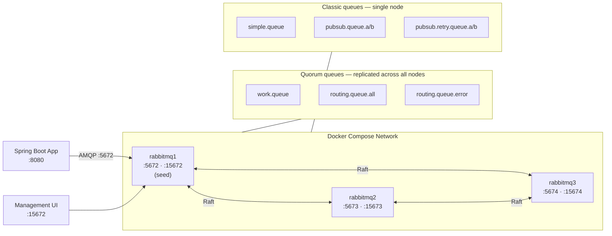
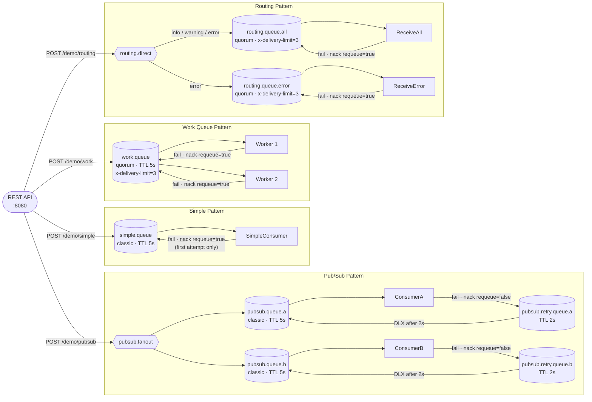

# RabbitMQ Demo

A 3-node RabbitMQ Docker cluster and a Spring Boot demo app demonstrating four messaging patterns: simple queue, work queues, pub/sub (fanout exchange), and routing (direct exchange).

## Prerequisites

- Java 21
- Maven 3.9+
- Docker

All commands below assume your working directory is `message-brokers/rabbitmq/`.

## Start the cluster

```bash
cd docker
docker compose up -d
```

Wait ~30 seconds for the cluster to form, then verify:

```bash
docker exec rabbitmq1 rabbitmqctl cluster_status
```

Management UI: http://localhost:15672 (guest / guest)

## Run the app

```bash
cd spring-demo
mvn spring-boot:run
```

## Trigger endpoints

```bash
# Simple queue
curl -X POST "http://localhost:8080/demo/simple?message=hello"

# Work queue (dispatches 5 messages by default)
curl -X POST "http://localhost:8080/demo/work?message=task..&count=5"

# Pub/Sub — broadcast to all fanout subscribers
curl -X POST "http://localhost:8080/demo/pubsub?message=broadcast"

# Routing — direct exchange with routing key (info | warning | error)
curl -X POST "http://localhost:8080/demo/routing?key=error&message=boom"
```

## Swagger UI

http://localhost:8080/swagger-ui/index.html

## Run performance tests

Requires the cluster and app to be running (see above). Start the app in a separate terminal if needed, then run:

```bash
cd spring-demo
mvn gatling:test
```

HTML report: `target/gatling/<timestamp>/index.html`

## Architecture

### Cluster topology

Three RabbitMQ nodes form a cluster via Docker Compose. The Spring Boot app connects to `rabbitmq1`; quorum queues replicate their data across all three nodes using Raft consensus.



### Messaging patterns and retry flows



## Queue characteristics

Each queue is declared durable (survives broker restart) with a 5-second message TTL. Consumers use manual acknowledgment — messages are only removed from the queue after an explicit `basicAck`.

| Queue | Type | TTL | Retry strategy | Max attempts |
|---|---|---|---|---|
| `simple.queue` | Classic | 5 s | Redelivered flag — requeue on first failure, drop on redelivery | 2 |
| `work.queue` | Quorum | 5 s | `x-delivery-limit=3` — native quorum tracking, auto-drop after limit | 3 |
| `pubsub.queue.a` | Classic | 5 s | DLX retry chain — dead-letter to `pubsub.retry.queue.a` (2 s delay), back to main | 3 retries |
| `pubsub.queue.b` | Classic | 5 s | DLX retry chain — dead-letter to `pubsub.retry.queue.b` (2 s delay), back to main | 3 retries |
| `routing.queue.all` | Quorum | 5 s | `x-delivery-limit=3` | 3 |
| `routing.queue.error` | Quorum | 5 s | `x-delivery-limit=3` | 3 |

**Retry queues** (pub/sub only — not consumed directly, used as delay buffers):

| Queue | TTL | Routes back to |
|---|---|---|
| `pubsub.retry.queue.a` | 2 s | `pubsub.queue.a` via default exchange |
| `pubsub.retry.queue.b` | 2 s | `pubsub.queue.b` via default exchange |

**Failure simulation:** every consumer calls `FailureSimulator.maybeThrow()` which throws a `RuntimeException` with 5% probability, triggering the pattern-specific retry path.

### Queue type notes

- **Classic** queues store data on a single node. Data is lost if that node goes down before replication.
- **Quorum** queues are replicated across the cluster majority using Raft. They support `x-delivery-limit` natively (tracks per-message delivery count without application logic).
- **Dead Letter Exchange (DLX):** when a message is nacked with `requeue=false` or expires via TTL, RabbitMQ routes it to the configured dead-letter exchange. The pub/sub pattern uses the default exchange (`""`) as DLX so each queue dead-letters independently, without re-broadcasting through the fanout exchange.

## Cluster management

The cluster runs as three Docker nodes (`rabbitmq1`, `rabbitmq2`, `rabbitmq3`) defined in `docker/docker-compose.yml`. `rabbitmq1` is the seed node; the others join it on startup.

### Verify cluster health

```bash
# Cluster membership and quorum status
docker exec rabbitmq1 rabbitmqctl cluster_status

# Node-level health check
docker exec rabbitmq1 rabbitmq-diagnostics check_running
docker exec rabbitmq1 rabbitmq-diagnostics check_local_alarms

# List all queues with message counts across the cluster
docker exec rabbitmq1 rabbitmqctl list_queues name messages consumers state type
```

### Inspect a specific queue

```bash
# Message count, consumers, arguments (TTL, DLX, delivery limit)
docker exec rabbitmq1 rabbitmqctl list_queues name messages consumers arguments \
  --vhost /

# Quorum queue members and leader
docker exec rabbitmq1 rabbitmqctl list_queues name type leader members \
  --vhost /
```

### Add / remove a node

```bash
# Scale up: bring up a fourth node (add to docker-compose.yml first)
docker compose up -d rabbitmq4

# Remove a node gracefully
docker exec rabbitmq3 rabbitmqctl stop_app
docker exec rabbitmq1 rabbitmqctl forget_cluster_node rabbit@rabbitmq3
docker compose stop rabbitmq3
```

### Reset a node

```bash
# Stop the app on the node, wipe its data, re-join the cluster
docker exec rabbitmq2 rabbitmqctl stop_app
docker exec rabbitmq2 rabbitmqctl reset
docker exec rabbitmq2 rabbitmqctl join_cluster rabbit@rabbitmq1
docker exec rabbitmq2 rabbitmqctl start_app
```

### Force-boot after total cluster outage

If all nodes go down simultaneously, the cluster will refuse to start (each node waits for the others). Boot the last node to go down first:

```bash
docker exec rabbitmq1 rabbitmqctl force_boot
docker compose restart
```

### Management UI shortcuts

| URL | Purpose |
|---|---|
| http://localhost:15672 | Overview, queue list, message rates |
| http://localhost:15672/#/queues | Per-queue depth, consumers, DLX config |
| http://localhost:15672/#/nodes | Node memory, disk alarms, uptime |

## Stop the cluster

```bash
cd docker
docker compose down
```
