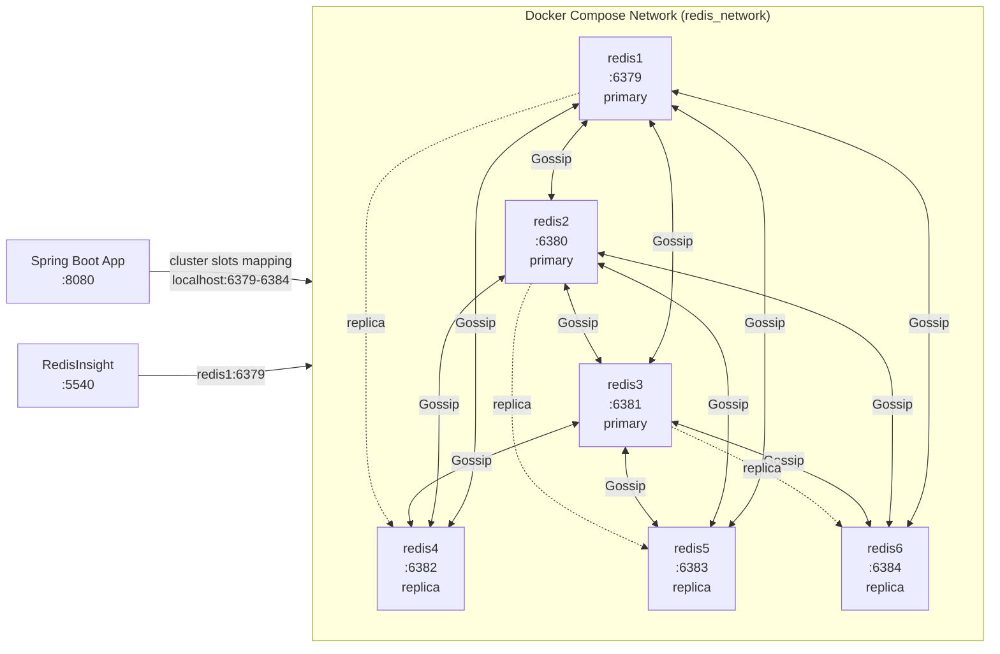
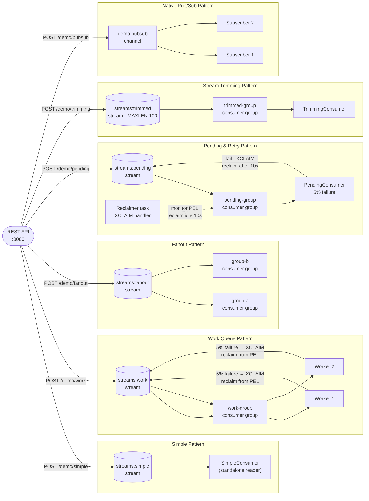

# Redis Streams Demo

A 6-node Redis Cluster and a Spring Boot demo app demonstrating six messaging patterns: simple streams, work queues, fanout, pending & retry, stream trimming, and native pub/sub.

## Prerequisites

- Java 21
- Maven 3.9+
- Docker

All commands below assume your working directory is `message-brokers/redis/`.

## Start the cluster

```bash
cd docker
docker compose up -d
```

Wait ~30 seconds for the cluster to initialize, then verify:

```bash
docker exec redis1 redis-cli cluster info
```

RedisInsight: http://localhost:5540

## Run the app

```bash
cd spring-demo
mvn spring-boot:run
```

## Trigger endpoints

```bash
# Simple stream — XADD to {streams}:simple
curl -X POST "http://localhost:8080/demo/simple?message=hello"

# Work queue — XADD to {streams}:work (work-group, default 1 message)
curl -X POST "http://localhost:8080/demo/work?message=task&count=5"

# Fanout — XADD to {streams}:fanout (group-a and group-b)
curl -X POST "http://localhost:8080/demo/fanout?message=broadcast"

# Pending & retry — XADD to {streams}:pending (5% failure, XCLAIM reclaimer)
curl -X POST "http://localhost:8080/demo/pending?message=hello&count=3"

# Stream trimming — XADD with MAXLEN 100
curl -X POST "http://localhost:8080/demo/trimming?message=hello"

# Native Pub/Sub — PUBLISH to demo:pubsub
curl -X POST "http://localhost:8080/demo/pubsub?message=broadcast"
```

## Swagger UI

http://localhost:8080/swagger-ui/index.html

## Run performance tests

Requires the cluster and app to be running (see above). Start the app in a separate terminal if needed, then run:

```bash
cd spring-demo
mvn gatling:test
```

HTML report: `target/gatling/<timestamp>/index.html`

## Architecture

### Cluster topology

Six Redis nodes form a cluster with 3 primaries and 3 replicas. The cluster-init container initializes the topology during startup. The Spring Boot app connects to any node and uses cluster slots mapping for reads and writes. RedisInsight connects via the Docker network.



### Messaging patterns and data flows



## Stream and channel characteristics

Each stream entry is added with XADD and assigned a unique ID (`<timestamp>-<sequence>`). Consumer groups track the last delivered ID per consumer, allowing independent replay.

| Stream/Channel | Type | Consumer Group(s) | Acknowledgment | Special config |
|---|---|---|---|---|
| `{streams}:simple` | Stream | none (standalone) | Auto (reader only) | — |
| `{streams}:work` | Stream | `work-group` | Manual XACK | Two workers share queue |
| `{streams}:fanout` | Stream | `group-a`, `group-b` | Manual XACK | Both groups receive all messages independently |
| `{streams}:pending` | Stream | `pending-group` | Manual XACK + XCLAIM | 5% failure simulated; reclaimer monitors PEL |
| `{streams}:trimmed` | Stream | `trimmed-group` | Manual XACK | MAXLEN 100 — older entries deleted automatically |
| `demo:pubsub` | Pub/Sub | n/a | Fire-and-forget | Native Pub/Sub (not Streams) — no persistence |

**Failure simulation:** `SimpleConsumer`, `WorkQueueConsumer`, and `PendingConsumer` call `FailureSimulator.maybeThrow()` (5% probability). Failures trigger the pattern-specific retry mechanism:
- **Simple & Work Queue:** consumed messages are not acknowledged; the consumer framework retries from the Pending Entry List (PEL).
- **Pending & Retry:** the `Reclaimer` task uses `XCLAIM` to reclaim unacknowledged messages idle for 10 seconds, returning them to the queue for retry.
- **Fanout & Trimming:** normal retry via PEL; trimming automatically enforces max 100 entries per stream.

### Redis Cluster notes

- **6 nodes:** `redis1–redis6` (ports 6379–6384), forming 3 primaries + 3 replicas.
- **Cluster slots:** 16384 slots divided among the three primaries; replicas mirror their primary's data.
- **Gossip protocol:** nodes exchange cluster state every 10 seconds to detect node additions/removals and failover.
- **Appendonly:** all nodes use `appendonly yes` for persistence across restarts.
- **Streams:** distributed across the cluster using consistent hashing on the key.
- **Consumer groups:** metadata is stored on the shard holding the stream key; all consumers must be able to reach that shard.

## Cluster management

### Verify cluster health

```bash
# Cluster info — node count, state, slots assigned
docker exec redis1 redis-cli cluster info

# List cluster nodes — roles, IDs, replication offset
docker exec redis1 redis-cli cluster nodes

# Check if all slots are assigned
docker exec redis1 redis-cli cluster slots
```

### Inspect streams

```bash
# Stream length
docker exec redis1 redis-cli XLEN {streams}:simple

# Last N entries (newest first)
docker exec redis1 redis-cli XREVRANGE {streams}:work 0 -5

# Consumer group info — consumers in the group
docker exec redis1 redis-cli XINFO GROUPS {streams}:work

# Pending entries in a consumer group — who hasn't acknowledged
docker exec redis1 redis-cli XPENDING {streams}:work pending-group
```

### Reset streams

```bash
# Delete a stream (all entries and consumer group metadata)
docker exec redis1 redis-cli DEL {streams}:simple

# Clear consumer group (without deleting the stream)
docker exec redis1 redis-cli XGROUP DESTROY {streams}:work work-group
```

### Reclaim pending entries manually

```bash
# Show all pending entries in a consumer group
docker exec redis1 redis-cli XPENDING {streams}:pending pending-group 0 + 100

# Manually reclaim entries idle for 10+ seconds to a specific consumer
docker exec redis1 redis-cli XCLAIM {streams}:pending pending-group reclaimer 10000 <id1> <id2>
```

### Add or remove a node (cluster scaling)

```bash
# Add a new node (update docker-compose.yml, bring it up, then add it to the cluster)
docker compose up -d redis7
docker exec redis7 redis-cli CLUSTER MEET redis1 6379

# Remove a node gracefully (move its slots to other nodes, then shut it down)
docker exec redis1 redis-cli CLUSTER REPLICATE <primary-node-id>  # if redis7 is a replica
docker exec redis1 redis-cli CLUSTER DELSLOTS <slot-range>
docker compose stop redis7
```

### Force failover

```bash
# If a primary is down, promote its replica
docker exec redis4 redis-cli CLUSTER FAILOVER FORCE

# Monitor failover progress
docker exec redis1 redis-cli CLUSTER INFO
```

## RedisInsight shortcuts

| URL | Purpose |
|---|---|
| http://localhost:5540 | RedisInsight home — add cluster database at `redis1:6379` |
| http://localhost:5540/database | Cluster database browser — keys, streams, pub/sub channels |
| http://localhost:5540/browser | Key browser — search keys by pattern, view types (string, stream, etc.) |

## Stop the cluster

```bash
cd docker
docker compose down
```
