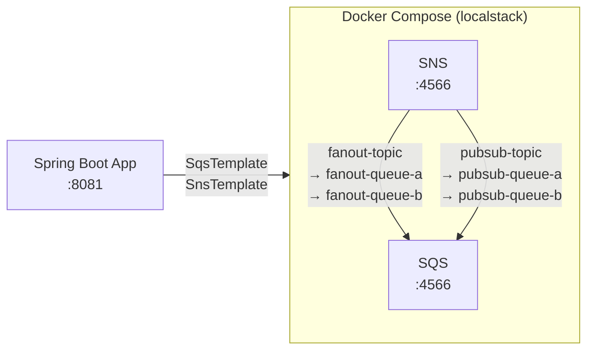
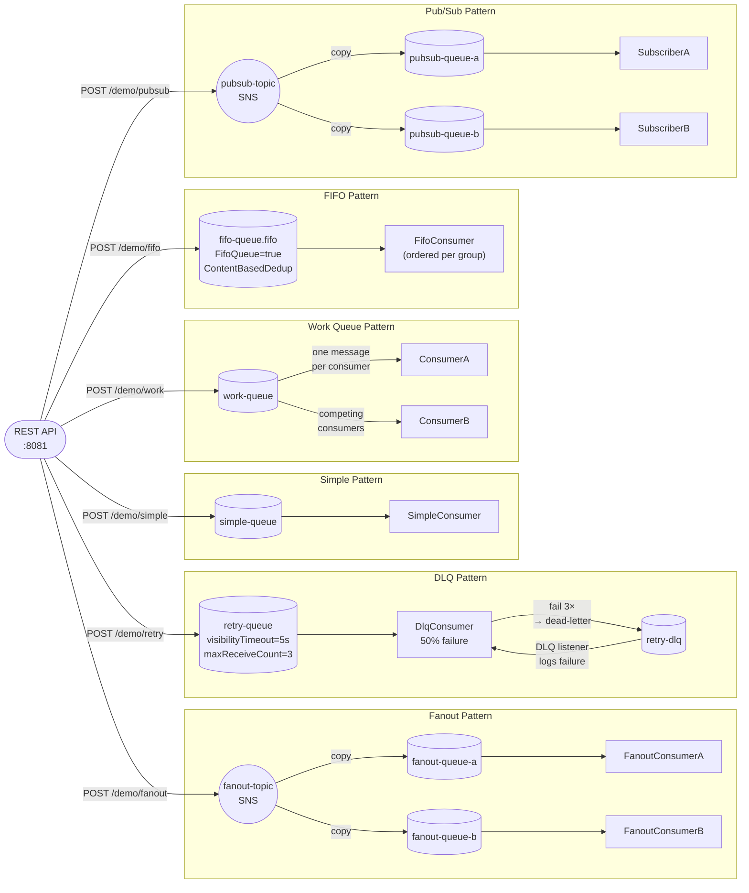

# Amazon SQS Demo

A LocalStack-based Amazon SQS + SNS environment and a Spring Boot demo app demonstrating six messaging patterns: simple queue, work queue, fanout, dead-letter queue, FIFO ordering, and pub/sub.

## Prerequisites

- Java 21
- Maven 3.9+
- Docker

All commands below assume your working directory is `message-brokers/sqs/`.

## Start LocalStack

```bash
cd docker
docker compose up -d
```

LocalStack runs SQS and SNS on port 4566. The `init-queues.sh` script runs automatically on startup and creates all queues, topics, and subscriptions. Wait ~10 seconds, then verify:

```bash
docker exec localstack awslocal sqs list-queues
```

## Run the app

```bash
cd spring-demo
mvn spring-boot:run
```

## Trigger endpoints

```bash
# Simple queue — send to simple-queue, single consumer receives it
curl -X POST "http://localhost:8081/demo/simple?message=hello"

# Work queue — competing consumers A and B share work-queue
curl -X POST "http://localhost:8081/demo/work?message=task&count=5"

# Fanout — SNS publishes to fanout-queue-a AND fanout-queue-b
curl -X POST "http://localhost:8081/demo/fanout?message=broadcast"

# DLQ — retry-queue consumer fails ~50%, message goes to retry-dlq after 3 attempts
curl -X POST "http://localhost:8081/demo/retry?message=risky&count=3"

# FIFO — ordered delivery per message group
curl -X POST "http://localhost:8081/demo/fifo?message=ordered&groupId=demo-group"

# Pub/Sub — SNS publishes to pubsub-queue-a AND pubsub-queue-b
curl -X POST "http://localhost:8081/demo/pubsub?message=event"
```

## Swagger UI

http://localhost:8081/swagger-ui/index.html

## Run performance tests

Requires LocalStack and the app to be running. Start the app in a separate terminal if needed, then:

```bash
cd spring-demo
mvn gatling:test
```

HTML report: `target/gatling/<timestamp>/index.html`

## Architecture

### Infrastructure topology



### Messaging patterns and data flows



## Queue and topic characteristics

| Resource | Type | Pattern | Key config |
|---|---|---|---|
| `simple-queue` | SQS Standard | Simple | — |
| `work-queue` | SQS Standard | Work Queue | Two `@SqsListener` beans compete for messages |
| `fanout-topic` | SNS Topic | Fanout | RawMessageDelivery=true |
| `fanout-queue-a/b` | SQS Standard | Fanout | Subscribed to `fanout-topic` |
| `retry-queue` | SQS Standard | DLQ | VisibilityTimeout=5s, maxReceiveCount=3 |
| `retry-dlq` | SQS Standard | DLQ | Receives messages after 3 failed attempts |
| `fifo-queue.fifo` | SQS FIFO | FIFO | FifoQueue=true, ContentBasedDeduplication=true |
| `pubsub-topic` | SNS Topic | Pub/Sub | RawMessageDelivery=true |
| `pubsub-queue-a/b` | SQS Standard | Pub/Sub | Subscribed to `pubsub-topic` |

**Failure simulation:** `DlqConsumer` calls `FailureSimulator.shouldFail()` (50% probability). On failure the listener throws a `RuntimeException`, which prevents acknowledgement. SQS makes the message visible again after `VisibilityTimeout` (5 s). After `maxReceiveCount=3` failed attempts SQS automatically moves the message to `retry-dlq`.

**Work queue vs fanout:**
- **Work queue** — each message is delivered to exactly one consumer (A or B, whichever polls first). Used for distributing load.
- **Fanout / Pub/Sub** — each message is delivered to all subscribers via SNS fan-out. Used for broadcasting events.

## Inspect queues

```bash
# List all queues
docker exec localstack awslocal sqs list-queues

# Approximate message counts
docker exec localstack awslocal sqs get-queue-attributes \
  --queue-url http://localhost:4566/000000000000/simple-queue \
  --attribute-names ApproximateNumberOfMessages ApproximateNumberOfMessagesNotVisible

# Check DLQ depth
docker exec localstack awslocal sqs get-queue-attributes \
  --queue-url http://localhost:4566/000000000000/retry-dlq \
  --attribute-names ApproximateNumberOfMessages

# Peek at a message without consuming it
docker exec localstack awslocal sqs receive-message \
  --queue-url http://localhost:4566/000000000000/retry-dlq \
  --visibility-timeout 0
```

## Inspect topics and subscriptions

```bash
# List SNS topics
docker exec localstack awslocal sns list-topics

# List subscriptions for a topic
docker exec localstack awslocal sns list-subscriptions-by-topic \
  --topic-arn arn:aws:sns:us-east-1:000000000000:fanout-topic
```

## Reset queues

```bash
# Purge all messages from a queue
docker exec localstack awslocal sqs purge-queue \
  --queue-url http://localhost:4566/000000000000/simple-queue
```

## Stop LocalStack

```bash
cd docker
docker compose down
```
