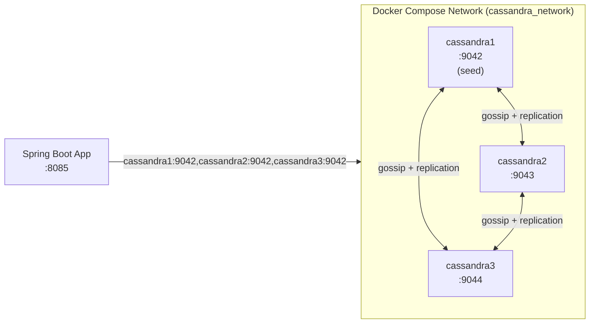
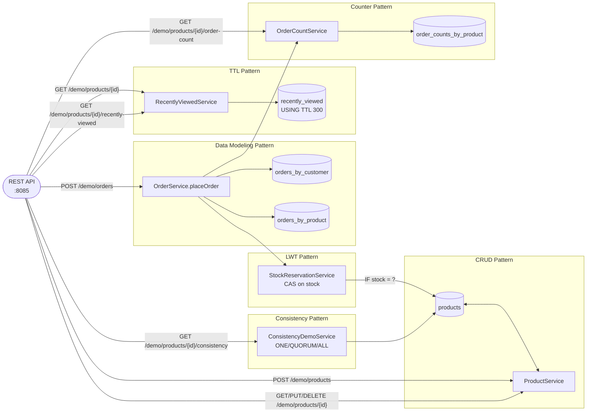

# Cassandra Demo

A 3-node Cassandra ring and a Spring Boot demo app demonstrating six wide-column NoSQL patterns: CRUD, query-first data modeling (denormalized tables), lightweight transactions (compare-and-swap), tunable consistency levels, TTL (expiring rows), and counters, around a product-catalog/orders domain.

## Prerequisites

- Java 21
- Maven 3.9+
- Docker
- `cassandra1`, `cassandra2`, `cassandra3` resolvable from the host machine (see below)

All commands below assume your working directory is `noSQL/cassandra/`.

### One-time host setup

The Spring Boot app (running on the host, not in Docker) connects to the ring using the containers' hostnames. Add these lines to `/etc/hosts` once:

```
127.0.0.1 cassandra1
127.0.0.1 cassandra2
127.0.0.1 cassandra3
```

```bash
echo "127.0.0.1 cassandra1" | sudo tee -a /etc/hosts && echo "127.0.0.1 cassandra2" | sudo tee -a /etc/hosts && echo "127.0.0.1 cassandra3" | sudo tee -a /etc/hosts
```

## Start the cluster

```bash
cd docker
docker compose up -d
```

Wait 60-90 seconds for the ring to form, then verify:

```bash
docker exec cassandra1 nodetool status
```

Expected: three `UN` (Up/Normal) rows.

Grafana: http://localhost:3003 (admin/admin)
Prometheus: http://localhost:9096

## Run the app

```bash
cd spring-demo
mvn spring-boot:run
```

## Trigger endpoints

```bash
# Create a product
curl -X POST "http://localhost:8085/demo/products" \
  -H "Content-Type: application/json" \
  -d '{"name":"Widget","price":9.99,"stock":100}'

# Read a product (replace <id> with the id returned above) — also records a TTL'd "recently viewed" row
curl "http://localhost:8085/demo/products/<id>"

# Update a product
curl -X PUT "http://localhost:8085/demo/products/<id>" \
  -H "Content-Type: application/json" \
  -d '{"name":"Widget v2","price":12.99,"stock":50}'

# Place an order — LWT-decrements stock, writes to both orders_by_customer and orders_by_product, increments the counter
curl -X POST "http://localhost:8085/demo/orders" \
  -H "Content-Type: application/json" \
  -d '{"customerId":"cust-1","productId":"<id>","quantity":3}'

# Orders for a customer (orders_by_customer table)
curl "http://localhost:8085/demo/orders/by-customer/cust-1"

# Orders for a product (orders_by_product table)
curl "http://localhost:8085/demo/orders/by-product/<id>"

# Read at a tunable consistency level (ONE, QUORUM, or ALL)
curl "http://localhost:8085/demo/products/<id>/consistency?level=ONE"
curl "http://localhost:8085/demo/products/<id>/consistency?level=QUORUM"

# List still-live recently-viewed rows (5-minute TTL)
curl "http://localhost:8085/demo/products/<id>/recently-viewed"

# Current order count for a product (counter table)
curl "http://localhost:8085/demo/products/<id>/order-count"

# Delete a product
curl -X DELETE "http://localhost:8085/demo/products/<id>"
```

## Swagger UI

http://localhost:8085/swagger-ui/index.html

## Run performance tests

Requires the cluster and app to be running. Start the app in a separate terminal if needed, then run:

```bash
cd spring-demo
mvn gatling:test
```

HTML report: `target/gatling/<timestamp>/index.html`

## Architecture

### Cluster topology

Three Cassandra nodes form one ring in datacenter `datacenter1`. The Spring Boot app connects via all three contact points; `nodetool`/`cqlsh` are used via `docker exec` for administration (no maintained web UI exists for Cassandra, unlike MongoDB's mongo-express).



### Patterns and data flows



## Table characteristics

| Table | Pattern(s) | Notes |
|---|---|---|
| `products` | CRUD, LWT, Consistency | `id`, `name`, `price`, `stock` — single-partition table, target of the compare-and-swap stock decrement |
| `orders_by_customer` | Data Modeling | Partition key `customer_id`, clustering key `order_id` (timeuuid, DESC) — one query-optimized copy of each order |
| `orders_by_product` | Data Modeling | Partition key `product_id`, clustering key `order_id` (timeuuid, DESC) — the same order, denormalized for the other query shape |
| `recently_viewed` | TTL | Partition key `product_id`, clustering key `viewed_at` — rows expire 5 minutes after insert |
| `order_counts_by_product` | Counter | Partition key `product_id`, single `counter` column — increment-only |

## Verify the patterns directly

```bash
# LWT: attempt to over-decrement stock, watch [applied] come back false on the second concurrent attempt
docker exec cassandra1 cqlsh ecommerce -e "SELECT id, stock FROM products LIMIT 5"

# Consistency: compare latency of ONE vs QUORUM vs ALL for the same product
curl -w "\n%{time_total}s\n" "http://localhost:8085/demo/products/<id>/consistency?level=ONE"
curl -w "\n%{time_total}s\n" "http://localhost:8085/demo/products/<id>/consistency?level=ALL"

# TTL: rows disappear from query results after 5 minutes without any deletion
docker exec cassandra1 cqlsh ecommerce -e "SELECT * FROM recently_viewed WHERE product_id = <id>"

# Counter: raw counter value
docker exec cassandra1 cqlsh ecommerce -e "SELECT * FROM order_counts_by_product WHERE product_id = <id>"
```

## Monitoring

Each Cassandra node runs the `prometheus/jmx_exporter` Java agent directly in its JVM (no separate exporter container), exposing metrics on port `7070`. Prometheus scrapes all three nodes every 15 seconds; Grafana visualizes the result.

| URL | Purpose |
|---|---|
| http://localhost:9096 | Prometheus — query metrics directly, check scrape target health under `/targets` |
| http://localhost:3003 | Grafana (admin/admin) — pre-loaded "Cassandra Demo Cluster" dashboard |

**Dashboard panels:** nodes up/down, client request read latency (99th percentile), pending compactions, JVM heap used.

## Ring admin commands

```bash
# Ring status — which nodes are up, token ownership
docker exec cassandra1 nodetool status

# Detailed ring/token info
docker exec cassandra1 nodetool ring

# Inspect a table
docker exec cassandra1 cqlsh ecommerce -e "SELECT * FROM orders_by_customer"
```

## Stop the cluster

```bash
cd docker
docker compose down
```
