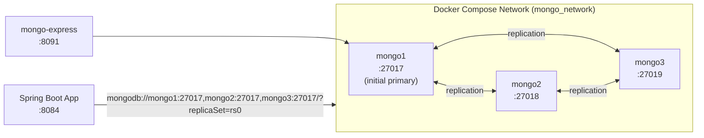
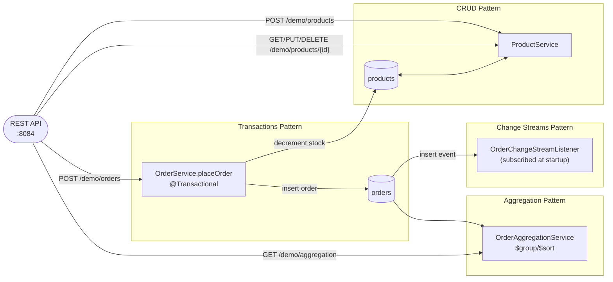

# MongoDB Demo

A 3-node MongoDB replica set and a Spring Boot demo app demonstrating four NoSQL patterns: CRUD, multi-document transactions, change streams, and aggregation pipelines, around a product-catalog/orders domain.

## Prerequisites

- Java 21
- Maven 3.9+
- Docker
- `mongo1`, `mongo2`, `mongo3` resolvable from the host machine (see below)

All commands below assume your working directory is `noSQL/mongodb/`.

### One-time host setup

The replica set members register themselves with each other using their container hostnames (`mongo1`, `mongo2`, `mongo3`) — that's required for the nodes to replicate to each other correctly. The MongoDB driver discovers this same member list when the app connects, so the app (running on the host, not in Docker) also needs to resolve those hostnames. Docker's internal DNS already handles this between containers; for the host side, add these lines to `/etc/hosts` once:

```
127.0.0.1 mongo1
127.0.0.1 mongo2
127.0.0.1 mongo3
```

```bash
echo "127.0.0.1 mongo1" | sudo tee -a /etc/hosts && echo "127.0.0.1 mongo2" | sudo tee -a /etc/hosts && echo "127.0.0.1 mongo3" | sudo tee -a /etc/hosts
```

## Start the cluster

```bash
cd docker
docker compose up -d
```

Wait ~30 seconds for the replica set to form, then verify:

```bash
docker exec mongo1 mongosh --quiet --eval "rs.status().members.map(m => ({name: m.name, state: m.stateStr}))"
```

Expected: one `PRIMARY`, two `SECONDARY`.

mongo-express: http://localhost:8091

## Run the app

```bash
cd spring-demo
mvn spring-boot:run
```

## Trigger endpoints

```bash
# Create a product
curl -X POST "http://localhost:8084/demo/products" \
  -H "Content-Type: application/json" \
  -d '{"name":"Widget","price":9.99,"stock":100}'

# Read a product (replace <id> with the id returned above)
curl "http://localhost:8084/demo/products/<id>"

# Update a product
curl -X PUT "http://localhost:8084/demo/products/<id>" \
  -H "Content-Type: application/json" \
  -d '{"name":"Widget v2","price":12.99,"stock":50}'

# Place an order — atomically decrements stock and triggers the change-stream listener
curl -X POST "http://localhost:8084/demo/orders" \
  -H "Content-Type: application/json" \
  -d '{"productId":"<id>","quantity":3}'

# Aggregation — revenue and order count per status
curl "http://localhost:8084/demo/aggregation"

# Delete a product
curl -X DELETE "http://localhost:8084/demo/products/<id>"
```

## Swagger UI

http://localhost:8084/swagger-ui/index.html

## Run performance tests

Requires the cluster and app to be running. Start the app in a separate terminal if needed, then run:

```bash
cd spring-demo
mvn gatling:test
```

HTML report: `target/gatling/<timestamp>/index.html`

## Architecture

### Cluster topology

Three MongoDB nodes form a replica set named `rs0`. The Spring Boot app connects via a replica-set-aware connection string listing all three; mongo-express connects directly to `mongo1`.



### Messaging patterns and data flows



## Collection characteristics

| Collection | Pattern(s) | Notes |
|---|---|---|
| `products` | CRUD, Transactions | `id`, `name`, `price`, `stock` |
| `orders` | Transactions, Change Streams, Aggregation | `id`, `productId`, `quantity`, `unitPrice`, `lineTotal`, `status` — `unitPrice`/`lineTotal` are snapshotted from the product's price at order time |

## Replica set admin commands

```bash
# Replica set status — member states, who's primary
docker exec mongo1 mongosh --quiet --eval "rs.status()"

# Step down the current primary (triggers an election)
docker exec mongo1 mongosh --quiet --eval "rs.stepDown()"

# Inspect a collection
docker exec mongo1 mongosh ecommerce --quiet --eval "db.orders.find().pretty()"
```

## Stop the cluster

```bash
cd docker
docker compose down
```
